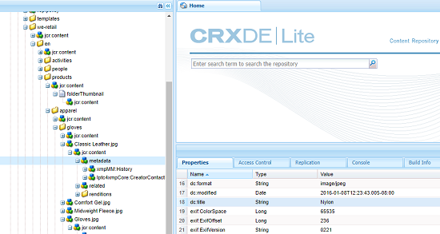
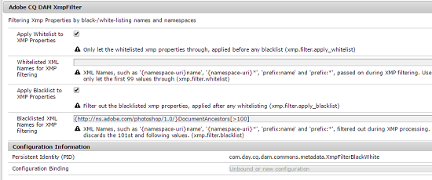

# Write-back de XMP a execuções {#xmp-writeback-to-renditions}

Esse recurso XMP Writeback no Adobe Experience Manager (AEM) Assets replica as alterações nos metadados do ativo nas representações do ativo.

Quando você altera os metadados de um ativo no AEM Assets ou durante o upload do ativo, as alterações são armazenadas inicialmente no nó do ativo no Crx-De.

O recurso XMP Writeback propaga as alterações de metadados para todas as representações ou para as representações específicas do ativo.

Considere um cenário em que você modifica a propriedade [!UICONTROL Title] do ativo intitulado `Classic Leather` para `Nylon`.

Nesse caso, o AEM Assets salva as alterações na propriedade **[!UICONTROL Title]** no parâmetro `dc:title` para os metadados de ativos armazenados na hierarquia de ativos.

No entanto, a AEM Assets não propaga automaticamente quaisquer alterações de metadados nas representações de um ativo.

O recurso XMP Writeback permite que você propague as alterações de metadados para todas as execuções ou representações específicas do ativo. No entanto, as alterações não são armazenadas no nó de metadados na hierarquia do ativo. Em vez disso, esse recurso incorpora as alterações nos arquivos binários das execuções.

## Ativar XMP write-back {#enabling-xmp-writeback}

Para permitir que as alterações de metadados sejam propagadas para as representações do ativo ao carregá-lo, modifique a configuração **Adobe CQ DAM Rendition Maker** no Configuration Manager.

1. Abra o Configuration Manager de `https://[aem_server]:[port]/system/console/configMgr`.
1. Abra a configuração **[!UICONTROL Adobe CQ DAM Rendition Maker]**.
1. Selecione a opção **[!UICONTROL Propagar XMP]** e salve as alterações.

   

## Habilitar XMP write-back para execuções específicas {#enabling-xmp-writeback-for-specific-renditions}

Para permitir que o recurso XMP Writeback propague alterações de metadados para selecionar execuções, especifique essas execuções para a etapa de fluxo de trabalho do Processo de gravação XMP do fluxo de trabalho WriteBack de metadados DAM. Por padrão, essa etapa é configurada com a representação original.

Para que o recurso XMP Writeback propague metadados para as miniaturas de execução 140.100.png e 319.319.png, execute estas etapas.

1. No Experience Manager, navegue até **[!UICONTROL Ferramentas > Fluxo de trabalho > Modelos]**.
1. Na página [!UICONTROL Modelos], abra o modelo de fluxo de trabalho **[!UICONTROL DAM Metadata Writeback]**.
1. Na página de propriedades **[!UICONTROL DAM Metadata Writeback]**, abra a etapa **[!UICONTROL Processo de Writeback XMP]**.
1. Na caixa de diálogo **[!UICONTROL Propriedades da etapa]**, toque/clique na guia **[!UICONTROL Processo]**.
1. Na caixa **[!UICONTROL Argumentos]**, adicione `rendition:cq5dam.thumbnail.140.100.png,rendition:cq5dam.thumbnail.319.319.png`. Toque/clique em **[!UICONTROL OK]**.

   

1. Para gerar novamente as execuções de pirâmide TIFF para imagens do Dynamic Media com os novos atributos, adicione a etapa **[!UICONTROL Dynamic Media Process Image Assets]** ao fluxo de trabalho de Write-back de metadados do DAM.
As renderizações PTIFF são criadas e armazenadas apenas localmente em um modo Dynamic Media Híbrido. Salve o fluxo de trabalho.

As alterações de metadados são propagadas para as representações `thumbnail.140.100.png` e `thumbnail.319.319.png` do ativo, e não para as outras.

>[!NOTE]
>
>Para XMP problemas de gravação no Linux de 64 bits, consulte [Como ativar XMP write-back no RedHat Linux](https://helpx.adobe.com/experience-manager/kb/enable-xmp-write-back-64-bit-redhat.html) de 64 bits.
>
>Para obter mais informações sobre plataformas compatíveis, consulte [XMP pré-requisitos de gravação de metadados](/help/sites-deploying/technical-requirements.md#requirements-for-aem-assets-xmp-metadata-write-back).

## Filtrar metadados XMP {#filtering-xmp-metadata}

[!DNL Experience Manager Assets] suporta a filtragem de lista de bloqueios e lista de permissões de propriedades/nós para metadados XMP que são lidos de binários de ativos e armazenados no JCR quando os ativos são ingeridos.

Filtrar usando uma lista de bloqueios permite importar todas as propriedades de metadados XMP, exceto as propriedades especificadas para exclusão. No entanto, para tipos de ativos, como arquivos INDD que têm uma grande quantidade de metadados XMP (por exemplo, 1000 nós com 10.000 propriedades), os nomes dos nós a serem filtrados nem sempre são conhecidos antecipadamente. Se a filtragem usando uma lista de bloqueios permitir a importação de um grande número de ativos com vários metadados XMP, a instância AEM ou o cluster poderá encontrar problemas de estabilidade, por exemplo, filas de observação obstruídas.

A filtragem de metadados de XMP por lista de permissões resolve esse problema ao permitir que você defina as propriedades de XMP a serem importadas. Dessa forma, qualquer outra propriedade XMP ou desconhecida é ignorada. Para compatibilidade com versões anteriores, você pode adicionar algumas dessas propriedades ao filtro que usa uma lista de bloqueios.

>[!NOTE]
>
>A filtragem funciona somente para as propriedades derivadas de fontes XMP em binários de ativos. Para as propriedades derivadas de fontes não XMP, como formatos EXIF e IPTC, a filtragem não funciona. Por exemplo, a data de criação do ativo é armazenada na propriedade `CreateDate` em EXIF TIFF. AEM armazena esse valor no campo de metadados chamado `exif:DateTimeOriginal`. Como a fonte é uma fonte não XMP, a filtragem não funciona nessa propriedade.

1. Abra o Configuration Manager de `https://[aem_server]:[port]/system/console/configMgr`.
1. Abra a configuração **[!UICONTROL Adobe CQ DAM XmpFilter]**.
1. Para aplicar a filtragem por meio de uma lista de permissões, selecione **[!UICONTROL Aplicar Lista de permissões a XMP Propriedades]** e especifique as propriedades a serem importadas na caixa **[!UICONTROL Nomes XML permitidos para filtragem de XMP]**.

   

1. Para filtrar XMP propriedades bloqueadas após aplicar filtragem por lista de permissões, especifique as propriedades na caixa **[!UICONTROL Nomes XML Bloqueados para filtragem XMP]**. Salve as alterações.

   >[!NOTE]
   >
   >A opção **[!UICONTROL Aplicar Lista de bloqueios a XMP Propriedades]** está selecionada por padrão. Em outras palavras, a filtragem usando uma lista de bloqueios é ativada por padrão. Para desativar essa filtragem, desmarque a opção **[!UICONTROL Aplicar Lista de bloqueios a XMP Propriedades]**.
