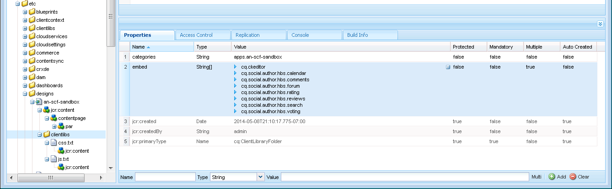

# Adicionar Clientlibs {#add-clientlibs}

>[!CAUTION]
>
>AEM 6.4 chegou ao fim do suporte estendido e esta documentação não é mais atualizada. Para obter mais detalhes, consulte nossa [períodos de assistência técnica](https://helpx.adobe.com/br/support/programs/eol-matrix.html). Encontre as versões compatíveis [here](https://experienceleague.adobe.com/docs/).

## Adicionar uma ClientLibraryFolder (clientlibs) {#add-a-clientlibraryfolder-clientlibs}

Crie uma ClientLibraryFolder com o nome `clientlibs`que conterão o JS e o CSS usados para renderizar as páginas do site.

O `categories`o valor da propriedade dado a essa biblioteca do cliente é o identificador usado para incluir diretamente essa clientlib de uma página de conteúdo ou para incorporá-la a outras clientlibs.

1. Usando **[!UICONTROL CRXDE Lite]**, expandir `/etc/designs`

1. Clique com o botão direito em `an-scf-sandbox` e selecione `Create Node`

   * Nome: `clientlibs`
   * Tipo: `cq:ClientLibraryFolder`

1. Clique em **[!UICONTROL OK]**


No **[!UICONTROL Propriedades]** para o novo `clientlibs` , insira o **`categories`** propriedade:

* Nome: **[!UICONTROL categorias]**
* Tipo: **[!UICONTROL String]**
* Valor: **[!UICONTROL apps.an-scf-sandbox]**
* Clique em **[!UICONTROL Adicionar]**
* Clique em **[!UICONTROL Salvar tudo]**

Observação: apresentando o valor das categorias como &quot;aplicativos&quot;. é uma convenção para identificar o &quot;aplicativo proprietário&quot; como sendo da pasta /apps, não /libs.  IMPORTANTE: Adicionar espaço reservado `js.txt` e `css.txt` arquivos. (Não é oficialmente uma cq:ClientLibraryFolder sem eles.)


1. Clique com o botão direito em **`/etc/designs/an-scf-sandbox/clientlibs`**
1. Selecionar **[!UICONTROL Criar arquivo...]**
1. Enter **[!UICONTROL Nome]**: `css.txt`

1. Selecionar **[!UICONTROL Criar arquivo...]**
1. Enter **[!UICONTROL Nome]**: `js.txt`

1. Clique em **[!UICONTROL Salvar tudo]**


A primeira linha do css.txt e do js.txt identifica o local base do qual as listas de arquivos a seguir devem ser encontradas.

Tente definir o conteúdo de css.txt como:

```
#base=.
 style.css
```

Em seguida, crie um arquivo em clientlibs chamado style.css e defina o conteúdo como:

`body {`

`background-color: #b0c4de;`

`}`

## Incorporar Clientlibs SCF {#embed-scf-clientlibs}

No **[!UICONTROL Propriedades]** para o `clientlibs` nó , insira a propriedade String de vários valores **[!UICONTROL embed]**. Isso incorporará o [bibliotecas do lado do cliente (clientlibs) para componentes SCF](client-customize.md#clientlibs-for-scf). Neste tutorial, adicionaremos várias clientlibs necessárias para os componentes das Comunidades.

**Observação** que essa pode ou não ser a abordagem desejada para usar em um site de produção, pois há considerações de conveniência versus tamanho/velocidade das clientlibs baixadas para cada página.

Se estiver usando apenas um recurso em uma página, você pode incluir a clientlib completa desse recurso diretamente na página, por exemplo, &lt;% ui:includeClientLib categories=cq.social.hbs.forum&quot; %>

Nesse caso, estamos incluindo todas elas, então preferiria as clientlibs do SCF mais básicas, que são as clientlibs do autor:

* Nome: **`embed`**
* Tipo: **`String`**

* Clique em **`Multi`**
* Valor: **`cq.social.scf`**

   *&lt;enter> abrirá uma caixa de diálogo*

   *Clique em **[+]**após cada entrada para adicionar as seguintes categorias clientlib:*

   * **`cq.ckeditor`**
   * **`cq.social.author.hbs.comments`**
   * **`cq.social.author.hbs.forum`**
   * **`cq.social.author.hbs.rating`**
   * **`cq.social.author.hbs.reviews`**
   * **`cq.social.author.hbs.voting`**
   * Clique em **[!UICONTROL OK]**

* Clique em **[!UICONTROL Salvar tudo]**


É assim que `/etc/designs/an-scf-sandbox/clientlibs` agora deve aparecer no repositório:



## Incluir clientlibs no modelo do PlayPage {#include-clientlibs-in-playpage-template}

Sem incluir a variável `apps.an-scf-sandbox` Categoria ClientLibraryFolder na página, os componentes do SCF não serão funcionais nem estilizados, pois os Javascript e o(s) estilo(s) necessários não estarão disponíveis.

Por exemplo, sem incluir as clientlibs, o componente de comentários do SCF aparece sem o estilo:


Uma vez que apps.an-scf-sandbox clientlibs é incluído, o componente SCF comments aparece no estilo :


A instrução include pertence ao `<head>` da seção `<html>` script. O padrão **`foundation head.jsp`** inclui um script que pode ser sobreposto: **`headlibs.jsp`**.

**Copie headlibs.jsp e inclua clientlibs:**

1. Usando **[!UICONTROL CRXDE Lite]**, selecione **`/libs/foundation/components/page/headlibs.jsp`**
1. Clique com o botão direito do mouse e selecione **[!UICONTROL Copiar]** (ou selecione Copiar na barra de ferramentas)
1. Selecionar **`/apps/an-scf-sandbox/components/playpage`**
1. Clique com o botão direito do mouse e selecione **[!UICONTROL Colar]** (ou selecione Colar na barra de ferramentas)
1. Clique duas vezes em **`headlibs.jsp`** para abri-lo
1. Anexe a seguinte linha ao final do arquivo

   **`<ui:includeClientLib categories="apps.an-scf-sandbox"/>`**

1. Clique em **[!UICONTROL Salvar tudo]**


```xml
<%@ page session="false" %><%
%><%@include file="/libs/foundation/global.jsp" %><%
%><ui:includeClientLib categories="cq.foundation-main"/><%
%>
<cq:include script="/libs/cq/cloudserviceconfigs/components/servicelibs/servicelibs.jsp"/>
<% currentDesign.writeCssIncludes(pageContext); %>
<ui:includeClientLib categories="apps.an-scf-sandbox"/>
```

Carregue seu site na Web no navegador e veja se o plano de fundo não é uma sombra de azul.

[http://localhost:4502/content/an-scf-sandbox/en/play.html](http://localhost:4502/content/an-scf-sandbox/en/play.html)


## Salvando Seu Trabalho Até Agora {#saving-your-work-so-far}

Neste ponto, existe uma sandbox minimalista e pode valer a pena salvar como um pacote para que, durante a reprodução, se o seu repositório ficar corrompido e você desejar iniciar novamente, você possa desligar o servidor, renomear ou excluir a pasta crx-quickstart/, ligar o servidor, carregar e instalar esse pacote salvo e não precisar repetir essas etapas mais básicas.

Este pacote existe no [Criar uma página de exemplo](create-sample-page.md) tutorial para aqueles que não podem esperar apenas para entrar e começar a jogar!..

Para criar um pacote:


* De **[!UICONTROL CRXDE Lite]**, clique no botão [Ícone Pacote](http://localhost:4502/crx/packmgr/)
* Clique em **[!UICONTROL Criar pacote]**

   * Nome do pacote: `an-scf-sandbox-minimal-pkg`
   * Versão: `0.1`
   * Grupo: &lt;leave as=&quot;&quot; default=&quot;&quot;>
   * Clique em **[!UICONTROL OK]**

* Clique em **[!UICONTROL Editar]**

   * Selecionar **[!UICONTROL Filtros]** guia

      * Clique em **[!UICONTROL Adicionar filtro]**
      * Caminho raiz: &lt;browse to=&quot;&quot; span=&quot;&quot; id=&quot;0&quot; translate=&quot;no&quot; />>`/apps/an-scf-sandbox`
      * Clique em **[!UICONTROL Concluído]**
      * Clique em **[!UICONTROL Adicionar filtro]**
      * Caminho raiz: &lt;browse to=&quot;&quot; span=&quot;&quot; id=&quot;0&quot; translate=&quot;no&quot; />>`/etc/designs/an-scf-sandbox`
      * Clique em **[!UICONTROL Concluído]**
      * Clique em **[!UICONTROL Adicionar filtro]**
      * Caminho raiz: &lt;browse to=&quot;&quot; span=&quot;&quot; id=&quot;0&quot; translate=&quot;no&quot; />>`/content/an-scf-sandbox`
      * Clique em **[!UICONTROL Concluído]**
   * Clique em **[!UICONTROL Salvar]**


* Clique em **[!UICONTROL Criar]**

Agora você pode selecionar **[!UICONTROL Baixar]** para salvá-lo em disco e **[!UICONTROL Fazer upload do pacote]** em outro lugar, bem como selecionar **[!UICONTROL Mais > Replicar]** para enviar a sandbox para uma instância de publicação de host local, expanda o realm da sandbox.
