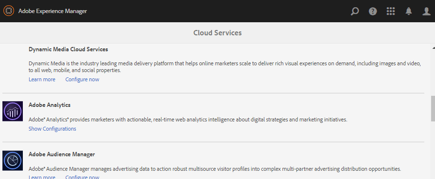

# Configuração do Analytics para recursos de comunidades {#analytics-configuration-for-communities-features}

## Visão geral {#overview}

A Adobe Analytics e a Adobe Experience Manager (AEM) são ambas soluções da Adobe Marketing Cloud.

A Adobe Analytics pode ser configurada para AEM Communities para que, à medida que um membro interage com os recursos das Comunidades compatíveis, eventos sejam enviados para a Adobe Analytics a partir da qual os relatórios são gerados.

Por exemplo, quando um membro de um site da comunidade de ativação visualização um recurso de vídeo atribuído a ele, o player de recursos enviará eventos ao Analytics, incluindo dados de pulsação de vídeo. No site da comunidade, os administradores podem ver vários relatórios relacionados à reprodução do vídeo.

Além disso, a análise é necessária para:

* No ambiente publish:

   * Relatórios nas [tendências da comunidade](trends.md)
   * Permitir que os visitantes do site classifiquem por &quot;mais visualizados&quot;, &quot;mais ativos&quot;, &quot;mais curtidos&quot;
   * Contagem de Visualizações em listas UGC

* No ambiente do autor:

   * Exibição de dados de participação no console [de gerenciamento de](members.md) membros (visualização, publicações, seguidores, curtidas)
   * Resumo de tendências, pulsação de vídeo e dispositivo de vídeo para ativar [relatórios de recursos](reports.md)

Os recursos das Comunidades suportadas incluem:

* [Recursos de ativação](resources.md)
* [Fórum](forum.md)
* [Perguntas e respostas](working-with-qna.md)
* [Blog](blog-feature.md)
* [Biblioteca de arquivos](file-library.md)
* [Calendário](calendar.md)

Esta seção da documentação descreve como conectar um conjunto de relatórios do Analytics com os recursos das Comunidades. As etapas básicas são:

1. [Replicar a chave](#replicate-the-crypto-key) de criptografia para garantir que a criptografia/descriptografia ocorra corretamente em todas as instâncias AEM
1. Preparar um conjunto de [relatórios da Adobe Analytics](#adobe-analytics-report-suite-for-video-reporting)
1. Criar um serviço [e uma](#aem-analytics-cloud-service-configuration) estrutura de [nuvem do AEM Analytics](#aem-analytics-framework-configuration)
1. [Ativar o Analytics](#enable-analytics-for-a-community-site) para um site da comunidade
1. [Verifique](#verify-analytics-to-aem-variable-mapping) o Analytics para AEM mapeamento de variáveis
1. Identificar editor [principal](#primary-publisher)
1. [Publicar](#publish-community-site-and-analytics-cloud-service) o site da comunidade
1. Configurar a [importação de dados](#obtaining-reports-from-analytics) do relatório da Adobe Analytics para o site da comunidade

## Pré-requisitos {#prerequisites}

Para configurar os recursos do Analytics para Comunidades, é necessário trabalhar com seu representante de conta para configurar uma conta da Adobe Analytics e um conjunto de [relatórios](#adobe-analytics-report-suite-for-video-reporting). Uma vez estabelecida, devem estar disponíveis as seguintes informações:

* Nome da Empresa

   A empresa associada à conta do Adobe Analytics
* Nome de usuário

   O nome de usuário de logon do usuário autorizado a gerenciar a conta do Analytics

   (Deve incluir privilégios de acesso ao serviço da Web)

* Senha

   A senha de logon do usuário autorizado

* Data Center do Analytics

   O URL do centro de dados do Analytics para a conta

* Conjunto de relatórios

   O nome do conjunto de relatórios do Analytics a ser usado

## Conjunto de relatórios Adobe Analytics para Relatórios de vídeo {#adobe-analytics-report-suite-for-video-reporting}

Usando o Gerenciador [de conjunto de](https://docs.adobe.com/content/help/en/analytics/admin/manage-report-suites/new-report-suite/new-report-suite.html)relatórios da Adobe Marketing Cloud, os conjuntos de relatórios do Analytics podem ser configurados para que um site da comunidade possa ser habilitado para fornecer relatórios sobre os recursos das Comunidades.

Ao fazer logon no [Adobe Marketing Cloud](https://docs.adobe.com/content/help/en/analytics/analyze/analysis-workspace/home.html) com o Nome da [Empresa e o Nome](analytics.md#prerequisites)de usuário, é possível configurar um conjunto de relatórios novo ou existente para ter:

* [11 Variáveis](https://docs.adobe.com/content/help/en/analytics/admin/admin-tools/conversion-variables/conversion-var-admin.html) de conversão (evars)

   * **`evar1`** por meio **`evar11`** ativado
   * Pode reaproveitar (renomear) evars existentes ou criar novas para usar nos recursos das Comunidades

* [7 Eventos](https://docs.adobe.com/content/help/en/analytics/admin/admin-tools/success-events/success-event.html) bem-sucedidos (eventos)

   * **`event1`** por meio **`event7`** ativado
   * Tipo **`Counter`**

      * not **`Counter (no subrelations)`**
   * Pode alterar a finalidade (renomear) dos eventos existentes ou criar novos para usar nos recursos das Comunidades


* [Gerenciamento de vídeo](https://docs.adobe.com/content/help/en/media-analytics/using/media-overview.html)

   * Console de Relatórios de vídeo

      * Ativar `Video Core`
      * Selecione Salvar
   * Console de avaliação do Video Core

      * Selecionar `Use Solution Variables`
      * Selecione Salvar


Se estiver usando um **novo conjunto** de relatórios, esteja ciente de que um novo conjunto de relatórios pode ter apenas 4 e 6 variáveis de evento, enquanto 11 e 7 eventos de vars são necessários para Comunidades.

Se estiver usando um conjunto **de relatórios** existente, talvez seja necessário [modificar o mapeamento](#modifying-analytics-variable-mapping) de variável antes de ativar a estrutura do Analytics para um site da comunidade. Entre em contato com seu representante de conta para obter informações sobre quaisquer preocupações relacionadas às variáveis dedicadas às Comunidades.

>[!CAUTION]
>
>**Se estiver usando um conjunto de relatórios existente que já usa variáveis em**
>
>* **`evar1`** a **`evar11`**
>* **`event1`** a **`event7`**

>
>
**Depois, antes de o site da comunidade ser publicado,** é importante restaurar o mapeamento preexistente movendo as variáveis AEM que foram mapeadas automaticamente para as variáveis do Analytics quando o Analytics foi ativado para um site da comunidade.
>
>Para restaurar o mapeamento preexistente e mover variáveis AEM para outras variáveis do Analytics, consulte a seção sobre [Modificação do mapeamento](#modifying-analytics-variable-mapping)de variáveis do Analytics.
>
>Se isso não for feito, poderá ocorrer perda irrecuperável de dados.

### Análise do Video Heartbeat {#video-heartbeat-analytics}

Quando a Análise do Video Heartbeat está licenciada, um `Marketing Cloud Org Id` é atribuído.

Para ativar o relatórios Video Heartbeat após [configurar o conjunto de relatórios do Analytics para o relatórios](#adobe-analytics-report-suite-for-video-reporting)de vídeo:

* Criar um serviço em nuvem [do Analytics](#aem-analytics-cloud-service-configuration)
* Ativar o [Analytics para um site da comunidade](#enable-analytics-for-a-community-site)
* Associar o site `Marketing Cloud Org Id` ao site da comunidade

O `Marketing Cloud Org Id` pode ser inserido no momento da criação [do site da](sites-console.md#enablement) comunidade ou posteriormente, [modificando](sites-console.md#modifying-site-properties) as propriedades do site da comunidade. [](#aem-analytics-cloud-service-configuration)


Quando a Análise do Video Heartbeat está ativada, o código Javascript (JS) do player de vídeo instancia o código da biblioteca do Video Heartbeat (também em JS), que lida com toda a lógica para enviar atualizações de status de vídeo aos servidores de rastreamento de vídeo do Analytics a cada 10 segundos (não configurável) e, eventualmente, enviar um relatório cumulativo da sessão de vídeo aos principais servidores do Analytics.

Se não estiver ativado, o código de pulsação de vídeo nunca será instanciado e somente o andamento do vídeo e o rastreamento de posição de retomada serão mantidos no SRP para o relatórios.

## Configuração do serviço Analytics Cloud AEM {#aem-analytics-cloud-service-configuration}

Para criar uma nova Integração do Analytics, que integra o Adobe Analytics ao site da comunidade AEM, usando a interface padrão na instância do autor:

* Da navegação global: **[!UICONTROL Ferramentas > Implantação > Cloud Services]**
* Role para baixo até o **[!UICONTROL Adobe Analytics]**
* Selecione **[!UICONTROL Configurar agora]** ou **[!UICONTROL Mostrar configurações]**



### Criar caixa de diálogo de configuração {#create-configuration-dialog}

* Selecione `[+]` o ícone ao lado de Configurações **** disponíveis para criar uma nova configuração

Na caixa de diálogo Criar configuração, os valores a serem inseridos identificam a configuração.


* **[!UICONTROL Título]**

   (Obrigatório) Um título de exibição para a configuração.

   Por exemplo, insira *Ativar o Analytics da comunidade*

* **[!UICONTROL Nome]**

   (Opcional) Se não for especificado, o nome assumirá como padrão um nome de nó válido derivado do título.

   For example, enter *communities*


* **[!UICONTROL Modelo]**

   Selecionar `Adobe Analytics Configuration`

* Selecione **[!UICONTROL Criar]**
   * Inicia a página de configuração e abre a caixa de diálogo `Analytics Settings`

### Caixa de diálogo Configurações do Analytics {#analytics-settings-dialog}

A criação inicial de uma nova configuração do Analytics resulta na exibição da configuração e em uma nova caixa de diálogo para a entrada das Configurações do Analytics. Essa caixa de diálogo exige as informações [de conta de](#prerequisites) pré-requisito obtidas do representante da conta.


* **[!UICONTROL Empresa]**

   A empresa associada à conta do Adobe Analytics

* **[!UICONTROL Nome de usuário]**

   O nome de usuário de logon do usuário autorizado a gerenciar a conta do Analytics

* **[!UICONTROL Senha]**

   A senha de logon do usuário autorizado

* **[!UICONTROL Centro de dados]**

   Selecione o centro de dados do Analytics que hospeda o conjunto de relatórios

* **[!UICONTROL Não adicionar a tag de rastreamento à página]**

   Deixar como padrão (desmarcado)

* **[!UICONTROL Usar AppMeasurement]**

   Deixar como padrão (desmarcado)

* **[!UICONTROL Não realizar importações de impressões de página todas as noites (autor)]**

   Deixar como padrão (desmarcado)

* **[!UICONTROL Não realizar importações de impressões de página todas as noites (publicar)]**

   Deixar como padrão (marcado)

Para salvar as configurações:


* Selecione **[!UICONTROL Conectar ao Analytics]**

   * Se não for bem-sucedido,

      * Verifique se as entradas não contêm espaços à esquerda
      * Tente um data center diferente
      * Entre em contato com seu representante de conta

* Selecionar **[!UICONTROL OK]**


### Criar estrutura {#create-framework}

Após a configuração bem-sucedida da conexão básica com o Adobe Analytics, é necessário criar ou editar uma estrutura para o site da comunidade. A finalidade da estrutura é mapear as variáveis de recurso Comunidades (AEM) para as variáveis do Analytics (conjunto de relatórios).

* Selecione `[+]` o ícone ao lado de Estruturas **** disponíveis para criar uma nova estrutura


* **[!UICONTROL Título]**

   (Obrigatório) Um título de exibição para a estrutura

   Por exemplo, digite *Ativação da estrutura da comunidade*

* **[!UICONTROL Nome]**

   (Opcional) Se não for especificado, o nome assumirá como padrão um nome de nó válido derivado do título.

   For example, enter *communities*

* **[!UICONTROL Modelo]**

   Selecionar `Adobe Analytics Framework`

* Selecione **[!UICONTROL Criar]**

A criação da Estrutura do Analytics abre a estrutura para configuração.

## Configuração da estrutura do AEM Analytics {#aem-analytics-framework-configuration}

A finalidade da estrutura é mapear variáveis AEM para variáveis do Analytics (evars e eventos). As variáveis do Analytics disponíveis para mapeamento são [definidas no conjunto](#adobe-analytics-report-suite-for-video-reporting)de relatórios.


### Selecionar conjunto de relatórios {#select-report-suite}

Selecione o conjunto de relatórios que foi configurado para o relatórios de vídeo.

Se um conjunto de relatórios ainda não foi criado ou não foi configurado corretamente, consulte a seção anterior:\
[Conjunto de relatórios Adobe Analytics para Relatórios de vídeo](#adobe-analytics-report-suite-for-video-reporting)

O Sidekick não é necessário e pode ser minimizado para que não obstrua o acesso às configurações dos Report Suites.

#### Caixa de diálogo Conjuntos de relatórios antes e depois de selecionar &#39;Adicionar item&#39; {#report-suites-dialog-before-and-after-selecting-add-item}


1. Selecione **[!UICONTROL Adicionar item +]** duas caixas suspensas
1. Escolha um conjunto de relatórios associado `Report suite` à conta de Empresa que deve estar disponível para seleção
1. Selecione **[!UICONTROL Sim]** na caixa de diálogo que é aberta: ```Load default server settings? Do you want to load the default server settings and overwrite current values in the Server section?```
1. Choose a `Run Mode`\
   Escolher **[!UICONTROL publicar]**


O serviço e a estrutura da nuvem do Analytics estão concluídos. Os Mapeamentos serão definidos assim que um site da comunidade for criado com esse serviço do Analytics ativado.

## Ativar o Analytics para um site da comunidade {#enable-analytics-for-a-community-site}

### Ativar para Novo Site da Comunidade {#enable-for-new-community-site}

Para adicionar o serviço em nuvem do Analytics ao [criar um novo site](sites-console.md)da comunidade:


* Na etapa 3
* Na guia [ANALYTICS](sites-console.md#analytics):

   * Marque a caixa de seleção **[!UICONTROL Ativar o Analytics]**
   * Escolha a estrutura na caixa suspensa

* Como opção, retorne à configuração da estrutura do Analytics para ajustar os mapeamentos de variáveis.

### Habilitar para site da comunidade existente {#enable-for-existing-community-site}

Para adicionar o serviço em nuvem do Analytics a um site [da comunidade](sites-console.md#modifying-site-properties)existente:


* Navegue até o console **[!UICONTROL Comunidades > Sites]**
* Selecione o ícone Editar site do site da comunidade
* Selecione as CONFIGURAÇÕES
* Na seção Analytics:

   * Marque a caixa de seleção **[!UICONTROL Ativar o Analytics]**
   * Escolha a estrutura na caixa suspensa


* Como opção, retorne à configuração da estrutura do Analytics para ajustar os mapeamentos de variáveis.

### Ativar para sites personalizados {#enable-for-customized-sites}

Para que o rastreamento e a importação do Analytics funcionem corretamente em um site da comunidade, um elemento de página com os atributos `scf-js-site-title` class e href deve estar presente. Somente um elemento desse tipo deve existir na página, como ocorre em um script não modificado para um site da comunidade. `sitepage.hbs` O valor de `siteUrl` é extraído e enviado para a Adobe Analytics como o caminho *do* site.

```xml
# present in default sitepage.hbs
# only one scf-js-site-title class should be included
# this example sets it to be hidden as it serves no visual purpose
<div
    class="navbar-brand scf-js-site-title"
    href="{{siteUrl}}.html"
    style="visibility: hidden;"
>
</div>
```

Para um site **da comunidade** personalizado que sobrepõe o `sitepage.hbs` script, verifique se o elemento está presente. A `siteUrl`variável será definida quando renderizada no servidor antes de servir ao cliente.

Para um site **de AEM** genérico que inclui componentes do Communities, mas não é criado com o assistente [de criação de](sites-console.md)site, é necessário adicionar o elemento. O valor do href deve ser o caminho para o site. Por exemplo, se o caminho do site for `/content/my/company/en`, use:

```xml
<div
    class="navbar-brand scf-js-site-title"
    href="/content/my/company/en.html"
    style="visibility: hidden;"
>
</div>
```

## Recursos do Analytics para comunidades {#analytics-for-communities-features}

O Analytics é usado automaticamente para vários recursos das Comunidades.

A configuração [OSGi do ambiente do autor](../../help/sites-deploying/configuring-osgi.md)`AEM Communities Analytics Component Configuration`fornece uma lista dos componentes que foram instrumentados para o Analytics. O mapeamento automático de variáveis é determinado pelos componentes listados.

Se novos componentes personalizados forem criados e instrumentados para o Analytics, eles deverão ser adicionados a essa lista de componentes configurados.

### Configuração do componente {#component-configuration}


Observação: os `journal` componentes são usados para implementar o recurso de blog.

### Análise mapeada para variáveis AEM {#mapped-analytics-to-aem-variables}

Quando o site da comunidade for salvo com o Analytics ativado e a estrutura de configuração da nuvem selecionada, as variáveis AEM serão mapeadas automaticamente para as eVars e eventos do Analytics, começando com evar1 e evento1, respectivamente, e aumentando em 1.

Se estiver usando um conjunto de relatórios existente que mapeou qualquer uma das variáveis dentro de evar1 até evar11 e evento1 até o evento7, será necessário [remapear as variáveis](#modifying-analytics-variable-mapping) AEM e restaurar o mapeamento original.

Veja a seguir um exemplo de mapeamentos padrão após seguir o tutorial [de](getting-started-enablement.md)introdução:


#### Mapa de eVars enviadas com cada evento {#map-of-evars-sent-with-each-event}

|  | Tipo de recurso de ativação | Título do site | Tipo de função | Título do grupo | Caminho do grupo | Tipo UGC | Título UGC | Usuário (Membro) | Caminho UGC | Caminho do site |
|------------------------|------------------------|-----------|--------------|------------|-----------|---------|----------|--------------|---------|----------|
|  | **eVar1** | **eVar2** | **eVar3** | **eVar4** | **eVar5** | **eVar6** | **eVar7** | **eVar8** | **eVar9** | **eVar10** |
| evento1Reprodução de recursos | (uma sessão gerenciada no quadro branco) | - | - | - | - | - | - | - | i) | - |
| event2SCFView | (uma sessão gerenciada no quadro branco) | b) | c) | (d) | (e) | (f) | (g) | (h) | i) | j) |
| evento3SCFCreate (Post) | - | b) | c) | (d) | (e) | (f) | (g) | (h) | i) | j) |
| event4SCFFollow | - | b) | c) | (d) | (e) | (f) | (g) | (h) | i) | j) |
| event5SCFVoteUp | - | b) | c) | (d) | (e) | (f) | (g) | (h) | i) | j) |
| event6SCFVoteDown | - | b) | c) | (d) | (e) | (f) | (g) | (h) | i) | j) |
| event7SCFRate | - | b) | c) | (d) | (e) | (f) | (g) | (h) | i) | j) |

**Exemplos de valores de eVar:**

* [Tipo](https://www.iana.org/assignments/media-types)MIME: video/mp4
* [Título](sites-console.md#step13asitetemplate)do site da comunidade: Comunidades Geometrixx
* [Nome](functions.md)da função da comunidade: Fórum
* [Nome](creating-groups.md#creating-a-new-group)do grupo da comunidade: Caminho
* Caminho para o conteúdo do grupo da comunidade: /content/sites/Communities/en/groups/hiking
* [ResourceType](essentials.md)do componente UGC: social/fórum/componentes/hbs/tópico
* Título do componente UGC: Tópicos de rastreamento
* Logon (ID de autorização): aaron.mcdonald@mailinator.com
* Caminho SRP para UGC: /content/usergenerate/asi/.../forum/jmtz-topics3 ou *caminho do componente a ser seguido*: /content/sites/Communities/en/jcr:content/content/Primary/forum
* Caminho para o conteúdo do site da comunidade: /content/sites/community/br

### Modificação do mapeamento de variáveis do Analytics {#modifying-analytics-variable-mapping}

O mapeamento de evars e eventos do Analytics para variáveis AEM é visível da configuração da estrutura depois que o Analytics é ativado para um site da comunidade.

Depois que o Analytics for ativado e antes da publicação do site da comunidade, o mapeamento poderá ser alterado na estrutura arrastando a evar ou o evento do Analytics desejado do painel esquerdo e soltando-o na linha relevante na tabela de mapeamento.

Para evitar mapeamentos de duplicados, remova a evar ou o evento substituído do Analytics da linha passando o mouse sobre ela e selecionando o &quot;X&quot; que aparece à direita do elemento de variável do Analytics.

Se as evars e os eventos das Comunidades substituírem os mapeamentos que existiam no conjunto de relatórios, para evitar perda de dados, atribua as variáveis AEM para os recursos das Comunidades a outras evars e/ou eventos do Analytics e restaure os mapeamentos originais.

>[!CAUTION]
>
>É importante remapear antes que o site da comunidade seja [publicado](#publishing-the-community-site) com o Analytics ativado, caso contrário, há risco de perda de dados.

#### Exemplo Etapa 1: Arrastar a evar14 do Analytics para a tabela de mapeamento {#example-step-dragging-analytics-evar-into-mapping-table}


#### Exemplo Etapa 2: Selecionar &#39;x&#39; para remover evar11 substituído {#example-step-selecting-x-to-remove-replaced-evar}


#### Exemplo Etapa 3: AEM var eventdata.siteId remapeado para a evar14 do Analytics {#example-step-aem-var-eventdata-siteid-remapped-to-analytics-evar}


## Publicar o site da comunidade {#publishing-the-community-site}

### Verifique o Analytics para AEM o mapeamento de variáveis {#verify-analytics-to-aem-variable-mapping}

Convém verificar o mapeamento de variável antes de publicar o site da comunidade, que também publica o serviço e a estrutura da nuvem do Analytics.

Consulte as seções:

* [Análise mapeada para variáveis AEM](#mapped-analytics-to-aem-variables)
* [Modificação do mapeamento de variáveis do Analytics](#modifying-analytics-variable-mapping)

>[!CAUTION]
>
>**Se estiver usando um conjunto de relatórios existente que já usa variáveis em**
>
>* **`evar1`** a **`evar11`**
>* **`event1`** a **`event7`**

>
>
**Depois, antes de o site da comunidade ser publicado,** é importante restaurar o mapeamento preexistente e mover as variáveis Comunidades AEM que foram automaticamente mapeadas (quando o Analytics foi ativado para o site da comunidade) para outras variáveis do Analytics. Esse novo mapeamento deve ser consistente em todos os componentes das Comunidades.
>
>Se isso não for feito, poderá ocorrer perda irrecuperável de dados.

### Editor principal {#primary-publisher}

Quando a implantação escolhida é um farm [de](topologies.md#tarmk-publish-farm)publicação, uma instância de publicação AEM deve ser identificada como o editor principal para sondar a Adobe Analytics para que os dados do relatório sejam gravados no [SRP](working-with-srp.md).

Por padrão, a configuração do `AEM Communities Publisher Configuration` OSGi identifica sua instância de publicação como o editor principal, de modo que todas as instâncias de publicação em um farm de publicação se autoidentificariam como o principal.

Portanto, é necessário editar a configuração em todas as instâncias de publicação secundárias para desmarcar a caixa de seleção Editor **** primário.

Para obter instruções específicas, consulte a seção principal do editor de [Implantação de comunidades](deploy-communities.md#primary-publisher).

>[!CAUTION]
>
>É importante que o editor principal seja configurado para impedir a pesquisa de várias instâncias de publicação.

### Replicar a chave de criptografia {#replicate-the-crypto-key}

As credenciais do Adobe Analytics são criptografadas. Para facilitar a replicação ou a transmissão de credenciais de análise criptografadas entre o autor e os editores, todas as instâncias AEM devem compartilhar a mesma chave de criptografia primária.

Para fazer isso, siga as instruções em [Replicar a chave](deploy-communities.md#replicate-the-crypto-key)de criptografia.

### Publicar site da comunidade e serviço Analytics Cloud {#publish-community-site-and-analytics-cloud-service}

Assim que o serviço em nuvem do Analytics for ativado para um site da comunidade e, se necessário, o [mapeamento do Analytics para variáveis AEM for ajustado](#mapped-analytics-to-aem-variables), será necessário replicar a configuração para o ambiente de publicação [(re)publicando o site](sites-console.md#publishing-the-site)da comunidade.

## Obtenção de relatórios do Analytics {#obtaining-reports-from-analytics}

### Gerenciamento de relatórios {#report-management}

A configuração [OSGi do autor e do editor principal,](../../help/sites-deploying/configuring-osgi.md)`AEM Communities Analytics Report Management`, é usada para query do Analytics.

No autor, os query são para relatórios em tempo real.

No editor principal, os query são usados para fornecer informações em preparação para a importação de dados analíticos do Importador de relatórios.

O padrão do intervalo de query é 10 segundos.

### Importador de relatórios {#report-importer}

Depois que um site da comunidade habilitado para o Analytics for publicado, a configuração [OSGi do editor principal,](../../help/sites-deploying/configuring-osgi.md)`AEM Communities Analytics Report Importer`, poderá ser configurada para definir o intervalo de pesquisa padrão para as configurações que não estão configuradas individualmente no CRXDE.

O intervalo de sondagem controla a frequência de solicitações à Adobe Analytics para que os dados sejam obtidos e salvos no [SRP](working-with-srp.md).

Quando os dados podem ser classificados como &quot;grandes dados&quot;, pesquisas mais frequentes podem colocar uma grande carga no site da comunidade.

O intervalo **padrão de** importação de sondagem é definido como 12 horas.


### Personalização do relatório do componente {#component-report-customization}

Atualmente, para personalizar as métricas a serem rastreadas, os nós são criados no repositório que define períodos de tempo para os quais gerar um relatório sobre essa métrica.

O tópico do fórum é atualmente o único exemplo dessa personalização:

* No editor principal
* Fazer logon com privilégios administrativos
* Navegue até [CRXDE Lite](../../help/sites-developing/developing-with-crxde-lite.md)

   * Por exemplo, [http://localhost:4503/crx/de](http://localhost:4503/crx/de)

* No `jcr:content` nó da raiz do idioma

   * Por exemplo, `/content/sites/engage/en/jcr:content`

* Navegue até o componente configurado para o relatórios do Analytics

   * Por exemplo, `analytics/reportConfigs/social_forum_components_hbs_topic`

* Observe os períodos de tempo criados

   * `last30Days`
   * `last90Days`
   * `thisYear`

* Observe o `total`nó

   * Modificar a `interval` propriedade substituirá o intervalo do Importador de relatórios
   * O valor está em segundos e é definido como 4 horas (14400 segundos)


## Gerenciar dados do usuário no Analytics {#manage-user-data-in-analytics}

A Adobe Analytics fornece APIs que permitem acessar, exportar e excluir dados do usuário. Para obter mais informações, consulte [Enviar acesso e excluir solicitações](https://docs.adobe.com/content/help/en/analytics/admin/data-governance/gdpr-submit-access-delete.html).

## Recursos {#resources}

* Adobe Marketing Cloud: [Ajuda e referência do Analytics](https://docs.adobe.com/content/help/en/analytics/landing/home.html)
* AEM: [Integrating with Adobe Analytics](../../help/sites-administering/adobeanalytics.md)
* AEM: [Analytics com provedores externos](../../help/sites-administering/external-providers.md)

