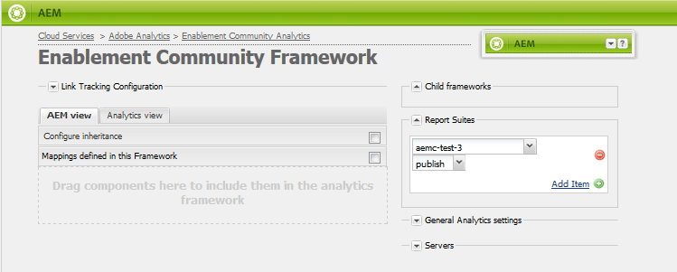

# Configuração do Analytics para recursos das Comunidades {#analytics-configuration-for-communities-features}

>[!CAUTION]
>
>AEM 6.4 chegou ao fim do suporte estendido e esta documentação não é mais atualizada. Para obter mais detalhes, consulte nossa [períodos de assistência técnica](https://helpx.adobe.com/br/support/programs/eol-matrix.html). Encontre as versões compatíveis [here](https://experienceleague.adobe.com/docs/).

## Visão geral {#overview}

A Adobe Analytics e a Adobe Experience Manager (AEM) são soluções da Adobe Marketing Cloud.

O Adobe Analytics pode ser configurado para o AEM Communities de forma que, à medida que um membro interage com os recursos das Comunidades compatíveis, os eventos sejam enviados para o Adobe Analytics a partir do qual os relatórios são gerados.

Por exemplo, quando um membro de um site da comunidade de ativação exibir um recurso de vídeo atribuído a ele, o reprodutor de recursos enviará eventos para o Analytics, incluindo dados de pulsação de vídeo. No site da comunidade, os administradores podem visualizar vários relatórios sobre a reprodução do vídeo.

Além disso, o analytics é necessário para:

* No ambiente de publicação:

   * Relatórios sobre a comunidade [tendências](trends.md)
   * Permitir que os visitantes do site classifiquem por &quot;mais visualizados&quot;, &quot;mais ativos&quot;, &quot;mais curtidos&quot;
   * Exibir contagens em listas UGC

* No ambiente de criação:

   * Exibição dos dados de participação no [console de gerenciamento de membros](members.md) (visualizações, postagens, seguidores, curtidas)
   * Resumo de tendências, pulsação de vídeo e dispositivo de vídeo para ativar o recurso [relatórios](reports.md)

Os recursos suportados das Comunidades incluem:

* [Recursos de habilitação](resources.md)
* [Fórum](forum.md)
* [QnA](working-with-qna.md)
* [Blog](blog-feature.md)
* [Biblioteca de arquivos](file-library.md)
* [Calendário](calendar.md)

Esta seção da documentação descreve como conectar um conjunto de relatórios do Analytics com recursos das Comunidades. As etapas básicas são:

1. [Replicar a chave de criptografia](#replicate-the-crypto-key) para garantir que a criptografia/descriptografia ocorra corretamente em todas as instâncias AEM
1. Preparar uma Adobe Analytics [conjunto de relatórios](#adobe-analytics-report-suite-for-video-reporting)
1. Criar um AEM Analytics [serviço na nuvem](#aem-analytics-cloud-service-configuration) e [estrutura](#aem-analytics-framework-configuration)
1. [Ativar o Analytics](#enable-analytics-for-a-community-site) para um site da comunidade
1. [Verificar](#verify-analytics-to-aem-variable-mapping) Análise para mapeamento AEM variável
1. Identificar [editor principal](#primary-publisher)
1. [Publicar](#publish-community-site-and-analytics-cloud-service) o site da comunidade
1. Configurar [importação de dados de relatório](#obtaining-reports-from-analytics) do Adobe Analytics para o site da comunidade

## Pré-requisitos {#prerequisites}

Para configurar os recursos do Analytics for Communities, é necessário trabalhar com seu representante de conta para configurar uma conta do Adobe Analytics e [conjunto de relatórios](#adobe-analytics-report-suite-for-video-reporting). Uma vez estabelecidas, devem estar disponíveis as seguintes informações:

* Nome da empresa

   A empresa associada à conta da Adobe Analytics
* Nome de usuário

   O nome de usuário de logon do usuário autorizado a gerenciar a conta do Analytics

   (Deve incluir privilégios de acesso ao serviço da Web)

* Senha

   A senha de logon do usuário autorizado

* Data Center do Analytics

   O URL do data center do Analytics para a conta

* Conjunto de relatórios

   O nome do conjunto de relatórios do Analytics a ser usado

## Relatório do Conjunto de relatórios do Adobe Analytics para vídeo {#adobe-analytics-report-suite-for-video-reporting}

Usar o [Gerenciador do Conjunto de relatórios](https://experienceleague.adobe.com/docs/analytics/admin/manage-report-suites/new-report-suite/new-report-suite.html), os conjuntos de relatórios do Analytics podem ser configurados para que um site da comunidade possa ser habilitado para fornecer relatórios para os recursos das Comunidades.

Ao fazer logon em [Adobe Marketing Cloud](https://experienceleague.adobe.com/docs/analytics/analyze/analysis-workspace/home.html) com [Nome da empresa e nome de usuário](analytics.md#prerequisites), é possível configurar um conjunto de relatórios novo ou existente para ter:

* [11 Variáveis de conversão](https://experienceleague.adobe.com/docs/analytics/admin/admin-tools/conversion-variables/conversion-var-admin.html) (evars)

   * **`evar1`** through **`evar11`** ativado
   * Pode redefinir (renomear) evars existentes ou criar novas para usar nos recursos das Comunidades

* [7 Eventos bem-sucedidos](https://experienceleague.adobe.com/docs/analytics/admin/admin-tools/success-events/success-event.html) (events)

   * **`event1`** through **`event7`** ativado
   * Tipo **`Counter`**

      * não **`Counter (no subrelations)`**
   * Pode redefinir (renomear) os eventos existentes ou criar novos eventos para usar nos recursos das Comunidades


* [Gerenciamento de vídeo](https://experienceleague.adobe.com/docs/media-analytics/using/media-overview.html)

   * Console de relatórios de vídeo

      * Ativar `Video Core`
      * Selecione Salvar
   * Console de medição do vídeo principal

      * Selecionar `Use Solution Variables`
      * Selecione Salvar


Se estiver usando um **novo conjunto de relatórios**, esteja ciente de que um novo conjunto de relatórios pode ter apenas 4 evars e 6 variáveis de evento, enquanto 11 evars e 7 vars de evento são necessários para Comunidades.

Se estiver usando um **conjunto de relatórios existente**, pode ser necessário [modificar o mapeamento de variável](#modifying-analytics-variable-mapping) antes de ativar a estrutura do Analytics para um site da comunidade. Entre em contato com o representante de conta para obter informações sobre as variáveis dedicadas às Comunidades.

>[!CAUTION]
>
>**Se estiver usando um conjunto de relatórios existente que já usa variáveis no**
>
>* **`evar1`** a **`evar11`**
>* **`event1`** a **`event7`**
>
>**Em seguida, antes de o site da comunidade ser publicado,** é importante restaurar o mapeamento preexistente movendo as variáveis de AEM que foram mapeadas automaticamente para as variáveis do Analytics quando o Analytics foi ativado para um site da comunidade.
>
>Para restaurar o mapeamento pré-existente e mover AEM variáveis para outras variáveis do Analytics, consulte a seção em [Modificação do mapeamento de variável do Analytics](#modifying-analytics-variable-mapping).
>
>Se isso não for feito, poderá ocorrer perda irrecuperável de dados.

### Análise do Video Heartbeat {#video-heartbeat-analytics}

Quando o Video Heartbeat Analytics estiver licenciado, uma `Marketing Cloud Org Id` é atribuído.

Para ativar o relatório do Video Heartbeat após [configuração do conjunto de relatórios do Analytics para relatórios de vídeo](#adobe-analytics-report-suite-for-video-reporting):

* Crie um [Serviço em nuvem do Analytics](#aem-analytics-cloud-service-configuration)
* Habilitar [Analytics para um site da comunidade](#enable-analytics-for-a-community-site)
* Associe o `Marketing Cloud Org Id` com o site da comunidade

O `Marketing Cloud Org Id` podem ser inseridas no momento da [criação de site da comunidade](sites-console.md#enablement) ou mais tarde [modificação](sites-console.md#modifying-site-properties) as propriedades do site da comunidade. [](#aem-analytics-cloud-service-configuration)


Quando a Análise do Video Heartbeat está ativada, o código Javascript (JS) do reprodutor de vídeo instancia o código da biblioteca do Video Heartbeat (também no JS), que lida com toda a lógica para enviar atualizações de status de vídeo aos servidores de rastreamento de vídeo do Analytics a cada 10 segundos (não configurável) e, eventualmente, enviar um relatório cumulativo da sessão de vídeo para os principais servidores do Analytics.

Se não estiver habilitado, o código da pulsação de vídeo nunca será instanciado e somente o rastreamento do progresso e da posição de retomada do vídeo será mantido no SRP para gerar relatórios.

## Configuração do serviço Analytics Cloud AEM {#aem-analytics-cloud-service-configuration}

Para criar uma nova Integração do Analytics, que integra o Adobe Analytics ao site da comunidade de AEM, usando a interface padrão na instância do autor:

* Na navegação global: **[!UICONTROL Ferramentas > Implantação > Cloud Services]**
* Role para baixo até **[!UICONTROL Adobe Analytics]**
* Selecione um **[!UICONTROL Configurar agora]** ou **[!UICONTROL Mostrar configurações]**


### Caixa de diálogo Criar configuração {#create-configuration-dialog}

* Selecionar `[+]` ícone ao lado de **[!UICONTROL Configurações disponíveis]** para criar uma nova configuração

Na caixa de diálogo Criar configuração , os valores a serem inseridos identificam a configuração.


* **[!UICONTROL Título]**

   (Obrigatório) Um título de exibição para a configuração.

   Por exemplo, insira *Ativar o Community Analytics*

* **[!UICONTROL Nome]**

   (Opcional) Se não especificado, o nome assumirá como padrão um nome de nó válido derivado do título.

   Por exemplo, insira *comunidades*


* **[!UICONTROL Modelo]**

   Selecionar `Adobe Analytics Configuration`

* Selecione **[!UICONTROL Criar]**
   * Inicia a página de configuração e abre `Analytics Settings` diálogo

### Caixa de diálogo Configurações do Analytics {#analytics-settings-dialog}

A criação inicial de uma nova configuração do Analytics resulta na exibição da configuração e em uma nova caixa de diálogo para a entrada das Configurações do Analytics. Essa caixa de diálogo requer o [informações da conta de pré-requisito](#prerequisites) obtido do representante da conta.


* **[!UICONTROL Empresa]**

   A empresa associada à conta da Adobe Analytics

* **[!UICONTROL Nome de usuário]**

   O nome de usuário de logon do usuário autorizado a gerenciar a conta do Analytics

* **[!UICONTROL Senha]**

   A senha de logon do usuário autorizado

* **[!UICONTROL Centro de dados]**

   Selecione o data center do Analytics que hospeda o conjunto de relatórios

* **[!UICONTROL Não adicionar a tag de rastreamento à página]**

   Deixar como padrão (desmarcado)

* **[!UICONTROL Usar AppMeasurement]**

   Deixar como padrão (desmarcado)

* **[!UICONTROL Não realizar importações de impressões de página todas as noites (autor)]**

   Deixar como padrão (desmarcado)

* **[!UICONTROL Não realizar importações de impressões de página todas as noites (publicar)]**

   Deixe como padrão (marcado)

Para salvar as configurações:


* Selecionar **[!UICONTROL Conectar-se ao Analytics]**

   * Se não tiver êxito,

      * Verifique se as entradas não contêm espaços à esquerda
      * Tente um data center diferente
      * Entre em contato com seu representante de conta

* Selecionar **[!UICONTROL OK]**


### Criar estrutura {#create-framework}

Após a configuração bem-sucedida da conexão básica com o Adobe Analytics, é necessário criar ou editar uma estrutura para o site da comunidade. A finalidade da estrutura é mapear as variáveis de recurso (AEM) das Comunidades para variáveis do Analytics (conjunto de relatórios).

* Selecionar `[+]` ícone ao lado de **[!UICONTROL Estruturas disponíveis]** para criar uma nova estrutura


* **[!UICONTROL Título]**

   (Obrigatório) Um título de exibição para a estrutura

   Por exemplo, insira *Ativação do quadro comunitário*

* **[!UICONTROL Nome]**

   (Opcional) Se não especificado, o nome assumirá como padrão um nome de nó válido derivado do título.

   Por exemplo, insira *comunidades*

* **[!UICONTROL Modelo]**

   Selecionar `Adobe Analytics Framework`

* Selecione **[!UICONTROL Criar]**

A criação da Estrutura do Analytics abre a estrutura para configuração.

## Configuração da estrutura do AEM Analytics {#aem-analytics-framework-configuration}

A finalidade da estrutura é mapear variáveis AEM para variáveis do Analytics (evars e eventos). As variáveis do Analytics disponíveis para mapeamento são [definido no conjunto de relatórios](#adobe-analytics-report-suite-for-video-reporting).


### Selecionar Conjunto de relatórios {#select-report-suite}

Selecione o conjunto de relatórios que foi configurado para relatórios de vídeo.

Se um conjunto de relatórios ainda não tiver sido criado ou não tiver sido configurado corretamente, consulte a seção anterior:\
[Relatório do Conjunto de relatórios do Adobe Analytics para vídeo](#adobe-analytics-report-suite-for-video-reporting)

O Sidekick não é necessário e pode ser minimizado para que não obstrua o acesso às configurações dos Conjuntos de relatórios.

#### Caixa de diálogo Conjuntos de relatórios antes e depois de selecionar &#39;Adicionar item&#39; {#report-suites-dialog-before-and-after-selecting-add-item}


1. Selecionar **[!UICONTROL Adicionar Item +]** duas caixas suspensas são exibidas
1. Escolha um `Report suite` os conjuntos de relatórios associados à conta Empresa devem estar disponíveis para seleção
1. Selecionar **[!UICONTROL Sim]** na caixa de diálogo que é aberta: ```Load default server settings? Do you want to load the default server settings and overwrite current values in the Server section?```
1. Escolha um `Run Mode`\
   Choose **[!UICONTROL publicar]**



O serviço e a estrutura de nuvem do Analytics estão concluídos. Os Mapeamentos serão definidos assim que um site da comunidade for criado com este serviço do Analytics ativado.

## Ativar o Analytics para um site da comunidade {#enable-analytics-for-a-community-site}

### Ativar para Novo Site da Comunidade {#enable-for-new-community-site}

Para adicionar o serviço de nuvem do Analytics ao [criação de um novo site da comunidade](sites-console.md):


* Na etapa 3
* Em [Guia ANALYTICS](sites-console.md#analytics):

   * Verifique a **[!UICONTROL Ativar o Analytics]** caixa de seleção
   * Escolha a estrutura na caixa suspensa

* Como opção, retorne à configuração da estrutura do Analytics para ajustar os mapeamentos de variáveis.

### Habilitar para site da comunidade existente {#enable-for-existing-community-site}

Para adicionar o serviço de nuvem do Analytics a um [site da comunidade existente](sites-console.md#modifying-site-properties):


* Navegue até o **[!UICONTROL Comunidades > Sites]** console
* Selecione o ícone Editar Site do site da comunidade
* Selecione as CONFIGURAÇÕES
* Na seção Analytics :

   * Verifique a **[!UICONTROL Ativar o Analytics]** caixa de seleção
   * Escolha a estrutura na caixa suspensa


* Como opção, retorne à configuração da estrutura do Analytics para ajustar os mapeamentos de variáveis.

### Ativar para sites personalizados {#enable-for-customized-sites}

Para que o rastreamento e a importação do Analytics funcionem corretamente para um site da comunidade, um elemento de página com a variável `scf-js-site-title` os atributos class e href devem estar presentes. Somente um desses elementos deve existir na página, como ocorre em um elemento não modificado `sitepage.hbs` script para um site da comunidade. O valor de `siteUrl` é extraída e enviada para a Adobe Analytics como a variável *caminho do site*.

```xml
# present in default sitepage.hbs

>[!CAUTION]
>
>AEM 6.4 has reached the end of extended support and this documentation is no longer updated. For further details, see our [technical support periods](https://helpx.adobe.com/support/programs/eol-matrix.html). Find the supported versions [here](https://experienceleague.adobe.com/docs/).
# only one scf-js-site-title class should be included

>[!CAUTION]
>
>AEM 6.4 has reached the end of extended support and this documentation is no longer updated. For further details, see our [technical support periods](https://helpx.adobe.com/support/programs/eol-matrix.html). Find the supported versions [here](https://experienceleague.adobe.com/docs/).
# this example sets it to be hidden as it serves no visual purpose

>[!CAUTION]
>
>AEM 6.4 has reached the end of extended support and this documentation is no longer updated. For further details, see our [technical support periods](https://helpx.adobe.com/support/programs/eol-matrix.html). Find the supported versions [here](https://experienceleague.adobe.com/docs/).
<div
    class="navbar-brand scf-js-site-title"
    href="{{siteUrl}}.html"
    style="visibility: hidden;"
>
</div>
```

Para um **site personalizado da comunidade** que sobrepõe a variável `sitepage.hbs` verifique se o elemento está presente. O `siteUrl`será definida quando renderizada no servidor antes de servir ao cliente.

Para um **site de AEM genérico** que inclui componentes do Communities, mas não é criado com o [assistente de criação de sites](sites-console.md), é necessário adicionar o elemento . O valor da href deve ser o caminho para o site. Por exemplo, se o caminho do site for `/content/my/company/en`, em seguida use:

```xml
<div
    class="navbar-brand scf-js-site-title"
    href="/content/my/company/en.html"
    style="visibility: hidden;"
>
</div>
```

## Recursos do Analytics for Communities {#analytics-for-communities-features}

O Analytics é usado automaticamente para vários recursos das Comunidades.

O ambiente do autor [Configuração do OSGi](../../help/sites-deploying/configuring-osgi.md), `AEM Communities Analytics Component Configuration`, fornece uma lista dos componentes que foram instrumentados para o Analytics. O mapeamento automático de variáveis é determinado pelos componentes listados.

Se forem criados novos componentes personalizados instrumentados para o Analytics, eles deverão ser adicionados a esta lista de componentes configurados.

### Configuração do componente {#component-configuration}


Observação: o `journal` são usados para implementar o recurso de blog.

### Análise mapeada para variáveis de AEM {#mapped-analytics-to-aem-variables}

Depois que o site da comunidade é salvo com o Analytics ativado e a estrutura de configuração de nuvem selecionada, as variáveis de AEM são mapeadas automaticamente para as evars e os eventos do Analytics que começam com evar1 e event1, respectivamente, e aumentam em 1.

Se estiver usando um conjunto de relatórios existente que mapeou qualquer uma das variáveis dentro de evar1 até evar11 e event1 até event7, será necessário [remapear as variáveis de AEM](#modifying-analytics-variable-mapping) e restaure o mapeamento original.

Veja a seguir um exemplo de mapeamentos padrão após seguir o [tutorial de introdução](getting-started-enablement.md):


#### Mapa de eVars enviadas com cada evento {#map-of-evars-sent-with-each-event}

|  | Ativar Tipo de Recurso | Título do Site | Tipo de função | Título do grupo | Caminho do grupo | Tipo de UGC | Título do UGC | Usuário (Membro) | Caminho UGC | Caminho do site |
|------------------------|------------------------|-----------|--------------|------------|-----------|---------|----------|--------------|---------|----------|
|  | **eVar1** | **eVar2** | **eVar3** | **eVar4** | **eVar5** | **eVar6** | **eVar7** | **eVar8** | **eVar9** | **eVar10** |
| event1Resource Play | (a) | - | - | - | - | - | - | - | i) | - |
| event2SCFView | (a) | (b) | (c) | (d) | e) | f) | g) | (h) | i) | j) |
| event3SCFCreate (Post) | - | (b) | (c) | (d) | e) | f) | g) | (h) | i) | j) |
| event4SCFFollow | - | (b) | (c) | (d) | e) | f) | g) | (h) | i) | j) |
| event5SCFVoteUp | - | (b) | (c) | (d) | e) | f) | g) | (h) | i) | j) |
| event6SCFVoteDown | - | (b) | (c) | (d) | e) | f) | g) | (h) | i) | j) |
| event7SCFRate | - | (b) | (c) | (d) | e) | f) | g) | (h) | i) | j) |

**Exemplos de valores de eVar:**

* [Tipo MIME](https://www.iana.org/assignments/media-types): video/mp4
* [Título do site da comunidade](sites-console.md#step13asitetemplate): Comunidades Geometrixx
* [Nome da função da comunidade](functions.md): Fórum
* [Nome do grupo da comunidade](creating-groups.md#creating-a-new-group): Caminho
* Caminho para o conteúdo do grupo da comunidade: /content/sites/communities/en/groups/trilha
* [Tipo de recurso do componente UGC](essentials.md): social/fórum/componentes/hbs/tópico
* Título do componente UGC: Tópicos de rastreamento
* Logon (ID autorizável): aaron.mcdonald@mailinator.com
* Caminho SRP para UGC: /content/usergenerated/asi/.../forum/jmtz-topic3 ou *caminho do componente a seguir*: /content/sites/communities/en/jcr:content/content/primary/forum
* Caminho para o conteúdo do site da comunidade: /content/sites/community/en

### Modificação do mapeamento de variável do Analytics {#modifying-analytics-variable-mapping}

O mapeamento de evars e eventos do Analytics para variáveis de AEM é visível da configuração da estrutura depois que o Analytics é ativado para um site da comunidade.

Depois que o Analytics for ativado e antes que o site da comunidade seja publicado, o mapeamento poderá ser alterado na estrutura, arrastando a eVar ou o evento do Analytics desejado do painel esquerdo e soltando-o na linha relevante na tabela de mapeamento.

Para evitar mapeamentos duplicados, remova a evar ou o evento do Analytics substituído da linha ao passar o mouse sobre ela e selecionar o &quot;X&quot; que aparece à direita do elemento de variável do Analytics.

Se as evars e os eventos do Communities substituírem os mapeamentos que existiam anteriormente no conjunto de relatórios, para evitar perda de dados, atribua as variáveis de AEM para os recursos do Communities a outras evars e/ou eventos do Analytics e restaure os mapeamentos originais.

>[!CAUTION]
>
>É importante remapear antes que o site da comunidade seja [publicado](#publishing-the-community-site) com o Analytics ativado, há o risco de perda de dados.

#### Exemplo da Etapa 1: Arrastar a evar14 do Analytics para a tabela de mapeamento {#example-step-dragging-analytics-evar-into-mapping-table}


#### Exemplo da Etapa 2: Selecionar &#39;x&#39; para remover evar11 substituído {#example-step-selecting-x-to-remove-replaced-evar}


#### Exemplo da Etapa 3: AEM var eventdata.siteId remapeado para a evar14 do Analytics {#example-step-aem-var-eventdata-siteid-remapped-to-analytics-evar}


## Publicar o site da comunidade {#publishing-the-community-site}

### Verifique o Analytics para AEM o mapeamento de variáveis {#verify-analytics-to-aem-variable-mapping}

É recomendável verificar o mapeamento de variável antes de publicar o site da comunidade, que também publica o serviço de nuvem e a estrutura do Analytics.

Consulte as seções:

* [Análise mapeada para variáveis de AEM](#mapped-analytics-to-aem-variables)
* [Modificação do mapeamento de variável do Analytics](#modifying-analytics-variable-mapping)

>[!CAUTION]
>
>**Se estiver usando um conjunto de relatórios existente que já usa variáveis no**
>
>* **`evar1`** a **`evar11`**
>* **`event1`** a **`event7`**
>
>**Em seguida, antes de o site da comunidade ser publicado,** é importante restaurar o mapeamento preexistente e mover as variáveis de AEM Comunidades que foram mapeadas automaticamente (quando o Analytics foi ativado para o site da comunidade) para outras variáveis do Analytics. Esse remapeamento deve ser consistente em todos os componentes das Comunidades.
>
>Se isso não for feito, poderá ocorrer perda irrecuperável de dados.

### Editor principal {#primary-publisher}

Quando a implantação escolhida é uma [publicar farm](topologies.md#tarmk-publish-farm), uma instância de publicação de AEM deve ser identificada como o editor principal para a pesquisa do Adobe Analytics para os dados do relatório para gravação em [SRP](working-with-srp.md).

Por padrão, a variável `AEM Communities Publisher Configuration` A configuração do OSGi identifica a instância de publicação como o editor principal, de modo que todas as instâncias de publicação em um farm de publicação se autoidentificariam como as primárias.

Portanto, é necessário editar a configuração em todas as instâncias de publicação secundárias para desmarcar a variável **Editor principal** caixa de seleção.

Para obter instruções específicas, consulte a seção Editor principal de [Implantação de comunidades](deploy-communities.md#primary-publisher).

>[!CAUTION]
>
>É importante que o editor principal seja configurado para impedir a pesquisa de várias instâncias de publicação.

### Replicar a chave de criptografia {#replicate-the-crypto-key}

As credenciais do Adobe Analytics são criptografadas. Para facilitar a replicação ou a transmissão de credenciais de análise criptografadas entre o autor e os editores, todas as instâncias AEM devem compartilhar a mesma chave de criptografia primária.

Para fazer isso, siga as instruções em [Replicar a chave de criptografia](deploy-communities.md#replicate-the-crypto-key).

### Publicar site da comunidade e serviço do Analytics Cloud {#publish-community-site-and-analytics-cloud-service}

Quando o serviço em nuvem do Analytics tiver sido ativado para um site da comunidade e, se necessário, a variável [O mapeamento do Analytics para variáveis de AEM foi ajustado](#mapped-analytics-to-aem-variables), é necessário replicar a configuração para o ambiente de publicação por [(re)publicar o site da comunidade](sites-console.md#publishing-the-site).

## Obter relatórios do Analytics {#obtaining-reports-from-analytics}

### Gerenciamento de relatórios {#report-management}

O autor e o editor principal [Configuração do OSGi](../../help/sites-deploying/configuring-osgi.md), `AEM Communities Analytics Report Management`, é usada para consultar o Analytics.

No autor, as consultas são para relatórios em tempo real.

No editor principal, as consultas são usadas para fornecer informações em preparação para a importação de dados do Analytics do Importador de relatórios.

O padrão do intervalo de query é 10 segundos.

### Importador de relatórios {#report-importer}

Depois que um site da comunidade habilitado para o Analytics for publicado, o [Configuração do OSGi](../../help/sites-deploying/configuring-osgi.md), `AEM Communities Analytics Report Importer`, pode ser configurado para definir o intervalo de pesquisa padrão para as configurações que não estão configuradas individualmente no CRXDE.

O intervalo de sondagem controla a frequência das solicitações ao Adobe Analytics para que os dados sejam obtidos e salvos em [SRP](working-with-srp.md).

Quando os dados podem ser categorizados como &quot;grandes dados&quot;, pesquisas mais frequentes podem colocar uma grande carga no site da comunidade.

A pesquisa padrão **Intervalo de importação** é definido como 12 horas.


### Personalização de relatórios de componentes {#component-report-customization}

Atualmente, para personalizar as métricas para rastrear, os nós são criados no repositório que definem períodos de tempo para os quais gerar um relatório sobre essa métrica.

O tópico do fórum é atualmente o único exemplo dessa personalização:

* No editor principal
* Fazer logon com privilégios administrativos
* Navegar para [CRXDE Lite](../../help/sites-developing/developing-with-crxde-lite.md)

   * Por exemplo, [http://localhost:4503/crx/de](http://localhost:4503/crx/de)

* Em `jcr:content` nó da raiz do idioma

   * Por exemplo, `/content/sites/engage/en/jcr:content`

* Navegue até o componente configurado para os relatórios do Analytics

   * Por exemplo, `analytics/reportConfigs/social_forum_components_hbs_topic`

* Observe os períodos de tempo criados

   * `last30Days`
   * `last90Days`
   * `thisYear`

* Observe que `total`nó

   * Modificação do `interval` substituirá o intervalo do Importador de relatórios
   * O valor é em segundos e é definido como 4 horas (14400 segundos)


## Gerenciar dados do usuário no Analytics {#manage-user-data-in-analytics}

O Adobe Analytics fornece APIs que permitem acessar, exportar e excluir dados do usuário. Para obter mais informações, consulte [Enviar solicitações de acesso e de exclusão](https://experienceleague.adobe.com/docs/analytics/admin/data-governance/gdpr-submit-access-delete.html).

## Recursos {#resources}

* Adobe Marketing Cloud: [Ajuda e referência do Analytics](https://experienceleague.adobe.com/docs/analytics/landing/home.html)
* AEM: [Integração com o Adobe Analytics](../../help/sites-administering/adobeanalytics.md)
* AEM: [Analytics com provedores externos](../../help/sites-administering/external-providers.md)
