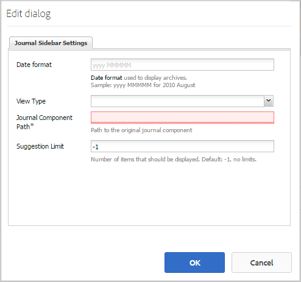

# Recurso do blog {#blog-feature}

## Introdução {#introduction}

O recurso de blog do AEM Communities se transformou de uma atividade de criação em uma verdadeira atividade da comunidade que acontece no ambiente de publicação.

O recurso de blog suporta o fornecimento de informações da comunidade em um formato de diário. As entradas do blog são feitas no ambiente de publicação por membros autorizados (usuários registrados, conectados).

O recurso de blog fornece:

* Criação no lado da publicação de artigos e comentários do blog
* Edição de texto formatado
* Imagens embutidas (com suporte para arrastar e soltar)
* Conteúdo de rede social incorporado ([Suporte a incorporação](blog-developer-basics.md#allowing-rich-media))
* Modo de rascunho
* Publicação agendada
* Compor em nome (um [membro privilegiado](users.md#privileged-members-group) pode criar conteúdo em nome de um membro da comunidade diferente)
* [Moderação em massa e em contexto de artigos e comentários em ](moderate-ugc.md) blog

Esta seção da documentação descreve

* Adicionar o recurso de blog a um site AEM
* Configurações para componentes de blog

>[!NOTE]
>
>Os componentes `Journal`e `Journal Sidebar` são intitulados `Blog` e `Blog Sidebar`.
>
>O recurso de blog encontrado no AEM 6.0 e versões anteriores foi removido. Ele era baseado em um modelo e permitia somente que autores criassem conteúdo no ambiente do autor.

## Adicionar componentes do blog a uma página {#adding-blog-components-to-a-page}

Se desejar adicionar um blog a uma página no modo de autor, use o navegador de componentes para localizar

* `Communities / Blog`
* `Communities / Blog Sidebar`

E arraste-os para o lugar em uma página onde o blog deveria aparecer.

Para obter as informações necessárias, visite [Informações básicas sobre componentes das comunidades](basics.md).

Quando as [bibliotecas obrigatórias do lado do cliente](blog-developer-basics.md#essentials-for-client-side) forem incluídas, será assim que o componente `Blog`aparecerá:

E como o `Blog Sidebar` aparecerá:

### Configurando o Blog {#configuring-blog}

Selecione o componente `Blog` inserido para acessar e selecione o ícone `Configure` que abre a caixa de diálogo de edição.

 

#### Guia Configurações {#settings-tab}

Na guia **[!UICONTROL Settings]**, especifique os recursos básicos do blog:

* **[!UICONTROL Permitir]**
miniatura do anexoSe marcada, uma miniatura da imagem anexada é criada.

* **[!UICONTROL Tamanho máximo da]**
miniatura de anexaçãoTamanho máximo (em pixels) da imagem em miniatura do anexo. O valor padrão é 800 x 800.

* **[!UICONTROL Tamanho mínimo da imagem para]**
miniaturaTamanho mínimo (em bytes) da imagem para geração de miniatura para imagens em linha. O valor padrão é 100000 bytes (100 kb).

* **[!UICONTROL Tamanho máx.]**
da miniaturaTamanho máximo (em pixels) da imagem em miniatura para imagem em linha. O valor padrão é 800 x 800.

* **[!UICONTROL Permitir]**
membros privilegiadosSe marcada, somente membros privilegiados poderão criar conteúdo.

* **[!UICONTROL Membros]**
privilegiados permitidosAdicione os membros privilegiados permitidos para criar conteúdo.

* **[!UICONTROL Bloquear conteúdo gerado pelo usuário no]**
modo de edição do autorSe ativado, bloqueia o conteúdo gerado pelo usuário durante a edição no modo de autor.

* **[!UICONTROL Título]**
do journalO título do blog a ser exibido na página.
   >Nota:
   >O Título do Journal é usado para criar automaticamente o URL para o blog. No máximo 50 caracteres (com 5 caracteres adicionais para exclusividade) são usados no título do journal que você especificou aqui para criar o URL para o blog.

* **[!UICONTROL Descrição]**
do journalA descrição do blog.

* **[!UICONTROL Tópicos por página]**

   Define o número de entradas/comentários do blog exibidos por página. O padrão é 10.

* **[!UICONTROL Moderada]**

   Se marcada, a postagem de entradas e comentários do blog deve ser aprovada antes de serem exibidos em um site de publicação. O padrão está desmarcado.

* **[!UICONTROL Fechado]**

   Se marcada, o blog é fechado a novas entradas e comentários do blog. O padrão está desmarcado.

* **[!UICONTROL Editor de Rich Text]**

   Se marcada, as entradas de blog e os comentários podem ser inseridos com marcação. O padrão está marcado.

* **[!UICONTROL Permitir marcação]**

   Se marcada, permita que os membros adicionem etiquetas à sua postagem (consulte a guia **[!UICONTROL Campo de tag]**). O padrão está desmarcado.

* **[!UICONTROL Permitir carregamento de arquivos]**

   Se marcada, permita que os anexos de arquivo sejam adicionados a uma entrada de blog ou a um comentário. O padrão está desmarcado.

* **[!UICONTROL Tamanho máximo do arquivo]**

   Relevante somente se `Allow File Uploads` estiver marcado. Este campo limitará o tamanho (em bytes) de um arquivo carregado. O padrão é 104857600 (10 Mb).

* **[!UICONTROL Tipos de arquivos permitidos]**

   Relevante somente se `Allow File Uploads` estiver marcado. Uma lista separada por vírgulas de extensões de arquivo com o separador &quot;ponto&quot;. Por exemplo: .jpg, .jpeg, .png, .doc, .docx, .pdf. Se algum tipo de arquivo for especificado, o upload dos não especificados não será permitido. O padrão não é especificado, de modo que todos os tipos de arquivos sejam permitidos.

* **[!UICONTROL Tamanho máximo do arquivo de imagem a ser anexado]**

   Relevante somente se a opção Permitir uploads de arquivo estiver marcada. Número máximo de bytes que um arquivo de imagem carregado pode ter. O padrão é 2097152 (2 Mb).

* **[!UICONTROL Permitir respostas]**

   Se marcada, permita respostas a comentários publicados na entrada do blog. O padrão está desmarcado.

* **[!UICONTROL Permitir que usuários excluam comentários e tópicos]**

   Se marcada, permita que os membros excluam os comentários e entradas de blog que publicaram. O padrão está desmarcado.

* **[!UICONTROL Permitir monitoramento]**

   Se marcada, inclua o seguinte recurso para artigos de blog, que permite que os membros sejam [notificados](notifications.md) de novas publicações. O padrão está desmarcado.

* **[!UICONTROL Permitir assinaturas de email]**

   Se marcada, permita que os membros sejam notificados de novas postagens por email ([subscrição](subscriptions.md)). Exige que `Allow Following` seja verificado e [e-mail configurado](email.md). O padrão está desmarcado.

* **[!UICONTROL Permitir votação]**

   Se marcada, inclua o recurso Voto com uma entrada de blog. O padrão está desmarcado.

* **[!UICONTROL Exibir selos]**

   Se marcada, exiba os [emblemas](implementing-scoring.md) obtidos e atribuídos com a entrada de blog de um membro. O padrão está desmarcado.

* **[!UICONTROL Ativar conteúdo em destaque]**

   se marcada, a ideia pode ser identificada como [conteúdo em destaque](featured.md). O padrão está desmarcado.

#### Guia Moderação do usuário {#user-moderation-tab}

Na guia **[!UICONTROL Moderação do usuário]**, especifique as configurações de moderação:

* **[!UICONTROL Negar postagens]**

   Se marcada, os moderadores de membros confiáveis poderão negar publicações e impedir que a publicação apareça no fórum público. O padrão está desmarcado.

* **[!UICONTROL Fechar/Reabrir tópicos]**

   Se marcada, os moderadores de membros confiáveis podem fechar um tópico para outras edições e comentários, e também podem reabrir um tópico. O padrão está desmarcado.

* **[!UICONTROL Sinalizar postagens]**

   Se marcada, permita que os membros sinalizem os tópicos ou comentários de outras pessoas como inadequados. O padrão está desmarcado.

* **[!UICONTROL Sinalizar lista de motivo]**

   Se marcada, permita que os membros escolham, em uma lista suspensa, seu motivo para marcar um tópico ou comentário como inapropriado. O padrão está desmarcado.

* **[!UICONTROL Motivo personalizado de sinalização]**

   Se marcada, permita que os membros insiram seu próprio motivo para marcar um tópico ou comentário como inapropriado. O padrão está desmarcado.

* **[!UICONTROL Limite de moderação]**

   Insira o número de vezes que um tópico ou comentário deve ser sinalizado pelos membros antes que os moderadores sejam notificados. O padrão é 1 (uma vez).

* **[!UICONTROL Limite de sinalização]**

   Insira o número de vezes que um tópico ou comentário deve ser sinalizado antes de ser ocultado da visualização pública. Se definido como -1, o tópico ou comentário sinalizado nunca será ocultado da visualização pública. Caso contrário, esse número deve ser maior ou igual ao Limite de moderação. O padrão é 5.

#### Guia Campo de tag {#tag-field-tab}

Na guia **[!UICONTROL Campo de tag]**, especifique as tags que podem ser aplicadas se **[!UICONTROL Permitir marcação]** estiver marcado na guia **[!UICONTROL Configurações]**:

* **[!UICONTROL Espaços de nomes permitidos]**

   Relevante se `Allow Tagging` estiver marcado na guia **[!UICONTROL Settings]**. As marcas que podem ser aplicadas são limitadas às da categoria verificada. A lista do namespace inclui &quot;Tags padrão&quot; (a namespace padrão) e &quot;Incluir todas as tags&quot;. O padrão não está marcado, o que significa que todas as namespaces são permitidas.

* **[!UICONTROL Limite sugerido]**

   Insira o número de tags a serem exibidas como uma sugestão para o membro postando no fórum. Um valor de -1 significa que não há limites. O padrão é 0.

### Configuração da barra lateral do blog {#configuring-blog-sidebar}

Ao clicar com o duplo no componente `Blog Sidebar`, uma caixa de diálogo de edição é aberta.

Na guia **[!UICONTROL Configurações da barra lateral do Journal]**, especifique o formato de data para arquivos e que tipo de entradas serão exibidas na barra lateral:

* **[!UICONTROL Formato de data]**

   O formato usado para exibir arquivos de entradas de blog. O formato usa espaços reservados de acordo com a convenção Java.

   * aaaa: ano inteiro, como em 2015
   * yy: ano curto, como &quot;15&quot;
   * MMMM: mês inteiro, como junho
   * MMM: mês curto, como Jun
   * MM: número do mês, como 06

   O padrão é &quot;yyyy MMMM&quot;, que exibiria, por exemplo, &quot;2015 June&quot;

* **[!UICONTROL Visualizar tipo]**

   O Título e o tipo de entradas de blog a serem exibidas na barra lateral. A escolha é entre

   * Autores
   * Categorias
   * Arquivos

* **[!UICONTROL Caminho de componentes do diário]**

   *(Opcional)* O local do recurso de blog a partir do qual os artigos de blog devem ser listados. Se deixado em branco, usará o componente de resourceType `social/journal/components/hbs/journal` que aparece na mesma página.

   * Por exemplo, `/content/sites/engage/en/blog/jcr:content/content/primary/blog`

* **[!UICONTROL Limite sugerido]**

   O número de artigos do blog a serem exibidos. Um valor de -1 significa sem limite. O padrão é -1.

## Experiência de Visitante do site {#site-visitor-experience}

No ambiente publish, o recurso blog exibirá o artigo mais recente do blog seguido de artigos mais antigos em blog em ordem decrescente de criação. As barras laterais do blog permitem que os visitantes do site apliquem filtros para limitar a seleção de artigos do blog exibidos.

O artigo do blog é seguido de um link para postar ou visualização de comentários.

Quando um artigo do blog é selecionado, o artigo do blog e os comentários são exibidos (se ativados).

Outras capacidades dependem de o visitante do site ser um moderador, administrador, membro da comunidade, membro privilegiado ou anônimo.

### Como trabalhar com artigos {#working-with-articles}

Ao criar um novo artigo de blog, há a opção de

1. Publicar imediatamente
1. Publicar um rascunho
1. Publicar em uma data e hora agendadas

Os artigos do blog aparecerão sob a guia apropriada (Publicado, Rascunhos ou Programado) para os membros capazes de criar ao publicar.

#### Moderadores e administradores {#moderators-and-administrators}

Quando o usuário conectado tem privilégios de moderador ou administrador, ele pode executar [tarefas de moderação](moderate-ugc.md) (conforme permitido pela configuração do componente) em todos os artigos de blog e comentários publicados em um blog.

### Membros {#members}

Quando o usuário conectado é um membro da comunidade ou [membro privilegiado](users.md#privileged-members-group) (dependendo da configuração), ele poderá selecionar `New Article` para criar e publicar um novo artigo de blog.

Concretamente, podem:

* Criar um novo artigo de blog
* Publicar um novo artigo no blog em nome de outro membro
* Publicar um comentário em um artigo de blog
* Editar seu próprio artigo ou comentário no blog
* Excluir seu próprio artigo ou comentário no blog
* Sinalizar artigos ou comentários de outras pessoas no blog

 

### Anônimo {#anonymous}

Os visitantes do site que não estão conectados só podem ler artigos e comentários postados do blog, traduzi-los se houver suporte, mas não podem adicionar artigos ou comentários do blog nem sinalizar artigos ou comentários de outras pessoas.

## Informações adicionais {#additional-information}

Mais informações podem ser encontradas na página [Blog Essentials](blog-developer-basics.md) para desenvolvedores.

Para moderação de entradas e comentários do blog, consulte [Moderação de conteúdo gerado pelo usuário](moderate-ugc.md).

Para marcar entradas e comentários no blog, consulte [Marcação de conteúdo gerado pelo usuário](tag-ugc.md).

Para obter a tradução de entradas e comentários do blog, consulte [Traduzindo conteúdo gerado pelo usuário](translate-ugc.md).
