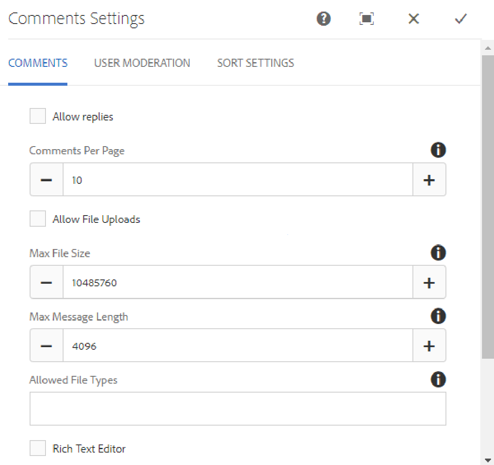

# Usando Comentários {#using-comments}

## Introdução {#introduction}

O recurso comments é usado para permitir que visitantes do site conectados (membros) compartilhem suas opiniões e conhecimentos sobre o conteúdo do site. Esse recurso geralmente já está presente em outros recursos, mas pode ser adicionado a qualquer site.

Esta seção da documentação descreve

* Adicionar `Comments` a uma página
* Configurações do componente `Comments`

>[!NOTE]
>
>Não há suporte para a publicação anônima de um comentário. Os visitantes do site devem se registrar (tornar-se um membro) e fazer logon para participar.

## Adicionar comentários a uma página {#adding-comments-to-a-page}

Para adicionar um componente `Comments`a uma página no modo de autor, use o navegador de componentes para localizar

* `Communities / Comments`

e arraste-o para o lugar em uma página, como uma posição relativa ao recurso no qual os usuários podem comentar ou simplesmente na parte inferior da página.

Para obter as informações necessárias, visite [Informações básicas sobre componentes das comunidades](basics.md).

Quando as [bibliotecas do lado do cliente necessárias](essentials-comments.md#essentials-for-client-side) forem incluídas, será assim que o componente `Comments`aparecerá.

>[!NOTE]
>
>Somente um `Comments`componente pode existir em uma página. Esteja ciente de que vários recursos das Comunidades já incluem comentários, como um blog, calendário, fórum, QnA e revisões.

## Configurando Comentários {#configuring-comments}

Selecione o componente `Comments` inserido para acessar e selecione o ícone `Configure` que abre a caixa de diálogo de edição.

 

### Guia Comentários {#comments-tab}

Na guia **[!UICONTROL Comments]**, especifique como os comentários são inseridos pelos visitantes.

* **[!UICONTROL Permitir respostas]**

   Se marcada, permite que os membros respondam aos comentários existentes. O padrão está desmarcado.

* **[!UICONTROL Comentários por página]**

   Limita o número de comentários exibidos por página, bem como o número de respostas exibidas. O padrão é 10.

* **[!UICONTROL Permitir carregamento de arquivos]**

   Se marcada, a opção para carregar um arquivo será apresentada com a caixa de entrada de texto. O padrão está desmarcado.

* **[!UICONTROL Tamanho máximo do arquivo]**

   Relevante somente se a opção Permitir uploads de arquivo estiver marcada. Esse valor limitará o tamanho do arquivo carregado. O limite padrão é 10 MB.

* **[!UICONTROL Comprimento máximo da mensagem de]**

   Número máximo de caracteres que podem ser inseridos na caixa de texto. O padrão é 4096 caracteres.

* **[!UICONTROL Tipos de arquivos permitidos]**

   Relevante somente se a opção Permitir uploads de arquivo estiver marcada. Uma lista separada por vírgulas de extensões de arquivo com o separador &quot;ponto&quot;. Por exemplo: .jpg, .jpeg, .png, .doc, .docx, .pdf. Se algum tipo de arquivo for especificado, os não especificados não serão permitidos. O padrão não é especificado, de modo que todos os tipos de arquivos sejam permitidos.

* **[!UICONTROL Editor de Rich Text]**

   Se marcada, os comentários podem ser inseridos com marcação. O padrão está desmarcado.

* **[!UICONTROL Permitir votação]**

   Se marcada, a opção para votar para cima ou para baixo será apresentada com a caixa de entrada de texto. O padrão está desmarcado.

* **[!UICONTROL Permitir monitoramento]**

   Se marcada, permita que os membros sigam os comentários. O padrão está desmarcado.

* **[!UICONTROL Exibir selos]**

   Se marcada, permita que os crachás ganhados e premiados sejam exibidos. O padrão está desmarcado.

### Guia Moderação do usuário {#user-moderation-tab}

Na guia **[!UICONTROL Moderação do usuário]**, especifique como os comentários publicados serão gerenciados. Para obter mais informações, consulte [Moderação de conteúdo gerado pelo usuário](moderate-ugc.md).

* **[!UICONTROL Pré-moderação]**

   Se marcada, os comentários devem ser aprovados antes de serem exibidos em um site de publicação. O padrão está desmarcado.

* **[!UICONTROL Excluir comentários]**

   Se marcada, o membro que postou o comentário terá a capacidade de excluí-lo. O padrão está desmarcado.

* **[!UICONTROL Negar comentários]**

   Se marcada, permita que os moderadores neguem comentários. O padrão está desmarcado.

* **[!UICONTROL Fechar/Reabrir comentários]**

   Se marcada, permita que os moderadores fechem e reabram os comentários. O padrão está desmarcado.

* **[!UICONTROL Sinalizar comentários]**

   Se marcada, permita que os membros sinalizem comentários como inadequados. O padrão está desmarcado.

* **[!UICONTROL Sinalizar lista de motivo]**

   Se marcada, permita que os membros escolham, em uma lista suspensa, seu motivo para marcar um comentário como inapropriado. O padrão está desmarcado.

* **[!UICONTROL Motivo personalizado de sinalização]**

   Se marcada, permita que os membros digitem seu próprio motivo para marcar um comentário como inapropriado. O padrão está desmarcado.

* **[!UICONTROL Limite de moderação]**

   Insira o número de vezes que um comentário deve ser sinalizado pelos membros antes que os moderadores sejam notificados. O padrão é uma vez (1).

* **[!UICONTROL Limite de sinalização]**

   Insira o número de vezes que um comentário deve ser sinalizado antes de ser ocultado da visualização pública. Esse número deve ser maior ou igual ao **[!UICONTROL Limite de moderação]**. O padrão é 5.

### guia Configurações de classificação {#sort-settings-tab}

Na guia **[!UICONTROL Classificar configurações]**, especifique como os comentários publicados são classificados quando exibidos.

* **[!UICONTROL Classificar campo]**

   Puxe para baixo para selecionar `Newest, Oldest, Last Updated, Most Viewed, Most Active, Most Followed` ou `Most Liked`.

* **[!UICONTROL Ordem de classificação]**

   Puxe para baixo para selecionar `Ascending` ou `Descending`.

### Alteração para um Tipo de Comentário Personalizado {#changing-to-a-custom-comment-type}

Ao alterar o Tipo de recurso de comentário, o sistema de comentários não gerará mais uma instância de um comentário usando o padrão, mas uma que foi personalizada (estendida) pelos desenvolvedores.

Quando os tipos de recursos personalizados forem conhecidos, digite [Modo de design](../../help/sites-authoring/default-components-designmode.md) e clique no duplo no componente `Comments` inserido para abrir uma caixa de diálogo com uma guia adicional.

Na guia **[!UICONTROL Tipos de recurso]**, especifique o resourceType personalizado para novas instâncias dos componentes `Comments or Voting`:

* **[!UICONTROL Tipo de recursos de comentários]**

   Navegue até resourceType de um componente `comment`estendido (comentário único) em /apps. Por exemplo, `/apps/social/commons/components/hbs/comments/comment`

   Esse recurso identificará o resourceType do UGC criado quando um visitante postar um comentário.

* **[!UICONTROL Tipo de recursos para pesquisa]**

   Navegue até resourceType de um componente `voting`estendido em /apps. Por exemplo, `/apps/social/components/hbs/voting`

   Esse recurso identificará o tipo de recurso do UGC criado quando um visitante postar um voto.

* **[!UICONTROL Tipo de recurso do sistema de comentários]**

   Navegue até resourceType de um componente `comments`estendido (Sistema de comentários) em /apps. Deixe em branco, a menos que o modelo de página [inclua dinamicamente](scf.md#add-or-include-a-communities-component) o Sistema de comentários no script subjacente em vez de ser adicionado à página como um recurso (nó de comentários). Saiba mais lendo sobre o auxiliar [{{include}}](handlebars-helpers.md#include).

## Experiência de Visitante do site {#site-visitor-experience}

### Moderadores e administradores {#moderators-and-administrators}

Quando o usuário conectado tem privilégios de moderador ou administrador, ele pode executar as tarefas de moderação permitidas pela configuração do componente, independentemente de quem criou o comentário.

### Membros {#members}

Quando o visitante do site estiver conectado, dependendo da configuração, eles poderão

* Publicar um novo comentário
* Editar seus próprios comentários
* Excluir seus próprios comentários
* Sinalizar comentários de outras pessoas

### Anônimo {#anonymous}

Os visitantes do site que não estão conectados só podem ler comentários publicados, traduzi-los se houver suporte, mas não podem adicionar comentários nem sinalizar comentários de outras pessoas.

## Informações adicionais {#additional-information}

Mais informações podem ser encontradas na página [Comments Essentials](essentials-comments.md) para desenvolvedores.

Para moderação de comentários publicados, consulte [Moderação de conteúdo gerado pelo usuário](moderate-ugc.md).

Para obter a tradução de comentários postados, consulte [Traduzindo conteúdo gerado pelo usuário](translate-ugc.md).
