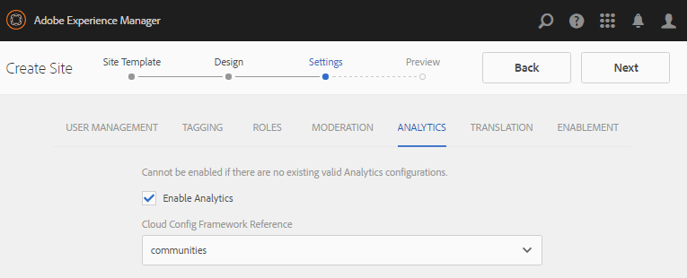

# Criar um novo site da comunidade {#author-a-new-community-site}

## Criar um novo site da comunidade {#create-a-new-community-site}

Usar a instância do autor para criar um novo site da comunidade

* Fazer logon com privilégios de administrador
* Da navegação global: **[!UICONTROL Navegação > Comunidades > Sites]**

O console Sites das Comunidades fornece um assistente para guiá-lo pelas etapas de criação de um site da comunidade. É possível ir para a etapa `Next`ou `Back`para a etapa anterior antes de confirmar o site na etapa final.

Para começar a criar um novo site da comunidade:

* Selecione o botão `Create`

### Etapa 1: Modelo do site {#step-site-template}

Na [etapa Modelo de site](sites-console.md#step2013asitetemplate), insira um título, uma descrição, o nome do URL e selecione um modelo de site da comunidade, por exemplo:

* **[!UICONTROL Título do site da comunidade]**: `Getting Started Tutorial`

* **[!UICONTROL Descrição do site da comunidade]**: `A site for engaging with the community.`

* **[!UICONTROL Raiz]** do site da comunidade: (deixe em branco para a raiz padrão  `/content/sites`)

* **[!UICONTROL Configurações]** da nuvem: (deixe em branco se nenhuma configuração de nuvem for especificada) forneça o caminho para as configurações de nuvem especificadas.
* **[!UICONTROL Idioma]** base do site da comunidade: (deixe intocado para uma única língua: Inglês) use o menu suspenso para escolher um  *ou* mais idiomas base dos idiomas disponíveis - alemão, italiano, francês, japonês, espanhol, português (Brasil), chinês (tradicional) e chinês (simplificado). Um site da comunidade será criado para cada idioma adicionado e existirá na mesma pasta do site seguindo a melhor prática descrita em [Traduzindo conteúdo para sites multilíngues](../../help/sites-administering/translation.md). A página raiz de cada site conterá uma página secundária nomeada pelo código de idioma de um dos idiomas selecionados, como &quot;en&quot; para inglês ou &quot;fr&quot; para francês.

* **[!UICONTROL Nome]** do site da comunidade: engajamento

   * Verifique o nome pelo duplo, pois ele não é facilmente alterado depois que o site é criado
   * O URL inicial será exibido abaixo do Nome do site da comunidade
   * Para um URL válido, acrescente um código de idioma base + &quot;.html&quot;
   * *Por exemplo*, http://localhost:4502/content/sites/  `engage/en.html`

* **[!UICONTROL Modelo]**: menu suspenso para escolher  `Reference Site`

Selecione **[!UICONTROL Próximo]**

### Etapa 2: Design {#step-design}

A etapa de design é apresentada em duas seções para selecionar o tema e o banner de marca:

#### TEMA DO SITE DA COMUNIDADE {#community-site-theme}

Selecione o estilo desejado a ser aplicado ao modelo. Quando selecionado, o tema será sobreposto com uma marca de seleção.

#### MARCA DO SITE DA COMUNIDADE {#community-site-branding}

(Opcional) Faça upload de uma imagem de banner para ser exibida nas páginas do site. O banner é fixado na borda esquerda do navegador, entre o cabeçalho e o menu do site da comunidade (links de navegação). A altura do banner é cortada em 120 pixels. Não há redimensionamento do banner para ajustar à largura do navegador e à altura de 120 pixels.

 

Selecione **[!UICONTROL Próximo]**.

### Etapa 3: Configurações {#step-settings}

Na etapa Configurações, antes de selecionar `Next`, observe que há sete seções fornecendo acesso a configurações que envolvem gerenciamento de usuários, marcação, moderação, gerenciamento de grupos, análise, tradução e ativação.

Visite o tutorial [Introdução ao AEM Communities para ativar](getting-started-enablement.md) para experimentar o trabalho com os recursos de ativação.

#### GERENCIAMENTO DE USUÁRIOS {#user-management}

Marque todas as caixas de seleção para [Gerenciamento de usuários](sites-console.md#user-management)

* Para permitir que os visitantes do site se registrem automaticamente
* Para permitir que os visitantes do site vejam o site sem fazer logon
* Para permitir que membros enviem e recebam mensagens de outros membros da comunidade
* Para permitir o logon com o Facebook em vez de registrar e criar um perfil
* Para permitir o logon no Twitter em vez de registrar e criar um perfil

>[!NOTE]
>
>Para um ambiente de produção, é necessário criar aplicativos personalizados do Facebook e do Twitter. Consulte [Logon social com Facebook e Twitter](social-login.md).

#### MARCANDO {#tagging}

As tags que podem ser aplicadas ao conteúdo da comunidade são controladas selecionando AEM namespaces previamente definidas por meio do [Console de marcação](../../help/sites-administering/tags.md#tagging-console) (como [namespace do tutorial](setup.md#create-tutorial-tags)).

Encontrar namespaces é fácil usando a pesquisa antecipada por tipo. Por exemplo,

* Digite &#39;tut&#39;
* Selecionar `Tutorial`

#### ROLES {#roles}

[As ](users.md) funções dos membros da comunidade são atribuídas pelas configurações na seção Funções.

Para permitir que um membro da comunidade (ou grupo de membros) experimente o site como o gerente da comunidade, use a pesquisa de tipo antecipada e selecione o nome do membro ou grupo nas opções no menu suspenso.

Por exemplo,

* Digite &quot;q&quot;
* Selecione [Quinn Harper](enablement-setup.md#publishcreateenablementmembers)

>[!NOTE]
>
>[O ](https://helpx.adobe.com/experience-manager/6-3/communities/using/deploy-communities.html#tunnel-service-on-author) serviço de túnel permite a seleção de membros e grupos existentes apenas no ambiente publish.

#### MODERAÇÃO {#moderation}

Aceite as configurações globais padrão para [moderar](sites-console.md#moderation) conteúdo gerado pelo usuário (UGC).

#### ANALYTICS {#analytics}

Se a Adobe Analytics estiver licenciada e um serviço e uma estrutura em nuvem do Analytics tiverem sido configurados, então será possível habilitar o Analytics e selecionar a estrutura.

Consulte [Configuração do Analytics para Recursos de comunidades](analytics.md).

#### TRADUÇÃO {#translation}

As [Configurações de tradução](sites-console.md#translation) especificam o idioma base do site, bem como se o UGC pode ou não ser traduzido e para qual idioma, se assim for.

* Marque **[!UICONTROL Permitir tradução automática]**
* Deixe os idiomas padrão selecionados para tradução pelo serviço padrão de Tradução Automática
* Deixe o provedor de tradução e a configuração padrão
* Não há necessidade de uma loja global porque não há cópias de idioma
* Selecione **[!UICONTROL Traduzir página inteira]**
* Deixe a opção de persistência padrão

#### ATIVAÇÃO {#enablement}

Deixe em branco ao criar uma comunidade de envolvimento.

Para que um tutorial semelhante crie rapidamente uma [comunidade de ativação](overview.md#enablement-community), consulte [Introdução ao AEM Communities para Ativação](getting-started-enablement.md).

Selecione **[!UICONTROL Próximo]**.

### Etapa 4: Criar site de comunidades {#step-create-communities-site}

Selecione **[!UICONTROL Criar]**.

Quando o processo for concluído, a pasta do novo site será exibida no console Comunidades - Sites.

## Publicar o novo site da comunidade {#publish-the-new-community-site}

O site criado deve ser gerenciado a partir do console Comunidades - Sites, o mesmo console de onde os novos sites podem ser criados.

Depois de selecionar a pasta do site da comunidade para abri-la, passe o mouse sobre o ícone do site para que quatro ícones de ação sejam exibidos:

Ao selecionar o quarto ícone de elipses (Mais ações), as opções Exportar site e Excluir site são exibidas.

Da esquerda para a direita estão:

* **Abrir o**
SiteSelecione o ícone de lápis para abrir o site da comunidade no modo de edição do autor, para adicionar e/ou configurar os componentes da página

* **Editar**
siteSelecione o ícone de propriedades para abrir o site da comunidade para modificação de propriedades, como o título ou para alterar o tema

* **Publicar**
siteSelecione o ícone do mundo para publicar o site da comunidade (por exemplo, se o servidor de publicação estiver sendo executado em sua máquina local, em seguida, para localhost:4503 por padrão)

* **Exportar**
siteSelecione o ícone de exportação para criar um pacote do site da comunidade que esteja armazenado no  [gerenciador de ](../../help/sites-administering/package-manager.md) pacotes e baixado.

   Observe que o UGC não está incluído no pacote do site.

* **Excluir site**

   selecione o ícone de exclusão para excluir o site da comunidade em **[!UICONTROL Communities > Sites console]**. Esta ação remove todos os itens associados ao site, como UGC, grupos de usuários, ativos e registros de banco de dados.

>[!NOTE]
>
>Se não estiver usando a porta padrão 4503 para a instância de publicação, edite o agente de replicação padrão para definir o número da porta com o valor correto.
>
>Na instância do autor, no menu principal
>
>1. Navegue até o menu **[!UICONTROL Ferramentas > Operações > Replicação]**
>1. Selecione **[!UICONTROL Agentes no autor]**
>1. Selecione **[!UICONTROL Agente Padrão (publicar)]**
>1. Ao lado de **[!UICONTROL Configurações]** selecione **[!UICONTROL Editar]**
>1. Na caixa de diálogo pop-up de Configurações do agente, selecione a guia Transporte
>1. No URI, altere o número da porta, 4503, para o número da porta desejado

>
>
Por exemplo, para usar a porta 6103: `http://localhost:6103/bin/receive?sling:authRequestLogin=1`
>
>1. Selecione **[!UICONTROL OK]**
>1. (Opcional) Selecione `Clear` ou `Force Retry` para redefinir a fila de replicação

### Selecione Publicar {#select-publish}

Depois de garantir que o servidor de publicação esteja em execução, selecione o ícone mundial para publicar o site da comunidade.

Quando o site da comunidade for publicado com êxito, uma mensagem será exibida brevemente:

### Aviso aos novos grupos de usuários da comunidade {#notice-new-community-user-groups}

Juntamente com o novo site da comunidade, novos grupos de usuários são criados, que têm as permissões apropriadas definidas para várias funções administrativas. Para obter detalhes, visite [Grupos de usuários para sites da comunidade](users.md#usergroupsforcommunitysites).

Para este novo site da comunidade, dado o nome do site &quot;engajar&quot; na Etapa 1, os quatro novos grupos de usuários podem ser vistos no [console Grupos](members.md) (navegação global: Comunidades, Grupos):

* Gerentes de comunidades de envolvimento
* Administradores de grupos de envolvimento da comunidade
* Membros de participação da comunidade
* Moderadores de envolvimento da comunidade
* Membros com privilégios de envolvimento da comunidade
* Sitecontentmanager do envolvimento da comunidade

Observe que [Aaron McDonald](tutorials.md#demo-users) é membro do

* Gerentes de comunidades de envolvimento
* Moderadores de envolvimento da comunidade
* Membros participantes da comunidade (indiretamente como membro do grupo Moderadores)

#### http://localhost:4503/content/sites/engage/en.html {#http-localhost-content-sites-engage-en-html}

## Configurar para erro de autenticação {#configure-for-authentication-error}

Depois que um site é configurado e enviado para publicação, [configure o mapeamento de logon](sites-console.md#configure-for-authentication-error) ( `Adobe Granite Login Selector Authentication Handler`) na instância de publicação. O benefício é que quando as credenciais de logon não forem inseridas corretamente, o erro de autenticação exibirá novamente a página de logon do site da comunidade com uma mensagem de erro.

Adicionar um `Login Page Mapping` como

* /content/sites/contact/br/sign:/content/sites/engagement/en

## Etapas opcionais {#optional-steps}

### Alterar o Home page padrão {#change-the-default-home-page}

Ao trabalhar com o site de publicação para fins de demonstração, pode ser útil alterar o home page padrão para o novo site.

Para fazer isso, é necessário usar [CRXDE](http://localhost:4503/crx/de) Lite para editar a tabela [mapeamento de recursos](../../help/sites-deploying/resource-mapping.md) na publicação.

Para começar:

1. Ao publicar, faça logon com privilégios de administrador
1. Navegue até [http://localhost:4503/crx/de](http://localhost:4503/crx/de)
1. No navegador do projeto, expanda `/etc/map`
1. Selecione o nó `http`

   * Selecione **[!UICONTROL Criar Nó]**

      * **** Namelocalhost.4503

         (do *not* use `:`)

      * **** [Digitação:Mapeamento](https://sling.apache.org/documentation/the-sling-engine/mappings-for-resource-resolution.html)

1. Com o nó `localhost.4503` recém-criado selecionado

   * Adicionar propriedade

      * **** Nomeação:correspondência
      * **** TypeString
      * **** Valuelocalhost.4503/\$

         (deve terminar com o caractere &#39;$&#39;)
   * Adicionar propriedade

      * **** Nomeação:internalRedirect
      * **** TypeString
      * **Valor** /content/sites/engage/en.html

1. Selecione **[!UICONTROL Salvar tudo]**
1. (opcional) Excluir o histórico de navegação
1. Navegue até http://localhost:4503/

   * Chegar em http://localhost:4503/content/sites/engage/en.html

>[!NOTE]
>
>Para desativar, basta anexar o valor da propriedade `sling:match` a um valor &#39;x&#39; - `xlocalhost.4503/$` - e **[!UICONTROL Salvar tudo]**.

#### Solução de problemas: Erro ao salvar mapa {#troubleshooting-error-saving-map}

Se não for possível salvar as alterações, verifique se o nome do nó é `localhost.4503`, com um separador &#39;dot&#39; e não `localhost:4503` com um separador &#39;colon&#39;, pois `localhost`não é um prefixo de namespace válido.

#### Solução de problemas: Falha ao redirecionar {#troubleshooting-fail-to-redirect}

A string &#39;**$**&#39; no final da expressão regular `sling:match`é crucial, de modo que apenas `http://localhost:4503/` seja mapeado, caso contrário, o valor de redirecionamento será anexado a qualquer caminho que possa existir após server:port no URL. Dessa forma, quando AEM tentar redirecionar para a página de logon, isso falhará.

### Modificar o Site {#modify-the-site}

Após a criação inicial do site, os autores podem usar o [ícone Abrir site](sites-console.md#authoring-site-content) para executar atividades de criação padrão AEM.

Além disso, os administradores podem usar o [ícone Editar site](sites-console.md#modifying-site-properties) para modificar as propriedades do site, como o título.

Após qualquer modificação, lembre-se de **salvar** e **publicar novamente** o site.

>[!NOTE]
>
>Se não estiver familiarizado com o AEM, visualização a documentação em [manuseio básico](../../help/sites-authoring/basic-handling.md) e um [guia rápido para criar páginas](../../help/sites-authoring/qg-page-authoring.md).