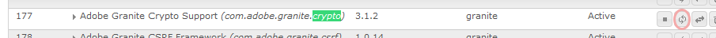

# Implantação de comunidades {#deploying-communities}

>[!CAUTION]
>
>AEM 6.4 chegou ao fim do suporte estendido e esta documentação não é mais atualizada. Para obter mais detalhes, consulte nossa [períodos de assistência técnica](https://helpx.adobe.com/br/support/programs/eol-matrix.html). Encontre as versões compatíveis [here](https://experienceleague.adobe.com/docs/).

## Pré-requisitos {#prerequisites}

* [Plataforma AEM 6.4](../../help/sites-deploying/deploy.md)

* Licença AEM Communities

* Licenças opcionais para:

   * [Recursos do Adobe Analytics for Communities](analytics.md)
   * [MongoDB para MSRP](msrp.md)
   * [Adobe Cloud para ASRP](asrp.md)

## Lista de verificação da instalação {#installation-checklist}

**Para o [Plataforma AEM](../../help/sites-deploying/deploy.md#what-is-aem)**

* Instalar mais recente [Atualizações do AEM 6.4](#aem-updates)

* Se não estiver usando as portas padrão (4502, 4503), então [configurar agentes de replicação](#replication-agents-on-author)
* [replicar a chave de criptografia](#replicate-the-crypto-key)
* Se apoiarem a globalização, [configurar tradução automática](../../help/sites-administering/translation.md)

   (a configuração de amostra é fornecida para desenvolvimento)

**Para o [Capacidade das comunidades](overview.md)**

* Se estiver implantando um [publicar farm](../../help/sites-deploying/recommended-deploys.md#tarmk-farm), [identificar o editor principal](#primary-publisher)

* [Ativar o serviço de túnel](#tunnel-service-on-author)
* [Ativar o logon social](social-login.md#adobe-granite-oauth-authentication-handler)
* [Configurar o Adobe Analytics](analytics.md)
* Configure um [serviço de email padrão](email.md)
* Identificar a opção para [armazenamento UGC compartilhado](working-with-srp.md) (**SRP**)

   * Se MongoDB SRP [(MSRP)](msrp.md)

      * [Instalar e configurar o MongoDB](msrp.md#mongodb-configuration)
      * [Configurar Solr](solr.md)
      * [Selecionar MSRP](srp-config.md)
   * Se SRP de banco de dados relacional [(DSRP)](dsrp.md)

      * [Instale o driver JDBC para MySQL](#jdbc-driver-for-mysql)
      * [Instalar e configurar o MySQL para DSRP](dsrp-mysql.md)
      * [Configurar Solr](solr.md)
      * [Selecione DSRP](srp-config.md)
   * Se Adobe SRP [(ASRP)](asrp.md)

      * Entre em contato com seu representante de conta para obter provisionamento
      * [Selecionar ASRP](srp-config.md)
   * Se JCR SRP [(JSRP)](jsrp.md)

      * Não é um repositório UGC compartilhado:

         * O UGC nunca é replicado
         * UGC visível somente em AEM instância ou cluster no qual foi inserido
      * O padrão é JSRP

   Para o **[recurso de ativação](overview.md#enablement-community)**

   * [Instalar e configurar o FFmpeg](ffmpeg.md)
   * [Instale o driver JDBC para MySQL](#jdbc-driver-for-mysql)
   * [Instalar o AEM Communities SCORM-Engine](#scorm-package)
   * [Instalar e configurar o MySQL para ativação](mysql.md)


## Versões mais recentes {#latest-releases}

AEM 6.4 Communities GA inclui o pacote Communities. Para saber mais sobre as atualizações do AEM 6.4 [Comunidades](/help/release-notes/release-notes.md#experience-manager-communities), consulte [Notas de versão do AEM 6.4](/help/release-notes/release-notes.md#release-information).

### Atualizações do AEM 6.4 {#aem-updates}

A partir do AEM 6.3, as atualizações nas Comunidades são fornecidas como parte AEM Pacotes de correções cumulativas e Service Packs.

Para obter as atualizações mais recentes do AEM 6.4, verifique se [Pacotes de correção cumulativos e service packs do Adobe Experience Manager 6.4](https://helpx.adobe.com/br/experience-manager/aem-releases-updates.html).

### Histórico da versão {#version-history}

Como em AEM 6.4 e mais, os recursos e hotfixes do AEM Communities fazem parte dos fix packs cumulativos do AEM Communities e service packs. Portanto, não há pacotes de recursos separados.

### Driver JDBC para MySQL {#jdbc-driver-for-mysql}

Dois recursos do Communities usam um banco de dados MySQL :

* Para [ativação](enablement.md): registrando atividades e aprendentes do SCORM
* Para [DSRP](dsrp.md): armazenamento de conteúdo gerado pelo usuário (UGC)

O conector MySQL deve ser obtido e instalado separadamente.

As etapas necessárias são:

1. Baixe o arquivo ZIP de [https://dev.mysql.com/downloads/connector/j/](https://dev.mysql.com/downloads/connector/j/)

   * A versão deve ser >= 5.1.38

1. Extrair mysql-connector-java-&lt;version>-bin.jar (pacote) do arquivo

1. Use o console da Web para instalar e iniciar o pacote:

   * Por exemplo, http://localhost:4502/system/console/bundles
   * Selecionar **`Install/Update`**
   * Navegue... para selecionar o pacote extraído do arquivo ZIP baixado
   * Verifique se *Driver JDBC da Oracle Corporation para MySQLcom.mysql.jdbc* estiver ativo e iniciá-lo se não estiver ativo (ou verifique os logs)

1. Se a instalação for feita em uma implantação existente depois que o JDBC tiver sido configurado, refaça o JDBC para o novo conector, salvando a configuração do JDBC no console da Web:

   * Por exemplo, http://localhost:4502/system/console/configMgr
   * Localizar `Day Commons JDBC Connections Pool` configuração
   * Selecione para abrir
   * Selecionar `Save`

1. Repita as etapas 3 e 4 em todas as instâncias de autor e publicação

Mais informações sobre a instalação de pacotes podem ser encontradas no [Console da Web](/help/sites-deploying/web-console.md#bundles) página.

#### Exemplo: Pacote do Conector MySQL Instalado {#example-installed-mysql-connector-bundle}


### Pacote SCORM {#scorm-package}

O Shareable Content Object Reference Model (SCORM) é uma coleção de padrões e especificações para e-learning. O SCORM também define como o conteúdo pode ser empacotado em um arquivo ZIP transferível.

O mecanismo AEM Communities SCORM é necessário para o [ativação](overview.md#enablement-community) recurso. Os pacotes de pontuação compatíveis com a versão do AEM Communities 6.4 são:

* **[cq -social- scorm -package, versão 1.2.11](https://experience.adobe.com/#/downloads/content/software-distribution/en/aem.html?package=%2Fcontent%2Fsoftware-distribution%2Fen%2Fdetails.html%2Fcontent%2Fdam%2Faem%2Fpublic%2Fadobe%2Fpackages%2Fcq640%2Fsocial%2Fscorm%2Fcq-social-scorm-pkg)**. Este pacote SCORM é suportado por todas as versões AEM 6.4 Communities.

* **[cq-social-scorm-package, versão 2.2.2](https://experience.adobe.com/#/downloads/content/software-distribution/en/aem.html?package=%2Fcontent%2Fsoftware-distribution%2Fen%2Fdetails.html%2Fcontent%2Fdam%2Faem%2Fpublic%2Fadobe%2Fpackages%2Fcq640%2Fsocial%2Fscorm%2Fcq-social-scorm-2017-pkg)** inclui [SCORM 2017.1](https://rusticisoftware.com/blog/scorm-engine-2017-released/) motor. Este pacote SCORM é suportado AEM Comunidades 6.4.2.x em diante.

Para uma nova instalação do motor SCORM, o pacote que contém [SCORM 2017.1](https://rusticisoftware.com/blog/scorm-engine-2017-released/) (que [  cq-social-scorm-package, versão 2.2.2](https://experience.adobe.com/#/downloads/content/software-distribution/en/aem.html?package=%2Fcontent%2Fsoftware-distribution%2Fen%2Fdetails.html%2Fcontent%2Fdam%2Faem%2Fpublic%2Fadobe%2Fpackages%2Fcq640%2Fsocial%2Fscorm%2Fcq-social-scorm-2017-pkg)) deve ser usada. Para que você possa reproduzir recursos de aprendizagem apoiados pelo SCORM 2017.

<!--This section used to be an accordion until converted to straight Markdown. When accordions are enabled, revert-->

### Para instalar um pacote SCORM pela primeira vez

1. Instale o **[cq-social-scorm-package, versão 2.2.2](https://experience.adobe.com/#/downloads/content/software-distribution/en/aem.html?package=%2Fcontent%2Fsoftware-distribution%2Fen%2Fdetails.html%2Fcontent%2Fdam%2Faem%2Fpublic%2Fadobe%2Fpackages%2Fcq640%2Fsocial%2Fscorm%2Fcq-social-scorm-2017-pkg).**
1. Baixar **`/libs/social/config/scorm/database_scormengine_data.sql`** da instância do cq e execute-a no servidor mysql para criar um esquema scormEngineDB atualizado.
1. Adicionar `/content/communities/scorm/RecordResults` na propriedade Caminhos excluídos no filtro CSRF de `https://<hostname>;:<port>/system/console/configMgr` em editores.

As instalações SCORM existentes podem ser atualizadas para [**cq-social-scorm-package, versão 2.2.2**](https://experience.adobe.com/#/downloads/content/software-distribution/en/aem.html?package=%2Fcontent%2Fsoftware-distribution%2Fen%2Fdetails.html%2Fcontent%2Fdam%2Faem%2Fpublic%2Fadobe%2Fpackages%2Fcq640%2Fsocial%2Fscorm%2Fcq-social-scorm-2017-pkg) que utiliza [SCORM 2017.1](https://rusticisoftware.com/blog/scorm-engine-2017-released/)), se o conteúdo do curso de criação exigir o SCORM 2017.1.

>[!NOTE]
>
>A atualização para o pacote SCORM 2017.1 requer a migração do banco de dados existente (conforme explicado mais adiante).

<!--This section used to be an accordion until converted to straight Markdown. When accordions are enabled, revert-->

### Para atualizar a versão do seu mecanismo SCORM

1. Faça um backup do esquema ScormEngineDB.
1. Instale o **[cq-social-scorm-package, versão 2.2.2](https://experience.adobe.com/#/downloads/content/software-distribution/en/aem.html?package=%2Fcontent%2Fsoftware-distribution%2Fen%2Fdetails.html%2Fcontent%2Fdam%2Faem%2Fpublic%2Fadobe%2Fpackages%2Fcq640%2Fsocial%2Fscorm%2Fcq-social-scorm-2017-pkg).**
1. Baixe o pacote de `/libs/social/config/scorm/ScormEngine.zip` e extrair o mesmo.
1. Ir para **Instalador** pasta do diretório extraído.
1. Atualizar `SystemDatabaseConnectionString` com seu `scorm db connection url` no arquivo **[!UICONTROL EngineInstall.xml]**.
1. Execute a ferramenta de atualização do esquema mysql na pasta Instalador com o comando:

   `java -Dlogback.configurationFile=logback.xml -cp "lib/*" RusticiSoftware.ScormContentPlayer.Logic.Upgrade.ConsoleApp EngineInstall.xml`
1. Monitorar `engine_upgrade.log` para qualquer tipo de erro e status de atualização do schema.
1. Adicionar `/content/communities/scorm/RecordResults` em **[!UICONTROL Caminhos excluídos]** propriedade no filtro CSRF de `https://<hostname>:<port>/system/console/configMgr` em editores.

### Registro de SCORM {#scorm-logging}

Conforme instalado, todas as atividades de ativação são registradas no console do sistema.

Se desejar, o nível de log pode ser definido como AVISO para a variável `RusticiSoftware.*` pacote.

Para trabalhar com logs, consulte [Trabalhar com registros de auditoria e arquivos de registro](../../help/sites-deploying/monitoring-and-maintaining.md#working-with-audit-records-and-log-files).

### AEM MLS avançado {#aem-advanced-mls}

Para que a coleção SRP (MSRP ou DSRP) ofereça suporte a pesquisa multilíngue avançada (MLS), são necessários novos plug-ins Solr além de um esquema personalizado e uma configuração Solr. Todos os itens necessários são empacotados em um arquivo zip que pode ser baixado.

O download MLS avançado (também conhecido como &quot;phasetwo&quot;) está disponível no repositório do Adobe:

* AEM-SOLR-MLS-phasetwo

   Para obter o pacote MLS avançado, consulte [AEM MLS avançado](deploy-communities.md#aem-advanced-mls) na seção implantar da documentação.

   * Versão 1.2.40, 6 de abril de 2016
   * Baixar AEM-SOLR-MLS-phasetwo-1.2.40.zip

Para obter detalhes e informações sobre instalação, visite [Configuração Solr](solr.md) para SRP.

### Sobre links para o compartilhamento de pacotes {#about-links-to-package-share}

**Pacotes visíveis no Adobe AEM Cloud**

Os links para pacotes nesta página não exigem nenhuma instância em execução do AEM, pois são para compartilhamento de pacotes no `adobeaemcloud.com`. Enquanto os pacotes estiverem visíveis, a variável `Install`é para instalar os pacotes em um site hospedado no Adobe. Se você deseja instalar em uma instância de AEM local, selecione `Install`resultará em um erro.

**Como instalar na instância de AEM local**

Para instalar os pacotes visíveis em `adobeaemcloud.com` em uma instância de AEM local, o pacote deve ser baixado primeiro em um disco local:

* Selecione o **[!UICONTROL Ativos]** guia
* Selecionar **[!UICONTROL transferir para disco]**

Na instância de AEM local, use o gerenciador de pacotes (por exemplo, [http://localhost:4502/crx/packmgr/](http://localhost:4502/crx/packmgr/)), para fazer upload para o repositório de pacotes de AEM local.

Como alternativa, acesse o pacote usando o compartilhamento de pacote da instância de AEM local (por exemplo, [http://localhost:4502/crx/packageshare/](http://localhost:4502/crx/packageshare/)), `Download`será baixado para o repositório de pacotes da instância de AEM local.

Uma vez no repositório de pacotes da instância de AEM local, use o gerenciador de pacotes para instalar o pacote.

Para obter mais informações, visite [Como trabalhar com pacotes](../../help/sites-administering/package-manager.md#package-share).

## Implantações recomendadas {#recommended-deployments}

No AEM Communities, uma loja comum é usada para armazenar conteúdo gerado pelo usuário (UGC) e geralmente é chamada de [provedor de recursos de armazenamento (SRP)](working-with-srp.md). Os centros de implantação recomendados escolhem uma opção SRP para a loja comum.

A loja comum oferece suporte à moderação e ao analytics no UGC no ambiente de publicação, ao mesmo tempo em que elimina a necessidade de [replicação](sync.md) de UGC.

* [Armazenamento de conteúdo da comunidade](working-with-srp.md): discute as opções de armazenamento de SRP para comunidades AEM

* [Topologias recomendadas](topologies.md): discute a topologia a ser usada, dependendo do caso de uso e da escolha da SRP

## Atualização {#upgrading}

Ao atualizar para a plataforma do AEM 6.4 a partir de versões anteriores do AEM, é importante ler Atualização para o AEM 6.4.

Além de atualizar a plataforma, leia [Atualização para o AEM Communities 6.4](upgrade.md) para saber mais sobre as alterações do Communities.

## Configurações {#configurations}

### Editor principal {#primary-publisher}

Quando a implantação escolhida é uma [publicar farm](topologies.md#tarmk-publish-farm), em seguida, uma instância de publicação AEM deve ser identificada como **`primary publisher`** para atividades que não devem ocorrer em todas as instâncias, como recursos que dependem de **notificações** ou **Adobe Analytics**.

Por padrão, a variável `AEM Communities Publisher Configuration` A configuração do OSGi é configurada com a variável **`Primary Publisher`** caixa de seleção marcada, de modo que todas as instâncias de publicação em um farm de publicação se autoidentifiquem como as primárias.

Por conseguinte, é necessário **edite a configuração em todas as instâncias de publicação secundárias** para desmarcar o **`Primary Publisher`** caixa de seleção.


Para todas as outras instâncias de publicação (secundárias) em um farm de publicação:

* Fazer logon com privilégios de administrador
* Acesse o [console da web](../../help/sites-deploying/configuring-osgi.md)

   * Por exemplo, [http://localhost:4503/system/console/configMgr](http://localhost:4503/system/console/configMgr)

* Localize a variável `AEM Communities Publisher Configuration`
* Selecione o ícone de edição
* Desmarque a opção **[!UICONTROL Editor principal]** caixa
* Selecione **[!UICONTROL Salvar]**

### Agentes de Replicação no Autor {#replication-agents-on-author}

A replicação é usada para o conteúdo do site criado no ambiente de publicação, como grupos da comunidade, bem como para gerenciar membros e grupos de membros do ambiente de criação usando o [serviço de túnel](#tunnel-service-on-author).

Para o editor principal, verifique se [Configuração do Agente de Replicação](../../help/sites-deploying/replication.md) identifica corretamente o servidor de publicação e o usuário autorizado. O usuário autorizado padrão, `admin,` já tem as permissões apropriadas (é membro de `Communities Administrators`).

Para que outro usuário tenha as permissões apropriadas, ele deve ser adicionado como membro ao `administrators` grupo de usuários (também membro de `Communities Administrators`).

Há dois agentes de replicação no ambiente de criação que precisam que a configuração de transporte seja configurada corretamente.

* Acesse o console Replicação no autor

   * Na navegação global: **[!UICONTROL Ferramentas > Implantação > Replicação > Agentes no autor]**

* Siga o mesmo procedimento para ambos os agentes:

   * **Agente padrão (publicar)**
   * **Agente de replicação inversa (publicar inverso)**

      1. Selecione o agente
      1. Selecionar **[!UICONTROL editar]**
      1. Selecione o **[!UICONTROL Transportes]** guia
      1. Se não for porta `4503`edite o **[!UICONTROL URI]** para especificar a porta correta
      1. Se não for usuário `admin`edite o **[!UICONTROL Usuário]** e **[!UICONTROL Senha]** para especificar um membro do `administrators` grupo de usuários

As imagens a seguir mostram os resultados da alteração da porta de 4503 para 6103 por:

#### Agente padrão (publicar) {#default-agent-publish}


#### Agente de replicação inversa (publicar inverso) {#reverse-replication-agent-publish-reverse}


### Serviço de Túnel no Autor {#tunnel-service-on-author}

Ao usar o ambiente de criação para [criar sites](sites-console.md), [modificar propriedades do site](sites-console.md#modifying-site-properties) ou [gerenciar membros da comunidade](members.md), é necessário acessar membros (usuários) registrados no ambiente de publicação, não usuários registrados no autor.

O serviço de túnel fornece esse acesso usando o agente de replicação do autor.

Para habilitar o serviço de túnel:

* Ligado **autor**
* Fazer logon com privilégios administrativos
* Se o editor não for localhost:4503 ou o usuário de transporte não for `admin`,

   Então [configurar o agente de replicação](#replication-agents-on-author)

* Acesse o [Console da Web](../../help/sites-deploying/configuring-osgi.md)

   * Por exemplo, [http://localhost:4502/system/console/configMgr](http://localhost:4502/system/console/configMgr)

* Localize a variável `AEM Communities Publish Tunnel Service`
* Selecione o ícone de edição
* Verifique a **[!UICONTROL habilitar]** caixa
* Selecione **[!UICONTROL Salvar]**


### Replicar a chave de criptografia {#replicate-the-crypto-key}

Há dois recursos do AEM Communities que exigem que todas as instâncias do servidor AEM usem as mesmas chaves de criptografia. Estes [Analytics](analytics.md) e [ASRP](asrp.md).

A partir do AEM 6.3, o material principal é armazenado no sistema de arquivos e não mais no repositório.

Para copiar o material principal do autor para todas as outras instâncias, é necessário:

* Acesse a instância do AEM, normalmente uma instância do autor, que contém o material principal a ser copiado

   * Localize a variável `com.adobe.granite.crypto.file` pacote no sistema de arquivos local

      Por exemplo,

      * `<author-aem-install-dir>/crx-quickstart/launchpad/felix/bundle21`
      * O `bundle.info` o arquivo identificará o pacote
   * Navegar até a pasta de dados

      Por exemplo,

      * `<author-aem-install-dir>/crx-quickstart/launchpad/felix/bundle21/data`
   * Copie os arquivos hmac e do nó primário


* Para cada instância do AEM do target

   * Navegar até a pasta de dados

      Por exemplo,

      * `<publish-aem-install-dir>/crx-quickstart/launchpad/felix/bundle21/data`
   * Cole os 2 arquivos copiados anteriormente
   * É necessário [atualizar o pacote Granite Crypto](#refresh-the-granite-crypto-bundle) se a instância do target AEM estiver em execução no momento


>[!CAUTION]
>
>Se já tiver sido configurado outro recurso de segurança baseado nas chaves de criptografia, a replicação das chaves de criptografia poderá danificar a configuração. Para assistência, [entre em contato com o atendimento ao cliente](https://helpx.adobe.com/br/marketing-cloud/contact-support.html).

#### Replicação de Repositório {#repository-replication}

Ter o material principal armazenado no repositório, como era o caso da AEM 6.2 e anterior, pode ser preservado especificando a seguinte propriedade do sistema na primeira inicialização de cada instância de AEM (que cria o repositório inicial):

* `-Dcom.adobe.granite.crypto.file.disable=true`

>[!NOTE]
>
>É importante verificar se a variável [agente de replicação no autor](#replication-agents-on-author) está configurado corretamente.

Com o material principal armazenado no repositório, a maneira de replicar a chave de criptografia do autor para outras instâncias é a seguinte:

Usando [CRXDE Lite](../../help/sites-developing/developing-with-crxde-lite.md):

* navegue até [https://&lt;server>:&lt;port>/crx/de](http://localhost:4502/crx/de)
* select `/etc/key`
* open `Replication` guia
* select `Replicate`

* [atualizar o pacote Granite Crypto](#refresh-the-granite-crypto-bundle)


#### Atualizar o pacote do Granite Crypto {#refresh-the-granite-crypto-bundle}

* Em cada instância de publicação, acesse o [Console da Web](../../help/sites-deploying/configuring-osgi.md)

   * Por exemplo, [https://&lt;server>:&lt;port>/system/console/bundles](http://localhost:4503/system/console/bundles)

* Localizar `Adobe Granite Crypto Support` pacote (com.adobe.granite.crypto)
* Selecionar **[!UICONTROL Atualizar]**



* Após um momento, um **Sucesso** deve aparecer:

   `Operation completed successfully.`

### Servidor HTTP Apache {#apache-http-server}

Se estiver usando o servidor HTTP Apache, certifique-se de usar o nome correto do servidor para todas as entradas relevantes.

Em particular, tenha cuidado para usar o nome correto do servidor, não `localhost`no `RedirectMatch`.

#### exemplo de httpd.conf {#httpd-conf-sample}

```shell
<IfModule alias_module>
     # XAMPP does not have a favicon; this prevents any 404 errors which may arise.
     Redirect 404 /favicon.ico
     <Location /favicon.ico>
         ErrorDocument 404 "No favicon"
     </Location>

    # Return from "Sign Out" generates response header directing you to "/", generating a 404 error
    # The RedirectMatch resolves it correctly when modified for the target Community Site:
    RedirectMatch ^/$ https://[server name]/content/sites/engage/en.html
 ...
 </IfModule>
```

### Dispatcher {#dispatcher}

Se estiver usando um Dispatcher, consulte:

* AEM [Dispatcher](https://helpx.adobe.com/experience-manager/dispatcher/using/dispatcher.html) documentação
* [Instalação do Dispatcher](https://helpx.adobe.com/experience-manager/dispatcher/using/dispatcher-install.html)
* [Configuração do Dispatcher para Comunidades](dispatcher.md)
* [Problemas conhecidos](troubleshooting.md#dispatcher-refetch-fails)

## Documentação de comunidades relacionadas {#related-communities-documentation}

* Visita [Administrar sites das comunidades](administer-landing.md) para saber mais sobre como criar um site da comunidade, configurar modelos de site da comunidade, moderar conteúdo da comunidade, gerenciar membros e configurar mensagens.

* Visita [Desenvolvimento de comunidades](communities.md) para saber mais sobre a estrutura de componentes sociais (SCF) e personalizar os componentes e recursos das Comunidades.

* Visita [Componentes de comunidades de criação](author-communities.md) para saber como criar e configurar componentes do Communities.
