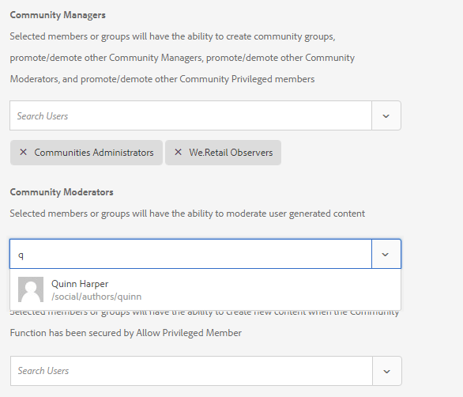

# Criar um novo site da comunidade para habilitação {#author-a-new-community-site-for-enablement}

## Criar site da comunidade {#create-community-site}

[A criação](sites-console.md) do site da comunidade emprega um assistente que o orienta pelas etapas da criação de um site da comunidade. É possível avançar para a `Next`etapa ou `Back`para a etapa anterior antes de confirmar o site na etapa final.

Para começar a criar um novo site da comunidade:

Uso da instância do [autor](http://localhost:4502/)

* Fazer logon com privilégios de administrador
* Navegue até **[!UICONTROL Comunidades > Sites]**

* Selecione **[!UICONTROL Criar]**

### Etapa 1: Modelo de site {#step-site-template}

Na etapa Modelo **de** site, insira um título, descrição, o nome do URL e selecione um modelo de site da comunidade, por exemplo:

* **Título do site da comunidade**: `Enablement Tutorial`

* **Descrição do site da comunidade**: `A site for enabling the community to learn.`

* **Raiz** do site da comunidade: (deixe em branco para a raiz padrão `/content/sites`)

* **Configurações** da nuvem: (deixe em branco se nenhuma configuração de nuvem for especificada) forneça o caminho para as configurações de nuvem especificadas.
* **Idioma** base do site da comunidade: (deixe intocado para uma única língua: Inglês) use o menu suspenso para escolher um *ou mais* idiomas base dos idiomas disponíveis - alemão, italiano, francês, japonês, espanhol, português (Brasil), chinês (tradicional) e chinês (simplificado). Um site da comunidade será criado para cada idioma adicionado e existirá dentro da mesma pasta do site, seguindo as práticas recomendadas descritas em [Translating Content for Multilingual Sites](../../help/sites-administering/translation.md). A página raiz de cada site conterá uma página secundária nomeada pelo código de idioma de um dos idiomas selecionados, como &quot;en&quot; para inglês ou &quot;fr&quot; para francês.

* **[!UICONTROL Nome do site da comunidade]**: `enable`

   * o URL inicial será exibido abaixo do Nome do site da comunidade
   * para um URL válido, acrescente um código de idioma base + &quot;.html&quot;

      *por exemplo*, http://localhost:4502/content/sites/ `enable/en.html`

* **[!UICONTROL Modelo]** de site de referência: menu suspenso para escolher `Reference Structured Learning Site Template`

Selecione **[!UICONTROL Próximo]**

### Etapa 2: Design {#step-design}

A etapa de design é apresentada em duas seções para selecionar o tema e o banner de marca:

#### COMMUNITY SITE THEME {#community-site-theme}

Selecione o estilo desejado a ser aplicado ao modelo. Quando selecionado, o tema será sobreposto com uma marca de seleção.

#### COMMUNITY SITE BRANDING {#community-site-branding}

(opcional) Faça upload de uma imagem de banner para ser exibida nas páginas do site. O banner é fixado na borda esquerda do navegador, entre o cabeçalho e o menu do site da comunidade (links de navegação). A altura do banner é cortada em 120 pixels. Não há redimensionamento do banner para ajustar à largura do navegador e à altura de 120 pixels.

 

Selecione **[!UICONTROL Próximo]**.

### Etapa 3: Configurações {#step-settings}

Na etapa Configurações, antes de selecionar `Next`, observe que há sete seções que fornecem acesso às configurações que envolvem gerenciamento de usuários, marcação, funções, moderação, análise, tradução e ativação.

#### USER MANAGEMENT {#user-management}

Recomenda-se que as comunidades [de](overview.md#enablement-community) ativação sejam privadas.

Um site da comunidade é privado quando visitantes anônimos do site têm acesso negado, podem não se inscrever e podem não usar o login social.

Verifique se a maioria das caixas de seleção está desmarcada para Gerenciamento do usuário:

* NÃO permitir que os visitantes do site se registrem automaticamente
* NÃO permitir que visitantes anônimos do site visualizações
* Opcional se permite ou não mensagens entre membros da comunidade
* NÃO permitir logon com o Facebook
* NÃO permitir logon com o Twitter

#### TAGGING {#tagging}

As tags que podem ser aplicadas ao conteúdo da comunidade são controladas selecionando AEM namespaces previamente definidas por meio do Console [de](../../help/sites-administering/tags.md#tagging-console) marcação (como a namespace [do](enablement-setup.md#create-tutorial-tags)tutorial).

Além disso, selecionar Namespaces de tags para o site da comunidade limita a seleção apresentada ao definir catálogos e recursos de ativação. Consulte [Marcação de recursos](tag-resources.md) de ativação para obter informações importantes.

Encontrar namespaces é fácil usando a pesquisa antecipada por tipo. Por exemplo,

* Digite &#39;tut&#39;
* Selecionar `Tutorial`

### ROLES {#roles}

[As funções](users.md) de membro da comunidade são atribuídas por meio das configurações na seção Funções.

Para permitir que um membro da comunidade (ou grupo de membros) experimente o site como o gerente da comunidade, use a pesquisa de tipo antecipada e selecione o nome do membro ou grupo nas opções no menu suspenso.

Por exemplo,

* Digite &quot;q&quot;
* Selecione [Quinn Harper](enablement-setup.md#publishcreateenablementmembers)

>[!NOTE]
>
>[O serviço](deploy-communities.md#tunnel-service-on-author) de túnel permite a seleção de membros e grupos existentes apenas no ambiente publish.

#### MODERATION {#moderation}

Aceite as configurações globais padrão para [moderar](sites-console.md#moderation) o conteúdo gerado pelo usuário (UGC).

#### ANALYTICS {#analytics}

No menu suspenso, selecione a estrutura de serviço em nuvem do Analytics configurada para este site da comunidade.

A seleção vista na captura de tela `Communities`é o exemplo de estrutura da documentação de [configuração.](analytics.md#aem-analytics-framework-configuration)

#### TRANSLATION {#translation}

As configurações [de](sites-console.md#translation) Tradução especificam se o UGC pode ser traduzido ou não e em qual idioma, se houver.

* Verifique **[!UICONTROL Permitir tradução automática]**
* Usar as configurações padrão

#### ENABLEMENT {#enablement}

Para uma comunidade de ativação, é necessário identificar um ou mais Gerentes de habilitação da comunidade.

* **[!UICONTROL Gerentes]** de ativação (obrigatório) Membros do 
`Community Enablement Managers` estão disponíveis para serem selecionados para gerenciar este site da comunidade.

   * Digite &quot;s&quot;
   * Selecionar `Sirius Nilson`

* **[!UICONTROL ID]** de organização do Marketing Cloud (opcional) A ID de uma conta Adobe Analytics que é necessária ao incluir o [Video Heartbeat Analytics](analytics.md#video-heartbeat-analytics) no relatórios de ativação.

Selecione **[!UICONTROL Próximo]**.

### Etapa 4: Criar site da comunidade {#step-create-community-site}

Selecione **[!UICONTROL Criar]**.

Quando o processo for concluído, a pasta do novo site será exibida no console Comunidades - Sites.

### Publicar o novo site da comunidade {#publish-the-new-community-site}

O site criado deve ser gerenciado a partir do console Comunidades - Sites, o mesmo console de onde os novos sites podem ser criados.

Depois de selecionar a pasta do site da comunidade, passe o mouse sobre o ícone do site para que quatro ícones de ação sejam exibidos:

Ao selecionar o ícone de elipses (ícone Mais ações), as opções Exportar site e Excluir site aparecem.

Da esquerda para a direita estão:

* **Abrir site** Selecione o ícone de lápis para abrir o site da comunidade no modo de edição do autor, para adicionar e/ou configurar componentes da página

* **Editar site** Selecione o ícone de propriedades para abrir o site da comunidade para modificação de propriedades, como o título ou para alterar o tema

* **Publicar site** Selecione o ícone do mundo para publicar o site da comunidade (para localhost:4503 por padrão)

* **Exportar site** Selecione o ícone de exportação para criar um pacote do site da comunidade que esteja armazenado no gerenciador [de](../../help/sites-administering/package-manager.md) pacotes e baixado.

   Observe que o UGC não está incluído no pacote do site.

* **Excluir site** Para excluir o site da comunidade, selecione o ícone Excluir site que aparece ao passar o mouse sobre o site no Console do site das Comunidades. Esta ação remove todos os itens associados ao site, como UGC, grupos de usuários, ativos e registros de banco de dados.

#### Selecione Publicar {#select-publish}

Selecione o ícone do mundo para publicar o site da comunidade.

Haverá uma indicação de que o site foi publicado.

## Usuários da comunidade e grupos de usuários {#community-users-user-groups}

### Aviso aos novos grupos de usuários da comunidade {#notice-new-community-user-groups}

Juntamente com o novo site da comunidade, novos grupos de usuários são criados, que têm as permissões apropriadas definidas para várias funções administrativas. Para obter detalhes, visite Grupos de [usuários para sites](users.md#usergroupsforcommunitysites)da comunidade.

Para este novo site da comunidade, dado o nome do site &quot;enable&quot; na Etapa 1, os novos grupos de usuários existentes no ambiente de publicação podem ser vistos no console [Membros e grupos da](members.md#groups-console)comunidade:

### Atribuir membros ao grupo Habilitar membros da comunidade {#assign-members-to-community-enable-members-group}

Em autor, com o serviço de túnel ativado, é possível atribuir os [usuários criados durante a Configuração](enablement-setup.md#publishcreateenablementmembers) Inicial ao grupo Membros da Comunidade para o site da comunidade recém-criado.

Usando o console Grupos da comunidade, os membros podem ser adicionados individualmente ou adicionados por meio da associação em um grupo.

Neste exemplo, o grupo `Community Ski Class` é adicionado como membro do grupo `Community Enable Members` e como membro `Quinn Harper`.

* Navegue até o console **[!UICONTROL Comunidades > Grupos]**
* Selecionar grupo de membros **[!UICONTROL da]** comunidade habilitados
* Digite `ski` na caixa de pesquisa **[!UICONTROL Adicionar membros ao grupo]**
* Selecionar classe **[!UICONTROL de esqui da]** comunidade (grupo de alunos)
* Digite `quinn` na caixa de pesquisa
* Selecione **[!UICONTROL Quinn Harper]** (contato de recursos de ativação)

* Selecione **[!UICONTROL Salvar]**

## Configurações na publicação {#configurations-on-publish}

### http://localhost:4503/content/sites/enable/en.html {#http-localhost-content-sites-enable-en-html}

### Erro ao configurar para autenticação {#configure-for-authentication-error}

Depois que um site é configurado e enviado para publicação, [configure o mapeamento](sites-console.md#configure-for-authentication-error) de logon ( `Adobe Granite Login Selector Authentication Handler`) na instância de publicação. O benefício é que quando as credenciais de logon não forem inseridas corretamente, o erro de autenticação exibirá novamente a página de logon do site da comunidade com uma mensagem de erro.

Adicionar um `Login Page Mapping` como

* /content/sites/enable/en/sign:/content/sites/enable/en

### (Opcional) Alterar o Home page padrão {#optional-change-the-default-home-page}

Ao trabalhar com o site de publicação para fins de demonstração, pode ser útil alterar o home page padrão para o novo site.

Para fazer isso, é necessário usar o [CRX|DE](http://localhost:4503/crx/de) Lite para editar a tabela de mapeamento [de](../../help/sites-deploying/resource-mapping.md) recursos na publicação.

Para começar

1. Ao publicar, acesse o CRXDE e faça logon com privilégios de administrador

   * Por exemplo, navegue até [http://localhost:4503/crx/de](http://localhost:4503/crx/de) e faça logon com `admin/admin`

1. No navegador do projeto, expanda `/etc/map`
1. Selecione o `http` nó

   * Selecionar nó **[!UICONTROL Criar]**

      * **Nome** localhost.4503

         ( *Não* utilizar `:`)

      * **Tipo** [sling:Mapeamento](https://sling.apache.org/documentation/the-sling-engine/mappings-for-resource-resolution.html)

1. Com o `localhost.4503` nó recém-criado selecionado

   * Adicionar propriedade

      * **Seleção de nome** :correspondência
      * **String de tipo**
      * **Valor** localhost.4503/\$

         (Deve terminar com o caractere &#39;$&#39;)
   * Adicionar propriedade

      * **Nomear** sling:internalRedirect
      * **String de tipo**
      * **Valor** /content/sites/enable/en.html

1. Selecione **[!UICONTROL Salvar tudo]**
1. (opcional) Excluir o histórico de navegação
1. Navegue até http://localhost:4503/

   * Chegar em http://localhost:4503/content/sites/enable/en.html

>[!NOTE]
>
>Para desativar, basta anexar o valor da `sling:match` propriedade a um &quot;x&quot; - `xlocalhost.4503/$` - e **[!UICONTROL Salvar tudo]**.

#### Solução de problemas: Erro ao salvar mapa {#troubleshooting-error-saving-map}

Se não for possível salvar as alterações, verifique se o nome do nó é `localhost.4503`, com um separador &quot;ponto&quot; e não `localhost:4503` com um separador &quot;dois pontos&quot;, pois não `localhost`é um prefixo de namespace válido.

#### Solução de problemas: Falha ao redirecionar {#troubleshooting-fail-to-redirect}

O valor &#39;**$**&#39; no final da `sling:match`string de expressão regular é crucial, de modo que apenas `http://localhost:4503/` seja mapeado exatamente; caso contrário, o valor de redirecionamento será anexado a qualquer caminho que possa existir após server:port no URL. Dessa forma, quando AEM tentar redirecionar para a página de logon, isso falhará.

## Modificando o site da comunidade {#modifying-the-community-site}

Após a criação inicial do site, os autores podem usar o ícone  Abrir site para executar atividades de criação padrão AEM.

Além disso, os administradores podem usar o ícone  Editar site para modificar as propriedades do site, como o título.

Após qualquer modificação, lembre-se de **Salvar** e **publicar** o site novamente.

>[!NOTE]
>
>Se não estiver familiarizado com o AEM, visualização a documentação sobre manuseio  básico e um guia [rápido para a criação de páginas](../../help/sites-authoring/qg-page-authoring.md).

### Adicionar um catálogo {#add-a-catalog}

O modelo de site da comunidade escolhido para este site da comunidade deve conter o recurso de catálogo.

Caso contrário, a função de catálogo pode ser facilmente adicionada. Isso permitiria que outros membros da comunidade, não atribuídos a recursos de ativação ou a um caminho de aprendizado, selecionassem recursos de ativação de um catálogo.

Se a estrutura do site já contiver o recurso de catálogo, seu Título poderá ser alterado.

Para modificar a estrutura do site, navegue até **[!UICONTROL Comunidades, console Sites]** , abra a `enable` pasta e selecione o ícone **Editar site** para acessar as propriedades do `Enablement Tutorial`.

Selecione o painel ESTRUTURA para adicionar um catálogo ou modificar um catálogo existente:

* **Título**: `Ski Catalog`

* **URL**: `catalog`

* **Selecione Todas as Namespaces**: deixe como padrão.
* Selecione **[!UICONTROL Salvar]**

Use o ícone Posição para mover a função Catálogo para a segunda posição, após Atribuições.

Selecione **[!UICONTROL Salvar]** no canto superior direito para salvar as alterações no site da comunidade.

Em seguida,**publique** o site novamente.