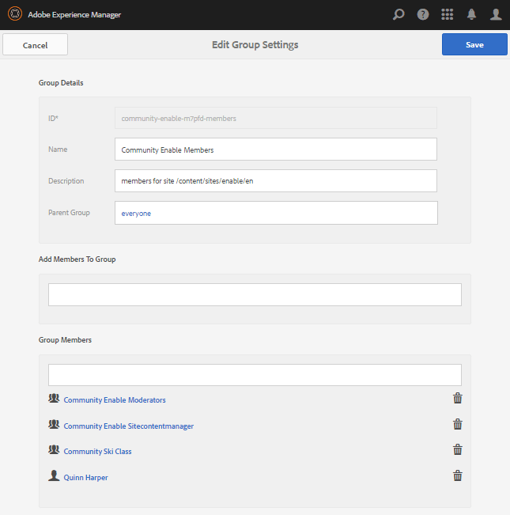

# Crie um novo site da comunidade para ativação {#author-a-new-community-site-for-enablement}

>[!CAUTION]
>
>AEM 6.4 chegou ao fim do suporte estendido e esta documentação não é mais atualizada. Para obter mais detalhes, consulte nossa [períodos de assistência técnica](https://helpx.adobe.com/br/support/programs/eol-matrix.html). Encontre as versões compatíveis [here](https://experienceleague.adobe.com/docs/).

## Criar site da comunidade {#create-community-site}

[Criação de sites da comunidade](sites-console.md) O emprega um assistente que o orienta pelas etapas da criação de um site da comunidade. É possível avançar para a `Next`etapa ou `Back`para a etapa anterior antes de confirmar o site na etapa final.

Para começar a criar um novo site de comunidade:

Usar o [instância do autor](http://localhost:4502/)

* Fazer logon com privilégios de administrador
* Navegar para **[!UICONTROL Comunidades > Sites]**

* Selecione **[!UICONTROL Criar]**

### Etapa 1: Modelo do site {#step-site-template}

No **Modelo do site** , insira um título, descrição, o nome do URL e selecione um modelo de site da comunidade, por exemplo:

* **Título do site da comunidade**: `Enablement Tutorial`

* **Descrição do site da comunidade**: `A site for enabling the community to learn.`

* **Raiz do site da comunidade**: (deixe em branco para a raiz padrão `/content/sites`)

* **Configurações da nuvem**: (deixe em branco se nenhuma configuração de nuvem for especificada) forneça o caminho para as configurações de nuvem especificadas.
* **Idioma base do site da comunidade**: (deixar intocado para uma única língua: inglês) use o menu suspenso para escolher um *ou mais* Idiomas de base dos idiomas disponíveis: alemão, italiano, francês, japonês, espanhol, português (Brasil), chinês (tradicional) e chinês (simplificado). Um site da comunidade será criado para cada idioma adicionado e existirá na mesma pasta do site seguindo a prática recomendada descrita em [Tradução de conteúdo para sites multilíngues](../../help/sites-administering/translation.md). A página raiz de cada site conterá uma página filho chamada pelo código de idioma de um dos idiomas selecionados, como &quot;en&quot; para inglês ou &quot;fr&quot; para francês.

* **[!UICONTROL Nome do site da comunidade]**: `enable`

   * o URL inicial será exibido abaixo do Nome do site da comunidade
   * para um URL válido, anexe um código de idioma base + &quot;.html&quot;

      *por exemplo*, http://localhost:4502/content/sites/ `enable/en.html`

* **[!UICONTROL Modelo de site de referência]**: puxe para baixo para escolher `Reference Structured Learning Site Template`

Selecione **[!UICONTROL Próximo]**

### Etapa 2: Design {#step-design}

A etapa Design é apresentada em duas seções para selecionar o tema e o banner de marca:

#### TEMA DO SITE DA COMUNIDADE {#community-site-theme}

Selecione o estilo desejado para aplicar ao modelo. Quando selecionado, o tema será sobreposto com uma marca de verificação.

#### MARCA DO SITE DA COMUNIDADE {#community-site-branding}

(opcional) Faça o upload de uma imagem de banner para ser exibida nas páginas do site. O banner é fixado à borda esquerda do navegador, entre o cabeçalho do site da comunidade e o menu (links de navegação). A altura do banner é cortada para 120 pixels. Não há redimensionamento do banner para ajustar a largura do navegador e a altura de 120 pixels.

 

Selecione **[!UICONTROL Próximo]**.

### Etapa 3: Configurações {#step-settings}

Na etapa Configurações , antes de selecionar `Next`, observe que há sete seções fornecendo acesso às configurações que envolvem gerenciamento de usuários, marcação, funções, moderação, análise, tradução e ativação.

#### GERENCIAMENTO DE USUÁRIOS {#user-management}

Recomenda-se que [comunidades de capacitação](overview.md#enablement-community) ser privado.

Um site da comunidade é privado quando visitantes anônimos do site têm acesso negado, podem não se registrar e podem não usar logon social.

Verifique se a maioria das caixas de seleção está desmarcada para [Gerenciamento de usuários](sites-console.md#user-management):

* NÃO permitir que os visitantes do site se registrem automaticamente
* NÃO permitir que visitantes anônimos do site visualizem o site
* Opcional se permite ou não mensagens entre membros da comunidade
* NÃO permitir logon com a Facebook
* NÃO permitir logon com a Twitter

#### MARCAÇÃO {#tagging}

As tags que podem ser aplicadas ao conteúdo da comunidade são controladas selecionando AEM namespaces definidos anteriormente por meio da variável [Console de marcação](../../help/sites-administering/tags.md#tagging-console) (como [Namespace do tutorial](enablement-setup.md#create-tutorial-tags)).

Além disso, selecionar Namespaces de tag para o site da comunidade limita a seleção apresentada ao definir catálogos e recursos de ativação. Consulte [Marcar recursos de ativação](tag-resources.md) para obter informações importantes.

Encontrar namespaces é fácil usando a pesquisa antecipada por tipo. Por exemplo,

* Digite &#39;tut&#39;
* Selecionar `Tutorial`

### FUNÇÕES {#roles}

[Funções dos membros da comunidade](users.md) são atribuídas pelas configurações na seção Funções .

Para permitir que um membro da comunidade (ou grupo de membros) experiencie o site como o gerente da comunidade, use a pesquisa do tipo para frente e selecione o nome do membro ou grupo nas opções do menu suspenso.

Por exemplo,

* Digite &quot;q&quot;
* Selecionar [Quinn Harper](enablement-setup.md#publishcreateenablementmembers)

>[!NOTE]
>
>[Serviço de túnel](deploy-communities.md#tunnel-service-on-author) permite a seleção de membros e grupos existentes somente no ambiente de publicação.

#### MODERAÇÃO {#moderation}

Aceite as configurações globais padrão para [moderação](sites-console.md#moderation) conteúdo gerado pelo usuário (UGC).

#### ANALYTICS {#analytics}

No menu suspenso, selecione a estrutura do serviço de nuvem do Analytics configurada para este site da comunidade.

A seleção vista na captura de tela, `Communities`, é o exemplo de estrutura da variável [documentação de configuração.](analytics.md#aem-analytics-framework-configuration)

#### TRADUÇÃO {#translation}

O [Configurações de tradução](sites-console.md#translation) especifique se o UGC pode ser traduzido ou não e em qual idioma, se assim for.

* Verificar **[!UICONTROL Permitir tradução automática]**
* Usar as configurações padrão

#### ATIVAÇÃO {#enablement}

Para uma comunidade de ativação, é necessário identificar um ou mais Gerentes de ativação da comunidade.

* **[!UICONTROL Gerentes de ativação]**
(obrigatório) Membros da 
`Community Enablement Managers` estão disponíveis para serem selecionadas para gerenciar este site da comunidade.

   * Tipo &quot;s&quot;
   * Selecionar `Sirius Nilson`

* **[!UICONTROL ID da Org do Marketing Cloud]**
(opcional) A ID de uma conta do Adobe Analytics, que é necessária ao incluir [Análise do Video Heartbeat](analytics.md#video-heartbeat-analytics) no relatório de ativação.

Selecione **[!UICONTROL Próximo]**.

### Etapa 4: Criar Site da Comunidade {#step-create-community-site}

Selecione **[!UICONTROL Criar]**.

Quando o processo for concluído, a pasta do novo site será exibida no console Comunidades - Sites .

### Publicar o novo site da comunidade {#publish-the-new-community-site}

O site criado deve ser gerenciado no console Comunidades - Sites , o mesmo console de onde novos sites podem ser criados.

Depois de selecionar a pasta do site da comunidade, passe o mouse sobre o ícone do site para que quatro ícones de ação sejam exibidos:

Ao selecionar o ícone de reticências (ícone Mais ações), as opções Exportar site e Excluir site são exibidas.

Da esquerda para a direita, são:

* **Abrir Site**
Selecione o ícone de lápis para abrir o site da comunidade no modo de edição do autor, para adicionar e/ou configurar os componentes da página

* **Editar Site**
Selecione o ícone de propriedades para abrir o site da comunidade para modificação de propriedades, como o título ou para alterar o tema

* **Publicar site**
Selecione o ícone do mundo para publicar o site da comunidade (para localhost:4503 por padrão)

* **Exportar Site**
Selecione o ícone de exportação para criar um pacote do site da comunidade que está armazenado em [gerenciador de pacotes](../../help/sites-administering/package-manager.md) e baixado.

   Observe que o UGC não está incluído no pacote do site.

* **Excluir Site**
Para excluir o site da comunidade, selecione o ícone Excluir site que aparece ao passar o mouse sobre o site no Console do site Comunidades. Essa ação remove todos os itens associados ao site, como UGC, grupos de usuários, ativos e registros de banco de dados.

#### Selecionar publicação {#select-publish}

Selecione o ícone do mundo para publicar o site da comunidade.

Haverá uma indicação de que o site foi publicado.

## Usuários da comunidade e grupos de usuários {#community-users-user-groups}

### Avisar novos grupos de usuários da comunidade {#notice-new-community-user-groups}

Junto com o novo site da comunidade, novos grupos de usuários são criados com as permissões apropriadas definidas para várias funções administrativas. Para obter detalhes, visite [Grupos de usuários para sites da comunidade](users.md#usergroupsforcommunitysites).

Para este novo site da comunidade, dado o nome do site &quot;ativar&quot; na Etapa 1, os novos grupos de usuários que existem no ambiente de publicação podem ser vistos no [Console Membros e grupos do Communities](members.md#groups-console):

### Atribuir membros ao grupo Habilitar membros da comunidade {#assign-members-to-community-enable-members-group}

Na criação, com o serviço de túnel ativado, é possível atribuir a variável [usuários criados durante a Configuração inicial](enablement-setup.md#publishcreateenablementmembers) ao grupo Membros da Comunidade para o site da comunidade recém-criado.

Usando o console Grupos da Comunidade , os membros podem ser adicionados individualmente ou adicionados por meio da associação a um grupo.

Neste exemplo, o grupo `Community Ski Class` é adicionado como membro do grupo `Community Enable Members` bem como os membros `Quinn Harper`.

* Navegar para **[!UICONTROL Comunidades > Grupos]** console
* Selecionar **[!UICONTROL Comunidade Habilitar membros]** grupo
* Enter `ski` na **[!UICONTROL Adicionar membros ao grupo]** caixa de pesquisa
* Selecionar **[!UICONTROL Classe de Esqui da Comunidade]** (grupo de aprendentes)
* Enter `quinn` na caixa de pesquisa
* Selecionar **[!UICONTROL Quinn Harper]** (contato de recursos de ativação)

* Selecione **[!UICONTROL Salvar]**

## Configurações na publicação {#configurations-on-publish}

### http://localhost:4503/content/sites/enable/en.html {#http-localhost-content-sites-enable-en-html}

### Configurar para Erro de Autenticação {#configure-for-authentication-error}

Depois que um site é configurado e enviado para publicação, [configurar o mapeamento de logon](sites-console.md#configure-for-authentication-error) ( `Adobe Granite Login Selector Authentication Handler`) na instância de publicação. A vantagem é que, quando as credenciais de logon não são inseridas corretamente, o erro de autenticação exibirá novamente a página de logon do site da comunidade com uma mensagem de erro.

Adicione um `Login Page Mapping` as

* /content/sites/enable/en/sign:/content/sites/enable/en

### (Opcional) Alterar a Página inicial padrão {#optional-change-the-default-home-page}

Ao trabalhar com o site de publicação para fins de demonstração, pode ser útil alterar a página inicial padrão para o novo site.

Para fazer isso, é necessário usar [CRX|DE](http://localhost:4503/crx/de) Lite para editar o [mapeamento de recursos](../../help/sites-deploying/resource-mapping.md) tabela em publicar.

Para começar

1. Ao publicar, acesse o CRXDE e faça logon com privilégios de administrador

   * Por exemplo, navegue até [http://localhost:4503/crx/de](http://localhost:4503/crx/de) e faça logon com `admin/admin`

1. No navegador do projeto, expanda `/etc/map`
1. Selecione o `http` nó

   * Selecionar **[!UICONTROL Criar nó]**

      * **Nome** localhost.4503

         (Do *not* use `:`)

      * **Tipo** [sling:Mapping](https://sling.apache.org/documentation/the-sling-engine/mappings-for-resource-resolution.html)

1. Com recém-criado `localhost.4503` nó selecionado

   * Adicionar propriedade

      * **Nome** sling:match
      * **Tipo** String
      * **Valor** localhost.4503/\$

         (Deve terminar com o caractere &#39;$&#39;)
   * Adicionar propriedade

      * **Nome** sling:internalRedirect
      * **Tipo** String
      * **Valor** /content/sites/enable/en.html

1. Selecionar **[!UICONTROL Salvar tudo]**
1. (opcional) Excluir o histórico de navegação
1. Navegue até http://localhost:4503/

   * Acesse http://localhost:4503/content/sites/enable/en.html

>[!NOTE]
>
>Para desativar, basta anexar o `sling:match` valor da propriedade com um &#39;x&#39; - `xlocalhost.4503/$` - e **[!UICONTROL Salvar tudo]**.

#### Solução de problemas: Erro ao salvar o mapa {#troubleshooting-error-saving-map}

Se não conseguir salvar as alterações, verifique se o nome do nó é `localhost.4503`, com um separador de &quot;ponto&quot;, e não `localhost:4503` com um separador de &quot;dois pontos&quot;, como `localhost`não é um prefixo de namespace válido.

#### Solução de problemas: Falha ao redirecionar {#troubleshooting-fail-to-redirect}

O &quot;**$**&#39; no final da expressão regular `sling:match`é crucial, de modo que somente `http://localhost:4503/` estiver mapeado, caso contrário, o valor de redirecionamento será anexado a qualquer caminho que possa existir após server:port no URL. Dessa forma, quando o AEM tenta redirecionar para a página de logon, ela falha.

## Modificando o Site da Comunidade {#modifying-the-community-site}

Após a criação inicial do site, os autores podem usar a variável [Ícone Abrir site](sites-console.md#authoring-site-content) para executar atividades de criação de AEM padrão.

Além disso, os administradores podem usar o [Ícone Editar site](sites-console.md#modifying-site-properties) para modificar as propriedades do site, como o título.

Depois de qualquer modificação, lembre-se de **Salvar** e re **Publicar** o site.

>[!NOTE]
>
>Se não estiver familiarizado com AEM, visualize a documentação em [tratamento básico](../../help/sites-authoring/basic-handling.md) e [guia rápido para a criação de páginas](../../help/sites-authoring/qg-page-authoring.md).

### Adicionar um catálogo {#add-a-catalog}

O modelo de site da comunidade escolhido para este site da comunidade deve conter o recurso de catálogo.

Caso contrário, a função de catálogo poderá ser facilmente adicionada. Isso permitiria que outros membros da comunidade, não atribuídos aos recursos de ativação ou a um caminho de aprendizado, selecionassem recursos de capacitação em um catálogo.

Se a estrutura do site já contiver o recurso de catálogo, seu Título poderá ser alterado.

Para modificar a estrutura do site, navegue até o **[!UICONTROL Comunidades, Sites]** abra o `enable` e selecione a **Editar Site** para acessar as propriedades de `Enablement Tutorial`.

Selecione o painel ESTRUTURA para adicionar um catálogo ou modificar um catálogo existente:

* **Título**: `Ski Catalog`

* **URL**: `catalog`

* **Selecionar todos os namespaces**: deixe como padrão.
* Selecione **[!UICONTROL Salvar]**

Use o ícone Posição para mover a função Catálogo para a segunda posição, depois de Atribuições.

Selecionar **[!UICONTROL Salvar]** no canto superior direito para salvar as alterações no site da comunidade.

Em seguida, re-**Publicar** o site.
