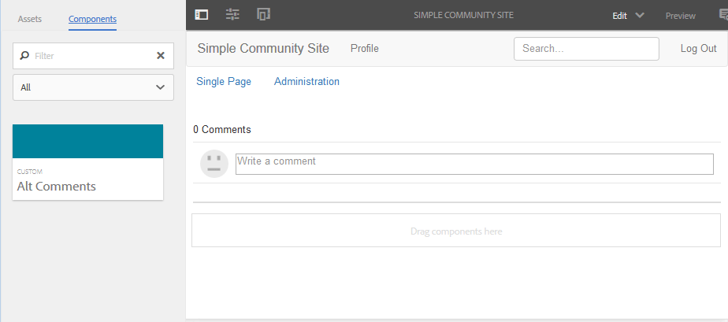

# Adicionar comentário à página de amostra {#add-comment-to-sample-page}

Agora que os componentes do sistema de comentários personalizado estão no diretório do aplicativo (/apps), é possível usar o componente estendido. A instância do sistema de comentários em um site a ser afetado deve definir resourceType como o sistema de comentários personalizado e incluir todas as bibliotecas de clientes necessárias.

## Identificar Clientlibs Necessários {#identify-required-clientlibs}

As bibliotecas do cliente necessárias para o estilo e o funcionamento dos Comentários padrão também são necessárias para os Comentários estendidos.

O Guia [de componentes da](components-guide.md) comunidade identifica as bibliotecas de clientes necessárias. Navegue até o Guia do componente e visualização o componente Comentários, por exemplo:

[http://localhost:4502/content/community-components/en/comments.html](http://localhost:4502/content/community-components/en/comments.html)

Observe as três bibliotecas de cliente necessárias para que os Comentários renderizem e funcionem corretamente. Eles precisarão ser incluídos onde os Comentários estendidos forem referenciados, bem como a biblioteca [do cliente dos Comentários](extend-create-components.md#create-a-client-library-folder) estendidos ( `apps.custom.comments`).

## Adicionar comentários personalizados a uma página {#add-custom-comments-to-a-page}

Como pode haver apenas um sistema de Comentários por página, é mais simples criar uma página de amostra, conforme descrito no breve tutorial [Criar uma página](create-sample-page.md) de amostra.

Depois de criado, entre no modo Design e disponibilize o grupo de componentes Personalizado para permitir que o `Alt Comments` componente seja adicionado à página.

Para que o Comentário seja exibido e funcione corretamente, as bibliotecas do cliente para Comentários devem ser adicionadas à clientlibslist para a página (consulte [Clientlibs for Communities Components](clientlibs.md)).

### Comentários Clientlibs na página de amostra {#comments-clientlibs-on-sample-page}

### Autor: Comentário alternativo na página de amostra {#author-alt-comment-on-sample-page}

### Autor: Exemplo de Nó de Comentários da Página {#author-sample-page-comments-node}

Você pode verificar o resourceType no CRXDE exibindo as propriedades do nó comments da página de amostra em `/content/sites/sample/en/jcr:content/content/primary/comments`.

### Página Publicar amostra {#publish-sample-page}

Depois que o componente personalizado é adicionado à página, também é necessário (re) [publicar a página](sites-console.md#publishing-the-site).

### Publicar: Comentário alternativo na página de amostra {#publish-alt-comment-on-sample-page}

Depois de publicar o aplicativo personalizado e a página de amostra, deve ser possível inserir um comentário. Quando conectado, seja com um usuário [de](tutorials.md#demo-users) demonstração ou administrador, deve ser possível postar um comentário.

Aqui está aaron.mcdonald@mailinator.com postando um comentário:

 

Agora que parece que o componente estendido está funcionando corretamente com a aparência padrão, é hora de modificar a aparência.

