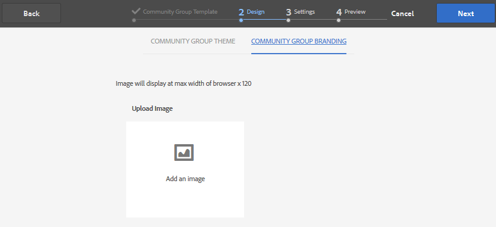

# Console de grupos da comunidade {#community-groups-console}

>[!CAUTION]
>
>AEM 6.4 chegou ao fim do suporte estendido e esta documentação não é mais atualizada. Para obter mais detalhes, consulte nossa [períodos de assistência técnica](https://helpx.adobe.com/br/support/programs/eol-matrix.html). Encontre as versões compatíveis [here](https://experienceleague.adobe.com/docs/).

O console Grupos fornece acesso à criação de grupos da comunidade quando um site da comunidade [estrutura do modelo](sites-console.md#step1) inclui a [função de grupos](functions.md#groups-function).

* Os grupos podem ser aninhados dentro de outros grupos. Isso acontece quando a variável [estrutura do novo grupo](tools-groups.md) contém a função groups .
* Somente para o ambiente de criação, há um assistente de criação de grupo semelhante ao assistente de criação de site.
* Se os membros podem ou não criar grupos do ambiente de publicação é configurável ao adicionar uma função Grupos a uma estrutura de site da comunidade ou de grupo da comunidade.

Dos três modelos de grupo incluídos, somente a variável `Reference Group` O template inclui uma função de grupos em sua estrutura.

Várias facetas dos grupos da comunidade são:

* Criação: o novo grupo pode ser criado no autor e, opcionalmente, na publicação
* Controle: pode ser aberto ou secreto
* Aninhamento: um grupo pode conter zero ou mais grupos

>[!NOTE]
>
>Grupos da comunidade, criados no ambiente de publicação antes da [existência do console Grupos Comunitários](https://helpx.adobe.com/in/experience-manager/6-3/communities/using/version-history.html#FeaturePack1FP1), não serão listadas no console Grupos da comunidade e, portanto, não serão modificáveis usando o console.

>[!NOTE]
>
>Esse console Grupos, acessível apenas no console Sites das Comunidades, não deve ser confundido com o membro [Console Grupos](members.md) para gerenciar grupos de membros.
>
>Os grupos de membros são grupos de usuários registrados no ambiente de publicação e acessados do ambiente de criação usando o [serviço de túnel](deploy-communities.md#tunnel-service-on-author).

## Criação do grupo {#group-creation}

Para acessar o console Grupos :

* Ao criar, faça logon com privilégios de administrador
* Na navegação global: **[!UICONTROL Comunidades > Sites]**
* Selecione uma pasta de site da comunidade existente para abri-la
* Selecione uma instância de um site da comunidade na pasta

   * A estrutura do site da comunidade deve incluir uma função de grupos
   * Essas capturas de tela são do tutorial Introdução após [criação de grupos na publicação](published-site.md)

Selecione o **[!UICONTROL Pasta Grupos]** para abri-lo.

Quando abertas, todos os grupos existentes, sejam eles criados em autor ou publicação, serão exibidos.

Nesse console Grupos é possível criar novos grupos.

* Selecionar **[!UICONTROL Criar grupo]** botão

### Etapa 1: Modelo de grupo da comunidade {#step-community-group-template}

* **[!UICONTROL Título do grupo da comunidade]**: Um título de exibição para o grupo.

   O título aparece no site publicado do grupo.

* **[!UICONTROL Descrição do grupo da comunidade]**: Uma descrição do grupo.
* **[!UICONTROL Raiz do grupo da comunidade]**: O caminho raiz para o grupo.

   A raiz padrão é o site pai, mas a raiz pode ser movida para qualquer local dentro do site. Não é recomendável alterá-la.

* **[!UICONTROL Idiomas adicionais disponíveis para grupos da comunidade]** menu: Use o menu suspenso para selecionar os idiomas de grupo da comunidade disponíveis. O menu exibe todos os idiomas nos quais o site da comunidade pai é criado. Os usuários podem selecionar entre esses idiomas para criar grupos em várias localidades nesta única etapa. O mesmo grupo é criado em vários idiomas especificados no console Grupos dos respectivos sites da comunidade.

* **[!UICONTROL Nome do grupo da comunidade]**: O nome da página raiz do grupo que aparece no URL

   * Verifique novamente o nome, pois ele não é facilmente alterado depois que o grupo é criado
   * O URL base será exibido abaixo do `Community Group Name`
   * Para um URL válido, anexe &quot;.html&quot;

      *Por exemplo*, `http://localhost:4502/content/sites/mysight/en/mygroup.html`

* **[!UICONTROL Modelo de grupo da comunidade]** menu: use o menu suspenso para escolher um disponível [modelo de grupo da comunidade](tools.md).

### Etapa 2: Design {#step-design}

#### TEMA DO GRUPO COMUNITÁRIO {#community-group-theme}

A estrutura usa `Twitter Bootstrap` para trazer um design responsivo e flexível para o site. Um dos muitos temas de Bootstrap pré-carregados pode ser selecionado para criar o estilo do modelo de grupo da comunidade selecionado ou um tema de Bootstrap pode ser carregado.

Quando selecionado, o tema será sobreposto com uma marca de seleção azul opaca.

É possível selecionar um tema que difere do tema do site pai.

Depois que o site da comunidade é publicado, é possível [editar as propriedades](#modifying-group-properties) e selecione um tema diferente.

#### MARCA DO GRUPO COMUNITÁRIO {#community-group-branding}

A marca do site da comunidade é uma imagem exibida como um cabeçalho na parte superior de cada página. É possível exibir um banner para o grupo que difere de outras páginas do site.

A imagem deve ser dimensionada para ser tão ampla quanto a exibição esperada da página no navegador e 120 pixels de altura.

Ao criar ou selecionar uma imagem, lembre-se:

* A altura da imagem será cortada para 120 pixels medidos a partir da borda superior da imagem
* A imagem é fixada na borda esquerda da janela do navegador
* Não há redimensionamento da imagem, de modo que quando a largura da imagem for...

   * Menos que a largura do navegador, a imagem se repetirá horizontalmente
   * Maior que a largura do navegador, a imagem parecerá estar cortada

### Etapa 3: Configurações {#step-settings}

#### MODERAÇÃO {#moderation}

Por padrão, a lista de moderadores do site da comunidade principal é herdada.

É possível adicionar moderadores específicos ao grupo:

* Pesquise membros (do ambiente de publicação) para adicioná-los como moderadores

#### ASSOCIAÇÃO {#membership}

A configuração de associação permite a seleção de uma das três maneiras de proteger um grupo da comunidade.

* Associação opcional

   Se selecionado, o grupo da comunidade é um grupo público. Os membros do site podem participar do grupo e publicar sem ingressar explicitamente no grupo. O padrão é selecionado.
* Associação necessária

   se selecionado, o grupo da comunidade será um grupo aberto. Os membros do site da comunidade podem visualizar o conteúdo do grupo, mas devem ingressar no grupo antes de poder publicar conteúdo. Os membros se associam selecionando o `Join` no ambiente de publicação. O padrão não está selecionado.

* Associação restrita

   se selecionado, o grupo da comunidade será um grupo secreto. Os membros da Comunidade devem ser convidados explicitamente. Os membros convidados são inseridos na caixa de pesquisa. Os membros podem ser acrescentados posteriormente, utilizando a [Consoles Membros e grupos](members.md) o ambiente do autor. O padrão não está selecionado.

#### MINIATURA {#thumbnail}

A miniatura é uma imagem a ser exibida para o grupo na criação e publicação.

O tamanho ideal para uma imagem de grupo é 170 x 90 pixels em um formato de imagem compatível (como JPG ou PNG).

Se nenhuma imagem for adicionada, uma imagem padrão será exibida.

### Etapa 4: Criar grupo {#step-create-group}

Se algum ajuste for necessário, use a variável **Voltar** para criá-las.

Uma vez **Criar** for selecionado e iniciado, o processo de criação do grupo não poderá ser interrompido.

Quando o processo é concluído, o cartão do novo site da subcomunidade (grupo) é exibido no console Grupos de sites das Comunidades , onde os autores podem adicionar conteúdo de página ou os administradores podem modificar as propriedades do site.

>[!NOTE]
>
>O grupo é criado em todos os idiomas, conforme especificado em [Etapa 1: Modelo de grupo da comunidade](groups.md#step1communitygrouptemplate) em Idiomas de grupos comunitários adicionais disponíveis, no console Grupos da comunidade dos respectivos sites da comunidade.

## Conteúdo do grupo de criação {#authoring-group-content}

O conteúdo da página de um grupo pode ser criado com as mesmas ferramentas que qualquer outra página AEM. Para abrir o grupo para criação, selecione o ícone Abrir site que aparece ao passar o mouse sobre o cartão de grupo.

## Modificando propriedades do grupo {#modifying-group-properties}

As propriedades de um site de subcomunidade existente, especificadas durante o processo de criação do grupo da comunidade, podem ser modificadas ao selecionar o ícone Editar site, que aparece ao passar o mouse sobre o cartão de grupo:

Os detalhes das seguintes propriedades correspondem às descrições fornecidas na [Criação de grupo](#group-creation) seção. Qualquer grupo aninhado pode ser modificado, seja ele criado no ambiente de publicação ou no ambiente de criação.

### Modificar Básico {#modify-basic}

O painel BÁSICO permite a modificação de

* Título do grupo da comunidade
* Descrição do grupo da comunidade

O Nome do Grupo da Comunidade não pode ser alterado.

A escolha de um modelo de grupo da comunidade diferente não teria efeito em um site de grupo da comunidade existente, pois nenhuma conexão permanece entre modelos e sites.

Em vez disso, a variável [ESTRUTURA](#modify-structure) da subcomunidade pode ser modificada.

### Modificar estrutura {#modify-structure}

O painel ESTRUTURA permite a modificação da estrutura inicialmente criada a partir do modelo de grupo da comunidade selecionado ao criar o site da subcomunidade a partir do ambiente de criação ou publicação. No painel , é possível

* Arrastar e soltar [funções da comunidade](functions.md) na estrutura do site
* Em uma instância de uma função da comunidade na estrutura do site:

   * **`gear icon`**

      Editar configurações, incluindo o título de exibição e o nome do URL, bem como [grupos de membros privilegiados](users.md#privilegedmembersgroups)

   * **`trashcan icon`**

      Remover (excluir) funções da estrutura do site

   * **`grid icon`**

      Modifique a ordem das funções, conforme exibido na barra de navegação de nível superior do site

>[!CAUTION]
>
>Embora o título de exibição possa ser alterado sem efeitos colaterais, não é recomendável editar o nome do URL de uma função da comunidade pertencente a um site da comunidade.
>
>Por exemplo, renomear o URL não moverá o UGC existente, tendo o efeito de &#39;perder&#39; o UGC.

>[!CAUTION]
>
>A função de grupos deve *not* ser *primeiro nem o único* na estrutura do site.
>
>Qualquer outra função, como a [função de página](functions.md#page-function), deve ser incluída e listada primeiro.

#### Exemplo: Adicionar uma função de calendário a uma estrutura de subcomunidade (grupo) {#example-adding-a-calendar-function-to-a-sub-community-group-structure}

### Modificar design {#modify-design}

O painel DESIGN permite a modificação do tema:

* [Tema do grupo da comunidade](#community-group-theme)
* [Marca de grupo da comunidade](#community-group-branding)

   * Role até a parte inferior do painel para alterar a imagem da marca

### Modificar configurações {#modify-settings}

O painel CONFIGURAÇÕES permite a capacidade de adicionar comunidade [moderadores](#moderation).

### Modificar Associação {#modify-membership}

O [ASSOCIAÇÃO](#membership) O painel é apenas informativo. Não é possível alterar o tipo de membro do grupo estabelecido, seja ele opcional, obrigatório ou restrito.

### Modificar miniatura {#modify-thumbnail}

O [MINIATURA](#thumbnail) permite que uma imagem seja carregada para representar o grupo da comunidade para os visitantes do site no ambiente de publicação, bem como no console Grupos do site das Comunidades no ambiente de criação.

## Publicar o grupo {#publishing-the-group}

Após um grupo da comunidade ter sido criado ou modificado recentemente, é possível publicar (ativar) o grupo selecionando o `Publish Site` ícone .

Depois que o grupo for publicado com êxito, uma mensagem será exibida:

>[!CAUTION]
>
>O site da comunidade pai e os grupos pai já deveriam ter sido publicados.
>
>O site da comunidade e os grupos aninhados devem ser publicados de cima para baixo.

## Excluindo o grupo {#deleting-the-group}

Exclua um grupo do console Grupos da comunidade selecionando o ícone Excluir grupo , que aparece ao passar o mouse sobre ele.

Isso remove todos os itens associados ao grupo, por exemplo, todo o conteúdo do grupo é excluído permanentemente e as associações de usuário são removidas do sistema.
