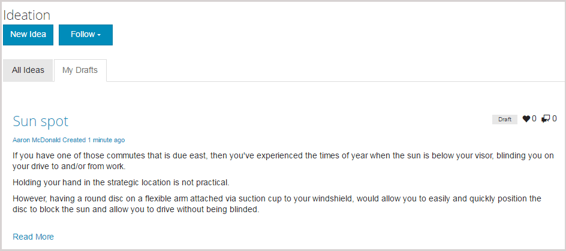

# Recurso Ideação {#ideation-feature}

## Introdução {#introduction}

O recurso de ideação fornece uma área para visitantes de site conectados (membros da comunidade) no ambiente de publicação para:

* Crie ideias para compartilhar com a comunidade
* Visualização e comentários sobre ideias
* Siga uma ideia
* Votar uma ideia

Esta seção da documentação descreve

* Adicionar o recurso de ideação a um site AEM
* Configurações do componente Ideação

## Adicionar uma ideia a uma página {#adding-a-ideation-to-a-page}

Para adicionar um componente `Ideation` a uma página no modo de autor, use o navegador de componentes para localizar `Communities / Ideation` e arraste-o para o lugar em uma página onde a ideia deve aparecer.

Para obter as informações necessárias, visite [Informações básicas sobre componentes das comunidades](basics.md).

Quando as [bibliotecas obrigatórias do lado do cliente](ideation.md#essentials-for-client-side) forem incluídas, será assim que o componente `Ideation`aparecerá:

## Configurando uma Ideia {#configuring-an-ideation}

Selecione o componente `Ideation` inserido para acessar e selecione o ícone `Configure` que abre a caixa de diálogo de edição.

 

### Guia Configurações {#settings-tab}

Na guia **[!UICONTROL Settings]**, especifique as configurações para ideias e comentários:

* **[!UICONTROL Título da]**
ideiaO título de exibição da ideia. O padrão é 
`Ideation`.

* **[!UICONTROL Descrição da]**
ideiaUma descrição para exibir como um subtítulo da ideia. O padrão não é descrição.

* **[!UICONTROL Tópicos por]**
páginaDefine o número de ideias/postagens exibidas por página. O padrão é 10.

* ****
ModeradoSe marcado, a postagem de ideias e comentários deve ser aprovada antes de serem exibidos em um site de publicação. O padrão está desmarcado.

* ****
FechadoSe marcado, o fórum de ideação é fechado a novas ideias e comentários. O padrão está desmarcado.

* **[!UICONTROL Rich Text]**
EditorSe marcada, as ideias e os comentários podem ser inseridos com marcação. O padrão está desmarcado.

* **[!UICONTROL Permitir]**
marcaçãoSe marcada, permita que os membros adicionem etiquetas à sua postagem (consulte  **[!UICONTROL Tag]** field tab). O padrão está desmarcado.

* **[!UICONTROL Permitir]**
uploads de arquivoSe marcada, permita que os anexos de arquivo sejam adicionados à ideia ou ao comentário. O padrão está desmarcado.

* **[!UICONTROL Tamanho máx.]**
do arquivoRelevante somente se 
`Allow File Uploads` está marcada. Este campo limitará o tamanho (em bytes) de um arquivo carregado. O padrão é 104857600 (10 Mb).

* **[!UICONTROL Permitidos]**
Tipos de ArquivoRelevante somente se 
`Allow File Uploads` está marcada. Uma lista separada por vírgulas de extensões de arquivo com o separador &quot;ponto&quot;. Por exemplo: .jpg, .jpeg, .png, .doc, .docx, .pdf. Se algum tipo de arquivo for especificado, o upload dos não especificados não será permitido. O padrão não é especificado, de modo que todos os tipos de arquivos sejam permitidos.

* **[!UICONTROL Tamanho máx. do arquivo de imagem anexadaRelevante somente se Permitir uploads de arquivo estiver marcado.]**
Número máximo de bytes que um arquivo de imagem carregado pode ter. O padrão é 2097152 (2 Mb).

* **[!UICONTROL Permitir]**
respostasSe marcada, permita respostas a comentários postados na ideia. O padrão está desmarcado.

* **[!UICONTROL Permitir que os usuários excluam comentários e]**
tópicosSe marcada, permita que os membros excluam os comentários e ideias que publicaram. O padrão está desmarcado.

* **[!UICONTROL Permitir]**
seguidoresSe marcada, inclua o seguinte recurso para publicações de ideias, que permite que os membros sejam   notificados sobre novas publicações. O padrão está desmarcado.

* **[!UICONTROL Permitir]**
assinaturas de e-mailSe marcada, permita que os membros sejam notificados de novas publicações por e-mail ([subscrição](subscriptions.md)). Exige que `Allow Following` seja verificado e [e-mail configurado](email.md). O padrão está desmarcado.

* **[!UICONTROL Permitir]**
votação Se marcada, permitir votação sobre os comentários de uma ideia. O padrão está desmarcado.

* **[!UICONTROL Exibir]**
emblemasSe marcada, exibe os   emblemas ganhados e atribuídos com a ideia de um membro. O padrão está desmarcado.

* **[!UICONTROL Se a opção Permitir]**
conteúdo em destaque estiver marcada, a ideia poderá ser identificada como conteúdo [ em ](featured.md)destaque. O padrão está desmarcado.

### Guia Moderação do usuário {#user-moderation-tab}

Na guia **[!UICONTROL Moderação do usuário]**, especifique como as ideias e os comentários publicados (conteúdo gerado pelo usuário) serão gerenciados. Para obter mais informações, consulte [Moderação de conteúdo gerado pelo usuário](moderate-ugc.md).

* **[!UICONTROL Negar]**
publicaçõesSe marcada, os moderadores de membros confiáveis poderão negar as publicações e impedir que a publicação apareça no fórum público. O padrão está desmarcado.

* **[!UICONTROL Fechar / Reabrir]**
tópicosSe marcados, os moderadores de membros confiáveis podem fechar um tópico para outras edições e comentários, e também podem reabrir um tópico. O padrão está desmarcado.

* **[!UICONTROL Sinalizar]**
postagensSe marcada, permita que os membros sinalizem os tópicos ou comentários de outras pessoas como inadequados. O padrão está desmarcado.

* **[!UICONTROL Sinalizar]**
lista de motivosSe estiver marcada, permita que os membros escolham, em uma lista suspensa, seu motivo para sinalizar um tópico ou comentário como inapropriado. O padrão está desmarcado.

* **[!UICONTROL Sinalizador personalizado]**
MotivoSe selecionado, permita que os membros insiram seu próprio motivo para sinalizar um tópico ou comentário como inapropriado. O padrão está desmarcado.

* **[!UICONTROL Limite de moderação]**
Digite o número de vezes que um tópico ou comentário deve ser sinalizado pelos membros antes que os moderadores sejam notificados. O padrão é 1 (uma vez).

* **[!UICONTROL Limite]**
de sinalizaçãoInsira o número de vezes que um tópico ou comentário deve ser sinalizado antes de ser ocultado da visualização pública. Se definido como -1, o tópico ou comentário sinalizado nunca será ocultado da visualização pública. Caso contrário, esse número deve ser maior ou igual ao Limite de moderação. O padrão é 5.

### Guia Campo de tag {#tag-field-tab}

Na guia **[!UICONTROL Campo de tag]**, as tags que podem ser aplicadas, se permitidas na guia **[!UICONTROL Settings]**, são limitadas de acordo com as namespaces escolhidas.

* **[!UICONTROL Espaços de]**
nomes permitidosRelevante se 
`Allow Tagging` está marcada na guia  **** Configurações. As marcas que podem ser aplicadas são limitadas às da categoria verificada. A lista do namespace inclui &quot;Tags padrão&quot; (a namespace padrão) e &quot;Incluir todas as tags&quot;. O padrão não está marcado, o que significa que todas as namespaces são permitidas.

* **[!UICONTROL Limite de]**
sugestãoInsira o número de tags a serem exibidas como uma sugestão para o membro postar no fórum. Um valor de 
**-** 1 significa sem limite. O padrão é 0.

### guia Configurações de classificação {#sort-settings-tab}

Na guia **[!UICONTROL Classificar configurações]**, especifique como os comentários publicados são classificados quando exibidos.

* **[!UICONTROL Classificar]**
porMarque todas as seleções de classificação permitidas: 
`Newest, Oldest, Last Updated, Most Viewed, Most Active, Most Followed and Most Liked`. O padrão é `Newest, Oldest, Last Updated`.

* **[!UICONTROL Defina como]**
DefaultPull para baixo para selecionar uma das opções de classificação marcadas para serem exibidas como padrão. O padrão é 
`Newest`.

* **[!UICONTROL Selecione Opções de tempo para]**
classificação do AnalyticsPuxe para baixo para selecionar uma das opções de 
`All, Last 24 Hours, Last 7 Days, Last 30 Days`. O padrão é `All`.

## Experiência de Visitante do site {#site-visitor-experience}

### Criando Ideia {#creating-idea}

Como acontece com todos os recursos das Comunidades, se não estiverem conectados, um visitante do site só poderá ler ideias e visualização opiniões de outras pessoas (através de comentários e votação/curtir).

Depois de conectado, um membro pode criar uma nova ideia.

Antes de enviar a ideia, é possível que o membro salve um rascunho.

Ao selecionar o botão `Save as Draft`, um rascunho é salvo.

Ao exibir rascunhos salvos na guia `My Drafts`, selecione `Read More` para entrar novamente no modo de edição:

#### Fornecer feedback {#providing-feedback}

Assim que a ideia for publicada, outros membros poderão fazer logon, abrir a ideia ( `Read More`) e curtir a ideia, adicionando à contagem de votos e fazendo comentários.

### Informações adicionais {#additional-information}

Mais informações podem ser encontradas na página [Ideation Essentials](ideation.md) para desenvolvedores.

Para moderação de tópicos e comentários publicados, consulte [Moderação de conteúdo gerado pelo usuário](moderate-ugc.md).

Para marcar tópicos e comentários publicados, consulte [Marcação de conteúdo gerado pelo usuário](tag-ugc.md).
