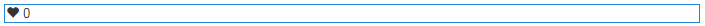

# Usando curtir {#using-liking}

O componente `Liking`é uma ferramenta útil que permite aos usuários expressar uma opinião sobre um conteúdo específico, como um comentário em um fórum. Com o componente `Liking`, os membros selecionam o ícone de coração para indicar uma opinião positiva.

## Adicionar curtir a uma página {#adding-liking-to-a-page}

Para adicionar um componente `Liking` a uma página no modo de autor, use o navegador de componentes para localizar

* `Communities / Liking`

e arraste-o para o lugar em uma página, como uma posição relativa ao recurso que os usuários desejam.

Para obter as informações necessárias, visite [Informações básicas sobre componentes das comunidades](basics.md).

Quando as [bibliotecas obrigatórias do lado do cliente](essentials-liking.md#essentials-for-client-side) forem incluídas, o componente `Liking` aparecerá desta forma.

## Configuração de curtir {#configuring-liking}

Selecione o componente `Liking` inserido para acessar e selecione o ícone `Configure` que abre a caixa de diálogo de edição.

Na guia **[!UICONTROL Textos e etiquetas]**, especifique as propriedades usadas para registrar curtidas.

* **[!UICONTROL Rótulo de resposta positiva]**
(
*Obrigatório*) O nome da propriedade para uma resposta positiva.

* **[!UICONTROL Etiqueta de resposta negativa]**
(
*Obrigatório*) O nome da propriedade para uma resposta negativa.

* **[!UICONTROL Nome Tally]**
(
*Obrigatório*) O nome de propriedade interno e identificável para esta instância de um componente de votação.

## Experiência de Visitante do site {#site-visitor-experience}

### Membros {#members}

Os deputados podem mudar de opinião a qualquer momento.

### Anônimo {#anonymous}

Gostos anônimos não são suportados. Os visitantes do site devem se registrar (tornar-se um membro) e fazer logon para participar do curtidas.

## Informações adicionais {#additional-information}

Mais informações podem ser encontradas na página [Curtir o Essentials](essentials-liking.md) para desenvolvedores.
