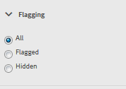
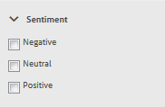

# Console de moderação {#moderation-console}

No AEM Communities, a moderação em massa de [conteúdo da comunidade](moderate-ugc.md) é possível tanto do autor quanto dos ambientes de publicação por administradores e moderadores da comunidade (membros da comunidade confiáveis atribuídos como moderadores).

Os administradores e os moderadores da comunidade também podem executar [moderação no contexto](in-context.md) no ambiente de publicação.

Um recurso de todos os [sites da comunidade](sites-console.md) é um `Administration`item de menu disponível para usuários que fazem logon com privilégios administrativos. O link `Administration`fornece acesso ao console Moderação.

No console Moderação, os administradores e moderadores da comunidade terão acesso a todo o conteúdo gerado pelo usuário (UGC) para o qual eles têm permissão para moderar. Se for permitido moderar vários sites, é possível visualização postagens em todos os sites ou filtrar por sites de comunidades selecionadas.

Para obter informações mais detalhadas, visite [Gerenciar usuários e grupos de usuários](users.md).

O console Moderação suporta:
* Realização de tarefas de moderação em massa
* Pesquisando UGC
* Exibição de detalhes do UGC
* Exibição de detalhes do autor UGC

Somente quando conectado como administrador, ou um membro com ` [moderator permissions](in-context.md#identifyingtrustedmembers)`, as tarefas de moderação podem ser executadas.

## Publicar acesso ao Ambiente {#publish-environment-access}

O acesso ao console de Moderação de um site da comunidade publicado é feito por meio de um link de Administração que é exibido quando um moderador da comunidade está conectado.

Ao selecionar o link Administração, o console Moderação é exibido:

## Acesso ao Ambiente do autor {#author-environment-access}

No ambiente do autor, para acessar o console Moderação

* Da navegação global: **[!UICONTROL Navegação > Comunidades > Moderação]**

Somente quando conectado como administrador, ou como membro com ` [moderator permissions](in-context.md#identifyingtrustedmembers)`, as tarefas de moderação podem ser executadas. O único conteúdo da comunidade exibido é aquele que o membro conectado tem permissão para moderar.

>[!NOTE]
>
>O UGC do ambiente publish só estará visível no autor se o SRP escolhido implementar uma loja comum. Por exemplo, por padrão, o armazenamento é JSRP, que não é uma loja comum para autor e publicação. Consulte [Armazenamento de conteúdo da comunidade](working-with-srp.md).

## Interface do usuário do console de moderação {#moderation-console-ui}

Além do painel de navegação esquerdo (que aparece no autor, mas não na publicação), a interface de usuário de moderação tem as seguintes áreas principais:

* **[Barra de navegação superior](#top-navigation-bar)**
* **[Barra de ferramentas](#toolbar)**
* **[Área de conteúdo](#content-area)**

### Barra de navegação superior {#top-navigation-bar}

A barra de navegação superior é constante para todos os consoles. Para obter mais informações, consulte [Manuseio básico](../../help/sites-authoring/basic-handling.md).

### Barra de ferramentas {#toolbar}

A barra de ferramentas, localizada abaixo da barra de navegação superior, fornece a seguinte opção de alternância no lado esquerdo:

* [O filtro ](moderation.md#filter-rail) abre um painel que permite escolher as propriedades nas quais filtrar o conteúdo.

A barra de ferramentas, localizada abaixo da barra de navegação superior, fornece a seguinte opção de alternância no lado esquerdo:

[Filtrar painel](moderation.md#filter-rail)\
Abre um trilho ao selecionar Pesquisa, o que permite escolher as propriedades nas quais filtrar o conteúdo.

### Área de conteúdo {#content-area}

A área de conteúdo contém informações para o UGC publicado:

* A UGC postou
* Nome do membro
* avatar do membro
* Localização da publicação
* Quando foi postado
* Número de respostas à publicação
*  Sentimento associado à publicação
* Se aprovada, uma marca de seleção é exibida
* Se houver um anexo, um clipe de papel será exibido

>[!NOTE]
>
>A área de conteúdo apresenta uma *rolagem infinita*, o que significa que permitirá que você continue a rolagem até atingir o final do conteúdo. A barra de ferramentas permanece em uma posição fixa e visível acima da área de conteúdo, mesmo durante a rolagem.

### Filtrar painel {#filter-rail}

O ícone do painel lateral abre o painel do filtro. O painel de filtros, que aparece à esquerda da área de conteúdo, fornece filtros diferentes, cada um com um efeito imediato no UGC referenciado que aparece na área de conteúdo.

Os filtros dentro de cada categoria são **OR** juntos, e os filtros em categorias diferentes são **AND** juntos.

Por exemplo, se você marcar **Pergunta** e **Resposta**, verá um conteúdo que seja **Pergunta** *ou* um **Resposta**.

Entretanto, se você marcar **Pergunta** e **Pendente**, verá apenas o conteúdo que é **Pergunta** e **Pendente**.

>[!NOTE]
>
>Os moderadores da comunidade podem marcar os filtros predefinidos na interface do usuário do console de moderação. Como esses filtros são anexados ao final do URL (como parâmetros de string de query), os moderadores podem voltar aos filtros marcados posteriormente e também compartilhar esses links.

Quando o painel de filtros estiver aberto, o ícone Pesquisar alterna o painel lateral para fechá-lo. No entanto, para fechar o painel de filtros e somente visualização o conteúdo gerado pelo usuário, clique no ícone Pesquisar e selecione a opção Somente conteúdo.

#### Caminho do conteúdo {#content-path}

O Caminho do conteúdo limita o UGC de referência exibido nas postagens colocadas no repositório de conteúdo especificado.

#### Pesquisa de texto {#text-search}

A pesquisa de texto limita o UGC referenciado exibido às postagens que contêm o texto inserido.

#### Site {#site}

O site limita o UGC referenciado exibido às postagens nos sites da comunidade selecionados. Se nenhum site for marcado, todas as referências ao UGC serão exibidas.

>[!NOTE]
>
>Quando o console de moderação em massa é acessado por um administrador, todas as referências ao UGC são mostradas, incluindo sites não criados com o [assistente de criação de site](sites-console.md), como amostras de Geometrixx.
>
>Quando o console de moderação em massa é acessado na publicação por um membro da comunidade confiável, somente as referências ao UGC criado para sites da comunidade que o membro está autorizado a moderar são mostradas e podem ser filtradas com o filtro Site.

#### Tipo de conteúdo {#content-type}

O Tipo de conteúdo limita o UGC referenciado exibido às postagens do tipo de recurso selecionado. Um ou mais dos seguintes tipos podem ser selecionados. Todos os tipos são exibidos se nenhum estiver selecionado.

* **Comentário**
* **Tópico do fórum**
* **Resposta do fórum**
* **Perguntas QnA**
* **Resposta QnA**
* **Artigo do blog**
* **Comentário do blog**
* **Evento do calendário**
* **Comentário do calendário**
* **Pasta da biblioteca de arquivos**
* **Documento da biblioteca de arquivos**
* **Ideia**
* **Comentário da ideação**

#### Tipos de conteúdo adicionais {#additional-content-types}

Para adicionar recursos adicionais nos quais filtrar:

* Em uma instância do autor
* Fazer logon como administrador
* Abrir [Console Web](http://localhost:4502/system/console/configMgr)
* Localizar `AEM Communities Moderation Dashboard Filters`
* Selecione a configuração para abrir no modo de edição
* Insira o ResourceType de um componente no qual filtrar
   * Por exemplo, para filtrar os componentes de Votação incluídos, informe:\
      `Voting=social/tally/components/hbs/voting`

* Selecione Salvar
* Atualizar as Comunidades - Console de moderação

O resultado é um novo filtro selecionável para `Voting`no grupo de filtros `Content Type`.

Quando esse filtro for selecionado, o conteúdo do painel mostrará o UGC que corresponde a qualquer um dos ResourceTypes inseridos.

#### Status {#status}

O status limita o UGC referenciado exibido às postagens do status selecionado, que pode ser uma ou mais de Pendente, Aprovado, Negado ou Fechado, assim como Rascunho ou Agendado para Artigos do Blog e Respondido ou Não Respondido para Perguntas QnA. Se nenhum estiver selecionado, então todos serão exibidos.

>[!NOTE]
>
>Se apenas o status Não respondida for selecionado, então o moderador visualizará todo o conteúdo (para todos os tipos de conteúdo), exceto as perguntas respondidas. Isso ocorre porque a propriedade responsável pela Pergunta respondida não existe no caso de perguntas não respondidas e outros conteúdos, como tópico do fórum, artigo do blog ou comentários.

#### Sinalização {#flagging}

A sinalização limita a exibição do UGC referenciado em postagens que estão sinalizadas ou ocultas.

Depois que um conteúdo é sinalizado, ele permanece sinalizado até que você cancele a sinalização desse único conteúdo selecionando o botão **[!UICONTROL Sinalizar]** novamente. Observe que não há níveis de sinalização, como importante ou acompanhamento.

#### Membros {#members}

Os membros limitam o UGC referenciado exibido ao UGC postado pelo nome do membro inserido.

#### Publicado nos últimos {#posted-in-the-last}

Publicado no último limite, o UGC referenciado era exibido nas postagens feitas na última hora, dia, semana, mês ou ano.

#### Sentimento {#sentiment}

[O ](moderate-ugc.md#sentiment) Sentimento limita a exibição do UGC referenciado para postagens com um valor de sentimento que seja positivo, negativo ou neutro.

## Ações de moderação {#moderation-actions}

[As ](moderate-ugc.md#moderation-actions) ações de moderação podem ser executadas em uma ou mais seleções feitas na área de conteúdo ou ao exibir os detalhes do conteúdo.

Para moderar as publicações em massa, na área de conteúdo, clique no ícone Selecionar ( ) em uma publicação, que aparece ao passar o mouse (área de trabalho) ou pressionando e segurando um dedo na publicação (móvel). Ao fazer isso, você entra no modo de seleção múltipla e pode selecionar as publicações subsequentes para serem moderadas em massa simplesmente clicando nelas. Use os botões exibidos na barra de ferramentas para executar ações de moderação nas postagens selecionadas. Todas as ações solicitarão confirmação.

Para moderar uma única publicação na área de conteúdo, passe o mouse sobre ela (área de trabalho) ou pressione e mantenha pressionado um dedo na publicação (móvel) para que os botões apareçam na publicação. Ao operar em um único detalhe de conteúdo, somente uma ação de exclusão solicitará a confirmação.

### Moderação de várias publicações {#moderating-multiple-posts}

Digite o modo de seleção em massa clicando no ícone `Select` em uma publicação:

Para sair do modo de seleção em massa, selecione o ícone de cancelamento (x) na barra de ferramentas:

As ações de moderação que podem ser executadas em várias publicações são:

* Negar 
* Excluir
* Fechar/reabrir as publicações

Os ícones que permitem essas ações só aparecem na barra de ferramentas quando várias postagens são selecionadas.

### Moderação de uma única publicação {#moderating-a-single-post}

No modo de seleção única, é possível

* Visualização dos detalhes do usuário selecionando o nome do usuário
* Visualização a publicação no contexto selecionando o link para a publicação
* [Responder](#reply)
* [Permitir](#allow)
* [Negar ](#deny)
* [Excluir](#delete)
* [Fechar](#close)
* Visualização [Histórico de moderação](#moderation-history)
* [Visualizar Detalhes](#viewdetails)

Presente na visualização do cartão acima dos ícones de ação de moderação é o texto da publicação e abaixo estão os dados que indicam

* Se tiver respondido, e, em caso afirmativo, precedido do número de respostas
* Se tiver sido sinalizado
* Se tiver sido aprovado
* Quando o UGC foi postado

#### Responder {#reply}

Ao trabalhar com uma única publicação, um ícone Responder será exibido se o tipo UGC suportar respostas e estiver configurado para permitir respostas.

#### Permitir {#allow}

Ao trabalhar com uma única publicação, o ícone Permitir aparecerá quando a publicação tiver sido sinalizada ou negada. Se sinalizado, selecionar Permitir apagará todos os sinalizadores.

#### Negar {#deny}

A ação de moderação **Negar** está disponível somente para conteúdo moderado e não aparece em conteúdo não moderado, exceto no modo de seleção múltipla.

O conteúdo que não é moderado é sempre aprovado.

O conteúdo moderado entra inicialmente em um estado Pendente e pode ser modificado posteriormente para ser aprovado ou negado.

O conteúdo que deixa o estado pendente nunca poderá voltar a um estado pendente. O conteúdo marcado como aprovado ou negado pode ser alterado para um estado diferente a qualquer momento.

#### Exclua {#delete}

No modo de seleção única ou em massa, é possível selecionar itens e excluí-los. A ação de exclusão resulta em uma caixa de diálogo de confirmação. Depois de excluídos, esses itens desaparecem imediatamente da área de conteúdo. **Depois que o UGC é excluído, ele é removido permanentemente do repositório e não pode ser recuperado posteriormente.**

#### Fechar {#close}

Ao trabalhar com uma única publicação, um ícone Fechar será exibido se o tipo UGC suportar a capacidade de impedir outras publicações para esse recurso.

#### Histórico de moderação {#moderation-history}

Ao trabalhar com uma única publicação, um ícone Histórico de moderação aparecerá ao passar o mouse sobre ela. Selecionar o ícone exibirá um painel contendo um histórico de ações tomadas em relação à publicação do UGC.

Para retornar à exibição da área de conteúdo de várias postagens UGC, selecione o X no canto superior direito do painel de detalhes da visualização.

Por exemplo:

#### Exibir detalhe {#view-detail}

Ao trabalhar com uma única publicação, mais detalhes podem ser exibidos ao abrir o UGC no modo de detalhes.

Para fazer isso, passe o mouse sobre a publicação para exibir o ícone `View Detail` e selecione-a para exibir um painel que contenha mais detalhes da publicação.

Para retornar à exibição da área de conteúdo de várias postagens UGC, selecione o X no canto superior direito do painel de detalhes da visualização.

Por exemplo:

