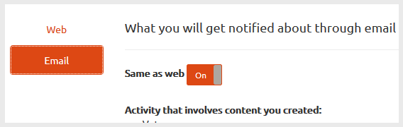

# Notificações de comunidades {#communities-notifications}

## Visão geral {#overview}

A AEM Communities fornece uma seção de notificações que exibe eventos de interesse para o membro da comunidade conectado.

As notificações são semelhantes a [atividade](essentials-activities.md) e [subscrição](subscriptions.md), uma vez que podem resultar de

* O conteúdo de publicação do membro
* O membro que escolheu seguir outro membro
* O membro optou por seguir tópicos específicos, artigos e outros segmentos de conteúdo

O que distingue as notificações do atividade e do subscrição é

* Um link para a seção de notificações está sempre presente no cabeçalho de um site da comunidade
   * As atividades exigem que [função de fluxo de atividade](functions.md#activity-stream-function) seja incluída na estrutura do site da comunidade
   * O Subscrição exige [configuração de e-mail](email.md)
* A implementação de notificações é feita por meio de canais escaláveis e conectáveis
   * As atividades só estão disponíveis na Web
   * As subscrições só estão disponíveis por email

A partir de Communities [FP1](deploy-communities.md#latestfeaturepack), os canais de notificação disponíveis são

* O canal da Web, acessado usando o link `Notifications`
* O canal de email, disponível quando o email está configurado corretamente

Os futuros canais são móveis e desktops.

### Requisitos {#requirements}

**Configurar email**

O e-mail deve ser configurado para que o canal de e-mail possa receber notificações.

Para obter instruções sobre como configurar o email, consulte [Configuração do Email](analytics.md).

**Habilitar Seguir**

Os componentes devem ser configurados para permitir o seguinte. Os recursos que permitem o seguinte são [blog](blog-feature.md), [fórum](forum.md), [QnA](working-with-qna.md), [calendário](calendar.md), [filelibrary](file-library.md) e [comentários](comments.md).

Observe que

* Os componentes usados nos [modelos de site](sites.md) e [modelos de grupo](tools-groups.md) da comunidade já podem ser configurados para permitir o seguinte

* Os perfis membros já estão configurados para permitir que outros membros sigam

## Notificações do seguinte {#notifications-from-following}

O botão **Seguir** fornece um meio de seguir as entradas como atividades, subscrições e/ou notificações. Sempre que o botão **Seguir** for selecionado, é possível ativar ou desativar uma seleção. A seleção `Email Subscriptions` só está presente quando configurada.

Se algum método do seguinte for selecionado, o texto do botão mudará para **Seguindo**. Para conveniência, é possível selecionar `Unfollow All` para desativar todos os métodos.

O botão **Seguir** será exibido

* Ao exibir o perfil de outro membro
* Em uma página principal de recursos, como fóruns, QnA e blogs
   * Segue toda a atividade desse recurso geral
* Para uma entrada específica, como um tópico do fórum, uma pergunta de QnA ou um artigo do blog
   * Segue toda a atividade para essa entrada específica

## Gerenciando configurações de notificação {#managing-notification-settings}

Ao selecionar o link Configurações de notificação na página Notificações, é possível que cada membro gerencie como as notificações são recebidas.

O canal da Web está sempre ativado.

O canal de e-mail, que depende da [configuração adequada do e-mail](email.md), fornece as mesmas configurações do canal da Web.

O canal de email está desativado por padrão.

Pode ser ativado por um membro, mas ainda depende do email que está sendo configurado.

## Visualizar notificações {#viewing-notifications}

### Notificações da Web {#web-notifications}

Um [assistente criou o site da comunidade](sites-console.md) agora inclui um link para o recurso `Notifications` na barra de cabeçalho do site acima do banner. Ao contrário das mensagens, as notificações são criadas para cada site da comunidade, enquanto as mensagens devem ser ativadas durante o processo de criação do site.

Ao visitar o site publicado, selecionar o link `Notifications` exibirá todas as notificações do membro.

### Notificações por email {#email-notifications}

Quando o canal de email é ativado, o membro recebe um email que contém um link para o conteúdo da Web.

