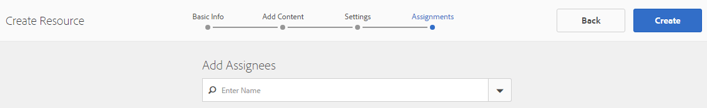
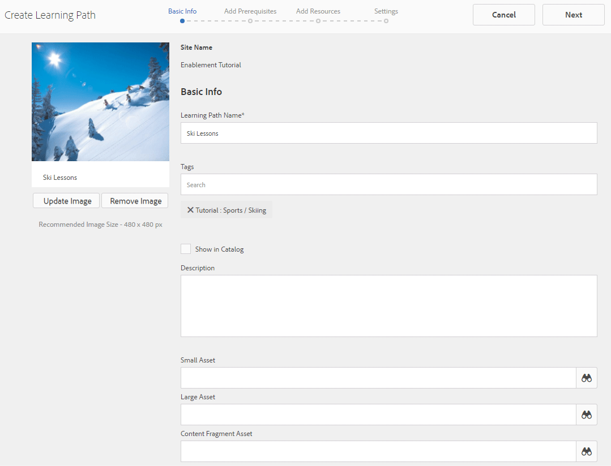

# Criar e atribuir recursos de habilitação {#create-and-assign-enablement-resources}

>[!CAUTION]
>
>AEM 6.4 chegou ao fim do suporte estendido e esta documentação não é mais atualizada. Para obter mais detalhes, consulte nossa [períodos de assistência técnica](https://helpx.adobe.com/br/support/programs/eol-matrix.html). Encontre as versões compatíveis [here](https://experienceleague.adobe.com/docs/).

## Adicionar um recurso de ativação {#add-an-enablement-resource}

Para adicionar um recurso de ativação ao novo site da comunidade:

* Na instância do autor
   * Por exemplo, [http://localhost:4502/](http://localhost:4503/)
* Fazer logon como administrador do sistema
* Na navegação global, selecione **Comunidades > [Recursos](resources.md)**

   
   
* Selecione o site da comunidade ao qual os recursos de ativação estão sendo adicionados
   * Selecionar `Enablement Tutorial`
* No menu, selecione ` Create`
* Selecionar **[!UICONTROL Recurso]**

### Informações básicas {#basic-info}

Preencha as informações básicas do Recurso:

* **[!UICONTROL Nome do site]**: defina para o nome do site da comunidade selecionado: Tutorial de ativação
* **[!UICONTROL Nome do Recurso &amp;;]**: Lição de Esqui 1
* **[!UICONTROL Tags]**: Tutorial: Esportes / Esqui
* **[!UICONTROL Mostrar no catálogo]**: Ligado
* **[!UICONTROL Descrição]**: Deslizando sobre a neve para os principiantes
* **[!UICONTROL Adicionar imagem]**: Adicionar uma imagem para representar o Recurso ao membro na exibição Atribuições
   
* Selecione **[!UICONTROL Próximo]**

### Adicionar conteúdo {#add-content}

Embora pareça que vários Recursos podem ser selecionados, somente um é permitido.

Selecione o `'+' icon`, no canto superior direito, para iniciar o processo de escolha do Recurso identificando a fonte.

 

Faça upload de um recurso. Se um recurso de vídeo, faça o upload de uma imagem personalizada para exibição antes que o vídeo comece a ser reproduzido ou permita que uma miniatura seja gerada a partir do vídeo (pode levar alguns minutos - não é necessário aguardar).

* select **[!UICONTROL Próximo]**

### Configurações {#settings}

* **[!UICONTROL Configurações sociais]**
Deixe as configurações padrão para experimentar comentários e avaliações dos recursos de ativação pelos alunos.
* **[!UICONTROL Data de vencimento]**

   *(Opcional)* Pode ser selecionada uma data até à qual a atribuição deve ser concluída.
* **[!UICONTROL Autor do recurso]**

   *(Opcional)* Deixe em branco.
* **[!UICONTROL Contato do Recurso &amp;;]**

   *(Obrigatório)* Use o menu suspenso para selecionar o membro `Quinn Harper`.
* **[!UICONTROL Especialista de recurso]**

   *(Opcional)* Deixe em branco.
   **Observação**: se os usuários ou grupos não estiverem visíveis, verifique se eles foram adicionados à variável `Community Enable Members` grupo e *Salvo* na instância de publicação.
   
* Selecione **[!UICONTROL Próximo]**

### Atribuições {#assignments}

* **[!UICONTROL Adicionar destinatários]**
Deixe indefinido, pois esse recurso de ativação será adicionado a um caminho de aprendizado. Se um aluno for atribuído ao recurso de ativação individual, bem como a um LearningPath contendo o recurso de ativação, o aluno será atribuído ao recurso de ativação duas vezes.

* Selecione **[!UICONTROL Criar]**

A criação bem-sucedida do Recurso retorna ao console Recursos com o Recurso recém-criado selecionado. Nesse console, é possível publicar, adicionar alunos e alterar outras configurações.

Para fazer upload de uma nova versão do recurso de ativação, é recomendável criar um novo recurso e, em seguida, cancelar a inscrição dos membros da versão antiga e inscrevê-los na nova versão.

### Publicar o recurso {#publish-the-resource}

Antes de os Inscritos poderem ver o Recurso atribuído, eles devem ser publicados:

* Selecione o mundo `Publish`ícone

A ativação é confirmada com uma mensagem de sucesso:

## Adicionar um segundo recurso de ativação {#add-a-second-enablement-resource}

Repita as etapas acima para criar e publicar um segundo recurso de ativação relacionado do qual um caminho de aprendizado será criado.

**Publicar** o segundo recurso.

Retorne à lista Tutorial de ativação de Recursos.

*Dica: se ambos os recursos não estiverem visíveis, atualize a página.*

## Adicionar um caminho de aprendizado {#add-a-learning-path}

Um caminho de aprendizagem é um agrupamento lógico de recursos de ativação que formam um curso.

* No console Recursos, selecione `+ Create`
* Selecionar **[!UICONTROL Caminho de aprendizado]**

Adicione o **[!UICONTROL Informações básicas]**:

* **[!UICONTROL Nome do caminho de aprendizado]**: Lições de Esqui
* **[!UICONTROL Tags]**: Tutorial: Esqui
* **[!UICONTROL Mostrar no catálogo]**: deixar desmarcado
* **[!UICONTROL Fazer upload de uma imagem]** para representar o caminho de aprendizagem no console Recursos

* Selecione **[!UICONTROL Próximo]**

Pule o próximo painel, pois não há caminhos de aprendizado de pré-requisito para adicionar.

* Selecione **[!UICONTROL Próximo]**

No painel Adicionar recursos

* Selecionar `+ Add Resources` para selecionar os 2 recursos de lesões de esqui a serem adicionados ao caminho de aprendizado

   Observação: Somente **publicado** Os recursos serão selecionáveis.

>[!NOTE]
>
>Você só pode selecionar os recursos disponíveis no mesmo nível que o caminho de aprendizagem. Por exemplo, para um caminho de aprendizado criado em um grupo, somente os recursos de nível de grupo estão disponíveis; para um caminho de aprendizado criado em um site da comunidade, os recursos nesse site estão disponíveis para adição ao caminho de aprendizado.

* Selecione **[!UICONTROL Enviar]**.

 

* Selecione **[!UICONTROL Próximo]**

* **[!UICONTROL Adicionar destinatários]**
Use o menu suspenso para selecionar a variável 
`Community Ski Class` grupo, que deve incluir membros `Riley Taylor` e `Sidney Croft.`

* **[!UICONTROL Contato do Caminho de Aprendizagem &amp;;]**

   *(Obrigatório)* Use o menu suspenso para selecionar o membro `Quinn Harper`.

* Selecione **[!UICONTROL Criar]**

A criação bem-sucedida do caminho de aprendizado retorna ao console Recursos com o caminho de aprendizado recém-criado selecionado. Nesse console, é possível publicar, adicionar alunos e alterar outras configurações.

**Publicar** o caminho de aprendizado.
