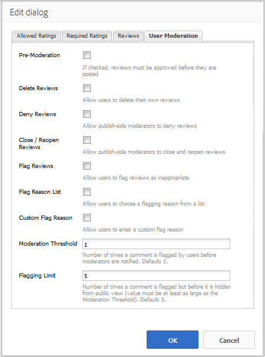

# Usando o Resumo de Revisões e Revisões (Exibição) {#using-reviews-and-reviews-summary-display}

O componente `Reviews`é um composto de [ `Comments`](comments.md) e [ `Rating`](rating.md) componentes prontos para uso.

O componente `Reviews Summary (Display)` fornece um resumo de uma instância ativa ou fechada de um componente `Reviews` para exibição em outro lugar do site.

>[!NOTE]
>
>Não há suporte para a publicação anônima de uma revisão. Os visitantes do site devem se registrar (tornar-se um membro) e fazer logon para participar. O visitante conectado pode atualizar sua revisão a qualquer momento.

## Adicionar uma revisão a uma página {#adding-a-review-to-a-page}

Para adicionar um componente `Reviews` a uma página no modo de autor, use o navegador de componentes para localizar `Communities / Reviews` e arraste-o para o lugar em uma página, como uma posição relativa ao recurso que os usuários devem revisar.

Para obter as informações necessárias, visite [Informações básicas sobre componentes das comunidades](basics.md).

Quando as [bibliotecas do lado do cliente necessárias](reviews-basics.md#essentials-for-client-side) forem incluídas, será assim que o componente `Reviews`aparecerá.

## Configurando revisões {#configuring-reviews}

Selecione o componente `Reviews` inserido para acessar e selecione o ícone `Configure` que abre a caixa de diálogo de edição.

Na guia **[!UICONTROL Classificações permitidas]**, especifique a lista completa de classificações a serem mostradas aos membros. A primeira notação deve ser uma notação geral/global, uma vez que é a notação que fornece a notação média para o componente `Review Summary (Display)`. As próximas duas classificações na configuração padrão devem receber um título diferente de &quot;Subrating 1&quot; ou &quot;Subrating 2&quot;.

* **[!UICONTROL Classificações permitidas]**

   Uma lista de classificações da qual um membro pode escolher.

   Use a seta para cima, a seta para baixo e os botões para excluir para modificar as seleções visíveis.

   Clique em **[!UICONTROL Adicionar Item]** para adicionar outra opção de classificação.

Na guia **[!UICONTROL Classificações necessárias]**, digite novamente os itens da lista de **[!UICONTROL Classificações permitidas]** que precisam ser classificados. Se um item for especificado apenas na guia Classificações permitidas, ele poderá ficar desmarcado quando submetido pelo membro.

No site, as classificações necessárias são marcadas com um asterisco. Se um item for obrigatório e não estiver marcado, uma mensagem será exibida para o membro e o envio será negado até que todas as classificações necessárias sejam marcadas.

* **[!UICONTROL Classificações necessárias]**

   Um subconjunto de classificações permitidas, indicando quais classificações são necessárias.

   Use a seta para cima, a seta para baixo e os botões para excluir para modificar as seleções visíveis.

   Clique em **[!UICONTROL Adicionar Item]** para adicionar outra opção de resposta.

>[!NOTE]
>
>Se um item for inserido na guia **[!UICONTROL Classificações Obrigatórias]** que não está especificada na guia **[!UICONTROL Classificações Permitidas]**, então ele não será incluído nos itens para classificar.

Na guia **[!UICONTROL Revisões]**, especifique como as revisões serão tratadas.

* **[!UICONTROL Permitir]**
respostasSe marcada, permita respostas a revisões. O padrão está desmarcado.

* ****
FechadoSe marcado, a revisão será fechada para novas revisões e respostas. O padrão está desmarcado.

* **[!UICONTROL Permitir]**
uploads de arquivoSe marcada, permita que os anexos de arquivo sejam carregados para a revisão. O padrão está desmarcado.

* **[!UICONTROL Tamanho máx.]**
do arquivoRelevante somente se a opção  **[!UICONTROL Permitir]** upload de arquivo estiver marcada. Este campo limita o tamanho (em bytes) de um arquivo carregado. O padrão é 10 MB.

* **[!UICONTROL Extensão Máx. da MensagemNúmero máximo de caracteres que podem ser inseridos na caixa de texto.]**
O padrão é 4096 caracteres.

* **[!UICONTROL Tipos de arquivo permitidosRelevant somente se]**
Permitir  **** upload de arquivo estiver marcado. Uma lista separada por vírgulas de extensões de arquivo com o separador &quot;ponto&quot;. Por exemplo: .jpg, .jpeg, .png, .doc, .docx, .pdf. Se algum tipo de arquivo for especificado, os não especificados não serão permitidos. O padrão não é especificado, de modo que todos os tipos de arquivos sejam permitidos.

* **[!UICONTROL Rich Text]**
EditorSe marcada, as publicações podem ser inseridas com marcação. O padrão está desmarcado.

* **[!UICONTROL Permitir]**
votaçãoSe marcada, inclua o recurso de votação para um tópico. O padrão está desmarcado.

Na guia **[!UICONTROL Moderação do usuário]**, especifique como as revisões publicadas serão gerenciadas. Para obter mais informações, consulte [Moderação de conteúdo gerado pelo usuário](moderate-ugc.md).

* **[!UICONTROL Pré-]**
moderaçãoSe marcada, as revisões devem ser aprovadas antes de serem exibidas em um site de publicação. O padrão está desmarcado.

* **[!UICONTROL Excluir]**
revisõesSe marcada, o membro que publicou a revisão terá a capacidade de excluí-la. O padrão está desmarcado.

* **[!UICONTROL Negar]**
revisõesSe marcada, permita que os moderadores neguem revisões. O padrão está desmarcado.

* **[!UICONTROL Fechar / Reabrir]**
revisõesSe marcada, permita que os moderadores fechem e reabram as revisões. O padrão está desmarcado.

* **[!UICONTROL Sinalizar]**
revisõesSe marcada, permita que os membros sinalizem revisões como inadequadas. O padrão está desmarcado.

* **[!UICONTROL Sinalizar]**
lista de motivosSe estiver marcada, permita que os membros escolham, em uma lista suspensa, o motivo para sinalizar uma revisão como inadequada. O padrão está desmarcado.

* **[!UICONTROL Motivo do sinalizador personalizadoSe estiver marcado, permita que os membros informem seu próprio motivo para marcar uma revisão como inadequada.]**
O padrão está desmarcado.

* **[!UICONTROL Limiar de moderaçãoInsira o número de vezes que uma revisão deve ser sinalizada pelos membros antes que os moderadores sejam notificados.]**
O padrão é uma vez (1).

* **[!UICONTROL Limite]**
de sinalizaçãoInsira o número de vezes que uma revisão deve ser sinalizada antes de ser ocultada da visualização pública. Esse número deve ser maior ou igual ao **[!UICONTROL Limite de moderação]**. O padrão é 5.

### Adicionar um Resumo da Revisão (Exibição) a uma Página {#adding-a-review-summary-display-to-a-page}

Para adicionar um componente `Reviews Summary (Display)` a uma página no modo de autor, localize o componente

* `Communities / Reviews Summary (Display)`

e arraste-o para o lugar em uma página onde um resumo de uma revisão ativa ou fechada deve ser exibido.

Para obter as informações necessárias, visite [Informações básicas sobre componentes das comunidades](basics.md).

Quando as [bibliotecas do lado do cliente necessárias](reviews-basics.md#essentials-for-client-side) forem incluídas, será assim que o componente `Reviews Summary (Display)`aparecerá.

>[!NOTE]
>
>A &quot;Média&quot; reflete os votos do primeiro item listado nas guias Classificações Permitidas da revisão que está sendo resumida.

### Configuração do Resumo das Revisões (Exibição) {#configuring-reviews-summary-display}

Selecione o componente `Reviews Summary (Display)` inserido para acessar e selecione o ícone `Configure` que abre a caixa de diálogo de edição.

Na guia **[!UICONTROL Resumo da revisão]**

* `Review Path`

   digite ou navegue até a instância colocada do componente `reviews`para resumir, por exemplo, se adicionado à Página da Web do [site de participação no Geometrixx,](getting-started.md) o caminho seria:

   /content/sites/contact/br/page/jcr:content/content/Primary/views

* `Include histogram`

   Se marcada, inclua a exibição de um gráfico de barras indicando quantos de cada classificação de estrela existem nas revisões que estão sendo resumidas. O padrão está desmarcado.

### Alteração para um Tipo de Revisão Personalizada {#changing-to-a-custom-review-type}

O componente Revisões usa o Sistema de comentários.

Ao alterar o Tipo de recurso de comentário, o sistema de comentários não gerará mais uma instância de um comentário usando o padrão, mas uma que foi personalizada (estendida) pelos desenvolvedores.

Quando os tipos de recursos personalizados forem conhecidos, digite [Modo de design](../../help/sites-authoring/default-components-designmode.md) e clique no duplo no componente `Comments` inserido para abrir uma caixa de diálogo com uma guia adicional.

Na guia **[!UICONTROL Tipos de recurso]**, especifique o resourceType personalizado para novas instâncias dos componentes `Comments or Voting`:

* **[!UICONTROL Tipo de recursos de comentários]**

   Navegue até resourceType de um componente `comment`estendido (comentário único) em /apps. Por exemplo, `/apps/social/commons/components/hbs/comments/comment`

   Esse recurso identificará o resourceType do UGC criado quando um visitante postar um comentário.

* **[!UICONTROL Tipo de recursos para pesquisa]**

   Navegue até resourceType de um componente `voting`estendido em /apps. Por exemplo, `/apps/social/components/hbs/voting`

   Esse recurso identificará o tipo de recurso do UGC criado quando um visitante postar um voto.

* **[!UICONTROL Tipo de recurso do sistema de comentários]**

   Navegue até resourceType de um componente `comments`estendido (Sistema de comentários) em /apps. Deixe em branco, a menos que o modelo de página [inclua dinamicamente](scf.md#add-or-include-a-communities-component) o Sistema de comentários no script subjacente em vez de ser adicionado à página como um recurso (nó de comentários). Saiba mais lendo sobre o auxiliar [{{include}}](handlebars-helpers.md#include)

## Experiência de Visitante do site {#site-visitor-experience}

### Moderadores e administradores {#moderators-and-administrators}

Quando o usuário conectado tem privilégios de moderador ou administrador, ele pode executar as tarefas de moderação permitidas pela configuração do componente, independentemente de quem criou a revisão.

### Membros {#members}

Quando o visitante do site estiver conectado, dependendo da configuração, eles poderão

* Publicar uma nova revisão
* Editar sua própria revisão
* Excluir sua própria revisão
* Sinalizar comentários de revisão de outras pessoas

Somente uma classificação por membro é permitida. O membro pode alterar a sua notação a qualquer momento.

### Anônimo {#anonymous}

Os visitantes do site que não estão conectados só podem ler revisões publicadas, traduzi-las se suportadas, mas não podem adicionar uma classificação ou uma revisão, nem sinalizar comentários de revisão de outras pessoas.

## Informações adicionais {#additional-information}

Mais informações podem ser encontradas na página [Analisar Essentials](reviews-basics.md) para desenvolvedores.

Para moderação de comentários publicados, consulte [Moderação de conteúdo gerado pelo usuário](moderate-ugc.md).

Para obter a tradução de comentários postados, consulte [Traduzindo conteúdo gerado pelo usuário](translate-ugc.md).
