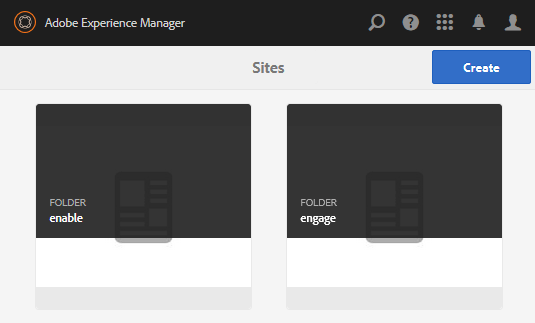

# Console de sites das comunidades {#communities-sites-console}

O console Sites das Comunidades fornece acesso a:

* Criação de sites
* Edição de site
* Gerenciamento de sites
* [Criação e edição de grupos](groups.md)  aninhados (subcomunidades)

Consulte [Introdução ao AEM Communities](getting-started.md) para saber quão rapidamente um site da comunidade pode ser criado no ambiente do autor, bem como como como criar grupos da comunidade a partir dos ambientes do autor e publicação.

>[!NOTE]
>
>Os menus principais Comunidades para a criação de [sites da comunidade](sites-console.md), [modelos de site da comunidade](sites.md), [modelos de grupo da comunidade](tools-groups.md) e [funções da comunidade](functions.md) são destinados a serem usados apenas no ambiente do autor.

## Pré-requisitos {#prerequisites}

Antes de criar um site da comunidade, é *necessário* para:

* Verifique se uma ou mais instâncias de publicação estão em execução
* Ative o [serviço de túnel](deploy-communities.md#tunnel-service-on-author) para gerenciar membros e grupos de membros
* Identifique o [editor principal](deploy-communities.md#primary-publisher)
* [Configure a ](deploy-communities.md#replication-agents-on-author) replicação quando a porta do editor principal não for o padrão (4503)

A prática recomendada, para garantir que o site esteja preparado para suportar muitos recursos, é executar as seguintes etapas:

* Instale o [pacote de recursos mais recente](deploy-communities.md#latestfeaturepack)
* Habilitar [Adobe Analytics](analytics.md) para AEM Communities
* Configurar [email](email.md)
* Identifique [Administradores da comunidade](users.md#creating-community-members)
* [Habilitar o ](social-login.md#adobe-granite-oauth-authentication-handler) manipulador OAuth para logon social

## Acesso ao console Sites das Comunidades {#accessing-communities-sites-console}

No ambiente do autor, para acessar o console Sites das Comunidades:

* Da navegação global: **[!UICONTROL Comunidades > Sites]**

O console Sites das Comunidades exibe todos os sites existentes da comunidade. Desse console, os sites da comunidade podem ser criados, editados, gerenciados e excluídos.

Para criar um novo site da comunidade, selecione o ícone **Criar**.

Para acessar um site da comunidade existente, com o objetivo de criar, modificar, publicar, exportar ou adicionar um grupo aninhado, selecione o ícone de pasta dos sites.

Por exemplo, a imagem a seguir mostra o console Sites das Comunidades principais exibindo as pastas de dois sites da comunidade: [enable](getting-started-enablement.md) e [engajar](getting-started.md):

## Criação de site {#site-creation}

O console de criação de site fornece uma abordagem passo a passo para reunir recursos do site com base em [modelo de site da comunidade](sites.md) e configurações selecionadas.

Cada site criado inclui um recurso de logon, já que visitantes do site precisam fazer logon antes de postar conteúdo, enviar mensagens ou participar de um grupo. Outros recursos incluídos são perfis do usuário, mensagens, notificações, menu do site, pesquisa, temas e marca.

O processo é iniciado selecionando o botão `Create` localizado na parte superior do console Sites das Comunidades.

O processo de criação é uma série de etapas apresentadas como painéis contendo um conjunto de recursos a serem configurados (apresentados como subpainéis). É possível avançar para a etapa **Next** ou **Back** para a etapa anterior antes de confirmar o site na etapa final.

### Etapa 1: Modelo do site {#step-site-template}

No painel Modelo do site, o Título, Descrição, Raiz do site, Idioma base, Nome e Modelo do site são especificados:

* **[!UICONTROL Título]** do site da comunidade: Um título de exibição para o site.

   O título é exibido no site publicado, bem como na interface do usuário do administrador do site.

* **[!UICONTROL Descrição]** do site da comunidade: Uma descrição do site.

   A descrição não aparece no site publicado.

* **[!UICONTROL Raiz]** do site da comunidade: O caminho raiz para o site.

   A raiz padrão é `/content/sites`, mas a raiz pode ser movida para qualquer local dentro do site.

* **[!UICONTROL Idioma]** base do site da comunidade: (deixe intocado para uma única língua: Inglês) use o menu suspenso para escolher um  *ou* mais idiomas base dos idiomas disponíveis - alemão, italiano, francês, japonês, espanhol, português (Brasil), chinês (tradicional) e chinês (simplificado). Um site da comunidade será criado para cada idioma adicionado e existirá na mesma pasta do site seguindo a melhor prática descrita em [Traduzindo conteúdo para sites multilíngues](../../help/sites-administering/translation.md). A página raiz de cada site conterá uma página secundária nomeada pelo código de idioma de um dos idiomas selecionados, como &quot;en&quot; para inglês ou &quot;fr&quot; para francês.

* **[!UICONTROL Nome]** do site da comunidade: O nome da página raiz do site que aparece no URL

   * Verifique o nome pelo duplo, pois ele não é facilmente alterado depois que o site é criado
   * O URL base ( `https://*server:port/site root/site name*)` será exibido abaixo de `Community Site Name`
   * Para um URL válido, acrescente um código de idioma base + &quot;.html&quot;

      *Por exemplo*, `http://localhost:4502/content/sites/mysight/en.html`

* **[!UICONTROL Menu]** Modelo de site da comunidade: Use o menu suspenso para escolher um modelo [ de site da ](tools.md)comunidade disponível.

Selecione **[!UICONTROL Próximo]**

### Etapa 2: Design {#step-design}

O painel Design contém dois subpainéis para selecionar o tema e o banner de marca:

#### TEMA DO SITE DA COMUNIDADE {#community-site-theme}

A estrutura usa [Bootstrap do Twitter](https://twitterbootstrap.org/) para trazer um design responsivo e flexível para o site. Um dos muitos temas de Bootstrap pré-carregados pode ser selecionado para criar o estilo do modelo de site da comunidade selecionado, ou um tema de Bootstrap pode ser carregado.

Quando selecionado, o tema será sobreposto com uma marca de seleção azul opaca.

Depois que o site da comunidade é publicado, é possível [editar as propriedades](#modifying-site-properties) e selecionar um tema diferente.

#### MARCA DO SITE DA COMUNIDADE {#community-site-branding}

A marca do site da comunidade é uma imagem exibida como um cabeçalho na parte superior de cada página.

A imagem deve ser dimensionada para ser tão larga quanto a exibição esperada da página no navegador e 120 pixels de altura.

Ao criar ou selecionar uma imagem, lembre-se:

* A altura da imagem será recortada para 120 pixels medidos a partir da borda superior da imagem
* A imagem é fixada na borda esquerda da janela do navegador
* Não há redimensionamento da imagem, de modo que quando a largura da imagem for...

   * Menor que a largura do navegador, a imagem será repetida horizontalmente
   * Maior que a largura do navegador, a imagem parece estar cortada

Selecione **[!UICONTROL Próximo]**.

### Etapa 3: Configurações {#step-settings}

O painel Configurações contém vários subpainéis que apresentam recursos a serem configurados antes de passar para a última etapa para criar o site.

* [GERENCIAMENTO DE USUÁRIOS](#user-management)
* [MARCAÇÃO](#tagging)
* [FUNÇÕES](#roles)
* [MODERAÇÃO](#moderation)
* [ANALYTICS](#analytics)
* [TRADUÇÃO](#translation)
* [ATIVAÇÃO](#enablement)

>[!NOTE]
>
>**Ativar serviço de túnel**
>
>Vários subpainéis de Configurações permitem a atribuição de um membro confiável para moderar o UGC, gerenciar grupos ou ser contatos para recursos de ativação no ambiente de publicação.
>
>A convenção é que os usuários e grupos de usuários [do lado da publicação](users.md) (membros e grupos de membros) não sejam duplicados no ambiente do autor.
>
>Assim, ao criar o site da comunidade no ambiente do autor e atribuir membros confiáveis a várias funções, é necessário recuperar dados de membros do ambiente de publicação.
>
>Isso é feito habilitando ` [AEM Communities Publish Tunnel Service](deploy-communities.md#tunnel-service-on-author)`para o ambiente do autor.

#### GERENCIAMENTO DE USUÁRIOS {#user-management}

>[!NOTE]
>
>Recomenda-se que [ative sites da comunidade](overview.md#enablement-community) sejam privados (entre em contato com seu representante de conta para obter mais informações).
>
>Um site da comunidade é privado quando visitantes anônimos do site têm acesso negado, podem não se inscrever e podem não usar o login social.

* **[!UICONTROL Permitir registro do usuário]**

   Se marcada, os visitantes do site podem se tornar membros da comunidade por autoinscrição.

   Se desmarcada, o site da comunidade é *restrito* e os visitantes do site devem ser atribuídos ao grupo de membros do site da comunidade, fazer uma solicitação ou receber um convite por email. Se desmarcada, o acesso anônimo não deve ser permitido.

   Desmarque um site da comunidade *private*. O padrão está marcado.

* **[!UICONTROL Permitir acesso anônimo]**

   Se marcada, o site da comunidade é *open* e qualquer visitante do site pode acessar o site.

   Se não estiver marcada, somente os membros conectados poderão acessar o site.

   Desmarque um site da comunidade *private*. O padrão está marcado.

* **[!UICONTROL Ativar mensagens]**

   Se marcada, os membros podem enviar mensagens entre si e para o grupo no site da comunidade.

   Se desmarcada, as mensagens não são configuradas para a comunidade.

   O padrão está desmarcado.

* **[!UICONTROL Permitir logons sociais: Facebook]**

   Se marcada, permita que os visitantes do site façam logon com suas credenciais de conta do Facebook. A [configuração de nuvem do Facebook](social-login.md#create-a-facebook-connect-cloud-service) selecionada deve ser configurada para adicionar usuários ao grupo de membros do site da comunidade depois que o site da comunidade for criado.

   Se desmarcada, nenhum logon do Facebook será apresentado.

   Deixe desmarcada para um *site privado* site da comunidade. O padrão está desmarcado.

* **[!UICONTROL Permitir logons sociais: Twitter]**

   Se marcada, permita que visitantes do site façam logon com suas credenciais de conta do Twitter. A [configuração de nuvem do Twitter](social-login.md#create-a-twitter-connect-cloud-service) selecionada deve ser configurada para adicionar usuários ao grupo de membros do site da comunidade assim que o site da comunidade for criado.

   Se desmarcada, nenhum logon do Twitter será apresentado.

   Deixe desmarcada para um *site privado* site da comunidade. O padrão está desmarcado.

>[!NOTE]
>
>**[!UICONTROL Permitir logons sociais]**
>
>Embora a amostra de configurações do Facebook e do Twitter possa existir e ser selecionada, para um [ambiente de produção](../../help/sites-administering/production-ready.md), é necessário criar aplicativos personalizados do Facebook e do Twitter. Consulte [Logon social com Facebook e Twitter](social-login.md).

#### MARCANDO {#tagging}

As tags que podem ser aplicadas ao conteúdo da comunidade são controladas selecionando Namespaces de tags definidas anteriormente pelo [Console de marcação](../../help/sites-administering/tags.md#tagging-console).

Além disso, selecionar namespaces de tags para o site da comunidade limita a seleção apresentada ao definir catálogos e recursos. Consulte [Marcando recursos de ativação](tag-resources.md) para obter informações importantes.

* Caixa de pesquisa de texto: Digitação de start para identificar tags que podem ser usadas no site

#### ROLES {#roles}

As [funções dos membros da comunidade](users.md) são atribuídas com estas definições.

Encontrar membros da comunidade é fácil usar a busca antecipada por tipos.

* **[!UICONTROL Gerentes da comunidade]**

   Digitação de start para selecionar um ou mais membros da comunidade ou grupos de membros que podem gerenciar membros da comunidade e grupos de membros.

* **[!UICONTROL Moderadores da comunidade]**

   Digitação de start para selecionar um ou mais membros da comunidade ou grupos de membros que devem ser confiáveis como moderadores de conteúdo gerado pelo usuário.

* **[!UICONTROL Membros privilegiados da comunidade]**

   Digitação de start para selecionar um ou mais membros da comunidade ou grupos de membros que terão a capacidade de criar novo conteúdo quando `Allow Privileged Member` for selecionado para uma [função da comunidade](functions.md).

#### MODERAÇÃO {#moderation}

A configuração global para moderar o conteúdo gerado pelo usuário (UGC) é controlada por essas configurações. Os componentes individuais têm configurações adicionais para controlar a moderação.

* **[!UICONTROL O conteúdo é pré-moderado]**

   Se marcada, o conteúdo da comunidade publicado não será exibido até ser aprovado por um moderador. O padrão está desmarcado. Para obter mais informações, consulte [Moderação do conteúdo da comunidade](moderate-ugc.md#premoderation).

* **[!UICONTROL Sinalização de limite antes do conteúdo estar oculto]**

   Se for maior que 0, o número de vezes que um tópico ou publicação deve ser sinalizado antes de ser ocultado da visualização pública. Se definido como -1, o tópico sinalizado ou a postagem nunca será ocultado da visualização pública. O padrão é 5.

#### ANALYTICS {#analytics}

* **[!UICONTROL Ativar Analytics]**

   Disponível somente quando o Adobe Analytics foi [configurado](analytics.md) para recursos de Comunidades.

   O padrão está desmarcado. Quando marcado, um menu de seleção adicional é exibido:

* **[!UICONTROL Referências de estrutura da configuração da nuvem]**

   No menu suspenso, selecione a estrutura de serviço em nuvem do Analytics configurada para este site da comunidade.

   `Communities`é o exemplo de estrutura da documentação Configuração do  [Analytics para ](analytics.md#aem-analytics-framework-configuration) recursos das comunidades.

#### TRADUÇÃO {#translation}

* **[!UICONTROL Permitir]**
tradução automática Quando marcada (o padrão está desmarcado), a tradução automática está ativada para UGC dentro do site. Isso não afeta nenhum outro conteúdo, como o conteúdo da página, mesmo se o site estiver configurado como um site multilíngue. Consulte [Traduzindo conteúdo gerado pelo usuário](translate-ugc.md) para obter informações sobre como configurar um serviço de tradução licenciado para AEM Communities. Consulte [Traduzindo conteúdo para sites multilíngues](../../help/sites-administering/translation.md) para obter uma visão geral completa.

* **[!UICONTROL Ativar a Tradução automática para os idiomas selecionados]**

   Os idiomas habilitados para tradução automática são definidos como padrão para a configuração do sistema especificada pela [configuração de integração de tradução](translate-ugc.md#translation-integration-configuration). Essas configurações padrão podem ser substituídas para este site, excluindo padrões e/ou selecionando outros idiomas no menu suspenso.

* **[!UICONTROL Escolher o provedor de tradução]**

   Por padrão, o provedor de serviço é um serviço de avaliação que usa `microsoft`apenas para demonstração. Se nenhum provedor de serviço de tradução estiver licenciado, **Permitir tradução automática** deverá estar desmarcada.

* **[!UICONTROL Escolher armazenamento global compartilhado]**

   Para um site com várias cópias de idioma, uma loja compartilhada global fornece um único thread de conversação, visível a partir de cada cópia de idioma. Isso é feito selecionando um dos idiomas incluídos como uma cópia de idioma. O padrão é *Nenhum armazenamento compartilhado global*.

* **[!UICONTROL Escolher a configuração do provedor de tradução]**

   Escolha uma [estrutura de integração de tradução](../../help/sites-administering/tc-tic.md) criada para o provedor de tradução licenciado.

* **Selecione as opções de tradução para seu site da comunidade**

   * **[!UICONTROL Traduzir a página inteira]**

      Se selecionado, todo o UGC em uma página é traduzido para o idioma base da página.

      O padrão é *não selecionado*.

   * **[!UICONTROL Traduzir somente a seleção]**

      Se selecionada, uma opção de tradução será exibida ao lado de cada postagem, permitindo que postagens individuais sejam traduzidas para o idioma base da página.

      O padrão é *seleted*.

* **Selecionar as opções de persistência**

   * **[!UICONTROL Traduzir as contribuições a pedido do usuário e continuar posteriormente]**

      Se selecionado, o conteúdo não é traduzido até que uma solicitação seja feita. Depois de traduzida, a tradução é armazenada no repositório.

      O padrão é *não selecionado*.

   * **[!UICONTROL Não continuar com as traduções]**

      Se selecionado, as traduções não são armazenadas no repositório.

      Se não for selecionado, as traduções serão mantidas.

      O padrão é *não selecionado*.

* **[!UICONTROL Renderização]**
inteligenteSelecione um dos

   * `Always show contributions in the original language` (default)
   * `Always show contributions in user preferred language`
   * `Show contributions in user preferred language for only logged-in users`

#### ATIVAÇÃO {#enablement}

As configurações `ENABLEMENT`são aplicáveis quando o modelo de site de comunidade escolhido inclui a [função de atribuições](functions.md#assignments-function), que está disponível quando os recursos de ativação estão licenciados e [configurados](enablement.md). O modelo do site de referência que inclui a função de atribuições é `Reference Structured Learning Site Template.`

* **[!UICONTROL Gerentes de ativação]**

   (obrigatório) Somente membros do grupo `Community Enablementmanagers` estão disponíveis para serem selecionados para gerenciar essa comunidade de ativação. Os gerentes de ativação são responsáveis por atribuir membros aos recursos. Consulte também [Gerenciar usuários e grupos de usuários](users.md).

* **[!UICONTROL ID da organização da Marketing Cloud]**

   (opcional) A ID de uma licença [Video Heartbeat Analytics](analytics.md#video-heartbeat-analytics).

Selecione **[!UICONTROL Próximo]**.

### Etapa 4: Criar site de comunidades {#step-create-communities-site}

Se algum ajuste for necessário, use o botão **Voltar** para fazer isso.

Quando **Create** for selecionado e iniciado, o processo de criação do site não poderá ser interrompido.

Depois que o site é criado:

* Não há suporte para a alteração do url (nome do nó)
* Alterações futuras no modelo de site da comunidade não afetarão o site da comunidade criado
* A desativação do modelo de site da comunidade não afetará o site da comunidade criado
* É possível editar [STRUCTURE](#modify-structure) de um site da comunidade modificando suas propriedades

Quando o processo é concluído, a pasta do novo site é exibida no console Sites das Comunidades, a partir do qual os autores podem adicionar conteúdo de página ou os administradores podem modificar as propriedades do site.

Para modificar um site da comunidade, selecione sua pasta de projeto para abri-lo:

Ao passar o mouse sobre um site ou tocar em um cartão de site, são exibidos ícones que permitem [editar o site no modo de autor](#authoring-site-content), [abrir as propriedades do site para modificação](#modifying-site-properties), [publicar o site](#publishing-the-site), [exportar o site](#exporting-the-site)9 e [excluir o site&lt;a>.](#deleting-the-site)

## Conteúdo do site de criação {#authoring-site-content}

O conteúdo de um site pode ser criado com as mesmas ferramentas que qualquer outro site AEM. Para abrir o site para criação, selecione o ícone `Open Site` que aparece ao passar o mouse sobre o site. O site será aberto em uma nova guia, de modo que o console Sites das Comunidades permaneça acessível.

>[!NOTE]
>
>Se não estiver familiarizado com o AEM, visualização a documentação em [manuseio básico](../../help/sites-authoring/basic-handling.md) e um [guia rápido para criar páginas](../../help/sites-authoring/qg-page-authoring.md).

## Modificando Propriedades do Site {#modifying-site-properties}

As propriedades de um site existente, especificadas durante o processo de criação do site, podem ser modificadas selecionando o ícone `Edit Site`que aparece ao passar o mouse sobre o site.

`Details of the following properties match the descriptions provided in the` [Seção ](#site-creation) Criação do site.

### Modificar Básico {#modify-basic}

O painel BASIC permite a modificação de

* Título do site da comunidade
* Descrição do site da comunidade

O Nome do Site da Comunidade não pode ser alterado.

A escolha de um modelo de site da comunidade diferente não afetaria um site da comunidade já que nenhuma conexão permanece entre modelos e sites.

Em vez disso, [STRUCTURE](#modify-structure) do site da comunidade pode ser modificado.

### Modificar estrutura {#modify-structure}

O painel ESTRUTURA permite a modificação da estrutura criada inicialmente a partir do modelo de site da comunidade selecionada. Do painel, é possível

* Arraste e solte [funções adicionais da comunidade](functions.md) na estrutura do site
* Em uma instância de uma função da comunidade na estrutura do site:

   * **`gear icon`**

      editar configurações, incluindo o título de exibição e o nome do URL;ast;

      bem como [grupos de membros privilegiados](users.md#privilegedmembersgroups)

   * **`trashcan icon`**

      remover (excluir) funções da estrutura do site

   * **`grid icon`**

      modificar a ordem das funções, conforme exibido na barra de navegação de nível superior do site

>[!NOTE]
>
>Você pode alterar a ordem de todas as funções na Estrutura do site, exceto a função na parte superior. Portanto, o home page de sites de comunidades não pode ser alterado.

>[!CAUTION]
>
>Embora o título de exibição possa ser alterado sem efeitos colaterais, não é recomendável editar o nome do URL de uma função da comunidade pertencente a um site da comunidade.
>
>Por exemplo, renomear o URL não moverá o UGC existente, com o efeito de &#39;perder&#39; o UGC.

>[!CAUTION]
>
>A função groups tem de *não* ser a função *first nem a única* função na estrutura do site.
>
>Qualquer outra função, como [função de página](functions.md#page-function), deve ser incluída e listada primeiro.

#### Exemplo: Adicionando uma função de catálogo a uma estrutura de site da comunidade {#example-adding-a-catalog-function-to-a-community-site-structure}

### Modificar Design {#modify-design}

O painel DESIGN permite que um novo tema seja aplicado:

* [Tema do site da comunidade](#community-site-theme)
* [Marca do site da comunidade](#community-site-branding)
   * Role até a parte inferior do painel para alterar a imagem da marca

### Modificar configurações {#modify-settings}

O painel CONFIGURAÇÕES permite acessar a maioria das configurações nos subpainéis da Etapa 3 da criação do site da comunidade:

* [Gerenciamento de usuários](#user-management)
* [Tags](#tagging)
* [Moderação](#moderation)
* [Funções de membro](#roles)
* [Análise](#analytics)
* [Tradução](#translation)

### Modificar miniatura {#modify-thumbnail}

O painel MINIATURA permite que uma imagem seja carregada para representar o site no console Sites das Comunidades.

### Modificar Ativação {#modify-enablement}

O painel ATIVAÇÃO permite acesso às configurações fornecidas durante a criação do site da comunidade.

Consulte a descrição [ENABLEMENT](#enablement).

## Publicar o Site {#publishing-the-site}

Depois que um site da comunidade é criado ou modificado recentemente, é possível publicar (ativar) o site selecionando o ícone `Publish Site`, que aparece ao passar o mouse sobre o site.

Haverá uma indicação depois que o site for publicado com êxito.

### Publicação com grupos aninhados {#publishing-with-nested-groups}

Depois de publicar um site da comunidade, é necessário publicar individualmente cada subcomunidade (grupo aninhado) criada usando o [console Grupos](groups.md).

## Exportar o Site {#exporting-the-site}

Selecione o ícone de exportação, ao passar o mouse sobre o site, para criar um pacote do site da comunidade que esteja armazenado em [gerenciador de pacote](../../help/sites-administering/package-manager.md) e baixado.\
Observe que o UGC não está incluído no pacote do site.

## Excluindo o Site {#deleting-the-site}

Para excluir o site da comunidade, selecione o ícone Excluir site que aparece ao passar o mouse sobre o site no console do site Comunidades. Esta ação remove todos os itens associados ao site, como UGC, grupos de usuários, ativos e registros de banco de dados.

## Grupos de usuários da comunidade criados {#created-community-user-groups}

Depois que o novo site da comunidade é publicado, os novos grupos de membros (os grupos de usuários são criados no ambiente de publicação) que têm as permissões apropriadas definidas para várias funções administrativas e de membros.

O nome criado para os grupos de membros inclui *site-name* fornecido ao site em [Etapa 1](#step13asitetemplate) (o nome que aparece no URL), bem como uma ID exclusiva para evitar conflitos com sites da comunidade e grupos que têm o mesmo nome de site para diferentes raízes de site da comunidade.

Por exemplo, se o nome fosse &quot;engajar&quot; para um site chamado &quot;Tutorial de introdução&quot;, o grupo de usuários para moderadores seria:

* Título: Moderadores de envolvimento da comunidade
* Nome: community-*engajar-uid*-moderadores

Observe que quaisquer membros com funções atribuídas como moderadores ou administradores de grupo durante a criação do site serão atribuídos ao grupo adequado, bem como atribuídos ao grupo de membros. Esses grupos e atribuições de membros são criados na publicação quando o novo site é publicado.

Para obter detalhes, consulte [Gerenciar usuários e grupos de usuários](users.md).

>[!NOTE]
>
>Se [Permitir login social: O Facebook](#user-management) é ativado, uma vez que o grupo de usuários
>
>* community-*&lt;site-name>*-*&lt;uid>* membros

for criado, o serviço de nuvem do Facebook [aplicado](social-login.md#createafacebookcloudservice) deve ser configurado para adicionar usuários a esse grupo.

## Configurar para erro de autenticação {#configure-for-authentication-error}

Por padrão, um site da comunidade será redirecionado para uma página de logon de amostra quando o usuário digitar as credenciais erradas e falhar no logon. Este exemplo de logon não estará presente em um [servidor de produção](../../help/sites-administering/production-ready.md).

Para redirecionar corretamente, depois que um site tiver sido configurado e enviado para publicação, complete estas etapas para obter a falha de autenticação para redirecionar para o site da comunidade:

* Em cada instância de publicação AEM
* Primeiro logon com privilégios de administrador
* Acesse o [Web Console](../../help/sites-deploying/configuring-osgi.md)
   * Por exemplo, [http://localhost:4503/system/console/configMgr](http://localhost:4503/system/console/configMgr)

* Localizar `Adobe Granite Login Selector Authentication Handler`
* Selecione o ícone `pencil`para abrir a configuração para edição
* Digite um **[!UICONTROL Mapeamentos de página de logon]** como segue:

   `/content/sites/<site-name>/path/to/login/page:/content/sites/<site-name>`

   por exemplo:

   `/content/sites/engage/en/signin:/content/sites/engage/en`

* Selecione **[!UICONTROL Salvar]**

### Testar redirecionamento de autenticação {#test-authentication-redirection}

Na mesma instância de publicação AEM configurada com um mapeamento de página de logon para o site da comunidade:

* Navegue até o home page do site da comunidade
   * Por exemplo, [http://localhost:4503/content/sites/engage/en.html](http://localhost:4503/content/sites/engage/en.html)

* Selecione Desconectar
* Selecione Login
* Digite credenciais obviamente incorretas, como nome de usuário &quot;x&quot; e senha &quot;x&quot;
* A página de logon deve ser exibida com um erro de &quot;logon inválido&quot;

## Acessar sites da comunidade do console Sites principais {#accessing-community-sites-from-main-sites-console}

No console de navegação global Sites, os sites da comunidade estão localizados na pasta `Community Sites`.

Embora seja possível acessar um site da comunidade dessa maneira, para tarefas administrativas, o site da comunidade deve ser acessado do console Sites das Comunidades.

