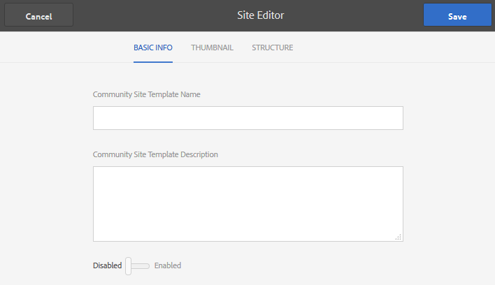

# Modelos de site {#site-templates}

>[!CAUTION]
>
>AEM 6.4 chegou ao fim do suporte estendido e esta documentação não é mais atualizada. Para obter mais detalhes, consulte nossa [períodos de assistência técnica](https://helpx.adobe.com/br/support/programs/eol-matrix.html). Encontre as versões compatíveis [here](https://experienceleague.adobe.com/docs/).

O console Modelos de site é muito semelhante ao [Modelos de grupo](tools-groups.md) , centrada em funções de interesse para grupos da Comunidade.

>[!NOTE]
>
>Os consoles para a criação de [sites da comunidade](sites-console.md), [modelos de site da comunidade](sites.md), [modelos de grupo da comunidade](tools-groups.md) e [funções da comunidade](functions.md) são para uso somente no ambiente do autor.

## Console de modelos de site {#site-templates-console}

No ambiente de criação, para acessar o console de sites da comunidade

* Na navegação global: **[!UICONTROL Ferramentas > Comunidades > Modelos do site]**

Esse console exibe os modelos a partir dos quais uma [site da comunidade](sites-console.md) podem ser criados e permitem a criação de novos modelos de site.

## Criar modelo de site {#create-site-template}

Para começar a criar um novo modelo de site, selecione `Create`.

Isso exibirá o painel Editor de sites , que contém três subpainéis:

### Informações básicas {#basic-info}

No painel Informações básicas , um nome, uma descrição e se o modelo está ativado ou desativado são configurados:

* **[!UICONTROL Nome do Modelo de Site da Comunidade]**
A ID do nome do modelo

* **[!UICONTROL Descrição do modelo do site da comunidade]**
A descrição do modelo

* **[!UICONTROL Desativado/Ativado]**
Um switch de alternância que controla se o modelo é referenciável

### Miniatura  {#thumbnail}

(Opcional) Selecione o ícone Fazer upload da imagem para exibir uma miniatura junto com o nome e a descrição para os criadores de sites da comunidade.

### Estrutura {#structure}

Para adicionar funções de comunidade, arraste do lado direito para a esquerda na ordem em que os links de menu do site devem aparecer. Os estilos serão aplicados ao modelo durante a criação do site.

Por exemplo, se você deseja uma página inicial, arraste a função Página da biblioteca e solte no construtor de modelos. Isso resultará na abertura da caixa de diálogo de configuração da página. Consulte a [console funções](functions.md) para obter informações sobre as caixas de diálogo de configuração.

Continue arrastando e soltando quaisquer outras funções da comunidade desejadas para um site da comunidade com base neste modelo.

A função de página fornece uma página vazia. A função de grupos fornece a capacidade de criar um site de grupo (subcomunidade) no site da comunidade.

>[!CAUTION]
>
>A função de grupos deve *not* ser *primeiro nem o único* na estrutura do site.
>
>Qualquer outra função, como a [função de página](functions.md#page-function), deve ser incluída e listada primeiro.

### Função Modelos de Grupo para Grupos {#group-templates-for-groups-function}

Ao incluir uma função de grupos no modelo do site, a configuração requer a especificação das opções de modelo de grupo permitidas quando um novo grupo é criado no ambiente de publicação.

>[!CAUTION]
>
>A função Grupos deve *not* ser *primeiro nem o único* na estrutura do site.

Ao selecionar dois ou mais modelos de grupo da comunidade, uma opção é fornecida ao administrador do grupo ao realmente criar um novo grupo na comunidade.

## Modelo de sites de edição {#edit-site-template}

Ao visualizar modelos de site no [Console de modelos de site](#site-templates-console), é possível selecionar um modelo de site existente para edição.

Esse processo fornece os mesmos painéis que [criação de um modelo de site](#create-site-template).
