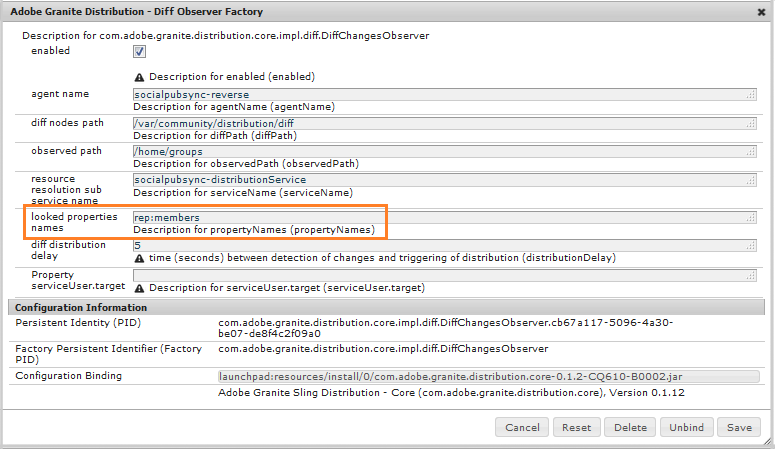
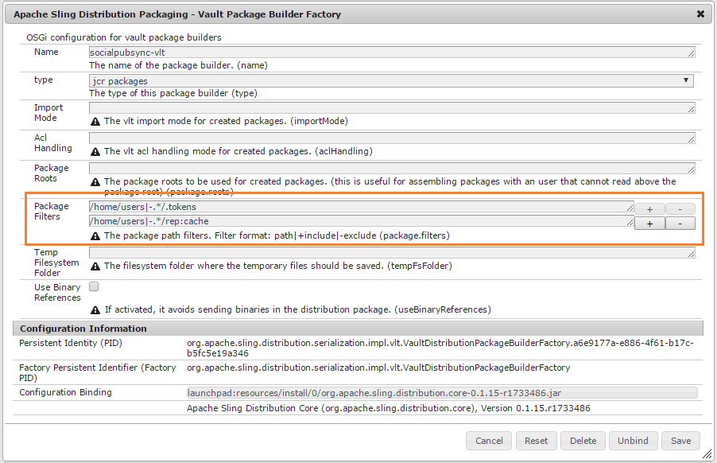

# Sincronização de usuários das comunidades {#communities-user-synchronization}

## Introdução {#introduction}

No AEM Communities, a partir do ambiente de publicação (dependendo das permissões configuradas), *visitantes do site* podem tornar-se *membros*, criar *grupos de usuários* e editar o perfil *membro*.

*Os* dados do usuário são um termo usado para se referir a  *usuários*, perfis  *do usuário e grupos*   ** de usuários.

*A* associação é um termo usado para se referir a  ** usuários registrados no ambiente publish, em vez de usuários registrados no ambiente author.

Para obter mais informações sobre os dados do usuário, visite [Gerenciar usuários e grupos de usuários](users.md).

## Sincronizando usuários em um farm de publicação {#synchronizing-users-across-a-publish-farm}

Por padrão, os dados do usuário criados no ambiente de publicação não aparecem no ambiente do autor.

A maioria dos dados do usuário criados no ambiente do autor deve permanecer no ambiente do autor e não é sincronizada nem replicada para publicar instâncias.

Quando [topology](topologies.md) for um [farm de publicação](../../help/sites-deploying/recommended-deploys.md#tarmk-farm), o registro e as modificações feitas em uma instância de publicação precisam ser sincronizados com outras instâncias de publicação. Os membros precisam fazer logon e ver seus dados em qualquer nó de publicação.

Quando a sincronização do usuário é ativada, os dados do usuário são sincronizados automaticamente entre as instâncias de publicação no farm.

### Instruções de configuração de sincronização do usuário {#user-sync-setup-instructions}

Para obter instruções detalhadas, passo a passo, sobre como ativar a sincronização em um farm de publicação, consulte

* [Sincronização do usuário](../../help/sites-administering/sync.md)

## Sincronização do usuário em segundo plano {#user-sync-in-the-background}


* **Embalagem** VLT: é um arquivo zip de todas as alterações feitas em um editor, que precisam ser distribuídas entre os editores. As alterações em um editor geram eventos que são selecionados pelo ouvinte de alteração de evento. Isso cria um pacote vlt que contém todas as alterações.

* **Embalagem** de distribuição: contém informações de distribuição para Sling. Essas são informações sobre onde o conteúdo precisa ser distribuído e quando foi distribuído por último.

## O Que Acontece Quando... {#what-happens-when}

### Publicar site do console Sites das comunidades {#publish-site-from-communities-sites-console}

No autor, quando um site da comunidade é publicado do [console Sites das Comunidades](sites-console.md), o efeito é [replicar](../../help/sites-deploying/configuring.md#replication-reverse-replication-and-replication-agents) as páginas associadas e o Sling distribuir os grupos de usuários da comunidade criados dinamicamente, incluindo sua associação.

### O usuário é criado ou edita o Perfil em Publicar {#user-is-created-or-edits-profile-on-publish}

Por padrão, os usuários e perfis criados no ambiente de publicação (por exemplo, por autoinscrição, login social, autenticação LDAP) não aparecem no ambiente do autor.

Quando a topologia for um [farm de publicação](topologies.md) e a sincronização do usuário tiver sido configurada corretamente, os *perfis do usuário* e *do usuário* serão sincronizados no farm de publicação usando a distribuição Sling.

### Novo grupo da comunidade é criado em Publicar {#new-community-group-is-created-on-publish}

Embora tenha sido iniciado a partir de uma instância de publicação, a criação de grupo da comunidade, que resulta em novas páginas do site e em um novo grupo de usuários, na verdade ocorre na instância do autor.

Como parte do processo, as novas páginas do site são replicadas para todas as instâncias de publicação. O grupo de usuários da comunidade criado dinamicamente e sua associação são Sling distribuídos para todas as instâncias de publicação.

### Usuários ou grupos de usuários são criados usando o console de segurança {#users-or-user-groups-are-created-using-security-console}

Por padrão, os dados do usuário criados no ambiente de publicação não aparecem no ambiente do autor e vice-versa.

Quando o console [Administração do usuário e Segurança](../../help/sites-administering/security.md) for usado para adicionar novos usuários no ambiente de publicação, a sincronização do usuário sincronizará os novos usuários e sua associação de grupo com outras instâncias de publicação, se necessário. A sincronização do usuário também sincronizará os grupos de usuários criados por meio do console de segurança.

### O usuário publica conteúdo na publicação {#user-posts-content-on-publish}

Para conteúdo gerado pelo usuário (UGC), os dados inseridos em uma instância de publicação são acessados por meio do [SRP](srp-config.md) configurado.

## Práticas recomendadas {#bestpractices}

Por padrão, a sincronização do usuário é **disabled**. Habilitar a sincronização do usuário envolve modificar *configurações existentes* OSGi. Nenhuma nova configuração deve ser adicionada como resultado da ativação da sincronização do usuário.

A sincronização do usuário depende do ambiente do autor para gerenciar as distribuições de dados do usuário, mesmo que os dados do usuário não sejam criados no autor.

**Pré-requisitos**

1. Se usuários e grupos de usuários já tiverem sido criados em um editor, é recomendável [sincronizar manualmente](../../help/sites-administering/sync.md#manually-syncing-users-and-user-groups) os dados do usuário para todos os editores antes de configurar e ativar a sincronização do usuário.

   Quando a sincronização do usuário estiver ativada, somente os usuários e grupos recém-criados serão sincronizados.

1. Verifique se o código mais recente foi instalado:

   * [Atualizações da plataforma AEM](https://helpx.adobe.com/br/experience-manager/kb/aem62-available-hotfixes.html)
   * [Atualizações do AEM Communities](deploy-communities.md#latestfeaturepack)

As seguintes configurações são necessárias para permitir a sincronização do usuário no AEM Communities. Certifique-se de que essas configurações estejam corretas para evitar que a distribuição do conteúdo seja reprovada.

### Apache Sling Distribution Agent - Fábrica de agentes de sincronização {#apache-sling-distribution-agent-sync-agents-factory}

Essa configuração busca o conteúdo a ser sincronizado entre os editores. A configuração está na instância Autor. O autor deve acompanhar todos os editores que estão lá e onde sincronizar todas as informações.

Os valores padrão na configuração são para uma única instância de publicação. Como a sincronização do usuário é útil para sincronizar várias instâncias de publicação, como para um farm de publicação, outras instâncias de publicação precisam ser adicionadas à configuração.

**Como o conteúdo é sincronizado?**

A instância do autor faz o ping do ponto de extremidade do exportador dos editores. Sempre que um usuário é criado ou atualizado em editores específicos (n), o Autor obtém o conteúdo dos pontos finais do exportador e [envia o conteúdo](sync.md#main-pars-image-1413756164) para outros editores (n-1, que é diferente dos editores dos quais o conteúdo é obtido).

<!--This section used to be an accordion until converted to straight Markdown. When accordions are enabled, revert-->

### Para configurar a configuração dos Apache Sling Sync Agents

Em AEM instância do autor:

1. Faça logon com privilégios de administrador.
1. Acesse o [Web Console](https://helpx.adobe.com/experience-manager/6-4/sites/deploying/using/configuring-osgi.html).

   Por exemplo, [http://localhost:4502/system/console/configMgr](http://localhost:4502/system/console/configMgr).
1. Localize **[!UICONTROL Apache Sling Distribution Agent - Sync Agents Fatory]**.

   * Selecione a configuração existente para abrir para edição (ícone de lápis).
   * Verificar nome: **`socialpubsync`.**
   * Marque a caixa de seleção **[!UICONTROL Enabled]**.
   * Selecione **[!UICONTROL Utilizar várias filas]**.
   * Especifique **[!UICONTROL Endpoints do exportador]** e **[!UICONTROL Endpoints do importador]** (você pode adicionar mais pontos finais do exportador e importador).

      Esses pontos de extremidade definem de onde você deseja obter o conteúdo e de onde deseja encaminhar o conteúdo. O autor busca o conteúdo do ponto de extremidade do exportador especificado e o envia para os editores (diferente do editor a partir do qual o conteúdo foi obtido).
   

### Distribuição de Adobe Granite - Provedor Secreto de Transporte de Senha Criptografado {#adobe-granite-distribution-encrypted-password-transport-secret-provider}

Ela permite que o autor identifique o usuário autorizado, como tendo permissão para sincronizar os dados do usuário do autor para publicar.

O [usuário autorizado criado](../../help/sites-administering/sync.md#createauthuser) em todas as instâncias de publicação ajuda os editores a se conectarem ao autor e a configurarem a distribuição Sling no autor. Este usuário autorizado tem todas as [ACLs](../../help/sites-administering/sync.md#howtoaddacl) necessárias.

Sempre que os dados devem ser instalados ou obtidos de editores, o autor se conecta com os editores usando as credenciais (nome de usuário e senha) definidas nesta configuração.

<!--This section used to be an accordion until converted to straight Markdown. When accordions are enabled, revert-->

### Para conectar o autor a editores usando um usuário autorizado

Em AEM instância do autor:

1. Faça logon com privilégios de administrador.
1. Acesse o [Web Console](../../help/sites-deploying/configuring-osgi.md).

   Por exemplo, [http://localhost:4502/system/console/configMgr](http://localhost:4502/system/console/configMgr).
1. Localize **[!UICONTROL Distribuição de Adobe Granite - Provedor Secreto de Transporte de Senha Criptografado]**.
1. Selecione a configuração existente para abrir para edição (ícone de lápis).

   Verifique a propriedade `name:` **`socialpubsync`\- `publishUser` .**
1. Defina o nome de usuário e a senha para o [usuário autorizado](../../help/sites-administering/sync.md#createauthorizeduser).

   Por exemplo, **`usersync`\-admin**

   

### Apache Sling Distribution Agent - Fábrica de agentes de fila {#apache-sling-distribution-agent-queue-agents-factory}

Essa configuração é usada para configurar os dados que você deseja sincronizar entre os editores. Quando os dados são criados/atualizados em caminhos especificados em **[!UICONTROL Raízes permitidas]**, &quot;var/community/distribution/diff&quot; é ativado e o replicador criado obtém os dados de um editor e os instala em outros editores.

<!--This section used to be an accordion until converted to straight Markdown. When accordions are enabled, revert-->

### Para configurar os dados (caminhos de nó) para sincronizar

Em AEM instância de publicação:

1. Faça logon com privilégios de administrador.
1. Acesse o [Web Console](https://helpx.adobe.com/experience-manager/6-4/sites/deploying/using/configuring-osgi.html).

   Por exemplo, [http://localhost:4503/system/console/configMgr](http://localhost:4503/system/console/configMgr).
1. Localize **[!UICONTROL Apache Sling Distribution Agent - Queue Agents Fatory]**.
1. Selecione a configuração existente para abrir para edição (ícone de lápis).

   Verificar nome: `socialpubsync` \-reverter.
1. Marque a caixa de seleção **[!UICONTROL Enabled]** e salve.
1. Especifique os caminhos de nó que devem ser replicados em **[!UICONTROL Raízes permitidas]**.
1. Repita o procedimento para cada instância `publish`.

   

### Distribuição de Adobe Granite - Fábrica de Observadores Diff {#adobe-granite-distribution-diff-observer-factory}

Essa configuração sincroniza a associação de grupo entre editores.\
Se alterar a associação de um grupo em um editor não atualizar sua associação em outros editores, verifique se **ref:Members** foi adicionado a **nomes de propriedades procuradas**.

<!--This section used to be an accordion until converted to straight Markdown. When accordions are enabled, revert-->

### Para garantir a sincronização de membros

Em cada instância de publicação AEM:

1. Faça logon com privilégios de administrador.
1. Acesse o [Web Console](https://helpx.adobe.com/experience-manager/6-4/sites/deploying/using/configuring-osgi.html).

   Por exemplo, [http://localhost:4503/system/console/configMgr](http://localhost:4503/system/console/configMgr).
1. Localize **[!UICONTROL Distribuição de Adobe Granite - Fábrica de Observadores Diff]**.
1. Selecione a configuração existente para abrir para edição (ícone de lápis).

   Verifique **[!UICONTROL nome do agente]**: `socialpubsync` \-reverso&amp;ast;&amp;ast;.
1. Marque a caixa de seleção **[!UICONTROL Enabled]**.
1. Especifique **rep`:members`** como `description` para propertyName em **[!UICONTROL nomes de propriedades procuradas]** e Save.

   

### Apache Sling Distribution Trigger - Agendamento da Fábrica de Acionadores {#apache-sling-distribution-trigger-scheduled-triggers-factory}

Essa configuração permite que você configure o intervalo de sondagem (após o qual os editores são pingados e as alterações são feitas pelo autor) para sincronizar as alterações entre os editores.

O autor pesquisa os editores a cada 30 segundos (padrão). Se algum pacote estiver presente na pasta */var/sling/distribution/packages/ socialpubsync - vlt /shared*, ele irá buscar esses pacotes e instalá-los em outros editores.

<!--This section used to be an accordion until converted to straight Markdown. When accordions are enabled, revert-->

### Alteração do intervalo de polling

Em AEM instância do autor:

1. Faça logon com privilégios de administrador.
1. Acesse o [Web Console](../../help/sites-deploying/configuring-osgi.md), por exemplo, [http://localhost:4502/system/console/configMgr](http://localhost:4502/system/console/configMgr)
1. Localize **[!UICONTROL Acionador de distribuição Apache Sling - Agendamento de fábrica de acionadores]**

   * Selecione a configuração existente para abrir para edição (ícone de lápis)
   * Verificar `Name:` **`socialpubsync`\-agendado-trigger**
   * Defina o intervalo em segundos para o intervalo desejado e salve.

   

### AEM Communities User Sync Listener {#aem-communities-user-sync-listener}

Para problemas na distribuição Sling em que há uma discrepância no subscrição e seguintes, verifique se as seguintes propriedades nas configurações **[!UICONTROL AEM Communities User Sync Listener]** estão definidas:

* NodeTypes
* IgnorableProperties
* IgnorableNodes
* DistributedFolders

<!--This section used to be an accordion until converted to straight Markdown. When accordions are enabled, revert-->

### Para sincronizar subscrições, seguidores e notificações

Em cada instância de publicação AEM:

1. Faça logon com privilégios de administrador.
1. Acesse o [Web Console](../../help/sites-deploying/configuring-osgi.md). Por exemplo, [http://localhost:4503/system/console/configMgr](http://localhost:4503/system/console/configMgr).
1. Localize **[!UICONTROL AEM Communities User Sync Listener]**.
1. Selecione a configuração existente para abrir para edição (ícone de lápis).

   Verificar nome: **`socialpubsync`\-agendado-trigger**
1. Defina o seguinte **`NodeTypes`**:

   rep:User

   `nt` :não estruturado

   `nt` :recurso

   rep:ACL

   sling:Folder

   sling:OrderedFolder

   Os tipos de nó especificados nesta propriedade serão sincronizados e as informações de notificações (blogs e configurações seguidas) serão sincronizadas entre diferentes editores.
1. Adicione todas as pastas para sincronizar em **[!UICONTROL DistributedFolders]**. Por exemplo,

   segmentos/pontuação

   social/relações

   atividades

1. Defina **`ignorablenodes`** como:

   .tokens

   sistema

   rep `:cache` (como usamos sessões aderentes, não precisamos sincronizar esse nó com editores diferentes)

   

### ID de Sling Exclusivo {#unique-sling-id}

AEM instância do autor usa a Sling ID para identificar de onde os dados estão vindo e para quais editores precisa enviar o pacote de volta (ou não precisa).

Verifique se todos os editores em um farm de publicação têm uma Sling ID exclusiva. Se a Sling ID for a mesma para várias instâncias de publicação em um farm de publicação, a sincronização do usuário falhará. Como o autor não saberá de onde buscar o pacote e de onde instalar o pacote.

<!--This section used to be an accordion until converted to straight Markdown. When accordions are enabled, revert-->

### Para garantir uma ID de Sling exclusiva de editores no farm de publicação

Em cada instância de publicação:

1. Navegue até [https://_host:port_/system/console/status-slingsettings](http://localhost:4503/system/console/status-slingsettings).
1. Verifique o valor de **[!UICONTROL Sling ID]**.

   

   Se a Sling ID de uma instância de publicação corresponder à Sling ID de qualquer outra instância de publicação, então:

1. Pare uma das instâncias de publicação com uma ID de Sling correspondente.
1. No diretório `crx-quickstart/launchpad/felix`, procure e exclua o arquivo chamado _sling.id.file.

   *por exemplo, em um sistema Linux:*

   `rm -i $(find . -type f -name sling.id.file)`

   *por exemplo, em um sistema Windows:*

   `use windows explorer and search for _sling.id.file_`

1. Start da instância de publicação. Na inicialização, será atribuída uma nova ID de Sling.
1. Valide se **[!UICONTROL ID Sling]** agora é exclusiva.

Repita essas etapas até que todas as instâncias de publicação tenham uma Sling ID exclusiva.

### Fábrica do Criador de Pacotes do Vault {#vault-package-builder-factory}

Para que as atualizações sejam sincronizadas corretamente, é necessário modificar o construtor de pacote do cofre para sincronização do usuário.\
Em `/home/users`, um nó `/rep:cache` é criado. É um cache que é usado para descobrir que, se formos query no nome principal de um nó, esse cache poderá ser usado diretamente.

A sincronização do usuário pode parar se `rep:cache `nós forem sincronizados entre os editores.

<!--This section used to be an accordion until converted to straight Markdown. When accordions are enabled, revert-->

### Para garantir que as atualizações sejam sincronizadas corretamente entre os editores

Em cada instância de publicação AEM:

1. Acesse o [Web Console](../../help/sites-deploying/configuring-osgi.md), por exemplo, [http://localhost:4503/system/console/configMgr](http://localhost:4503/system/console/configMgr).
1. Localize o **[!UICONTROL Apache Sling Distribution Packaging - Vault Package Builder Nome do Construtor de fábrica]**: socialpubsync-vlt.
1. Selecione o ícone de edição.
1. Adicionar dois Filtros do pacote:

   * `/home/users|-.\*/.tokens`
   * `/home/users|**+**.\*/rep:cache`
1. Manuseio de políticas
   * Para substituir os nós `:policy` existentes por novos nós, adicione um terceiro Filtro de Pacote:

      `/home/users|**+**.\*/rep:policy`
   * Para impedir que as políticas sejam distribuídas, defina

      Tratamento De Acl: IGNORAR



## Solução de problemas de distribuição Sling no AEM Communities {#troubleshoot-sling-distribution-in-aem-communities}

Se a distribuição Sling falhar, tente as seguintes etapas de depuração:

1. **Verifique se há configurações [ adicionadas ](../../help/sites-administering/sync.md#improperconfig)incorretamente.** Verifique se várias configurações não foram adicionadas ou editadas, em vez disso, as configurações padrão existentes devem ser editadas.
1. **Verifique as configurações**. Certifique-se de que todas as [configurações](sync.md#bestpractices) estejam adequadamente definidas na instância do autor de AEM, conforme mencionado em [Práticas recomendadas](sync.md#main-pars-header-863110628).
1. **Verifique as permissões** do usuário autorizado. Se os pacotes não estiverem instalados corretamente, verifique se o [usuário autorizado](../../help/sites-administering/sync.md#createauthuser) criado na primeira instância de Publicação possui as ACLs corretas.

   Para validar isso, em vez da configuração [usuário autorizado criado](../../help/sites-administering/sync.md#createauthuser) altere a configuração [Distribuição de granito de Adobe - Provedor secreto de transporte de senha criptografado](../../help/sites-administering/sync.md#adobegraniteencpasswrd) na instância do autor para usar as credenciais de usuário do administrador. Agora tente instalar os pacotes novamente. Se a sincronização do usuário funcionar bem com as credenciais de administrador, isso significa que o usuário de publicação criado não tinha ACLs apropriadas.

1. **Verifique a configuração** da Fábrica de Observadores Diff. Se apenas nós específicos não forem sincronizados no farm de publicação - por exemplo, os membros do grupo não serão sincronizados - verifique se a configuração [Distribuição de granito do Adobe - Fábrica de Observadores do Diff](../../help/sites-administering/sync.md#diffobserver) está ativada e **rep:Members** está definida em **nomes de propriedades procuradas**.
1. **Verifique a configuração do AEM Communities User Sync Listener.** Se os usuários criados estiverem sincronizados, mas o subscrição e os seguintes itens não estiverem funcionando, verifique se a configuração do AEM Communities User Sync Listener possui:

   * Tipos de nó- definidos como **rep:User, nt:unstruct**, **nt:resource**, **rep:ACL**, **sling:Folder** e **sling:OrderedFolder**
   * Nós ignoráveis - definidos como **.tokens**, **sistema** e **rep:cache**
   * Pastas distribuídas - definidas para as pastas que você deseja que sejam distribuídas

1. **Registros de verificação gerados na criação do usuário na instância** Publicar. Se as configurações acima estiverem adequadamente definidas e a sincronização do usuário não estiver funcionando, verifique os logs gerados na criação do usuário.

   Verifique se a ordem dos registros é a mesma, como segue:

   ```shell
   15.05.2016 18:33:01.523 *INFO* [sling-oak-observation-7422] com.adobe.cq.social.sync.impl.PublisherSyncServiceImpl Handing these paths to the distribution subsystem: [/home/users/C, /home/users/C/Cw-5avWqilmqsNn5hCvK]
   15.05.2016 18:33:01.523 *INFO* [sling-oak-observation-7422] org.apache.sling.distribution.agent.impl.SimpleDistributionAgent [agent][socialpubsync-reverse] REQUEST-START DSTRQ2: ADD paths=[/home/users/C, /home/users/C/Cw-5avWqilmqsNn5hCvK], user=communities-user-admin
   15.05.2016 18:33:01.523 *INFO* [sling-oak-observation-7431] com.adobe.cq.social.sync.impl.PublisherSyncServiceImpl Handing these paths to the distribution subsystem: [/home/users/C/Cw-5avWqilmqsNn5hCvK, /home/users/C/Cw-5avWqilmqsNn5hCvK/profile, /home/users/C/Cw-5avWqilmqsNn5hCvK/rep:policy]
   15.05.2016 18:33:01.523 *INFO* [sling-oak-observation-7431] org.apache.sling.distribution.agent.impl.SimpleDistributionAgent [agent][socialpubsync-reverse] REQUEST-START DSTRQ3: ADD paths=[/home/users/C/Cw-5avWqilmqsNn5hCvK, /home/users/C/Cw-5avWqilmqsNn5hCvK/profile, /home/users/C/Cw-5avWqilmqsNn5hCvK/rep:policy], user=communities-user-admin
   15.05.2016 18:33:01.757 *INFO* [sling-oak-observation-7431] org.apache.jackrabbit.vault.packaging.impl.JcrPackageDefinitionImpl unwrapping package sling/distribution:socialpubsync-vlt_1463337181554_ebb27ad9-a861-4405-9342-d64c916654e2:0.0.1
   15.05.2016 18:33:01.820 *INFO* [sling-oak-observation-7422] org.apache.jackrabbit.vault.packaging.impl.JcrPackageDefinitionImpl unwrapping package sling/distribution:socialpubsync-vlt_1463337181554_58811273-5861-48fe-95d2-4aff367b99c3:0.0.1
   15.05.2016 18:33:02.023 *INFO* [sling-oak-observation-7430] com.adobe.cq.social.sync.impl.PublisherSyncServiceImpl Handing these paths to the distribution subsystem: [/home/users/C/Cw-5avWqilmqsNn5hCvK/profile]
   15.05.2016 18:33:02.023 *INFO* [sling-oak-observation-7430] org.apache.sling.distribution.agent.impl.SimpleDistributionAgent [agent][socialpubsync-reverse] REQUEST-START DSTRQ4: ADD paths=[/home/users/C/Cw-5avWqilmqsNn5hCvK/profile], user=communities-user-admin
   15.05.2016 18:33:02.273 *INFO* [sling-oak-observation-7430] org.apache.jackrabbit.vault.packaging.impl.JcrPackageDefinitionImpl unwrapping package sling/distribution:socialpubsync-vlt_1463337182039_f34f4fa6-10b9-42eb-8740-4da9d4d38f99:0.0.1
   ```

   Para depurar:

   1. Desativar a sincronização do usuário:
   1. AEM instância do autor, faça logon com privilégios de administrador.

      1. Acesse o [Web Console](../../help/sites-deploying/configuring-osgi.md). Por exemplo, [http://localhost:4502/system/console/configMgr](http://localhost:4502/system/console/configMgr).
      1. Localize a configuração **[!UICONTROL Apache Sling Distribution Agent - Sync Agents Fatory]**.

      1. Desmarque a caixa de seleção **[!UICONTROL Enabled]**.
      Ao desativar a sincronização do usuário na instância do autor, os pontos finais (exportador e importador) são desativados e a instância do autor é estática. Os pacotes **[!UICONTROL vlt]** não são pingados nem buscados pelo autor.

      Agora, se um usuário for criado em uma instância de publicação, o pacote **[!UICONTROL vlt]** será criado no nó */var/sling/distribution/packages/ socialpubsync - vlt /data*. E se esses pacotes forem encaminhados pelo autor para outro serviço. Você pode baixar e extrair esses dados para verificar quais propriedades são enviadas para outros serviços.

   1. Vá até um editor e crie um usuário no editor. Como resultado, eventos são criados.
   1. Verifique a ordem [dos logs](sync.md#troubleshoot-sling-distribution-in-aem-communities), criada na criação do usuário.
   1. Verifique se um pacote **[!UICONTROL vlt]** foi criado em `/var/sling/distribution/packages/socialpubsync-vlt/data`.
   1. Agora, ative a sincronização do usuário AEM instância do autor.
   1. No editor, altere os pontos de extremidade do exportador ou importador em **[!UICONTROL Apache Sling Distribution Agent - Sync Agents Fatory]**.

      Podemos baixar e extrair dados do pacote para verificar quais propriedades são enviadas para outros editores e quais dados são perdidos.


