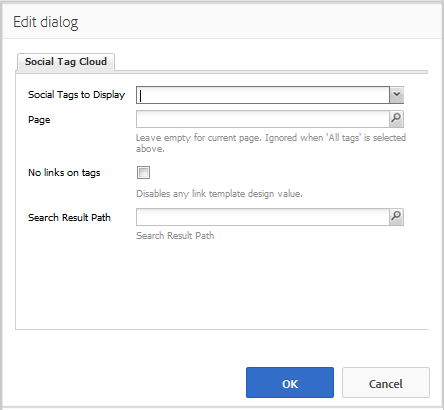

# Uso da Nuvem de tags sociais {#using-social-tag-cloud}

>[!CAUTION]
>
>AEM 6.4 chegou ao fim do suporte estendido e esta documentação não é mais atualizada. Para obter mais detalhes, consulte nossa [períodos de assistência técnica](https://helpx.adobe.com/br/support/programs/eol-matrix.html). Encontre as versões compatíveis [here](https://experienceleague.adobe.com/docs/).

## Introdução {#introduction}

O `Social Tag Cloud` O componente destaca as tags aplicadas pelos membros da comunidade ao publicar o conteúdo. É um meio de identificar tópicos de tendência e permitir que os visitantes do site localizem rapidamente o conteúdo marcado.

Para obter outro meio de identificar as tendências atuais, visite [Tendências da atividade](trends.md).

Esta página documenta as `Social Tag Cloud` configurações de caixa de diálogo do componente e descreve a experiência do usuário.

Para obter informações detalhadas para desenvolvedores, consulte [Tag Essentials](tag.md).

Consulte [Administração de tags](../../help/sites-administering/tags.md) para obter informações sobre como criar e gerenciar tags, bem como sobre quais tags de conteúdo foram aplicadas.

## Adicionar uma nuvem de tags sociais {#adding-a-social-tag-cloud}

Para adicionar uma `Social Tag Cloud` para uma página no modo autor, use o navegador de componentes para localizar `Communities / Social Tag Cloud` e arraste-a para o local em uma página onde a nuvem de tags deve aparecer.

Para obter as informações necessárias, visite [Noções básicas sobre componentes do Communities](basics.md).

Quando a variável [bibliotecas obrigatórias do lado do cliente](tag.md#essentials-for-client-side) são incluídos, é assim que a variável `Social Tag Cloud` componente será exibido:

## Configuração da nuvem de tags sociais {#configuring-social-tag-cloud}

Selecione o `Social Tag Cloud` para acessar e selecionar o `Configure` ícone que abre a caixa de diálogo de edição.

Em **[!UICONTROL Nuvem de tags sociais]** , especifique quais tags serão exibidas e, se as tags forem links ativos, o local da página para os resultados da pesquisa.:

* **[!UICONTROL Tags sociais a serem exibidas]**
Identifique quais tags de UGC serão exibidas. As opções de menu suspenso são

   * `From page and child pages`
   * `All tags`

   O padrão é `From page and child pages`, onde &quot;página&quot; se refere à variável **Página** abaixo.

* **[!UICONTROL Página]**
(obrigatório se não 
`All tags)` O caminho para o UGC de uma página. O padrão é a página atual, se deixada em branco.

* **[!UICONTROL Nenhum link nas tags]**
Se marcada, as tags serão exibidas na nuvem de tags como texto sem formatação. Se estiver desmarcada, as tags serão exibidas como links ativos que pesquisam todo o conteúdo ao qual essa tag é aplicada. O padrão está desmarcado e requer o **[!UICONTROL Caminho do Resultado da Pesquisa]** a ser definido.

* **[!UICONTROL Caminho do Resultado da Pesquisa]**
O caminho para uma página em que uma 
`Search Result` foi colocado, configurado para referenciar o UGC que inclui o caminho UGC especificado pelo **Página** configuração.

## Alterar a exibição da nuvem de tags sociais {#change-display-of-social-tag-cloud}

Para editar a exibição do **Nuvem de tags sociais**, insira [Modo Design](../../help/sites-authoring/default-components-designmode.md) e clique duas vezes no `Social Tag Cloud` para abrir uma caixa de diálogo com uma guia adicional.

Usar o **[!UICONTROL Nuvem de tags sociais (Design)]** , especifique como as tags são exibidas. Uma tag pode ser uma tag simples, uma única palavra no namespace padrão ou uma taxonomia hierárquica:

* **[!UICONTROL Mostrar caminhos de título completos]**
Se marcada, mostra os títulos das tags principais e do namespace para cada tag aplicada.

   Por exemplo:

   * Marcado: `Geometrixx Media: Gadgets / Cars`
   * Desmarcado: `Cars`

   Não há diferença para uma tag simples.

   O padrão está desmarcado.

* **[!UICONTROL Mostrar somente marcas de folha]**
Se marcada, mostra apenas as tags aplicadas que não contêm outras tags.

   Por exemplo, considerando a TagID de

   `Geometrixx Media: Gadgets / Cars`

   Há 3 tags que podem ser aplicadas: `Geometrixx Media (the namespace)`, `Gadgets`e `Cars`

   * Verificado: only `Cars` será exibido, se aplicado
   * Desmarcado: `Geometrixx Media` e `Gadgets`bem como `Cars` será exibido, se aplicado

   Uma tag simples é uma tag de folha.

   O padrão está desmarcado.

* **[!UICONTROL Modelo de link]**
Um modelo, diferente de padrão, usado para exibir os links em uma nuvem de tags, quando os links são ativados por meio da caixa de diálogo de edição de componentes.

* **[!UICONTROL Mesmo tamanho para todas as tags]**
Se marcada, todas as palavras na nuvem de tags terão o mesmo estilo. Se estiver desmarcado, o estilo das palavras será diferente de acordo com seu uso. O padrão está desmarcado.

## Informações adicionais {#additional-information}

Mais informações podem ser encontradas no [Tag Essentials](tag.md) página para desenvolvedores.

Consulte [Marcação de conteúdo gerado pelo usuário](tag-ugc.md) (UGC) para obter informações sobre como criar e gerenciar tags.
