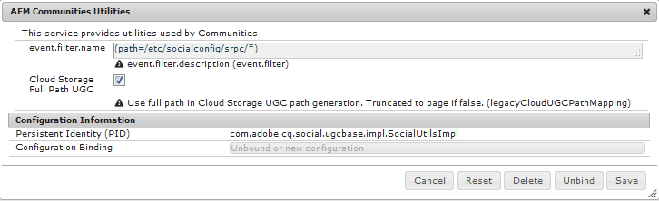

# Atualização para o AEM 6.4 Communities {#upgrading-to-aem-communities}

Dependendo da topologia e dos recursos de cada site, as seguintes ações podem ser necessárias ao atualizar para o AEM Communities 6.4 ou ao instalar o pacote de recursos mais recente.

Esta seção é específica das Comunidades e complementa as informações fornecidas em [Atualização para AEM 6.4](../../help/sites-deploying/upgrade.md) (plataforma).

## Atualização do AEM 6.1 ou posterior {#upgrading-from-aem-or-later}

### Reindexar Solr {#reindex-solr}

Ao instalar um novo pacote de recursos das Comunidades em uma implantação configurada com MSRP, será necessário:

1. Instale o [pacote de recursos mais recente](deploy-communities.md#latestfeaturepack)
2. Instale os [arquivos de configuração mais recentes do Solr](msrp.md#upgrading)
3. Reindexar MSRP

   consulte a seção [Ferramenta MSRP Reindex](msrp.md#msrp-reindex-tool)

### Ativação 2.0 {#enablement}

A partir do AEM 6.3, os recursos de ativação não armazenam mais informações do relatórios no MySQL. A dependência MySQL está disponível somente para rastrear conteúdo SCORM.

Entre em contato com o [Atendimento ao cliente](https://helpx.adobe.com/br/marketing-cloud/contact-support.html) para obter ajuda na migração de conteúdo do Enablement 1.0.

## Atualização do AEM 6.0 {#upgrading-from-aem}

Se o UGC pré-existente precisar ser retido, então os meios para fazer isso dependerão se a implantação armazenou o UGC [no local](#on-premise-storage) ou na [nuvem de Adobe](#adobe-cloud-storage).

### Armazenamento da Adobe Cloud {#adobe-cloud-storage}

Se o site atualizado tiver sido configurado para usar o armazenamento na nuvem do Adobe, ele poderá aparecer (incorretamente) como se todo o UGC tivesse sido perdido, pois os métodos SRP não conseguirão localizar o UGC preexistente no local antigo.

Portanto, há a capacidade de instruir o ASRP a usar `AEM 6.0 compatability-mode` para acessar o UGC.

Para todas as instâncias de autor e publicação do AEM 6.3

1. Fazer logon com privilégios de administrador
2. Configurar [ASRP](asrp.md)
3. Siga estas etapas para tornar visível o UGC pré-existente:
i. Navegue até o console da Web, por exemplo
   [https://&lt;host>:&lt;port>/system/console/](http://localhost:4502/system/console/configMgr)
configMgrii. Localizar a configuração **[!UICONTROL Utilitários AEM Communities]**
iii. Selecione para expandir o painel de configuração
   * *Desmarcar* **`Cloud Storage`**
   * Selecione **[!UICONTROL Salvar]**

### Armazenamento local {#on-premise-storage}

Se o site atualizado não tiver usado armazenamento em nuvem, qualquer UGC pré-existente deve ser convertido em conformidade com a nova estrutura introduzida no AEM 6.1 Communities em suporte à loja comum.

Para esse fim, uma ferramenta de migração de código aberto está disponível no GitHub:\
[Ferramenta de migração AEM Communities UGC](https://github.com/Adobe-Marketing-Cloud/communities-ugc-migration)

### APIs Java {#java-apis}

Ao atualizar de AEM 6.0 comunidades sociais para AEM 6.3 comunidades, esteja ciente de que muitas APIs foram reorganizadas em diferentes pacotes. A maioria deve ser facilmente resolvida ao usar um IDE para personalização dos recursos das Comunidades.

Para obter detalhes sobre o pacote SocialUtils obsoleto, visite [Refatoração SocialUtils](socialutils.md).

Consulte também [Usando o Maven para Communities](maven.md).

### Nenhum Modelo de Componente JSP {#no-jsp-component-templates}

A [estrutura de componente social](scf.md) (SCF) usa a linguagem de modelo [HandlebarsJS](https://www.handlebarsjs.com/) (HBS) no lugar de Java Server Pages (JSP) usada antes da AEM 6.0.

No AEM 6.0, os componentes do JSP permaneceram junto aos novos componentes do enquadramento do HBS no mesmo local, com os componentes do HBS normalmente localizados em subpastas denominadas &quot;hbs&quot;.

A partir do AEM 6.1, os componentes do JSP foram completamente removidos. Para Comunidades, é recomendável substituir todo o uso de componentes JSP por componentes SCF.

## Ferramenta de migração UGC AEM Communities {#aem-communities-ugc-migration-tool}

A [AEM Communities UGC Migration Tool](https://github.com/Adobe-Marketing-Cloud/communities-ugc-migration) é uma ferramenta de migração de código aberto, disponível no GitHub, que pode ser personalizada para exportar o UGC de versões anteriores de comunidades sociais AEM e importar para o AEM Communities 6.1 ou posterior.

Além de mover o UGC de versões anteriores, também é possível usar a ferramenta para mover o UGC de um [SRP](working-with-srp.md) para outro, como de MSRP para DSRP.

## Atualização do AEM 5.6.1 ou anterior {#upgrading-from-aem-or-earlier}

Conceitualmente, há três gerações de componentes de comunidades:

**Geração 1**: aproximadamente CQ 5.4 até AEM 5.6.0 - esses são os  **** componentes de colaboração que armazenaram o UGC no repositório local usando a replicação como meio de sincronizar o UGC entre plataformas. Outras diferenças envolvem a implementação usando Java Server Pages (JSP), bem como o recurso de blog que consiste na criação somente no ambiente do autor.

**Geração 2**: do AEM 5.6.1 até ao AEM 6.1 - trata-se de uma mistura de componentes  **** colativos  **** sociais. AEM 6.0 introduziu a nova [estrutura de componente social](scf.md) (SCF) e AEM 6.2 introduziu uma [loja UGC comum](working-with-srp.md) onde o UGC é acessado usando um [provedor de recursos de armazenamento](srp.md) (SRP).

**Geração 3**: a partir do AEM 6.2, existem apenas componentes  **** sociais, implementados no SCF como componentes do Handlebars (HBS) que exigem uma opção de SRP para UGC.
