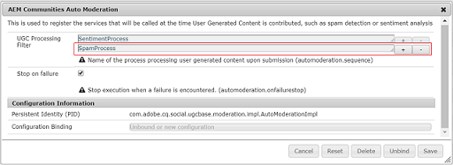

# Novidades do AEM 6.4 Communities {#what-s-new-in-aem-communities}

A AEM Communities oferta uma estrutura para as empresas colaborarem entre seus parceiros, clientes e funcionários. Ela proporciona recursos sociais à estrutura do site, e ajuda as empresas a engajarem e distribuírem conhecimento às partes interessadas, a fim de melhorar o valor de sua marca no seu caminho.

AEM 6.4 Comunidades traz funcionalidades para aprimorar as experiências dos usuários da comunidade e facilitar as tarefas atuais de administradores, moderadores e gerentes da comunidade.

Leia mais a fundo para uma rápida introdução a novos recursos e melhorias. Além disso, consulte AEM 6.4 Communities [notas de versão](../release-notes/communities-release-notes.md). Para obter AEM documentação das Comunidades 6.4, visite [AEM 6.4 Communities User Guide](home.md).

## Gerenciando subcomunidades ou grupos da comunidade {#managing-sub-communities-or-community-groups}

A AEM Communities permite que os administradores da comunidade criem grupos e subgrupos dentro do site de comunidades, usando modelos predefinidos, no ambiente do autor. Esses grupos servem como subcomunidades, o que pode herdar muitas configurações, como temas e estilização do site pai. No entanto, esses grupos podem diferir do site pai, por exemplo, ter um conjunto diferente de moderadores de grupo ou podem variar no nível de segurança. Esses grupos funcionam como minicomunidades independentes e de pleno direito, que são mais capacitadas pelos seguintes aprimoramentos.

### Criar grupos de várias localidades em uma única etapa {#create-multi-locale-groups-in-single-step}

Como parte de um site da comunidade, grupos multilíngues podem ser criados em uma única operação. **[!UICONTROL O]** campo Idioma(s) adicional(is) do grupo da comunidade disponível na página de  **[!UICONTROL modelos de grupo da]** comunidade, que está disponível ao criar um  [novo ](groups.md) grupo da comunidade em um site da comunidade, torna isso viável.

Para criar esses grupos, os usuários podem simplesmente navegar até a Coleção de grupos do site de comunidades desejado no console Sites. Crie um grupo e especifique os idiomas desejados no campo **[!UICONTROL Idioma(s) adicional(is) do grupo da comunidade]** da página **[!UICONTROL Modelo de grupo da comunidade]**.

### Excluir grupos da comunidade do console de grupos {#delete-community-groups-from-groups-console}

AEM 6.4 Comunidades fornece o ícone Excluir grupo nos grupos existentes da comunidade, na coleção Grupos da comunidade no console Sites da comunidade. Isso habilita [exclusão de grupo](groups.md#deleting-the-group) em um clique, juntamente com a exclusão de todos os itens associados (como conteúdo e associações de usuários) ao grupo.

### Criar e atribuir recursos de ativação dentro de grupos {#create-and-assign-enablement-resources-within-groups}

O conteúdo de aprendizado agora pode ser criado, gerenciado e publicado para um conjunto específico de membros da comunidade direcionados. Devido à disponibilidade de funções de catálogo e atribuição para grupos da comunidade (e não apenas para todo o site da comunidade), os gerentes de ativação podem [atribuir recursos de ativação](resource.md) e caminho de aprendizagem a um pequeno grupo de pessoas também.

## Moderação de conteúdo gerado pelo usuário {#moderating-user-generated-content}

AEM 6.4 Comunidades oferta poucas melhorias na moderação, que são fundamentais para facilitar o dia a dia dos moderadores comunitários.

### Detecção automática de spam {#automatic-spam-detection}

O novo mecanismo de detecção de spam ajuda a filtrar o conteúdo indesejado e não solicitado gerado pelo usuário em sites ou grupos da comunidade. Quando ativada, essa funcionalidade pode marcar um conteúdo gerado pelo usuário como Spam ou Não spam com base em um conjunto predefinido de palavras de spam. Os moderadores podem agir ainda mais sobre o conteúdo para negar ou permitir que ele apareça na instância de publicação. Essas ações de moderação podem ser executadas em linha ou por meio do console de moderação em massa.

[Os ](moderate-ugc.md#spam-detection) detectores de spam localizam e sinalizam um determinado conteúdo gerado pelo usuário com 90% de precisão. No entanto, essa funcionalidade não é ativada por padrão. Para habilitá-lo, os administradores da comunidade precisam navegar até o configMgr no sistema/console e adicionar o Processo de spam.

### Novos filtros (respondidos/não atendidos) para QnA {#new-answered-unanswered-filters-for-qna}

O AEM 6.4 adiciona dois [novos filtros](moderation.md#filter-rail), chamados Respondidos e Não Respondidos em caso de perguntas QnA, ao console de moderação em massa. Esses filtros estão disponíveis em Status no painel Filtro.

Ao selecionar o status Respondido, todas as perguntas respondidas estarão visíveis para o moderador na área de conteúdo. Enquanto que, se apenas o status Não respondida for selecionado, o moderador visualizará todo o conteúdo (para todos os tipos de conteúdo), exceto as perguntas respondidas, pois a propriedade responsável pela pergunta respondida não existe no caso de perguntas não respondidas e outros conteúdos, como tópico do fórum, artigo do blog ou comentários.

### Filtros de moderação de marcadores {#bookmark-moderation-filters}

A AEM Communities fornece a capacidade de [marcar os filtros de moderação predefinidos](moderation.md#filter-rail) no console de moderação. Esses marcadores salvos podem ser revisitados posteriormente e compartilhados com outros usuários.

Os usuários precisam apenas selecionar os filtros desejados no painel Filtro no console de moderação para visualização do UGC filtrado e marcar os filtros em seus navegadores. Esses filtros são anexados ao final da string do URL e, portanto, podem ser compartilhados, reutilizados e revisitados posteriormente.

## Gerenciamento de sites da comunidade {#managing-community-sites}

AEM 6.4 Comunidades fornece melhorias no gerenciamento de sites, que garantem que vários sites da comunidade em diferentes idiomas sejam facilmente criados, gerenciados e excluídos pelos administradores do site.

### Criar sites de comunidade de várias localidades em uma etapa {#create-multi-locale-community-sites-in-one-step}

A AEM Communities permite criar [sites de comunidade multilíngues](create-site.md) em uma única operação. Isso é possível devido à disponibilidade de vários idiomas para selecionar no campo **[!UICONTROL Linguagem Base do Site da Comunidade]** na página **[!UICONTROL Modelo do Site]**, ao criar um novo site da comunidade a partir do console de sites.

Os usuários podem selecionar pastas de configuração, marcas e muitas outras configurações ao mesmo tempo para todos esses sites.

### Excluir sites da comunidade do console de sites {#delete-community-sites-from-sites-console}

AEM 6.4 Comunidades fornece o ícone Excluir site nos sites existentes da comunidade, no console Sites da comunidade. Isso permite a [exclusão do site](create-site.md) e dos itens associados em um clique.

## Gerenciando perfis de usuário e UGC {#managing-ugc-and-user-profiles}

Mantendo a proteção de dados do usuário no centro da experiência das comunidades, a AEM Communities expõe [APIs prontas para uso](user-ugc-management-service.md) e [servlet de amostra](https://github.com/Adobe-Marketing-Cloud/aem-communities-ugc-migration/tree/main/bundles/communities-ugc-management-servlet). Essas APIs ajudam a gerenciar em massa (exclusão em massa e exportação em massa) o conteúdo gerado pelo usuário e excluir perfis do usuário, além de serem fundamentais para lidar com solicitações de conformidade com o RGPD da UE.

## O que foi alterado {#what-s-changed}

* A verificação do Captcha, ao criar um novo site da comunidade, não está mais disponível prontamente no AEM 6.4 Communities. No entanto, o site Comunidades pode ser personalizado para incluir [o componente Google reCAPTCHA](https://helpx.adobe.com/experience-manager/using/aem_recaptcha.html) para melhor segurança.
* A opção para carregar um CSS personalizado foi removida do tema de sites e grupos da comunidade.
* Os ícones Somente conteúdo e Pesquisar foram adicionados no painel Filtro na interface do usuário de moderação em massa.
* O filtro Caminho do conteúdo foi adicionado no painel Filtro na interface do usuário de moderação em massa.
* Os modos de alternância para o modo em massa e Saída em massa foram removidos da interface do usuário de moderação em massa. Para entrar no modo de seleção múltipla, clique no ícone Selecionar ( ) em uma publicação, que aparece ao passar o mouse sobre ela (área de trabalho) ou pressionando e segurando um dedo na publicação (móvel).
