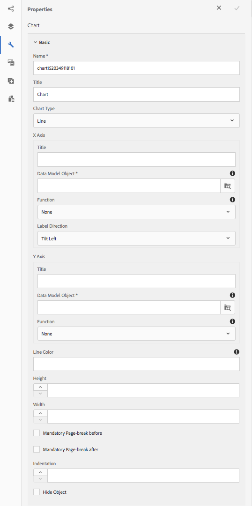

# Uso de gráficos em Comunicações Interativas {#using-charts-in-interactive-communications}

Usando gráficos em uma Comunicação Interativa, você pode condensar grandes quantidades de informações em um formato visual fácil de analisar e entender

Um gráfico ou um gráfico é uma representação visual dos dados. Ele condensa grandes quantidades de informações em um formato visual fácil de entender, permitindo que os recipient da Comunicação interativa visualizem, interpretem e analisem melhor dados complexos.

Ao criar uma comunicação interativa, você pode adicionar gráficos para representar visualmente dados bidimensionais do modelo de dados de formulário do Interative Communication. O componente Gráfico permite adicionar e configurar os seguintes tipos de gráficos:

* Pizza
* Coluna
* Rosca
* Barra (somente canal da Web)
* Linha
* Linha e ponto
* Ponto
* Área

## Adicionar e configurar um gráfico em uma comunicação interativa {#add-and-configure-chart-in-an-interactive-communication}

Complete as etapas a seguir para adicionar um gráfico a uma Comunicação interativa:

1. Na barra lateral AEM Componentes, arraste e solte o componente Gráfico em um dos seguintes itens de impressão ou canal da Web de uma Comunicação interativa:

   * Canal de impressão: Área do público alvo e campo de imagem
   * Canal da Web: Área do painel e do Público alvo

   O componente Gráfico solto cria um espaço reservado para um gráfico.

1. Toque no componente de gráfico no editor de Comunicação interativa e, na barra de ferramentas Componente, selecione **[!UICONTROL Configurar (]** configure_icon ).

   A barra lateral Propriedades é exibida com as propriedades Básicas do gráfico em foco.

   
   **Figura:** *Propriedades básicas de um gráfico de tipo de linha no canal de impressão*

   
   **Figura:** *Propriedades básicas de um gráfico de tipo de linha no canal da Web*

1. Configure as propriedades Básicas do gráfico para canal impresso e canal da Web. Além das propriedades comuns, há propriedades específicas para impressão e canal da Web e o tipo de gráfico.

   * **[!UICONTROL Nome]**: Nome do objeto de gráfico. O nome do gráfico especificado aqui não aparece na saída do gráfico, mas é usado em regras para fazer referência ao gráfico.
   * **[!UICONTROL Tipo]** de gráfico: Especifique o tipo de gráfico: Pizza, Coluna, Rosca, Linha, Linha e Ponto, Ponto ou Área.
   * **[!UICONTROL Ocultar objeto]**: Selecione para ocultar o gráfico na saída final.
   * Especifique o seguinte para os eixos **** x e **[!UICONTROL y]**:

      * **[!UICONTROL Título]**: Especifique os títulos dos eixos X e Y a serem exibidos na Comunicação interativa.
      * **[!UICONTROL Objeto de Modelo de Dados *]**: Procure e selecione objetos de modelo de dados para os eixos X e Y do gráfico a partir do modelo de dados de formulário especificado ao criar a Comunicação interativa. Escolha duas propriedades do tipo coleção/matriz do mesmo objeto de modelo de dados pai que sejam significativas em relação umas às outras para plotar nos eixos X e Y de um gráfico.
      * **[!UICONTROL Função]**: Para usar funções estatísticas para calcular os valores no eixo, selecione função para o eixo X / Y. Para obter mais informações sobre funções, consulte [Usar funções no gráfico](#usefunction) e [Exemplo 2: Aplicação de funções de soma e média em um gráfico](#applicationsumfrequency)de linhas.

   >[!NOTE]
   >
   >Para canal de impressão, no eixo X, o objeto de modelo de dados que você vincula deve ser do tipo Número, String ou Data. No eixo Y, o objeto de modelo de dados vinculado deve ser do tipo Number. É recomendável usar a legenda do lado direito no canal de impressão.

   Para obter mais informações sobre as propriedades do gráfico, consulte Propriedades [básicas em gráficos](#basicpropertiescharts).

1. (Somente canal de impressão) Nas Configurações do agente, especifique se é obrigatório que o agente use este gráfico. Se **[!UICONTROL a opção É obrigatório para o agente usar este gráfico]** não estiver selecionada, o agente pode tocar no ícone de olho do gráfico na guia Conteúdo da interface do agente para mostrar/ocultar o gráfico.

   

1. Na barra lateral Propriedades, toque em .

   Pré-visualização para ver a aparência e os dados do gráfico. Retorne para reconfigurar as propriedades do gráfico, se necessário.

1. Volte a fazer outras alterações na Comunicação interativa.

## Exemplo 1: Saída de gráfico na impressão e na Web {#chartoutputprintweb}

Na guia Básico, você define o tipo de gráfico, as propriedades do modelo de dados de formulário de origem que contêm dados, os rótulos a serem representados no eixo x e no eixo y do gráfico e, opcionalmente, a função estatística para calcular os valores de plotagem no gráfico.

Vamos entender detalhadamente as informações mínimas exigidas nas propriedades básicas, com a ajuda de uma declaração de cartão de crédito gerada por meio de uma Comunicação interativa. Considere que você deseja gerar um gráfico para descrever a quantidade de diferentes despesas na declaração. Você deseja usar diferentes tipos de gráficos para impressão e saída da Web da Comunicação Interativa.

Para fazer isso, é necessário especificar:

* **[!UICONTROL Tipo]** de gráfico - neste exemplo, Coluna para o canal de impressão e Rosca para o canal da Web
* **[!UICONTROL Objetos]** de Modelo de Dados como origem para os eixos X e Y do gráfico - neste exemplo, Quantia da Transação para o eixo X e Nome da Despesa para o eixo Y
* **[!UICONTROL Título]** para os eixos X e Y (para o gráfico de tipo Coluna no canal de impressão apenas neste exemplo) - neste exemplo, Quantia ($) para o eixo X e Despesa para o eixo Y.
* **[!UICONTROL Direção]** do rótulo (para o gráfico de tipo de coluna no canal de impressão apenas neste exemplo) - neste exemplo `Tilt Left`

* **[!UICONTROL Dica]** de ferramenta para exibir com o mouse sobre uma despesa (somente canal da Web) - neste exemplo `${x}: $ ${y}`, que é exibido como `[Expense Label: $ Amount]` (Exemplo: Visita ao parque de temas: US$ 315)

**Figura de comunicação interativa:** *Gráfico de colunas na saída de impressão de uma comunicação interativa*

**A.** Eixo Y - Valor obtido da propriedade de modelo de dados de formulário e da propriedade Title definida como Amount ($) **B.** Direção do Rótulo do eixo X definido para Inclinar Eixo **C.** X à Esquerda - Descrição da despesa obtida da propriedade do modelo de dados do formulário e propriedade Título definida como Despesa

**Figura de comunicação interativa:** *Gráfico de rosca na saída da Web de uma Comunicação Interativa*

**A.** A propriedade Raio interno da rosca está definida como **B.** A propriedade Mostrar Legenda está selecionada e a propriedade Posição da Legenda está definida como **C Direita.** A dica de ferramenta exibe o detalhe do item no mouse - A dica de ferramenta está definida como ${x}: $ ${y}

## Exemplo 2: Aplicação das funções Soma e Frequência em um gráfico de linhas {#applicationsumfrequency}

Ao aplicar funções em um gráfico, é possível plotar dados que não são fornecidos diretamente pelo modelo de dados do formulário. Neste exemplo, usamos um exemplo de declaração de cartão de crédito para entender como as funções Soma e Frequência podem ser aplicadas ao gráfico.

&quot;Cama e Café da manhã&quot;**Figura:** *Gráfico de linhas sem uma função com três transações de &quot;Cama e Café da manhã&quot;*

### Função de soma {#sum-function}

É possível aplicar a função sum para adicionar valores de várias instâncias da mesma propriedade de dados e mostrá-la apenas uma vez. Por exemplo, no gráfico a seguir, a função Soma é aplicada no eixo Y para somar a quantia das três transações do Bed e do Breakfast (US$ 99,45, US$ 78 e US$ 12) e mostrar apenas uma transação (US$ 189,45).

A função Sum pode tornar o gráfico mais útil quando você deseja agrupar e exibir a soma de muitas instâncias da mesma propriedade de dados.


### Função de frequência {#frequency-function}

A função Frequency retorna o número de valores no eixo X ou Y para um dado valor no outro eixo. Com a aplicação da função Frequency no eixo y (Quantia/Quantia Trans), o gráfico exibe que houve três ocorrências de transações de Ced e Café da manhã e uma ocorrência do restante dos tipos de transações.


## Propriedades básicas em gráficos {#basicpropertiescharts}

Na guia Básico, é possível configurar as seguintes propriedades:

**Nome** Um identificador para o elemento de gráfico. O nome não está visível no gráfico, mas ajuda ao se referir ao elemento de outros componentes, scripts e expressões SOM.

**Título (Somente canal de impressão)** Especifica o título do gráfico.

**Tipo** de gráfico Especifica o tipo de gráfico que você deseja gerar. As opções disponíveis são Pizza, Coluna, Rosca, Barra (somente canal da Web), Linha, Linha e Ponto, Ponto e Área. Para obter mais informações, consulte Exemplo 1: Saída de gráfico na impressão e na Web.

**Eixo X > Título** Especifica o título do eixo x.

**Eixo X > Objeto de Modelo de Dados &amp;ast;** Especifique o nome do item de coleta do modelo de dados de formulário a ser representado no eixo x.

**Eixo X > Função** Especifica a função estatística/personalizada a ser usada para calcular os valores no eixo x. Para obter mais informações sobre funções, consulte Usar funções no gráfico e Exemplo 2: Aplicação de funções de soma e média em um gráfico de linhas.

**Eixo X > Direção** do rótulo Direção do rótulo no gráfico no canal de impressão. Se você escolher a direção do rótulo como Rotação personalizada, o campo Ângulo de rotação personalizado (graus) será exibido. No campo Ângulo de rotação personalizado (graus), é possível escolher o ângulo de rotação em etapas de 15 graus.

**Eixo Y > Título** Especifica o título do eixo y.

**Eixo Y > Objeto do modelo de dados &amp;ast;** Especifica o item de coleta do modelo de dados de formulário a ser representado no eixo y. No canal Print, o objeto de modelo de dados para o eixo Y deve ser do tipo Number.

**Eixo Y > Função** Especifica a função estatística/personalizada a ser usada para calcular os valores no eixo y. Para obter mais informações sobre funções, consulte Usar funções no gráfico e Exemplo 2: Aplicação de funções de soma e média em um gráfico de linhas.

**Mostrar legenda** Mostra uma legenda para o gráfico de pizza ou rosca quando ativado.

**Posição** da legenda Especifica a posição da legenda em relação ao gráfico. As opções disponíveis são Direita, Esquerda, Superior e Inferior.

**Altura (Somente canal de impressão)** Altura do gráfico em pixels.

**Largura (somente canal de impressão)** Largura do gráfico em pixels.

>[!NOTE]
>
>É possível controlar a largura do gráfico no canal da Web usando a camada de estilo ou aplicando um tema.

**Dica de ferramenta (somente canal da Web)** Especifica o formato no qual a dica de ferramenta aparece ao passar o mouse sobre um ponto de dados no gráfico no canal da Web. O valor padrão é \${x}(\${y}). Dependendo do tipo de gráfico, quando você aponta o mouse para um ponto, barra ou fatia no gráfico, as variáveis \${x} e \${y} são substituídas dinamicamente pelos valores correspondentes no eixo x e no eixo y e exibidas na dica de ferramenta.

Para desativar a dica de ferramenta, deixe o campo Dica de ferramenta em branco. Essa opção não se aplica a gráficos de linha e de área. Por exemplo, consulte [Exemplo 1: Saída de gráfico na Web](#chartoutputprintweb)e na impressão.

**Classe CSS (somente canal da Web)** Especifique o nome de uma classe CSS no campo de classe CSS para aplicar o estilo personalizado ao gráfico.

**Quebra de página obrigatória antes (somente canal de impressão)** Selecione para adicionar uma quebra de página obrigatória antes do gráfico e coloque o gráfico na parte superior de uma nova página.

**Quebra de página obrigatória Após (somente canal de impressão)** Selecione para adicionar uma quebra de página obrigatória após o gráfico e coloque o conteúdo após o gráfico na parte superior de uma nova página.

**Recuo (Somente canal de impressão)** Especifique o recuo do gráfico à esquerda da página.

**Configurações** específicas do gráfico Além das configurações comuns, as seguintes configurações específicas do gráfico estão disponíveis:

* **Raio** interno: disponível para gráficos de rosca para especificar o raio (em pixels) do círculo interno no gráfico.
* **Cor** da linha: disponível para gráficos de Linha, Linha e Ponto e Área para especificar o valor hexadecimal da cor para a linha no gráfico.
* **Cor** do ponto: disponível para gráficos Ponto e Linha e Ponto para especificar o valor hexadecimal da cor para os pontos no gráfico.

* **Cor** da área: disponível para Gráficos de área para especificar o valor hexadecimal da cor para a área sob a linha no gráfico.

## Usar funções no gráfico {#usefunction}

Você pode configurar um gráfico para usar funções estatísticas para calcular valores a partir dos dados de origem para plotar no gráfico. Ao aplicar funções em um gráfico, é possível plotar dados que não são fornecidos diretamente pelo modelo de dados do formulário.

Enquanto o componente Gráfico vem com algumas funções incorporadas, você pode gravar suas próprias funções e disponibilizá-las para uso na configuração do gráfico no canal da Web.


>[!NOTE]
>
>É possível usar funções para calcular valores para o eixo X ou Y em um gráfico.

### Funções padrão {#default-functions}

As seguintes funções estão disponíveis por padrão com o componente Gráfico:

**Média (Média)** Retorna a média dos valores no eixo X ou Y para um dado valor no outro eixo.

**Soma** Retorna a soma de todos os valores no eixo X ou Y para um dado valor no outro eixo.

**Máximo** Retorna o máximo dos valores no eixo X ou Y para um determinado valor no outro eixo.

**Frequency** Retorna o número de valores no eixo X ou Y para um dado valor no outro eixo.

**Intervalo** Retorna a diferença entre o máximo e o mínimo dos valores no eixo X ou Y para um dado valor no outro eixo.

**Median** Retorna o valor que separa valores mais altos e mais baixos na metade no eixo X ou Y para um dado valor no outro eixo.

**Mínimo** Retorna o mínimo dos valores no eixo X ou Y para um dado valor no outro eixo.

**Modo** Retorna o valor com a maioria das ocorrências no eixo X ou Y para um dado valor no outro eixo

### Funções personalizadas no canal da Web {#custom-functions-in-web-channel}

Além de usar as funções padrão em gráficos, você pode gravar funções personalizadas no JavaScript™ e disponibilizá-las na lista de funções no componente Gráfico para o canal da Web.

Uma função usa uma matriz ou valores e um nome de categoria como entradas e retorna um valor. Por exemplo:

```
Multiply(valueArray, category) {
 var val = 1;
 _.each(valueArray, function(value) {
 val = val * value;
 });
 return val;
}
```

Depois de gravar uma função personalizada, faça o seguinte para disponibilizá-la para uso na configuração do gráfico:

1. Adicione a função personalizada na biblioteca do cliente associada ao Interative Communication relevante. Para obter mais informações, consulte [Configuração da ação](/help/forms/using/configuring-submit-actions.md) Enviar e [Uso de bibliotecas](/help/sites-developing/clientlibs.md)do lado do cliente.

1. Para exibir a função personalizada no menu suspenso Função, no CRXDe Lite, crie um `nt:unstructured` nó na pasta de aplicativos com as seguintes propriedades:

   * Adicionar propriedade `guideComponentType` com valor como `fd/af/reducer`. (mandatory)
   * Adicione a propriedade `value` a um nome totalmente qualificado da função personalizada do JavaScript™. (obrigatório) e defina seu valor como o nome da função personalizada, como Multiplicar.
   * Adicione a propriedade `jcr:description` com o valor que deseja exibir como o nome da função personalizada que aparece no menu suspenso Função. Por exemplo, **Multiplicar**.
   * Adicione uma propriedade `qtip` com um valor que será uma breve descrição da função personalizada. Ela é exibida como uma dica de ferramenta ao passar o ponteiro do mouse sobre o nome da função na lista suspensa **Função** .

1. Clique em **Salvar tudo** para salvar a configuração.

A função agora está disponível para uso no Gráfico.