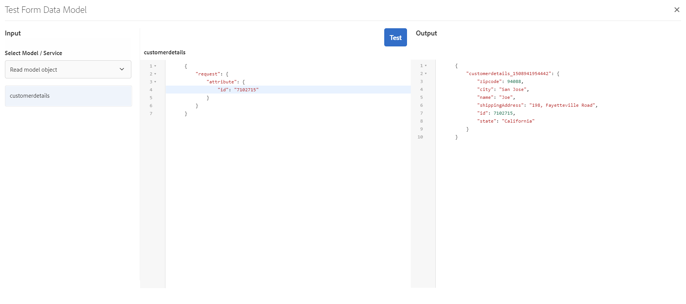

# Tutorial: Criar modelo de dados de formulário  {#tutorial-create-form-data-model}

>[!CAUTION]
>
>AEM 6.4 chegou ao fim do suporte estendido e esta documentação não é mais atualizada. Para obter mais detalhes, consulte nossa [períodos de assistência técnica](https://helpx.adobe.com/br/support/programs/eol-matrix.html). Encontre as versões compatíveis [here](https://experienceleague.adobe.com/docs/).

Este tutorial é uma etapa do [Criar seu primeiro formulário adaptável](/help/forms/using/create-your-first-adaptive-form.md) série. É recomendável seguir a série em sequência cronológica para entender, executar e demonstrar o caso de uso tutorial completo.

## Sobre o tutorial {#about-the-tutorial}

O módulo de integração de dados do AEM Forms permite criar um modelo de dados de formulário a partir de diferentes fontes de dados de backend, como AEM perfil de usuário, serviços Web RESTful, serviços Web baseados em SOAP, serviços OData e bancos de dados relacionais. É possível configurar objetos e serviços do modelo de dados em um modelo de dados de formulário e associá-lo a um formulário adaptável. Os campos de formulário adaptável são vinculados às propriedades de objetos do modelo de dados. Os serviços permitem preencher previamente o formulário adaptável e gravar os dados de formulário enviados de volta no objeto de modelo de dados.

Para obter mais informações sobre a integração de dados de formulário e o modelo de dados de formulário, consulte [Integração de dados do AEM Forms](/help/forms/using/data-integration.md).

Este tutorial o orienta pelas etapas para preparar, criar, configurar e associar um modelo de dados de formulário a um formulário adaptável. Ao final deste tutorial, você poderá:

* [Configurar o banco de dados MySQL como fonte de dados](#config-database)
* [Criar modelo de dados de formulário usando o banco de dados MySQL](#create-fdm)
* [Configurar o modelo de dados de formulário](#config-fdm)
* [Modelo de dados do formulário de teste](#test-fdm)

O modelo de dados de formulário será semelhante ao seguinte:

**A.** Fontes de dados configuradas **B.** Esquemas da fonte de dados **C.** Serviços disponíveis **D.** Objetos do modelo de dados **E.** Serviços configurados

## Pré-requisitos {#prerequisites}

Antes de começar, verifique se você tem o seguinte:

* Banco de dados MySQL com dados de amostra conforme declarado na seção Pré-requisitos de [Criar o primeiro formulário adaptável](/help/forms/using/create-your-first-adaptive-form.md)
* Pacote OSGi para o driver JDBC do MySQL, conforme explicado em [Pacote do driver de banco de dados JDBC](/help/sites-developing/jdbc.md#bundling-the-jdbc-database-driver)
* Formulário adaptável, conforme explicado no primeiro tutorial [Criar um formulário adaptável](/help/forms/using/create-adaptive-form.md)

## Etapa 1: Configurar o banco de dados MySQL como fonte de dados {#config-database}

Você pode configurar diferentes tipos de fontes de dados para criar um modelo de dados de formulário. Para este tutorial, configuraremos o banco de dados MySQL que você configurou e preencheu com dados de amostra. Para obter informações sobre outras fontes de dados compatíveis e como configurá-las, consulte [Integração de dados do AEM Forms](/help/forms/using/data-integration.md).

Faça o seguinte para configurar seu banco de dados MySQL:

1. Instale o driver JDBC para o banco de dados MySQL como um pacote OSGi:

   1. Faça logon na Instância do autor do AEM Forms como administrador e acesse AEM pacotes do console da Web. O URL padrão é [http://localhost:4502/system/console/bundles](http://localhost:4502/system/console/bundles).

   1. Toque **Instalar/atualizar**. Um **Fazer upload / instalar pacotes** será exibida.

   1. Toque **Escolher arquivo** para navegar e selecionar o pacote OSGi do driver JDBC do MySQL. Selecionar **Iniciar Pacote** e **Atualizar pacotes** e toque em **Instalar ou atualizar**. Certifique-se de que o Driver JDBC da Oracle Corporation para MySQL está ativo. O driver está instalado.

1. Configurar o banco de dados MySQL como uma fonte de dados:

   1. Vá para AEM console da Web em [http://localhost:4502/system/console/configMgr](http://localhost:4502/system/console/configMgr).
   1. Localizar **Fonte de dados agrupada da conexão Apache Sling** configuração. Toque em para abrir a configuração no modo de edição.
   1. Na caixa de diálogo de configuração, especifique os seguintes detalhes:

      * **Nome da fonte de dados:** Você pode especificar qualquer nome. Por exemplo, especifique **WeRetailMySQL**.
      * **Nome da propriedade do serviço DataSource**: Especifique o nome da propriedade de serviço que contém o nome DataSource. Ele é especificado ao registrar a instância da fonte de dados como serviço OSGi. Por exemplo, **datasource.name**.
      * **Classe de driver JDBC**: Especifique o nome da classe Java do driver JDBC. Para o banco de dados MySQL , especifique **com.mysql.jdbc.Driver**.
      * **URI de conexão JDBC**: Especifique o URL de conexão do banco de dados. Para o banco de dados MySQL em execução na porta 3306 e o schema weretail, o URL é: `jdbc:mysql://[server]:3306/weretail?autoReconnect=true&useUnicode=true&characterEncoding=utf-8`
      * **Nome de usuário:** Nome de usuário do banco de dados. É necessário habilitar o driver JDBC para estabelecer uma conexão com o banco de dados.
      * **Senha:** Senha do banco de dados. É necessário habilitar o driver JDBC para estabelecer uma conexão com o banco de dados.
      * **Teste em linha de crédito:** Ative o **Teste em linha de crédito** opção.
      * **Teste no retorno:** Ative o **Testar no retorno** opção.
      * **Consulta de validação:** Especifique uma consulta SQL SELECT para validar conexões do pool. A consulta deve retornar pelo menos uma linha. Por exemplo, **selecionar &amp;ast; de detalhes do cliente**.
      * **Isolamento de transação**: Defina o valor como **READ_BUTED**.

      Deixe outras propriedades com o padrão [values](https://tomcat.apache.org/tomcat-7.0-doc/jdbc-pool.html) e tocar **Salvar**.
   Uma configuração semelhante ao seguinte é criada.

   

## Etapa 2: Criar modelo de dados de formulário {#create-fdm}

O AEM Forms oferece uma interface de usuário intuitiva para [criar um modelo de dados de formulário](data-integration.md) em fontes de dados configuradas. É possível usar várias fontes de dados em um modelo de dados de formulário. No nosso caso de uso, usaremos a fonte de dados configurada do MySQL.

Faça o seguinte para criar um modelo de dados de formulário:

1. Em AEM instância do autor, navegue até **Forms** >  **Integração de dados** s.
1. Toque **Criar** >  **Modelo de dados do formulário**.
1. Na caixa de diálogo Criar modelo de dados de formulário , especifique um **name** para o modelo de dados de formulário. Por exemplo, **detalhes de faturamento de entrega do cliente**. Toque **Próximo**.
1. A tela selecionar fonte de dados lista todas as fontes de dados configuradas. Selecionar **WeRetailMySQL** fonte de dados e toque **Criar**.

   

O **detalhes de faturamento de entrega do cliente** o modelo de dados de formulário é criado.

## Etapa 3: Configurar o modelo de dados de formulário {#config-fdm}

A configuração do modelo de dados de formulário envolve:

* adição de objetos e serviços do modelo de dados
* configuração de serviços de leitura e gravação para objetos de modelo de dados

Faça o seguinte para configurar o modelo de dados de formulário:

1. Em AEM instância do autor, navegue até **Forms > Integrações de dados**. O URL padrão é [http://localhost:4502/aem/forms.html/content/dam/formsanddocuments-fdm](http://localhost:4502/aem/forms.html/content/dam/formsanddocuments-fdm).
1. O **detalhes de faturamento de entrega do cliente** o modelo de dados de formulário criado anteriormente está listado aqui. Abra-o no modo de edição.

   A fonte de dados selecionada **WeRetailMySQL** é configurado no modelo de dados de formulário.

   

1. Expanda a árvore da fonte de dados WeRailMySQL . Selecione os seguintes objetos e serviços do modelo de dados de **rede** >  **detalhes do cliente** esquema para formulário de modelo de dados:

   * **Objetos do modelo de dados**:

      * id
      * name
      * ShippingAddress
      * cidade
      * estado
      * código postal
   * **Serviços:**

      * get
      * atualizar

   Toque **Adicionar Selecionado** para adicionar objetos e serviços de modelo de dados selecionados ao modelo de dados de formulário.

   

   >[!NOTE]
   >
   >Os serviços padrão de obter, atualizar e inserir para fontes de dados JDBC são fornecidos prontos para uso com o modelo de dados de formulário .

1. Configure os serviços de leitura e gravação para o objeto de modelo de dados.

   1. Selecione o **detalhes do cliente** objeto e toque do modelo de dados **Editar propriedades**.
   1. Selecionar **get** na lista suspensa Serviço de leitura . O **id** O argumento , que é a chave primária no objeto de modelo de dados de detalhes do cliente, é adicionado automaticamente. Toque  e configure o argumento da seguinte maneira.

      

   1. Da mesma forma, selecione **atualizar** como o Serviço de gravação. O **detalhes do cliente** é adicionado automaticamente como argumento. O argumento é configurado da seguinte maneira.

      

      Adicione e configure o **id** como se segue.

      

   1. Toque **Concluído** para salvar as propriedades do objeto de modelo de dados. Em seguida, toque em **Salvar** para salvar o modelo de dados de formulário.

      O **get** e **atualizar** são adicionados como serviços padrão para o objeto de modelo de dados.

      

1. Vá para o **Serviços** guia e configure **get** e **atualizar** serviços.

   1. Selecione o **get** serviço e toque **Editar propriedades**. A caixa de diálogo de propriedades é aberta.
   1. Especifique o seguinte na caixa de diálogo Editar propriedades:

      * **Título**: Especifique o título do serviço. Por exemplo: Recuperar Endereço de Entrega.
      * **Descrição**: Especifique a descrição que contém o funcionamento detalhado do serviço. Por exemplo:

         Esse serviço recupera o endereço de entrega e outros detalhes do cliente do banco de dados MySQL

      * **Objeto do Modelo de Saída**: Selecione o schema que contém os dados do cliente. Por exemplo:

         esquema customerdetail
      * **Matriz de retorno**: Desative o **Matriz de retorno** opção.
      * **Argumentos**: Selecione o argumento com o nome **ID**.

      Toque **Concluído**. O serviço para recuperar detalhes do cliente do banco de dados do MySQL está configurado.

      

   1. Selecione o **atualizar** serviço e toque **Editar propriedades**. A caixa de diálogo de propriedades é aberta.

   1. Especifique o seguinte na caixa de diálogo Editar propriedades:

      * **Título**: Especifique o título do serviço. Por exemplo, Atualizar Endereço de Entrega.

      * **Descrição**: Especifique a descrição que contém o funcionamento detalhado do serviço. Por exemplo:

         Este serviço atualiza o endereço de entrega e campos relacionados no banco de dados MySQL

      * **Objeto do Modelo de Entrada**: Selecione o schema que contém os dados do cliente. Por exemplo:

         esquema customerdetail

      * **Tipo de saída**: Selecionar **BOOLEANO**.
      * **Argumentos**: Selecione o argumento com o nome **ID** e **detalhes do cliente**.

      Toque **Concluído**. O **atualizar** para atualizar os detalhes do cliente no banco de dados MySQL está configurado.

      

O objeto e os serviços do modelo de dados no modelo de dados de formulário são configurados. Agora é possível testar o modelo de dados de formulário.

## Etapa 4: Modelo de dados do formulário de teste {#test-fdm}

É possível testar o objeto e os serviços do modelo de dados para verificar se o modelo de dados do formulário está configurado corretamente.

Faça o seguinte para executar o teste:

1. Vá para o **Modelo** selecione a guia **detalhes do cliente** objeto de modelo de dados e toque em **Objeto de Modelo de Teste**.
1. No **Modelo/serviço de ensaio** janela , selecione **Ler objeto de modelo** do **Selecionar Modelo/Serviço** lista suspensa.
1. No **detalhes do cliente** especifique um valor para a seção **id** argumento que existe no banco de dados MySQL configurado e toque em **Teste**.

   Os detalhes do cliente associados à id especificada são buscados e exibidos na variável **Saída** conforme mostrado abaixo.

   

1. Da mesma forma, é possível testar o objeto e os serviços do modelo Gravar.

   No exemplo a seguir, o serviço de atualização atualiza com êxito os detalhes do endereço da id 7102715 no banco de dados.

   

   Agora, se você testar o serviço do modelo de leitura novamente para a id 7107215, ele buscará e exibirá os detalhes atualizados do cliente, conforme mostrado abaixo.

   
