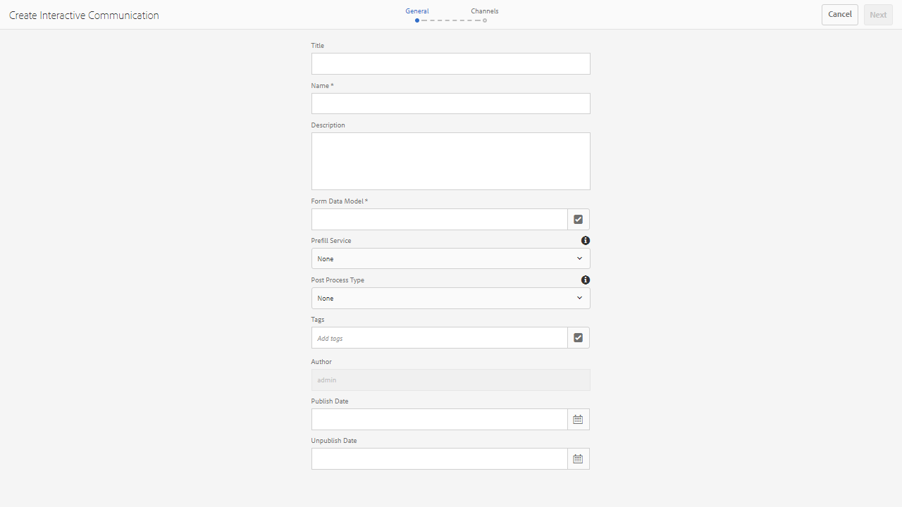
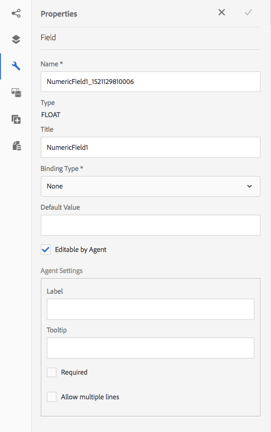

# Criar uma comunicação interativa {#create-an-interactive-communication}

Crie uma comunicação interativa usando o editor de comunicação interativa. Use a funcionalidade de arrastar e soltar para criar a Comunicação interativa e visualizar as saídas de impressão e da Web em diferentes tipos de dispositivos.

## Visão geral {#overview}

O Interative Communications centraliza e gerencia a criação, a montagem e a entrega de correspondências personalizadas e interativas. Utilize a impressão como canal mestre para a Web, você pode minimizar a duplicação de esforços ao criar a saída da Web da Interative Communication.

### Pré-requisitos {#prerequisites}

Estes são os pré-requisitos para a criação de uma comunicação interativa:

* Configure um Modelo [de dados de](/help/forms/using/data-integration.md) formulário contendo dados de teste ou com uma fonte de dados real, como uma instância do Microsoft® Dynamics.
* Verifique se você tem os fragmentos [do](/help/forms/using/document-fragments.md)Documento.
* Verifique se você tem [Modelos para impressão e canal](/help/forms/using/web-channel-print-channel.md)da Web.
* Certifique-se de ter o [tema](/help/forms/using/themes.md) necessário para o canal da Web.

## Criar a comunicação interativa {#createic}

1. Faça logon na instância do autor do AEM e navegue até **[!UICONTROL Adobe Experience Manager]** > **[!UICONTROL Formulários]** > **[!UICONTROL Formulários e documentos]**.
1. Toque em **[!UICONTROL Criar]** e selecione Comunicação **** interativa. A página Criar comunicação interativa é exibida.

   

1. Digite as seguintes informações. :

   * **[!UICONTROL Título]**: Insira o título da Comunicação interativa.
   * **[!UICONTROL Nome*]**: O nome da Comunicação interativa é derivado do título inserido. Edite-o, se necessário.
   * **[!UICONTROL Descrição]**: Insira uma descrição sobre a Comunicação interativa.
   * **[!UICONTROL Modelo de dados do formulário*]**: Navegue e selecione o modelo de dados do formulário. Para obter mais informações sobre o Modelo de dados de formulário, consulte Integração [de dados de formulários](/help/forms/using/data-integration.md)AEM.
   * **[!UICONTROL Serviço]** de preenchimento prévio: Selecione o serviço de pré-preenchimento para recuperar os dados e pré-preencher a Comunicação interativa.
   * **[!UICONTROL Tipo]** de pós-processo: Você pode selecionar o fluxo de trabalho do AEM ou do Forms a ser acionado quando a Comunicação interativa for enviada. Selecione o tipo de fluxo de trabalho a ser acionado.
   * **[!UICONTROL Processo]** de publicação: Selecione o nome do fluxo de trabalho a ser acionado. Ao selecionar o fluxo de trabalho do AEM, forneça Caminho do anexo, Caminho do layout, Caminho do PDF, Caminho de dados de impressão e Caminho de dados da Web.
   * **[!UICONTROL Tags]**: Selecione as tags a serem aplicadas à Comunicação interativa. Você também pode digitar um nome de tag novo/personalizado e pressionar Enter para criá-lo.
   * **[!UICONTROL Autor]**: o nome do autor é automaticamente retirado do nome de usuário do usuário conectado.
   * **** Data de publicação: Informe a data para publicar a Comunicação interativa.
   * **[!UICONTROL Desfazer publicação da data]**: Informe a data para cancelar a publicação da Comunicação interativa.

1. Toque em **[!UICONTROL Avançar]**. A tela para especificar detalhes de impressão e canal da Web é exibida.
1. Digite o seguinte:

   * **[!UICONTROL Imprimir]**: Selecione essa opção para gerar o canal de impressão da Comunicação interativa.
   * **** Modelo de impressão*: Procure e selecione um XDP como modelo de impressão.
   * **** Use Imprimir Como Mestre Para Canal Da Web: Selecione essa opção para criar o canal da Web em sincronia com o canal de impressão. O uso do canal de impressão como mestre para canal da Web garante que o conteúdo e o vínculo de dados do canal da Web sejam derivados do canal de impressão e as alterações feitas no canal de impressão sejam refletidas no canal da Web quando você toca em Sincronizar. No entanto, os autores podem interromper a herança de componentes específicos no canal da Web, conforme necessário. Para obter mais informações, consulte [Sincronizar canal da Web com canal](/help/forms/using/create-interactive-communication.md#synchronize)de impressão.
   * **** Web: Selecione essa opção para gerar o canal da Web ou a saída responsiva do Interative Communication.
   * **** Modelo da Web de Comunicação Interativa*: Navegue e selecione o modelo da Web.
   * **[!UICONTROL Tema]** e **[!UICONTROL selecione Tema*]**: Navegue e selecione o tema para criar o estilo do canal da Web da Comunicação interativa. Para obter mais informações, consulte [Temas no AEM Forms](/help/forms/using/themes.md).
   Para obter mais informações sobre canal de impressão e canal da Web, consulte Canal de [impressão e canal](/help/forms/using/web-channel-print-channel.md)da Web.

1. Toque em **[!UICONTROL Criar]**. A comunicação interativa é criada e uma caixa de alerta é exibida. Toque em **[!UICONTROL Editar]** para começar a criar o conteúdo da Comunicação interativa, conforme explicado em [Adicionar conteúdo usando a interface](#step2)do usuário de criação de Comunicações interativas. Como alternativa, você pode tocar em **[!UICONTROL Concluído]** e escolher editar a Comunicação interativa posteriormente.

## Adicionar conteúdo à comunicação interativa {#step2}

Depois de criar uma Comunicação interativa, você pode usar a interface de criação de Comunicação interativa para construir seu conteúdo.

Para obter mais informações sobre a interface de criação de Comunicação interativa, consulte [Introdução à criação](/help/forms/using/introduction-interactive-communication-authoring.md)de Comunicação interativa.

1. A interface de criação de Comunicação interativa é aberta quando você toca em Editar, conforme mencionado em [Criar comunicação](#createic)interativa. Como alternativa, você pode navegar até um ativo de Comunicação interativa existente no AEM, selecioná-lo e tocar em **[!UICONTROL Editar]** para iniciar a interface de criação de Comunicação interativa.

   Por padrão, o canal de impressão da Comunicação interativa é exibido, a menos que a Comunicação interativa seja somente de canal da Web. O canal Imprimir da Comunicação Interativa exibe áreas de destino, conforme disponível no modelo de canal de impressão/XDP selecionado. Nestas áreas de destino e campos, é possível adicionar componentes ou ativos.

1. Com o canal Imprimir selecionado, selecione a guia **[!UICONTROL Componentes]** . Os seguintes componentes estão disponíveis no canal de impressão:

   | **Componente** | **Funcionalidade** |
   |---|---|
   | Gráfico | Adiciona um gráfico que pode ser usado no Interative Communication para representação visual de dados bidimensionais recuperados de uma coleção de modelo de dados de formulário. Para obter mais informações, consulte [Uso de gráficos em Comunicações](/help/forms/using/chart-component-interactive-communications.md)interativas. |
   | Fragmento do documento | Permite adicionar um componente reutilizável, como texto, lista ou condição, a uma Comunicação interativa. O componente adicionado pode ser baseado em modelo de dados de formulário ou sem um modelo de dados de formulário. |
   | Imagem | Permite inserir uma imagem. |

   Arraste e solte os componentes em sua Comunicação interativa e configure-os conforme necessário.

1. Com o canal de impressão selecionado, vá para a guia **[!UICONTROL Ativos]** e aplique o filtro para exibir somente os ativos que deseja visualizar.

   Usando o navegador Ativos, também é possível arrastar e soltar ativos diretamente nas áreas de destino de Comunicação interativa.

   

1. Arraste e solte os fragmentos do documento na Comunicação interativa. A seguir estão os tipos de fragmentos de documento que você pode usar no canal de impressão da Comunicação interativa.

<table> 
 <tbody> 
  <tr> 
   <td><strong>Tipo do fragmento do documento</strong></td> 
   <td><strong>Exemplo de propósito</strong></td> 
  </tr> 
  <tr> 
   <td><a href="/help/forms/using/texts-interactive-communications.md" target="_blank">Texto</a></td> 
   <td>Texto para adicionar endereço, email do destinatário e texto do corpo da carta </td> 
  </tr> 
  <tr> 
   <td><a href="/help/forms/using/conditions-interactive-communications.md" target="_blank">Condição</a></td> 
   <td>Condição para adicionar a imagem de cabeçalho apropriada à comunicação com base no tipo da política: Padrão ou Premium.   </td> 
  </tr> 
  <tr> 
   <td>Lista</td> 
   <td>Grupo de fragmentos de documento, incluindo texto, condições, outras listas e imagens.   </td> 
  </tr> 
 </tbody> 
</table>

Para obter mais informações sobre fragmentos de documento, consulte Fragmentos [de](/help/forms/using/document-fragments.md)documento.

1. Para configurar o vínculo de variáveis, toque em uma variável e selecione  (Configurar) e configure as propriedades de vínculo no painel Propriedades na barra lateral.

   * **[!UICONTROL Nenhum]**: O agente preencherá o valor da variável.
   * **[!UICONTROL Fragmento]** de texto: Se selecionado, é possível navegar e selecionar um fragmento de documento de texto cujo conteúdo é renderizado no campo. Somente esses fragmentos de documento de texto podem ser vinculados a variáveis que não possuem variáveis.
   * **[!UICONTROL Objeto]** de Modelo de Dados: Selecione uma propriedade de modelo de dados de formulário cujo valor é preenchido no campo.
   Você também pode optar por configurar o fragmento do documento de texto relevante. O painel Propriedades exibe a lista de variáveis no fragmento do documento de texto. Você pode tocar em  (Editar) ao lado de um nome de variável para exibir as configurações dessa variável para edição.

1. Para adicionar uma tabela, com o canal de impressão selecionado, na guia **[!UICONTROL Ativos]** , aplique o filtro para exibir apenas os Fragmentos de layout. Arraste e solte o fragmento de layout necessário para a Comunicação interativa. Um fragmento de layout é baseado em um XDP e pode ser usado para criar layouts gráficos ou tabelas estáticas e dinâmicas no Interative Communication que são preenchidas com dados dinâmicos.

   Exemplo: Uma tabela de layout para exibir o prêmio bruto, a % de desconto de fidelidade e a disponibilidade de assistência de emergência nas estradas para políticas antigas e novas.

   Para obter mais informações sobre fragmentos de layout, consulte Fragmentos [de](/help/forms/using/document-fragments.md)documento.

1. Com o canal de impressão selecionado, na guia **[!UICONTROL Ativos]** , aplique o filtro para exibir imagens. Arraste e solte as imagens necessárias para a Comunicação interativa, como o logotipo da empresa.

   Além disso, gerencie o seguinte na Comunicação interativa:

   * [Adicionar e configurar gráficos](/help/forms/using/chart-component-interactive-communications.md)
   * [Sincronizar canal da Web com o canal de impressão](/help/forms/using/create-interactive-communication.md#synchronize)

      * Sincronização automática
      * Cancelar herança
      * Reativar herança
      * Sincronizar
   * [Anexos e acesso à biblioteca](/help/forms/using/create-interactive-communication.md#attachmentslibrary)
   * [Propriedades de campos XDP/Layout](/help/forms/using/create-interactive-communication.md#xdplayoutfieldproperties)
   * [Adicionar regras aos componentes](/help/forms/using/create-interactive-communication.md#rules)

1. Mudar para Canal **[!UICONTROL Web]**. O canal da Web é exibido no editor de Comunicação interativa. Quando você muda do canal Impressão para o canal da Web pela primeira vez, a sincronização automática ocorre. Para obter mais informações, consulte [Sincronizar canal da Web do canal](/help/forms/using/create-interactive-communication.md#synchronize)de impressão.

   Como estamos usando a opção Imprimir como mestre para a Web neste exemplo, os espaços reservados, o conteúdo e o vínculo de dados do canal de Impressão são sincronizados com o canal da Web. No entanto, você pode alterar e personalizar o conteúdo específico no canal da Web, conforme necessário.

   

1. Para adicionar outros componentes no canal da Web, com o canal da Web selecionado, toque em **[!UICONTROL Componentes]**. Arraste e solte componentes no canal da Web de sua Comunicação interativa, conforme necessário, e continue a configurá-los.

   | Componentes | Funcionalidade |
   |---|---|
   | Gráfico | Adiciona um gráfico que pode ser usado no Interative Communication para representação visual de dados bidimensionais recuperados de uma coleção de modelo de dados de formulário. Para obter mais informações, consulte [Uso do componente](/help/forms/using/chart-component-interactive-communications.md)gráfico. |
   | Fragmento do documento | Permite adicionar um componente reutilizável, texto, lista ou condição, a uma Comunicação interativa. O componente reutilizável adicionado a uma Comunicação interativa pode ser baseado em modelo de dados de formulário ou sem um modelo de dados de formulário. |
   | Imagem | Permite inserir uma imagem. |
   | Painel | O componente Painel é um espaço reservado para agrupar outros componentes e controla como um grupo de componentes, como acordeão e guias, é apresentado na Comunicação interativa. Um componente de painel também permite tornar um grupo de componentes repetíveis para o usuário final, como em várias entradas necessárias para o preenchimento de credenciais educacionais. |
   | Tabela | Adiciona uma tabela que permite organizar dados em linhas e colunas. |
   | Área de destino | Insere uma área de destino em um canal da Web para organizar os componentes específicos do canal da Web. A área de destino é um contêiner simples que permite agrupar componentes específicos de canais da Web. |
   | Texto | Adiciona rich text ao canal da Web de uma Comunicação interativa. O texto também pode usar objetos de modelo de dados de formulário para tornar o conteúdo dinâmico. |

1. Conforme necessário, insira ativos em seu canal da Web.

   Você pode [visualizar sua Comunicação](#previewic) interativa para ver como são as saídas de impressão e da Web da Comunicação interativa e continuar fazendo alterações, conforme necessário.

## Visualizar a comunicação interativa {#previewic}

Você pode usar a opção **[!UICONTROL Visualizar]** para avaliar a aparência da Comunicação interativa. O canal da Web de Comunicação interativa também oferece uma opção para emular a experiência de uma Comunicação interativa para vários dispositivos. Por exemplo, iPhone, iPad e Desktop. Você pode usar as opções **[!UICONTROL Visualizar]** e **[!UICONTROL Emulador]** de  em conjunto para visualizar as saídas da Web de dispositivos de tamanhos de tela diferentes. A amostra de dados na visualização é preenchida a partir do modelo de dados de formulários especificado.

1. Selecione o canal (impressão ou Web) para visualizar e tocar em visualizar. A comunicação interativa é exibida.

   >[!NOTE]
   >
   >A visualização é preenchida com os dados de amostra do modelo de dados de formulário especificado. Para obter mais informações sobre como visualizar a Comunicação interativa com outros dados ou usar o serviço de preenchimento prévio, consulte [Usar o modelo](/help/forms/using/using-form-data-model.md) de dados do formulário e [Trabalhar com o modelo](/help/forms/using/work-with-form-data-model.md)de dados do formulário.

1. Para o canal da Web, use a  para exibir a aparência da Comunicação interativa em vários dispositivos.

   

Além disso, você pode [Preparar e enviar comunicação interativa usando a interface do usuário](/help/forms/using/prepare-send-interactive-communication.md)do agente.

## Configuração de propriedades no Interative Communication {#configuring-properties-in-interactive-communication}

### Anexos e acesso à biblioteca {#attachmentslibrary}

No canal Imprimir, você pode configurar os anexos e o acesso à biblioteca para permitir que o Agente gerencie os anexos na interface do agente para a comunicação interativa:

1. No canal Imprimir, realce o Contêiner de documento e toque em **[!UICONTROL Propriedades]**.

   

   O painel Propriedades é exibido na barra lateral.

   

1. Expanda **[!UICONTROL Anexos]** e especifique as seguintes propriedades:

   * **[!UICONTROL Permitir acesso]**&#x200B;à biblioteca: Selecione para habilitar o acesso à biblioteca para o agente na interface do usuário do agente. Se ativado, o Agente pode adicionar arquivos da biblioteca enquanto prepara a Comunicação interativa.
   * **[!UICONTROL Permitir Reordenação De Anexos]**: Selecione para permitir que o Agente reordene os anexos com a Comunicação interativa.
   * **[!UICONTROL Número Máximo De Anexos Permitidos]**: Especifique o número máximo de anexos permitidos com a Comunicação interativa.
   * **[!UICONTROL Arquivos a serem anexados]**: Toque em **[!UICONTROL Adicionar]** e navegue para selecionar os arquivos a serem anexados e especifique o seguinte:

      * **[!UICONTROL Anexar Este Arquivo Ao Documento Por Padrão]**: É possível alterar essa opção se apenas o anexo não for Obrigatório.
      * **** Obrigatória: O agente não poderá remover o anexo na interface do agente.
   

1. Toque em **[!UICONTROL Concluído]**.

### Propriedades de campos XDP/Layout {#xdplayoutfieldproperties}

1. Ao editar o canal de Impressão de uma Comunicação interativa, passe o mouse sobre um campo, que é integrado ao modelo de canal de Impressão, e selecione  (Configurar).

   A caixa de diálogo Propriedades é exibida na barra lateral.

   

1. Especifique o seguinte:

   * **[!UICONTROL Nome]**: Nome do nó JCR.
   * **[!UICONTROL Título]**: Insira um título que estará visível para o Agente na interface do usuário do Agente e na árvore Contêiner de documentos.
   * **[!UICONTROL Tipo]** de vínculo: Selecione um dos seguintes tipos de vínculo para o campo.

      * Nenhum: O agente preencherá o valor da propriedade.
      * Fragmento de texto: Se selecionado, é possível navegar e selecionar um fragmento de documento de texto cujo conteúdo é renderizado no campo.
      * Objeto de modelo de dados: Selecione uma propriedade de modelo de dados de formulário cujo valor é preenchido no campo.
   * **[!UICONTROL Valores]** padrão: O valor padrão garante que o campo não esteja vazio quando não houver valor fornecido pelo objeto de modelo de dados ou fragmento de texto especificado. Se o tipo de vínculo de dados for nenhum, o valor padrão será pré-preenchido no campo.
   * **[!UICONTROL Editável pelo agente]**: Selecione para permitir que o agente edite o valor no campo na interface do usuário do agente. Essa configuração não se aplica se o Tipo de vínculo for Fragmento de texto.
   * **[!UICONTROL Rótulo]**: Especifique uma string de texto exibida com o campo para o Agente na interface do usuário do agente. Essa configuração não se aplica se o Tipo de vínculo for Fragmento de texto.
   * **[!UICONTROL Dica de ferramenta]**: Insira uma string de texto que estará visível com o mouse sobre o Agente na interface do usuário do agente. Essa configuração não se aplica se o Tipo de vínculo for Fragmento de texto.
   * **[!UICONTROL Obrigatório]**: Selecione para tornar o campo obrigatório para o Agente. Essa configuração não se aplica se o Tipo de vínculo for Fragmento de texto.
   * **[!UICONTROL Permitir várias linhas]**: Selecione esse campo para permitir várias linhas de texto como entrada no campo. Essa configuração não se aplica se o Tipo de vínculo for Fragmento de texto.

1. Toque em .

## Aplicar regras a componentes de Comunicação interativa {#rules}

Para condicionar componentes ou conteúdo na comunicação interativa, toque no componente/parte do conteúdo e selecione  (Criar regra) para iniciar o Editor de regras.

Para obter mais informações, consulte:

* [Editor de regras](/help/forms/using/rule-editor.md)
* [Introdução à criação de comunicação interativa](/help/forms/using/introduction-interactive-communication-authoring.md)

## Uso de tabelas {#tables}

### Tabelas dinâmicas no Interative Communication {#dynamic-tables-in-interactive-communication}

É possível adicionar tabelas dinâmicas no Interative Communication usando fragmentos de layout. As etapas a seguir usam um exemplo de uma declaração de cartão de crédito para ilustrar o uso de um fragmento de layout para criar uma tabela dinâmica em uma Comunicação interativa.

1. Verifique se o fragmento de layout necessário para criar a tabela está disponível no AEM.
1. No canal de impressão de sua Comunicação interativa, arraste e solte um fragmento de layout (com uma tabela de várias colunas) em uma Área de destino no navegador Ativos.

   

   Uma tabela é exibida na área de layout Comunicação interativa.

   

1. Especifique o vínculo de dados para cada uma das células da tabela. Para criar uma linha repetível, insira as propriedades do modelo de dados de formulário na linha que pertence a uma propriedade de coleção comum.

   1. Toque em uma célula na tabela e selecione  (Configurar).

      A caixa de diálogo Propriedades é exibida na barra lateral.

      

   1. Configure as propriedades:

      * **[!UICONTROL Nome]**: Nome do nó JCR.
      * **[!UICONTROL Título]**: Insira um título que estará visível no editor de Comunicação interativa.
      * **[!UICONTROL Tipo]** de Vínculo;ast;: Selecione um dos seguintes tipos de vínculo para o campo.

         * **[!UICONTROL Nenhum]**
         * **[!UICONTROL Objeto]** de modelo de dados: O valor de uma propriedade de modelo de dados de formulário é preenchido no campo.
      * **[!UICONTROL Objeto]** de Modelo de Dados: A propriedade form data model cujo valor é preenchido no campo.
      * **[!UICONTROL Valor]** padrão: O valor padrão garante que o campo não esteja vazio quando não houver valor fornecido pelo objeto de modelo de dados especificado. O valor padrão é preenchido previamente no campo.
      * **[!UICONTROL Editável pelo agente]**: Selecione para permitir que o agente edite o valor no campo na interface do usuário do agente.
   1. Toque em .

1. Visualize a Comunicação interativa para ver a tabela renderizada com os dados.

   

### Tabelas somente de canais da Web {#web-channel-only-tables}

É possível criar uma tabela dinâmica somente de canal da Web em uma Comunicação interativa usando uma propriedade de modelo de dados da coleção de tipos. Essa tabela é uma representação das propriedades filhas de uma coleção. É possível editar apenas as propriedades de formatação das várias células na tabela.

1. Alterne para o canal da Web e escolha exibir o navegador das Fontes de Dados.
1. Arraste e solte uma propriedade de coleção em um subformulário.

   Uma tabela é criada no subformulário.

1. Visualize a tabela na visualização da Web da Comunicação interativa.

## Sincronizar canal da Web com canal de impressão {#synchronize}

Quando você seleciona Imprimir como mestre para canal da Web ao criar uma comunicação interativa, o canal da Web é criado em sincronia com o canal de impressão e o conteúdo e o vínculo de dados do canal da Web são derivados do canal de impressão e as alterações feitas no canal de impressão são refletidas no canal da Web quando você toca em Sincronizar.

No entanto, os autores podem quebrar a herança de componentes no canal da Web, conforme necessário.
Clique para[ampliar](assets/printweb_2-3.png)

### Sincronização automática {#auto-sync}

Se você estiver usando o Canal de impressão como o mestre para o canal da Web e alternar para o canal da Web do canal de impressão, a sincronização automática ocorrerá. A sincronização automática traz os espaços reservados, o conteúdo e o vínculo de dados para o canal da Web a partir do canal Imprimir. Dependendo da complexidade e do conteúdo de sua Comunicação interativa, a sincronização automática pode levar algum tempo.

>[!NOTE]
>
>A sincronização dos canais sincroniza apenas fragmentos de documento, imagens, condições, listas e fragmentos de layout do canal de impressão para o canal da Web. Os subformulários ou os nós pai desses elementos não são sincronizados.

### Cancelar herança {#cancel-inheritance}

No canal da Web, os componentes são incorporados nas áreas de destino.

Passe o mouse sobre a área de destino relevante no canal da Web e selecione  (Cancelar herança) e, em seguida, na caixa de diálogo Cancelar herança, toque em **[!UICONTROL Sim]**.

A herança dos componentes dentro da área de destino é cancelada e agora você pode editá-los conforme necessário.

### Reativar herança {#re-enable-inheritance}

No canal da Web, se você cancelou a herança de um componente, poderá reativá-lo. Para reativar a herança, passe o mouse sobre o limite da área de destino relevante, que inclui o componente, e toque em .

A caixa de diálogo Reverter herança é exibida.

Se necessário, selecione **[!UICONTROL Sincronizar a página depois de reverter herança]**. Selecione essa opção para sincronizar toda a comunicação interativa. Se você não selecionar essa opção, somente a área de destino relevante será sincronizada ao reinstalar a herança.

Toque em **[!UICONTROL Sim]**.

### Sincronizar {#synchronize-1}

Se estiver usando a opção Imprimir como mestre para canal da Web e fizer alterações no canal de impressão, você poderá tocar em Sincronizar para trazer as alterações feitas recentemente para o canal da Web.

1. Para sincronizar o canal da Web com o canal Imprimir, toque em **[!UICONTROL Sincronizar]**.

   A caixa de diálogo Sincronizar conteúdo do canal mestre é exibida.

   

1. Toque em uma das seguintes opções:

   * **[!UICONTROL Descartar alterações]**: Descarta todas as alterações feitas no canal da Web, independentemente das alterações feitas no canal da Web.
   * **[!UICONTROL Manter alterações]**: Sincroniza o conteúdo somente para as áreas de destino nas quais a herança não é cancelada.

