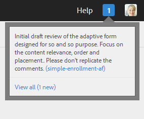

# Criar e gerenciar revisões de ativos nos formulários {#creating-and-managing-reviews-for-assets-in-forms}

>[!CAUTION]
>
>AEM 6.4 chegou ao fim do suporte estendido e esta documentação não é mais atualizada. Para obter mais detalhes, consulte nossa [períodos de assistência técnica](https://helpx.adobe.com/br/support/programs/eol-matrix.html). Encontre as versões compatíveis [here](https://experienceleague.adobe.com/docs/).

## Análise {#review}

Uma Revisão é um mecanismo que permite a um ou mais revisores comentar um ativo que está disponível em um formulário.

## Configurar uma revisão {#setting-up-a-review}

1. Navegue até a guia Forms e selecione um formulário.
1. Se o ativo não tiver uma revisão em andamento, uma revisão de Início  é exibido na barra Ação. Clique em Iniciar revisão  ícone .
1. Insira as seguintes informações:

   * Nome da revisão: Obrigatório, pode conter caracteres alfanuméricos, hífen ou sublinhado.
   * Descrição da revisão: Opcional, descrição da finalidade/conteúdo para revisão.
   * Prazo de revisão: Opcional, a data em que a revisão termina. Quando terminar o prazo, a tarefa aparecerá como &quot;Vencida&quot;.
   * Revisores: Um mínimo de um é obrigatório. Use a caixa de combinação para adicionar revisores. A digitação de um nome lista todos os nomes correspondentes; selecione um nome e clique em Adicionar.

1. Preencha todos os detalhes restantes e clique em Start.

### Ações que ocorrem quando uma revisão é configurada {#actions-that-occur-when-a-review-is-set-up}

Esta seção descreve o que acontece quando uma revisão é criada ou configurada.

1. Uma nova tarefa de revisão é criada e atribuída ao iniciador da revisão.
1. Todos os revisores recebem uma tarefa de revisão. A tarefa é exibida na seção Notifications. Um revisor pode clicar em uma notificação ou ir para a Caixa de entrada para exibir a tarefa. Um revisor pode clicar em para abrir a tarefa de revisão, exibir o formulário e começar a adicionar comentários.

   
   **Figura:** *Alerta de notificação do revisor*

1. A caixa de comentário está disponível para o iniciador e os revisores do ativo. Outros podem exibir os comentários, mas não podem escrever comentários.

## Gerenciamento de uma revisão {#managing-a-review}

>[!NOTE]
>
>Somente as revisões em andamento podem ser modificadas. As revisões concluídas não podem ser modificadas.

1. Navegue até a guia Forms e selecione um formulário.

1. Se um ativo tiver uma revisão em andamento e você for o iniciador da revisão, uma Análise de gerenciamento  ícones é exibido na barra Ação. Somente o iniciador de revisão pode gerenciar (atualizar/encerrar) a revisão.

   Clique em Gerenciar revisão ícone .

   Para outro usuário que não iniciador, o ícone Gerenciar Revisão está desativado.

1. Você recebe uma tela que exibe informações:

   * **Nome da revisão**: Não pode ser editado.
   * **Descrição da revisão**: Disponível para edição.
   * **Prazo de revisão**: Disponível para edição. É possível modificar o prazo para qualquer data e hora além da data e hora atuais.
   * **Revisores**: Disponível para edição. Você pode adicionar ou remover revisores. Se uma tarefa estiver vencida, você poderá adicionar revisores somente após estender o prazo além da data atual.

1. Edite os campos necessários e clique em Atualizar.

   
   **Figura:** *Rever o estado atualizado no Gerenciador de Tarefas*

1. Para encerrar a revisão, clique em Finalizar.

### Ações que ocorrem quando uma revisão é modificada {#actions-that-occur-when-a-review-is-modified}

Esta seção descreve o que acontece no final / modificação da revisão:

1. Se a descrição Revisar for modificada, a tarefa correspondente dos revisores e o iniciador serão atualizados.
1. Se o prazo de Revisão for modificado, a tarefa correspondente dos revisores será atualizada com a nova data.

1. Se um revisor for removido:

   
   **Figura:** *Remover um revisor*

   1. Se estiver incompleta, a tarefa atribuída será encerrada.
   1. O revisor não pode mais comentar o ativo.

1. Se um revisor for adicionado:

   
   **Figura:** *Adicionar um revisor*

   1. Uma tarefa de revisão é criada e atribuída ao revisor recém-adicionado.
   1. O revisor recém-adicionado pode adicionar comentários ao ativo.

1. Quando uma revisão termina:

   1. **Revisores**: Para cada revisor, a tarefa incompleta relacionada à revisão é encerrada. A tarefa não é mais exibida como &quot;Pendente&quot; na seção Notificações do revisor.
   1. **Iniciador**: A tarefa atribuída ao iniciador Revisar está marcada como concluída. A tarefa é removida da seção Notification do iniciador de revisão.
   1. **Todos**: A revisão é exibida na seção Revisões anteriores . Não podem ser acrescentadas outras observações.
