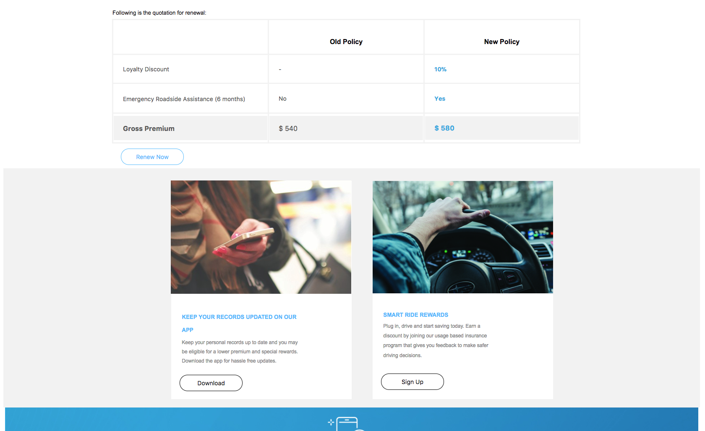

# NÃO PUBLICAR Crie seu primeiro documento adaptativo {#do-not-publish-create-your-first-adaptive-document}

## Caso de uso  {#use-case}

O We Finance é uma organização líder no domínio de Serviços Financeiros que oferece soluções financeiras abrangentes e personalizadas para atender às necessidades de diversos perfis de clientes.

Uma das apólices de seguro automático dos clientes está expirando e eles estão enviando um lembrete, que é interativo e inclui um PDF, com a citação de renovação. A comunicação também inclui outras informações, como prêmios de fidelidade e ofertas de descontos.

O portal é executado no Adobe AEM. A saída do canal de boas-vindas da Web e da impressão é criada usando os recursos multicanal do documento adaptativo.

No final do tutorial, você terá um documento adaptável semelhante ao seguinte:
[ ad-1 ](https://blogs.adobe.com/contentcorner/files/2017/07/PAF_Mobile.pdf)[ ad-2 ](https://blogs.adobe.com/contentcorner/files/2017/07/PAF_Desktop.pdf)A criação do seu primeiro tutorial de documento adaptável é categorizada em etapas. Cada etapa é um artigo completo em si mesmo.

<table> 
 <tbody>
  <tr>
   <th>Você aprenderá</th> 
   <th>
    <ul> 
     <li>Criação de um documento adaptável e um modelo de dados de formulário.</li> 
     <li>Criação de modelos e temas para documentos adaptáveis.</li> 
     <li>Uso do editor de regras para criar regras de negócios.  </li> 
     <li>Publicar um documento adaptativo.   </li> 
    </ul> </th> 
  </tr>
  <tr>
   <td>Pré-requisitos</td> 
   <td>
    <ul> 
     <li>Instale a instância do autor do AEM. </li> 
     <li>Instalar complemento do AEM Forms. Para obter informações detalhadas, consulte <a href="/help/forms/using/installing-configuring-aem-forms-osgi.md" target="_blank">Instalar e configurar o AEM Forms</a>.</li> 
     <li>Obtenha o driver de banco de dados JDBC (arquivo JAR) do provedor de banco de dados. Os exemplos no tutorial são baseados no banco de dados MySQL e usam o driver de banco de dados MySQL JDBC da Oracle. </li> 
     <li>Configure um banco de dados contendo dados do cliente. Um banco de dados é essencial para criar um documento adaptável. Este tutorial usa um banco de dados para exibir o modelo de dados do formulário e os recursos de persistência do AEM Forms. </li> 
     <li>Crie/importe e ative <a href="/help/forms/using/web-channel-print-channel.md">Modelos para impressão e canal</a>da Web.</li> 
     <li>Verifique se você tem os fragmentos <a href="/help/forms/using/document-fragments.md">do Documento com base no FDM</a>.</li> 
    </ul> </td> 
  </tr>
 </tbody>
</table>

## Step 1: Create Form Data Model {#step-create-form-data-model}

Um modelo de dados de formulário permite conectar um documento adaptável a fontes de dados diferentes. Por exemplo, perfil de usuário do AEM, serviços Web RESTful, serviços da Web baseados em SOAP, serviços OData e bancos de dados relacionais. Um modelo de dados de formulário é um esquema unificado de representação de dados de entidades de negócios e serviços disponíveis em fontes de dados conectadas. Você pode usar o modelo de dados de formulário com um documento adaptável para recuperar dados de fontes de dados conectadas. Para obter mais informações sobre o modelo de dados de formulário, consulte Integração [de dados de formulários](/help/forms/using/data-integration.md)AEM.

Objetivos:

* Configurar a instância do banco de dados (Microsoft Dynamics) como uma fonte de dados
* Criar o modelo de dados de formulário usando o Microsoft Dynamics como fonte de dados
* Adicionar objetos de modelo de dados ao modelo de dados de formulário
* Configurar serviços de leitura e gravação para o modelo de dados de formulário
* Testar modelo de dados de formulário e serviços configurados com dados de teste

## Etapa 2: Criar um documento adaptável {#step-create-an-adaptive-document}

A Customer Communications centraliza e gerencia a criação, montagem e entrega de correspondências seguras, personalizadas e interativas, como correspondência comercial, cartas, documentos, declarações, avisos de benefícios, prospetos de gerenciamento de riquezas, emails de marketing, contas e kits de boas-vindas.

Usando documentos adaptáveis, você pode criar comunicações de clientes que são envolventes, responsivas, dinâmicas e adaptáveis por natureza. O AEM Forms fornece um editor WYSIWYG para criar documentos adaptáveis.

<!--`For more information about adaptive documents, see [Introduction to authoring adaptive documents](/forms/using/introduction-ad-authoring.md).`-->

Objetivos:

* Crie uma saída impressa e da Web de um documento adaptável com base no modelo de dados do formulário.
* Campos de layout de um formulário adaptável para exibir informações ao cliente
* Crie regras para recuperar e exibir informações do modelo de dados de formulário para documento adaptável.

<!---->

## Etapa 3: Aplicar regras a campos de documento adaptáveis (somente canal da Web) {#step-apply-rules-to-adaptive-document-fields-web-channel-only}

O documento adaptável fornece um editor para escrever regras em objetos de documento adaptáveis. Essas regras definem ações para acionar objetos de documento com base em condições predefinidas e ações do usuário no documento. Isso ajuda a garantir a precisão e acelera a experiência do usuário na versão da Web do documento adaptável. Para obter mais informações sobre regras de documento adaptáveis e editor de regras, consulte o editor [de](/help/forms/using/rule-editor.md)regras.

Objetivos:

* Criar e aplicar regras aos campos de canal da Web do documento adaptável
* Usar regras para acionar serviços de modelo de dados de documento no canal da Web

## Etapa 4: Estilo do documento adaptativo (somente canal da Web) {#step-style-the-adaptive-document-web-channel-only}

Documentos adaptáveis fornecem um editor para criar temas para os documentos adaptáveis e estilo em linha. Um tema contém detalhes de estilização para componentes e painéis, e você pode reutilizar um tema em canais da Web de diferentes documentos. Os estilos incluem propriedades como cores de plano de fundo, cores de estado, transparência, alinhamento e tamanho. Quando você aplica o tema ao seu documento, o estilo especificado reflete nos componentes correspondentes do documento. For more information, see [Themes](/help/forms/using/themes.md).

Objetivos:

* Criar tema para o canal da Web de documentos adaptáveis
* Aplicar tema ao canal da Web do documento adaptável
* Validar a aparência do canal da Web do documento adaptável em dispositivos móveis e desktop

## Etapa 5: Publicar o documento adaptativo {#step-publish-the-adaptive-document}

Quando terminar de criar seu documento adaptativo, você precisará publicá-lo para que ele fique disponível na sua instância de publicação, onde os agentes poderão usar o documento adaptativo para criar as instâncias de comunicação baseadas nele.

Para publicar o documento adaptativo, os autores do documento precisam ter as permissões necessárias.
