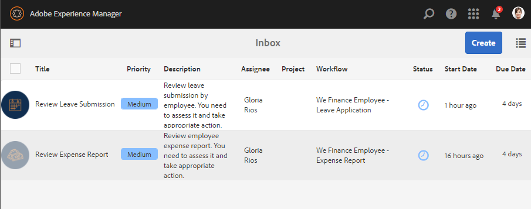

# Apresentação do site de referência de autoatendimento do funcionário {#employee-self-service-reference-site-walkthrough}

## Pré-requisitos {#prerequisite}

Configure os sites de referência conforme descrito em [Configurar e configurar os sites](/help/forms/using/setup-reference-sites.md)de referência do AEM Forms.

## Visão geral {#overview}

Os sistemas de autoatendimento dos funcionários, geralmente hospedados na Intranet da empresa, fornecem aos funcionários acesso a uma variedade de informações e serviços que eles podem utilizar em suas mesas. Permite e dá controle total aos funcionários para realizar ações como acessar seus detalhes de emprego, solicitar licença e enviar relatórios de despesas. Por outro lado, ajuda as organizações a melhorar a eficiência dos processos e a reduzir os custos, mantendo os funcionários informados e envolvidos.

O site de referência de autoatendimento do funcionário mostra como você pode aproveitar o AEM Forms para implementar o sistema de autoserviços do funcionário na sua organização.

>[!NOTE]
>
>Os casos de uso de autoatendimento do funcionário estão disponíveis nos sites de referência We.Finance e We.Gov. Os exemplos, imagens e descrições usados nas orientações usam o site de referência We.Finance. No entanto, você pode executar esses casos de uso e revisar artefatos usando We.Gov também. Para fazer isso, você deve substituir **we-finance** por **we-gov** nos URLs mencionados.

## Apresentação do questionário de conflito de interesses {#conflict-of-interest-questionnaire-walkthrough}

As organizações, de tempos em tempos, pedem aos seus funcionários que enviem um questionário Conflict of Interest para identificar atividades externas ou relações pessoais de seus funcionários que podem potencialmente entrar em conflito com sua organização.

O departamento de Conformidade da organização de Sarah pediu aos funcionários que enviassem o questionário Conflict of Interest .

### Sarah submete o questionário Conflict of Interest {#sarah-submits-the-conflict-of-interest-questionnaire}

Sarah acessa o portal, faz login e clica em Funcionário para acessar o painel do funcionário. Ela encontra o questionário Conflict of Interest no painel do funcionário e clica em **[!UICONTROL Apply (Aplicar]**).

 we-finance-home **** Figura: Portal *da organização*

 empregado-dashboard **** Figura: Painel de *funcionários*

Sarah navega o formulário usando o botão Avançar e lê pelas seções Introdução e Definição. Ela responde às perguntas na seção Perguntas. Por último, assina e envia o questionário.

O portal da organização e o questionário são responsivos e acessíveis para dispositivos móveis. O fluxo de trabalho a seguir mostra como Sarah navega e envia o questionário em seu dispositivo móvel.

**Como funciona**

O portal da organização e o painel do funcionário são páginas do AEM Sites. O painel lista várias opções de autoatendimento, como o questionário Conflito de interesses. O botão Aplicar está vinculado a um formulário adaptável.

O formulário adaptativo usa regras para mostrar e ocultar informações com base na resposta fornecida na guia Perguntas. Além disso, o formulário usa o componente Scribble para assinar na guia Declaração. Revise o formulário adaptável em `https://[authorHost]:[authorPort]/editor.html/content/forms/af/we-finance/employee/self-service/conflict-of-interest.html`.

**Veja você mesmo**

Vá para `https://[publishHost]:[publishPort]/content/we-finance/global/en/self-service-forms.html` e faça logon usando `srose/srose` como nome de usuário/senha para Sarah. Clique em **[!UICONTROL Funcionário]** para acessar o painel e clique em **[!UICONTROL Aplicar]** no questionário Conflito de interesses. Revise e envie o questionário.

### Gloria revê e aprova a apresentação do questionário Conflict of Interest {#gloria-reviews-and-approves-the-conflict-of-interest-questionnaire-submission}

O questionário Conflict of Interest (Conflito de Interesses) apresentado por Sarah é enviado à Gloria Rios para revisão. Gloria trabalha como oficial de conformidade na organização. Gloria faz logon na Caixa de entrada do AEM e analisa as tarefas atribuídas a ela. Ela aprova o questionário enviado pela Sarah e completa a tarefa.

 caixa de entrada de conflito **** Figura: Caixa de entrada de *Gloria*

 aprovada **por conflito** Figura: *Abrir tarefa*

**Como funciona**

A ação de envio no questionário Conflito de interesses aciona um fluxo de trabalho que cria uma tarefa na caixa de entrada de Gloria para aprovação. Revise o fluxo de trabalho dos formulários em `https://[authorHost]:[authorPort]/editor.html/conf/global/settings/workflow/models/we-finance/employee/self-service/we-finance-employee-conflict-of-interest.html`

**Veja você mesmo**

Vá para `https://[publishHost]:[publishPort]/content/we-finance/global/en/login.html?resource=/aem/inbox.html` e faça logon usando `grios/password` como nome de usuário/senha para Gloria Rios. Abra a tarefa criada para o questionário Conflito de interesses e aprove-a.

## Passeio pelo aplicativo de cartão corporativo {#corporate-card-application-walkthrough}

Sarah viaja muito por negócios e precisa de um cartão de crédito corporativo para pagar suas contas em movimento. Ela se candidata a um cartão corporativo através do portal de funcionários de sua organização.

### Sarah submete o pedido de Cartão Corporativo {#sarah-submits-the-corporate-card-application}

Sarah vai ao portal de sua organização, faz logon e clica em **[!UICONTROL Funcionário]** para acessar o painel do funcionário. Ela encontra o aplicativo Cartão corporativo no painel do funcionário e clica em **[!UICONTROL Aplicar]**.

 we-finance-home-1 **** Figura: Portal *da organização*

 empregado-dashboard-1 **** Figura: Painel de *funcionários*

Ela clica em **[!UICONTROL Aplicar]** no aplicativo Cartão corporativo. Um aplicativo de página única é aberto. Ela preenche todos os detalhes e clica em **[!UICONTROL Aplicar]** para enviar a solicitação.

**Como funciona**

O portal da organização e o painel do funcionário são páginas do AEM Sites. O painel lista várias opções de autoatendimento, como o aplicativo de cartão corporativo. O botão Aplicar no aplicativo está vinculado a um formulário adaptável.

O formulário adaptável para o aplicativo de cartão corporativo é um formulário adaptável simples, de uma página e responsivo. Ele usa componentes básicos de formulário adaptável, como texto, telefone, caixa numérica e entrada numérica. Revise o formulário adaptável em:\
`https://[authorHost]:[authorPort]/editor.html/content/forms/af/we-finance/employee/self-service/corporate-card.html`.

**Veja você mesmo**

Vá para `https://[publishHost]:[publishPort]/content/we-finance/global/en/self-service-forms.html` e faça logon usando `srose/srose` como nome de usuário/senha para Sarah. Clique em **[!UICONTROL Funcionário]** para acessar o painel e clique em **[!UICONTROL Aplicar]** no aplicativo Cartão corporativo. Preencha os detalhes e envie o pedido.

### Gloria revisa e aprova o aplicativo de cartão corporativo {#gloria-reviews-and-approves-the-corporate-card-application}

O pedido de cartão corporativo apresentado por Sarah é atribuído a Gloria Rios para revisão. Gloria faz logon na Caixa de entrada do AEM e analisa as tarefas atribuídas a ela. Ela aprova o pedido enviado pela Sarah e completa a tarefa.

 caixa de entrada **de cartão corporativo** Figura: Caixa de entrada de *Gloria*

 aprovado **pela placa corporativa** Figura: *Abrir tarefa*

**Como funciona**

O fluxo de trabalho de envio no aplicativo Cartão corporativo aciona um fluxo de trabalho de formulários que cria uma tarefa na caixa de entrada de Gloria para aprovação. Revise o fluxo de trabalho dos formulários em `https://[authorHost]:[authorPort]/editor.html/conf/global/settings/workflow/models/we-finance/employee/self-service/we-finance-employee-corporate-card.html`

**Veja você mesmo**

Vá para `https://[publishHost]:[publishPort]/content/we-finance/global/en/login.html?resource=/aem/inbox.html` e faça logon usando `grios/password` como nome de usuário/senha para Gloria Rios. Abra a tarefa criada para o aplicativo Cartão corporativo e aprove-a.

## Apresentação do relatório de despesas {#expense-report-submission-walkthrough}

Como Sarah passa durante viagens de negócios, ela precisa submeter relatórios de despesas para aprovação. A opção de autoatendimento em sua organização permite que ela envie o relatório de despesas on-line.

### Sarah submete a aplicação Relatório de Despesas {#sarah-submits-the-expense-report-application}

Sarah vai ao portal de sua organização, faz logon e clica em **[!UICONTROL Funcionário]** para acessar o painel do funcionário. Ela encontra o aplicativo Relatório de despesas no painel do funcionário e clica em **[!UICONTROL Aplicar]**.

 we-finance-home-2 **** Figura: Portal *da organização*

 empregado-dashboard-2 **** Figura: Painel de *funcionários*

Ela clica em **[!UICONTROL Aplicar]** no aplicativo Relatório de despesas. Um formulário de aplicativo é aberto, com duas guias: Nome do relatório e Detalhes do relatório. O ícone **+** na guia Detalhes do relatório permite que ela adicione mais de dispêndios em um relatório.

O portal da organização e os aplicativos são responsivos e compatíveis com dispositivos móveis. O fluxo de trabalho a seguir mostra como Sarah navega e envia o relatório de despesas em seu dispositivo móvel.

**Como funciona**

O portal da organização e o painel do funcionário são páginas do AEM Sites. O painel lista várias opções de autoatendimento, como o aplicativo Relatório de despesas. O botão Aplicar está vinculado a um formulário adaptável.

As guias Nome do relatório e Detalhes do relatório no formulário adaptativo são componentes do Painel. O painel Detalhes do relatório contém o painel Despesas. É um painel repetível que permite adicionar vários dispêndios no relatório. Consulte o formulário adaptável e suas configurações em `https://[authorHost]:[authorPort]/editor.html/content/forms/af/we-finance/employee/expense-report.html`.

**Veja você mesmo**

Vá para `https://[publishHost]:[publishPort]/content/we-finance/global/en/self-service-forms.html` e faça logon usando `srose/srose` como nome de usuário/senha para Sarah. Clique em **[!UICONTROL Funcionário]** para acessar o painel e clique em **[!UICONTROL Aplicar]** no aplicativo Relatório de despesas. Preencha os detalhes e envie o pedido.

### Gloria revisa e aprova o relatório de despesas {#gloria-reviews-and-approves-the-expense-report}

O relatório de despesas enviado por Sarah é atribuído a Gloria Rios para revisão. Gloria faz logon na Caixa de entrada do AEM e analisa as tarefas atribuídas a ela. Ela aprova o pedido enviado pela Sarah e completa a tarefa.

 caixa de entrada **de relatório de despesas** Figura: Caixa de entrada de *Gloria*

 relatório de despesas aprovado **** Figura: *Abrir tarefa*

**Como funciona**

O fluxo de trabalho de envio no aplicativo Relatório de despesas aciona um fluxo de trabalho do Forms que cria uma tarefa na caixa de entrada do Gloria para aprovação. Revise o fluxo de trabalho dos formulários em `https://[authorHost]:[authorPort]/editor.html/conf/global/settings/workflow/models/we-finance/employee/self-service/we-finance-employee-expense-report-workflow.html`

**Veja você mesmo**

Vá para `https://[publishHost]:[publishPort]/content/we-finance/global/en/login.html?resource=/aem/inbox.html` e faça logon usando `grios/password` como nome de usuário/senha para Gloria Rios. Abra a tarefa criada para o aplicativo Relatório de Despesas e aprove-a.

## Deixe o aplicativo em andamento {#leave-application-walkthrough}

Sarah está planejando umas férias de família no mês que vem e quer se candidatar por uma semana de licença do trabalho.

### Sarah submete o pedido de licença {#sarah-submits-the-leave-application}

Sarah vai ao portal de sua organização, faz logon e clica em **[!UICONTROL Funcionário]** para acessar o painel do funcionário. Ela encontra o aplicativo de licença no painel do funcionário e clica em **[!UICONTROL Aplicar]**.

 we-finance-home-3 **** Figura: Portal *da organização*

 empregado-dashboard-3 **** Figura: Painel de *funcionários*

O aplicativo de sair é aberto com o nome da Sarah e a ID do funcionário pré-preenchidos no formulário. Também mostra seu equilíbrio de licenças e sua história. Ela preenche os detalhes da licença e submete o pedido de aprovação.

O portal da organização e os aplicativos são responsivos e compatíveis com dispositivos móveis. O fluxo de trabalho a seguir mostra como Sarah navega e envia o aplicativo para seu dispositivo móvel.

**Como funciona**

O portal da organização e o painel do funcionário são páginas do AEM Sites. O painel lista várias opções de autoatendimento, como deixar o aplicativo. O botão Aplicar está vinculado a um formulário adaptável.

O formulário adaptável para o aplicativo de licença baseia-se no Modelo de dados de formulário de Folhas do Funcionário. Na seção Saldo de Deixe, a tabela de saldo de esquerda é preenchida usando o serviço Modelo de Dados de `getLeavesOf` Formulário. Os campos de datas inicial e final usam regras para validar se os valores de data são iguais ou posteriores à data atual. A duração da licença é calculada usando a `calcBusinessDays` função.

É possível revisar o formulário adaptável e o Modelo de dados de formulário nos seguintes locais:

`https://[authorHost]:[authorPort]/editor.html/content/forms/af/we-finance/employee/self-service/leave-application.html`

`https://[authorHost]:[authorPort]/aem/fdm/editor.html/content/dam/formsanddocuments-fdm/db`

**Veja você mesmo**

Vá para `https://[publishHost]:[publishPort]/content/we-finance/global/en/self-service-forms.html` e faça logon usando `srose/srose` como nome de usuário/senha para Sarah. Clique em **[!UICONTROL Funcionário]** para acessar o painel e clique em **[!UICONTROL Aplicar]** em Sair do aplicativo. Preencha os detalhes e envie o pedido.

### Gloria revisa e aprova o pedido de licença {#gloria-reviews-and-approves-the-leave-application}

O pedido de licença apresentado pela Sarah é entregue à Gloria Rios para revisão. Gloria faz logon na Caixa de entrada do AEM e analisa as tarefas atribuídas a ela. Ela aprova o pedido enviado pela Sarah e completa a tarefa.

 sair da caixa **de entrada** Figura: Caixa de entrada de *Gloria*

 aprovada **pela** Festa: *Abrir tarefa*

**Como funciona**

O fluxo de trabalho de envio no aplicativo de licença aciona um fluxo de trabalho do Forms que cria uma tarefa na caixa de entrada do Gloria para aprovação. Revise o fluxo de trabalho dos formulários em `https://[authorHost]:[authorPort]/editor.html/conf/global/settings/workflow/models/we-finance/employee/self-service/we-finance-employee-leave-application.html`

**Veja você mesmo**

Vá para `https://[publishHost]:[publishPort]/content/we-finance/global/en/login.html?resource=/aem/inbox.html` e faça logon usando `grios/password` como nome de usuário/senha para Gloria Rios. Abra a tarefa criada para deixar o aplicativo e aprove-o.
