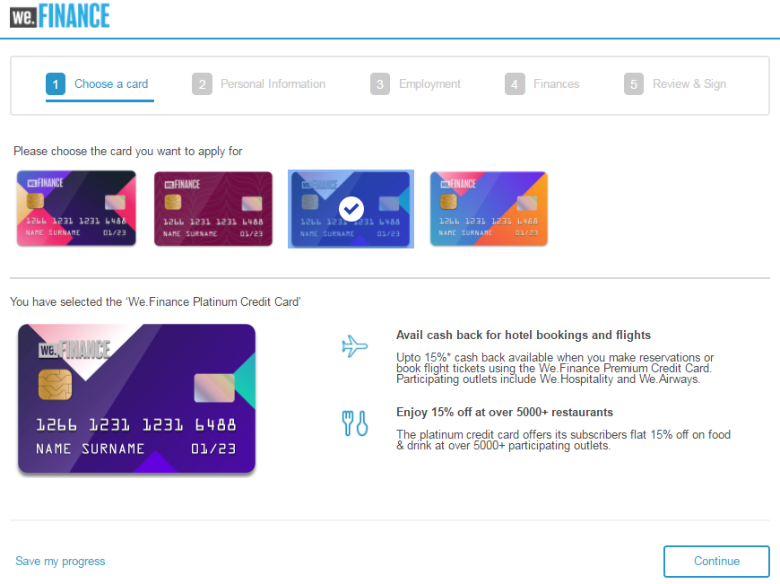
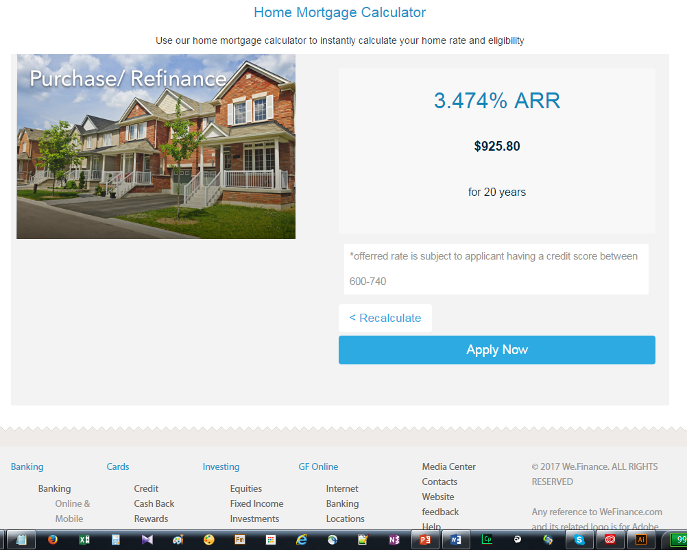

# Apresentação do site de referência do We.Finance {#we-finance-reference-site-walkthrough}

>[!CAUTION]
>
>AEM 6.4 chegou ao fim do suporte estendido e esta documentação não é mais atualizada. Para obter mais detalhes, consulte nossa [períodos de assistência técnica](https://helpx.adobe.com/br/support/programs/eol-matrix.html). Encontre as versões compatíveis [here](https://experienceleague.adobe.com/docs/).

## Pré-requisitos {#pre-requisites}

Configure os sites de referência conforme descrito em [Configurar e configurar sites de referência do AEM Forms](/help/forms/using/setup-reference-sites.md).

## Cenários do site de referência do We.Finance {#we-finance-reference-site-scenarios}

O We.Finance é uma organização líder no domínio de Serviços Financeiros que oferece soluções financeiras abrangentes e personalizadas para atender às necessidades de diversos perfis de clientes. Oferecem cartões de crédito, hipotecas domésticas e serviços de seguros domésticos.

O objetivo deles é alcançar clientes existentes e em potencial em seu dispositivo preferido, explicar os benefícios de seus serviços e ajudá-los a se inscrever em seus serviços. Além disso, eles estão buscando obter mais produtos financeiros, como cartões complementares que os clientes podem achar interessantes.

Leia para obter instruções detalhadas sobre casos de uso do We.Finance e entenda como o AEM Forms ajuda as organizações financeiras a alcançar seus objetivos. As seguintes etapas são abordadas:

* [Apresentação do aplicativo de cartão de crédito](#credit-card-application-walkthrough)
* [Apresentação do pedido de hipoteca de origem](#home-mortgage-application-walkthrough)
* [Apresentação do aplicativo Home Mortgauge com o Microsoft Dynamics](#home-mortgage-application-walkthrough-with-microsoft-dynamics)
* [Apresentação do pedido de seguro doméstico](#home-insurance-application-walkthrough)
* [Apresentação do gerenciamento de riqueza](#wealthmanagementwalkthrough)
* [Apresentação da aplicação de seguro automático](#autoinsuranceapplicationwalkthrough)

## Apresentação do aplicativo de cartão de crédito {#credit-card-application-walkthrough}

O cenário de aplicação de cartão de crédito We.Finance envolve as seguintes personas:

* Sarah Rose, uma cliente We.Finance
* Gloria Rios, Chefe de Cartão de Crédito e Hipoteca, We.Finance

O infográfico a seguir descreve passo a passo o fluxo de trabalho do aplicativo de cartão de crédito.

Vamos analisar o cenário do site de referência em detalhes para entender como a AEM Forms ajuda o We.Finance a alcançar seus objetivos.

### Sarah recebe um boletim informativo do We.Finance e se aplica a um cartão de crédito {#sarah-receives-a-newsletter-from-we-finance-and-applies-for-a-credit-card}

Sarah Rose é uma cliente We.Finance existente. Ela recebe um boletim informativo do We.Finance sobre novos cartões de crédito oferecidos. Ela acha as ofertas excitantes e decide se candidatar a cartão de crédito. Ela clica no botão Aplicar agora no boletim informativo, que a leva para o aplicativo de cartão de crédito no portal We.Finance.

#### Como funciona {#how-it-works}

O informativo enviado para Sarah é uma implementação personalizada que aciona um email para a ID de email especificada. O botão Aplicar agora no email é vinculado ao aplicativo de cartão de crédito, que é um formulário adaptável em uma instância de publicação.

#### Veja você mesmo {#see-it-yourself}

Abra o seguinte URL na instância de publicação para acionar um email de informativo. Certifique-se de substituir `[emailID]` com uma conta de email válida para receber o boletim informativo. Abra o boletim informativo e clique em **[!UICONTROL Aplicar agora]** para acessar o aplicativo de cartão de crédito.

`https://[publishServer]:[publsihPort]/content/campaigns/we-finance/start.html?app=cc&email=[emailID]&givenName=Sarah&familyName=Rose`

### Sarah acha a oferta interessante e escolhe aplicar {#sarah-finds-the-offer-interesting-and-chooses-to-apply}

Sarah decide se inscrever para o cartão de crédito e toque **[!UICONTROL Aplicar agora]** no email. Leva Sarah ao aplicativo de cartão de crédito no portal We.Finance. O formulário de aplicativo é organizado em seções usando um layout de cartão.

Sarah seleciona um cartão de crédito das opções e cliques disponíveis **[!UICONTROL Continuar]**.

Na página Informações pessoais, como Sarah fornece o Número de seguridade social, ela recebe um prompt para fazer logon com suas credenciais.

Sarah é uma cliente We.Finance existente. Ela faz logon com as credenciais da conta We.Finance e seus detalhes pessoais são preenchidos automaticamente no formulário. Sarah continua preenchendo o formulário de inscrição e é quando um lembrete aparece para uma reunião que ela deve participar. Ela clica **[!UICONTROL Salvar meu progresso]** no formulário de candidatura. Ele salva todas as informações que Sarah preencheu até agora e uma caixa de diálogo é aberta para confirmar se ela gostaria de receber um email com um link para o rascunho do aplicativo para ser concluída posteriormente.

Sarah clica **[!UICONTROL Enviar e-mail]**. Ela recebe um e-mail com um link para retomar seu aplicativo de cartão de crédito.

<!--Theses sections used to be an accordion until converted to straight Markdown. When accordions are enabled, revert-->

### Sarah acessa o aplicativo de cartão de crédito de seu dispositivo móvel {#a-sarah-access}

Se Sarah estiver acessando o aplicativo de cartão de crédito de seu dispositivo móvel, o aplicativo responsivo será aberto em uma exibição otimizada para dispositivos móveis. Nesta visualização, o formulário de aplicativo é renderizado como uma seção de cada vez. Ela permite que Sarah visualize e forneça informações progressivamente enquanto navega pelo aplicativo.

### Como funciona {#a-how-it-works}

O **[!UICONTROL Aplicar agora]** direciona Sarah para o aplicativo de cartão de crédito. O aplicativo é um formulário adaptável, que pode ser revisado nas instâncias de criação em `https://[host]:[Port]/editor.html/content/forms/af/we-finance/cc-app.html`.

Alguns dos principais recursos que você pode analisar no formulário adaptável são:

* É baseado em um esquema XSD.
* Ele é criado usando o Tema A do We Finance para estilo e o modelo We.Finance para layout. Além disso, usa Layout sem títulos de painel no layout do cabeçalho do formulário para navegação móvel. Ele exibe um layout móvel progressivo quando aberto a partir de um dispositivo móvel. Você pode revisar o modelo em `https://[host]:[Port]/libs/wcm/core/content/sites/templates.html/conf/we-finance` e o tema em `https://[host]:[Port]/editor.html/content/dam/formsanddocuments-themes/we-finance/we-finance-theme-a/jcr:content`.
* Ele inclui regras de formulário adaptáveis para chamar serviços do Modelo de dados de formulário para preencher previamente os detalhes do usuário de usuários conectados. Ele também chama os serviços para preencher previamente as informações por número de segurança social ou endereço de email fornecido no formulário. Você pode consultar os Modelos de dados de formulário e seus serviços em `https://[host]:[Port]/aem/forms.html/content/dam/formsanddocuments-fdm`.
* Ele usa vários componentes de formulário adaptáveis para capturar entradas e adaptá-las às respostas do usuário. Também usa componentes como Email que suportam tipos de entrada HTML5.
* Ele usa o componente Etapa de assinatura para exibir o formulário preenchido e permite a assinatura eletrônica no formulário.
* O botão Save my progress gera uma ID exclusiva para o usuário e salva o aplicativo parcialmente preenchido como um rascunho em um nó AEM repositório. Além disso, exibe uma caixa de diálogo que busca permissão para enviar um email com um link para o nó que contém o aplicativo de rascunho. O botão Send mail na caixa de diálogo de confirmação aciona um email com um link para o nó que contém o rascunho.
* Ela usa a ação Invoke AEM Workflow submit para acionar o fluxo de trabalho de aprovação do cartão de crédito. Você pode revisar o fluxo de trabalho usado neste formulário em `https://[host]:[Port]/editor.html/conf/global/settings/workflow/models/we-finance-credit-card-workflow.html`

É recomendável revisar o formulário para entender o esquema, os componentes, as regras, os Modelos de dados do formulário, o fluxo de trabalho dos formulários e enviar a ação usada para criar o formulário.

Além disso, consulte a documentação a seguir para obter mais informações sobre os recursos usados no formulário adaptável do aplicativo de cartão de crédito:

* [Introdução à criação de formulários adaptáveis](/help/forms/using/introduction-forms-authoring.md)
* [Criação de formulários adaptáveis usando o Esquema XML](/help/forms/using/adaptive-form-xml-schema-form-model.md)
* [Editor de regras](/help/forms/using/rule-editor.md)
* [Temas](/help/forms/using/themes.md)
* [Integração de dados](/help/forms/using/data-integration.md)
* [Uso do Acrobat Sign em formulários adaptáveis](/help/forms/using/working-with-adobe-sign.md)
* [Fluxo de trabalho centrado no Forms no OSGi](/help/forms/using/aem-forms-workflow.md)

### Veja você mesmo {#a-see-it-yourself}

Quando conectado como Sarah Rose, clique no botão **[!UICONTROL Aplicar agora]** no aplicativo de cartão de crédito. Preencha alguns detalhes, explore vários componentes de formulário adaptáveis e clique em **[!UICONTROL Salvar meu progresso]** para receber um email com uma **[!UICONTROL Retomar]** botão que se vincula ao aplicativo de rascunho. Certifique-se de especificar sua ID de email no formulário do aplicativo para receber o email.

Revise o Tema We.Finance disponível em:

`https://<host>:<AuthorPort>/editor.html/content/dam/formsanddocuments-themes/we-Finance/we-Finance-Theme-A/jcr:content`

Você pode revisar o Modelo We.Finance em:

`https://<host>:<AuthorPort>/editor.html/conf/we-finance/settings/wcm/templates/we-finance-template/structure.html`

### Sarah retoma e submete o pedido {#sarah-resumes-and-submits-the-application}

Sarah volta mais tarde e encontra um e-mail do We.Finance. Ela clica no botão **[!UICONTROL Retomar]** no email que a leva até o rascunho do aplicativo de cartão de crédito. As informações que ela preencheu anteriormente vêm preenchidas previamente. Preenche o formulário de candidatura restante, assina o pedido e submete-o.

Como alternativa, ela pode acessar o seu projeto de candidatura em **[!UICONTROL Meu Forms]** na página inicial do We.Finance.

#### Como funciona {#how-it-works-1}

O botão Resume no email redireciona Sarah para o nó que contém o aplicativo de rascunho.

#### Veja você mesmo {#see-it-yourself-1}

Você deve ter recebido um email com um link para o aplicativo de rascunho no seu ID de email especificado durante o preenchimento do formulário de inscrição. Vá em frente, preencha as seções restantes no aplicativo e envie-o.

### We.Finance recebe e aprova o aplicativo {#approving-the-application}

We.Finance recebe o pedido de cartão de crédito enviado pela Sarah. Uma tarefa é atribuída a Gloria Rios. Ela revisa a tarefa em sua Caixa de entrada de AEM e a aprova.

#### Como funciona {#how-it-works-2}

Quando Sarah preenche e envia o aplicativo de cartão de crédito, um Forms Workflow dispara e uma tarefa é criada na caixa de entrada AEM de Gloria.

O AEM Forms no OSGi fornece fluxos de trabalho centrados em formulários que permitem criar fluxos de trabalho adaptáveis baseados em formulários. Esses fluxos de trabalho podem ser usados para revisão e aprovações, fluxos de processos comerciais, para iniciar serviços de documento, integrar com o fluxo de trabalho de assinatura do Acrobat Sign e assim por diante. Para obter mais informações, consulte [Fluxo de trabalho centrado no Forms no OSGi](/help/forms/using/aem-forms-workflow.md).

A imagem a seguir descreve o fluxo de trabalho AEM que processa o aplicativo de cartão de crédito e gera uma saída PDF do aplicativo.

#### Veja você mesmo {#see-it-yourself-2}

Você pode acessar AEM caixa de entrada do site we.finance em https://&lt;*hostname*>:&lt;*PublishPort*>/content/we-finance/global/en.html. Na página , toque em **[!UICONTROL Fazer logon]**, selecione o **[!UICONTROL Efetuar logon como representante]** , faça logon na caixa de entrada de AEM usando `grios/password` como nome de usuário/senha para Gloria Rios e aprove o aplicativo de cartão de crédito. Para obter informações sobre como usar AEM Caixa de entrada para tarefas de fluxo de trabalho centradas em formulários, consulte [Gerenciar aplicativos e tarefas do Forms na Caixa de entrada AEM](/help/forms/using/manage-applications-inbox.md).

Quando você aprovar o aplicativo, Sarah recebe um e-mail com o kit de boas-vindas.

### Sarah recebe o kit de boas-vindas e se candidata a um cartão complementar {#sarah-receives-the-welcome-kit-and-applies-for-an-add-on-card}

Como o aplicativo de cartão de crédito da Sarah é aprovado, ela recebe um e-mail com um link para o kit de boas-vindas. Ela abre o kit de boas-vindas, que inclui os detalhes da conta do cartão de crédito. O kit de boas-vindas também exibe ofertas promocionais personalizadas para Sarah. À medida que ela rola para baixo, o kit de boas-vindas contém um formulário incorporado para solicitar um cartão complementar. Sarah preencheu rapidamente os detalhes necessários dentro do kit de boas-vindas e se candidata ao cartão complementar. Uma caixa de diálogo de confirmação para o aplicativo do cartão complementar é exibida.

O kit de boas-vindas é personalizado para Sarah e mostra informações relevantes para ela. Ela oferece a ela a opção de baixar uma versão PDF do kit de boas-vindas.

O kit de boas-vindas inclui outro formulário de aplicativo que Sarah pode preencher e enviar para solicitar um cartão complementar de dentro do kit de boas-vindas sem visitar o portal We.Finance.

#### Como funciona {#how-it-works-3}

O kit de boas-vindas é uma comunicação interativa incluída no `cq-we-finance-content-pkg.zip` pacote. Os cartões interativos na versão para desktop para mostrar os benefícios do cartão de crédito no kit de boas-vindas são um layout personalizado criado usando o layout de cartão padrão de um fragmento de documento.

O aplicativo de placa complementar é um formulário adaptável incorporado na comunicação interativa do kit de boas-vindas.

#### Veja você mesmo {#see-it-yourself-3}

Clique no botão **[!UICONTROL Retomar]** no email recebido na etapa anterior. Ele abre o rascunho de aplicação. Preencha todos os detalhes e envie o pedido. Você receberá um kit de boas-vindas. Revise o kit de boas-vindas.

Você também pode exibir o kit de boas-vindas no seguinte URL:

https://&lt;*host*>:&lt;*porta*>/content/aemforms-refsite/doclink.html?document=/content/forms/af/we-finance/credit-card/creditcardwelcomkit&amp;customerId=197&amp;channel=web

Você pode acessá-lo em instâncias de autor e publicação.

### Sarah recebe um extrato de cartão de crédito {#sarah-receives-a-credit-card-statement}

À medida que Sarah começa a usar o cartão de crédito, ela recebe outro e-mail do We.Finance que inclui o extrato do cartão de crédito. As imagens a seguir mostram o email com um link para a declaração do cartão de crédito em dispositivos móveis.

Sarah clica em Exibir Instrução no email para exibir a instrução do cartão de crédito. A declaração é uma comunicação interativa. Ele tem as versões Web e Print (PDF). A declaração integra-se ao Forms Data Model para recuperar dados específicos do cliente do banco de dados. A declaração interativa constitui vários elementos:

* Resumo do demonstrativo
* Relatório detalhado de despesas
* Análise gráfica de despesas
* Opção para efetuar um pagamento pelo montante devido dentro do extrato
* Baixar o recebimento de pagamento

Sarah não precisa acessar o portal ou pesquisar por seus emails por versão do PDF da declaração de cartão de crédito para arquivamento offline. Ela apenas clica no Download Statement para baixar uma versão PDF da instrução.

A declaração detalhada é apresentada em uma tabela responsiva. O demonstrativo também oferece a opção de pagar uma parte ou a quantia total devida dentro do demonstrativo.

Sarah agendou pagamento dentro do extrato. Sarah também pode usar a opção de pagamento flexível para dividir o pagamento em partes iguais.

#### Como funciona {#how-it-works-4}

O extrato de cartão de crédito é uma comunicação interativa. A tabela de despesas detalhada na declaração é uma tabela responsiva. O gráfico para análise de despesas é um componente de gráfico, que lê a tabela de despesas e gera o gráfico de pizza.

#### Veja você mesmo {#see-it-yourself-4}

Você pode revisar a declaração de cartão de crédito interativo no seguinte URL:

https://&lt;*hostname*>:&lt;*porta*>/content/aemforms-refsite/doclink.html?document=/content/forms/af/we-finance/credit-card/credit-card-statement&amp;customerId=197&amp;channel=web

Você pode acessá-lo em instâncias de autor e publicação.

O demonstrativo do cartão de crédito exibe ofertas promocionais no final do demonstrativo. É possível integrar o Adobe Target com a Comunicação interativa da AEM Forms para fornecer ofertas direcionadas promocionais com base em segmentos específicos do cliente. Para configurar sua comunicação interativa para usar o Adobe Target para ofertas personalizadas e direcionadas, consulte [criar experiências direcionadas](/help/forms/using/experience-targeting-forms.md).

### O We.Finance analisa o desempenho do aplicativo de cartão de crédito {#we-finance-analyzes-the-performance-of-the-credit-card-application}

O We.Finance, de tempos em tempos, analisa o desempenho de seu aplicativo de cartão de crédito para verificar se os clientes estão enfrentando problemas. Eles usam essa análise para tomar decisões informadas sobre as alterações necessárias no aplicativo de cartão de crédito para melhorar a experiência do usuário, reduzir a taxa de abandono de formulários e, assim, melhorar a conversão. Eles aproveitam a integração do AEM Forms com o Adobe Analytics para análise. A imagem a seguir descreve o painel de análise.

Para obter mais informações sobre como interpretar o painel de análise, consulte [Visualização e compreensão dos relatórios de análise do AEM Forms](/help/forms/using/view-understand-aem-forms-analytics-reports.md).

#### Como funciona {#how-it-works-5}

As métricas de desempenho do formulário de aplicativo de cartão de crédito são rastreadas com o Adobe Analytics. Para obter mais informações sobre como configurar o Adobe Analytics e visualizar relatórios, consulte [Configuração do Analytics para formulários e documentos](/help/forms/using/configure-analytics-forms-documents.md).

#### Veja você mesmo {#see-it-yourself-br}

Para que você possa visualizar e explorar o relatório de análise, estamos fornecendo dados de propagação para o aplicativo de cartão de crédito no site de referência. Antes de usar os dados de propagação, consulte [Configurar o Analytics](/help/forms/using/setup-reference-sites.md#configureanalytics). Execute as seguintes etapas na instância do autor para exibir o relatório com os dados de propagação:

1. Ir para **[!UICONTROL Forms &amp; Documents]** Interface do usuário em https://&lt;*hostname*>:&lt;*AuthorPort*>/aem/forms.html/content/dam/formsanddocuments.

1. Clique para abrir o **[!UICONTROL We.Finance]** Pasta.
1. Selecionar **[!UICONTROL Pedido de cartão de crédito]** formulário adaptável e, em seguida, na barra de ferramentas, clique em **[!UICONTROL Ativar o Analytics]**.

1. Selecione o formulário adaptável novamente e clique em **[!UICONTROL Relatório do Analytics]** na barra de ferramentas para gerar o relatório. Inicialmente, você verá um relatório em branco.

Para gerar relatórios de análise com dados de propagação:

1. No navegador de endereços do CRXDE lite, digite: `/apps/we-finance/demo-artifacts/analyticsTestData/Credit card Analytics Test Data`
1. Os dados de teste são selecionados na estrutura do diretório do lado esquerdo.
1. Clique duas vezes no arquivo selecionado para abrir o conteúdo no painel lateral direito.
1. Copie todo o conteúdo no arquivo de dados de propagação.
1. No CRXDE, navegue até: `/content/dam/formsanddocuments/we-finance/cc-app/jcr:content/analyticsdatanode/lastsevendays`
1. No **[!UICONTROL analyticsdata]** campo sob **[!UICONTROL Propriedades]**, cole o conteúdo copiado do arquivo de dados de propagação.

1. Selecionar **Pedido de cartão de crédito** formulário adaptável e clique em **[!UICONTROL Relatório do Analytics]** na barra de ferramentas para gerar o relatório com dados de propagação.

**Teste A/B do pedido de cartão de crédito**

Além de analisar o desempenho do aplicativo de cartão de crédito e aprimorá-lo constantemente, o We.Finance utiliza a integração do AEM Forms com o Target para criar testes A/B. Ele permite que eles atendam a diferentes experiências do formulário de aplicativo de cartão de crédito e identifiquem a experiência que causa uma melhor taxa de conversão em termos de preenchimento e envio do formulário.

Para configurar o Target no servidor do AEM Forms, consulte [Configurar e integrar o Target no AEM Forms](/help/forms/using/ab-testing-adaptive-forms.md#set%20up%20and%20integrate%20target%20in%20aem%20forms).

Execute as seguintes etapas para experimentar a criação do teste A/B para o formulário de aplicativo de cartão de crédito We.Finance:

1. Ir para **[!UICONTROL Forms &amp; Documents]** em https://&lt;*hostname*>:&lt;*AuthorPort*>/aem/forms.html/content/dam/formsanddocuments.

1. Clique para abrir o **[!UICONTROL We.Finance]** pasta.
1. Selecionar **[!UICONTROL Pedido de cartão de crédito]** formulário adaptável.
1. Clique em **[!UICONTROL Mais]** na barra de ferramentas e selecione **[!UICONTROL Configurar testes A/B]**. A página Configurar teste A/B é aberta.

1. Especifique um **[!UICONTROL Nome da atividade]**.
1. Na lista suspensa Público-alvo , selecione um público-alvo para o qual deseja fornecer diferentes experiências do formulário. Por exemplo, **Visitantes usando o Chrome**.
1. No **[!UICONTROL Distribuição de experiência]** para as experiências A e B, especifique a distribuição, em termos de porcentagem, para determinar a distribuição de experiências entre o público-alvo total. Por exemplo, se você especificar 40, 60 para as experiências A e B, respectivamente, a experiência A será veiculada em 40% do público-alvo e os 60% restantes verão a experiência B.
1. Clique em **Configurar**. Uma caixa de diálogo é exibida para confirmar a criação do teste A/B.
1. Clique em **Concluído**.
1. Selecione o **Pedido de cartão de crédito** formulário e clique em **Editar**. Ele dá a opção de abrir uma das experiências. Clique em **Experiência B**. O formulário é aberto no modo de edição.

1. Modifique o formulário conforme desejado para criar uma experiência diferente da experiência padrão A.
1. Vá para a interface Forms e Documents , selecione o formulário e clique em **Mais** e selecione **Iniciar testes A/B**.

1. Agora, abra o formulário no navegador chrome várias vezes usando o seguinte url:

   `https://[hostname]:[port]/content/dam/formsanddocuments/we-finance/cc-app/jcr:content?wcmmode=disabled`

   >[!NOTE]
   >
   >Remova o cookie com o nome **mbox** da persistência do cookie do navegador antes de abrir o formulário da próxima vez. Você verá a experiência A e B do formulário aleatoriamente.

1. Selecione o formulário, clique em **Mais** e clique em **Relatório de testes A/B**. Você não encontrará muitos dados no relatório, pois acabou de iniciar o teste. Agora vamos fornecer alguns dados de propagação para ver a aparência do relatório de Teste A/B.

1. Abra o CRXDE Lite e faça um backup do seguinte arquivo: /libs/fd/fmaddon/gui/components/admin/targetreport/clientlibs/targetreport/js/targetreport.js
1. Substitua a definição da função `onReportLoadSuccess` no arquivo acima mencionado com a definição de função no seguinte arquivo: /apps/we-finance/demo-artifacts/targetreport.js

   **Observação:** Essas alterações são somente para a finalidade de demonstração. Certifique-se de restaurar o conteúdo do arquivo após concluir este procedimento.

1. Atualize o relatório gerado e você verá algo como o seguinte. Revise o painel de relatórios.

Para encerrar o teste A/B, clique em **Teste A/B final** no painel de relatórios. No momento, uma caixa de diálogo solicita que você declare uma experiência. Escolha um vencedor e confirme para encerrar o teste A/B.

Se você escolher a experiência A como vencedora, o teste A/B será finalizado e, daqui para frente, somente a Experiência A será veiculada para todos os públicos, incluindo aqueles no Chrome.

## Apresentação do pedido de hipoteca de origem {#home-mortgage-application-walkthrough}

O cenário de hipoteca do We.Finance envolve as seguintes personas:

* Sarah Rose, uma cliente We.Finance
* Gloria Rios, Chefe de Cartão de Crédito e Hipoteca, We.Finance
* John Doe, Representante de Atendimento ao Cliente, We.Finance

O infográfico a seguir descreve o fluxo de trabalho passo a passo de um aplicativo hipotecário interno.

Agora vamos examinar detalhadamente as etapas no cenário do site de referência para ver como a AEM Forms ajuda o We.Finance a alcançar seus objetivos.

### Sarah visita o site We.Finance e se candidata a hipoteca {#sarah-visits-we-finance-website-and-applies-for-home-mortgage}

Sarah Rose está planejando comprar uma casa e procurar planos de hipoteca. Ela é cliente do We.Finance e, portanto, visita o portal We.Finance para explorar ofertas de hipotecas domésticas. Ela vai à seção Loans e encontra uma calculadora de hipotecas no portal. Ela preenche os detalhes e clica em Calcular minha hipoteca, o que retorna um plano de hipoteca.

 
**Figura:** *Calculadora de hipoteca*

**Figura:** *Resultado do cálculo da hipoteca*

#### Como funciona {#how-it-works-6}

A calculadora de hipotecas residenciais na página Empréstimos é um formulário adaptável incorporado na página do AEM Sites. Você pode revisar a página Empréstimos no modo de edição em `https://[authorHost]:[authorPort]/editor.html/content/we-finance/global/en/loan-landing-page.html`.

A calculadora de hipotecas embutida, que é uma forma adaptativa, utiliza regras para calcular o montante do IME com base nos detalhes do empréstimo fornecidos nos campos da calculadora. Você pode revisar o formulário adaptável em `https://[authorHost]:[authorPort]/editor.html/content/forms/af/we-finance/hm-calc.html`.

#### Veja você mesmo {#see-it-yourself-5}

Acesse o portal We.Finance em `https://<publishHost>:<publishPort>/content/we-finance/global/en.html` e clique em **[!UICONTROL Empréstimos]**. Forneça detalhes na calculadora de hipoteca e veja os resultados.

### Sarah acha a oferta interessante e escolhe aplicar {#sarah-finds-the-offer-interesting-and-chooses-to-apply-1}

Sarah escolhe se candidatar para hipoteca e cliques **[!UICONTROL Aplicar agora]** sobre os resultados da calculadora de hipotecas. Abre o pedido de hipoteca.

Se Sarah estiver acessando o aplicativo de hipoteca da casa a partir de seu dispositivo móvel, o formulário do aplicativo será aberto em uma exibição otimizada para visualização em um dispositivo móvel. Nesta visualização, o formulário de aplicativo renderiza uma seção de cada vez. Ela permite que Sarah visualize e forneça informações progressivamente enquanto navega no formulário do aplicativo.

As imagens a seguir mostram o fluxo de trabalho enquanto Sarah navega pelo aplicativo de hipoteca da casa em seu dispositivo móvel.

Se Sarah clicar **Aplicar agora** no desktop, o formulário do aplicativo de hipoteca é aberto da seguinte maneira. As informações fornecidas pela Sarah na calculadora de hipotecas são preenchidas previamente no formulário de inscrição. Sarah preenche os detalhes e os cliques restantes **Continuar**.

Com base na informação que Sarah preencheu na calculadora de hipotecas, ela tem alguns planos de hipoteca. Ela escolhe o plano que atende às suas necessidades e continua preenchendo o pedido. Por último, assina e submete o pedido.

O pedido enviado vai para o We.Finance para aprovação.

#### Como funciona {#how-it-works-7}

O **Aplicar agora** direciona Sarah para o aplicativo de hipoteca. O aplicativo é um formulário adaptável, que pode ser revisado nas instâncias de criação em `https://[host]:[Port]/editor.html/content/forms/af/we-finance/hm-app.html`.

Alguns dos principais recursos que você pode analisar no formulário adaptável são:

* É baseado em um esquema XSD, `homeMortgageApplication.xsd`.
* Ele é criado usando o Tema B do We Finance para estilo e o modelo We.Finance para layout. Além disso, usa Layout sem títulos de painel no layout do cabeçalho do formulário para navegação móvel. Ele exibe um layout móvel progressivo quando aberto a partir de um dispositivo móvel. Você pode revisar o modelo e o tema usados no formulário adaptável nos seguintes locais na instância do autor do AEM:

   * `https://[host]:[Port]/libs/wcm/core/content/sites/templates.html/conf/we-finance`
   * `https://[host]:[Port]/editor.html/content/dam/formsanddocuments-themes/we-finance/we-finance-theme-b/jcr:content`

* A primeira guia, Introdução, no aplicativo é uma calculadora de hipoteca dinâmica que exibe opções com base na seleção do usuário. Por exemplo, os campos e valores são diferentes para as opções de Compra e Refinanciamento. Essa funcionalidade é alcançada usando as regras de mostrar-ocultar. Além disso, quando você clica em Continuar e a guia Planos é inicializada, ela chama um serviço da Web configurado em um Modelo de dados de formulário para buscar e exibir planos de hipoteca. Você pode consultar os Modelos de dados de formulário e os serviços configurados em `https://[host]:[Port]/aem/forms.html/content/dam/formsanddocuments-fdm`.
* Ele usa vários componentes de formulário adaptáveis para capturar entradas e adaptá-las às respostas do usuário. Também usa componentes como Email que suportam tipos de entrada HTML5.
* Ele usa o componente Etapa de assinatura para exibir o formulário preenchido e permite a assinatura eletrônica no formulário.
* Ele usa a ação Invoke AEM Workflow submit para acionar o fluxo de trabalho AEM do We Finance Home Mortgauge . Você pode revisar o fluxo de trabalho usado neste formulário em `https://[host]:[Port]/editor.html/conf/global/settings/workflow/models/we-finance-home-mortgage-workflow.html`

É recomendável revisar o formulário para entender o esquema, os componentes, as regras, os Modelos de dados do formulário, o fluxo de trabalho dos formulários e enviar a ação usada para criar o formulário.

Além disso, consulte a documentação a seguir para obter mais informações sobre os recursos usados no formulário adaptável do aplicativo hipotecário:

* [Introdução à criação de formulários adaptáveis](/help/forms/using/introduction-forms-authoring.md)
* [Criação de formulários adaptáveis usando o Esquema XML](/help/forms/using/adaptive-form-xml-schema-form-model.md)
* [Editor de regras](/help/forms/using/rule-editor.md)
* [Temas](/help/forms/using/themes.md)
* [Integração de dados](/help/forms/using/data-integration.md)
* [Uso do Acrobat Sign em formulários adaptáveis](/help/forms/using/working-with-adobe-sign.md)
* [Fluxo de trabalho centrado no Forms no OSGi](/help/forms/using/aem-forms-workflow.md)

#### Veja você mesmo {#see-it-yourself-6}

Ir para `https://[server]:[port]/content/we-finance/global/en/all-forms.html` e clique no botão **Aplicar agora** no botão Home Mortgauge Application. Preencha os detalhes na guia Introdução , tente opções diferentes e envie o aplicativo.

Certifique-se de especificar uma ID de email válida no aplicativo para receber um email de confirmação em sua caixa de entrada.

### We.Finance recebe o aplicativo {#approving_the_application-1}

We.Finance recebe o pedido de hipoteca enviado pela Sarah. A tarefa de aprovar ou rejeitar o aplicativo é atribuída a Gloria Rios. Ela revisa o pedido e descobre que a ID do governo de Sarah está faltando.

Gloria abre a tarefa e clica em Precisa de mais informações e coloca um comentário sobre a falta de uma ID do governo.

A tarefa agora é atribuída a John Doe, um representante do Atendimento ao cliente com a We.Finance. Ele abre a tarefa e revisa o comentário de Gloria. Ele entra em contato com Sarah e pede para ela enviar uma cópia da ID dela. Depois de receber uma cópia da ID de Sarah, ele a anexa à tarefa e submete o pedido de reavaliação.

A tarefa foi reatribuída a Gloria. Ela analisa a ID anexada e aprova o aplicativo.

#### Como funciona {#how-it-works-8}

Quando Sarah preenche e envia o pedido de hipoteca, um Forms Workflow dispara e uma tarefa é criada na caixa de entrada AEM de Gloria. À medida que Gloria revisa o aplicativo e solicita mais informações, a tarefa é atribuída a John Doe. Quando John Doe anexa a ID e reenvia o aplicativo, ele é atribuído a Gloria. Isso é definido no Fluxo de trabalho AEM associado ao aplicativo de hipoteca.

O AEM Forms no OSGi fornece fluxos de trabalho centrados em formulários que permitem criar fluxos de trabalho adaptáveis baseados em formulários. Esses fluxos de trabalho podem ser usados para revisão e aprovações, fluxos de processos comerciais, para iniciar serviços de documento, integrar com o fluxo de trabalho de assinatura do Acrobat Sign e assim por diante. Para obter mais informações, consulte [Fluxo de trabalho centrado no Forms no OSGi](/help/forms/using/aem-forms-workflow.md).

A imagem a seguir descreve o fluxo de trabalho de AEM associado ao aplicativo de hipoteca.

#### Veja você mesmo {#see-it-yourself-7}

Você pode acessar a caixa de entrada AEM em https://&lt;***hostname***>:&lt;***AuthorPort***>/content/we-finance/global/en/login.html?resource=/aem/inbox.html. Faça logon na caixa de entrada de AEM usando `grios/password` como nome de usuário/senha para Gloria Rios e `jdoe/jdoe` para John Doe, e explore o fluxo de trabalho do aplicativo de hipoteca residencial.

Para obter informações sobre como usar AEM Caixa de entrada para tarefas de fluxo de trabalho centradas em formulários, consulte [Gerenciar aplicativos e tarefas do Forms na Caixa de entrada AEM](/help/forms/using/manage-applications-inbox.md).

### Sarah recebe o kit de boas-vindas {#sarah-receives-the-welcome-kit}

Enquanto a solicitação de hipoteca da Sarah é aprovada, ela recebe um e-mail com um link para o kit de boas-vindas. Ela abre o kit de boas-vindas, que inclui um carrossel que exibe ofertas promocionais personalizadas para a Sarah.

O kit de boas-vindas é personalizado para Sarah e mostra informações relevantes para ela. Ela oferece a ela a opção de baixar uma versão PDF do kit de boas-vindas. O botão de seta na parte inferior permite que Sarah role para baixo e navegue por outras seções no kit de boas-vindas.

#### Como funciona {#how-it-works-9}

O kit de boas-vindas é uma comunicação interativa incluída no `cq-we-finance-content-pkg.zip` pacote. As ofertas promocionais no kit de boas-vindas são fornecidas pelo servidor da Adobe Target. As ofertas são personalizadas e direcionadas para segmentos específicos do cliente. O kit de boas-vindas obtém ofertas de um servidor Adobe Target pré-configurado para um segmento de público-alvo de clientes do sexo feminino.

Os cartões interativos na versão para desktop do kit de boas-vindas usam um layout personalizado criado usando o layout de cartão padrão de um fragmento de documento.

#### Veja você mesmo {#see-it-yourself-8}

Se você forneceu sua ID de email ao preencher o aplicativo de hipoteca, você deve ter recebido um email contendo um link para o kit de boas-vindas. Verifique sua caixa de entrada e revise o kit de boas-vindas.

Você pode exibi-lo AEM instância de publicação no seguinte URL:

`https://[host]:[port]/content/forms/af/we-finance/mortgage-loan-welcome-kit.html`

### Sarah recebe um extrato de conta {#sarah-receives-an-account-statement}

À medida que Sarah paga o empréstimo e começa a pagar as prestações, ela recebe outro e-mail do We.Finance que inclui seu extrato de conta mensal.

Sarah clica em Exibir Instrução no email para exibir o demonstrativo da conta de hipoteca. A declaração interativa constitui vários elementos:

* Resumo do demonstrativo
* Detalhes da declaração

A imagem a seguir mostra uma parte diferente do extrato da conta na área de trabalho.

A declaração detalhada é apresentada em uma tabela responsiva e oferece a opção de pagar uma parte ou todo o valor devido dentro da declaração.

#### Como funciona {#how-it-works-10}

A declaração de hipoteca é uma comunicação interativa. Ele é gerado usando o processo de agrupamento JSON. A tabela de despesas detalhada na declaração é uma tabela responsiva.

#### Veja você mesmo {#see-it-yourself-9}

Você pode revisar o extrato da conta de hipoteca interativa no seguinte URL:

https://&lt;*hostname*>:&lt;*porta*>/content/forms/af/we-finance/mortgage-account-statement.html?wcmmode=disabled

Você pode acessá-lo em instâncias de autor e publicação.

### We.Finance analisa o desempenho do aplicativo de hipoteca {#we-finance-analyzes-the-performance-of-the-mortgage-application}

O We.Finance, de tempos em tempos, analisa o desempenho de seu aplicativo de hipoteca para verificar se os clientes podem estar enfrentando problemas. Eles usam essa análise para tomar decisões informadas sobre as alterações necessárias no aplicativo de hipoteca para melhorar a experiência do usuário, reduzir a taxa de abandono de formulários e, assim, melhorar a conversão. Eles aproveitam a integração do AEM Forms com o Adobe Analytics para análise. A imagem a seguir descreve o painel de análise.

Para obter mais informações sobre como interpretar o painel de análise, consulte [Visualização e compreensão dos relatórios de análise do AEM Forms](/help/forms/using/view-understand-aem-forms-analytics-reports.md).

#### Como funciona {#how-it-works-11}

As métricas de desempenho do formulário de aplicativo de hipoteca são rastreadas com o Adobe Analytics. Para obter mais informações sobre como configurar o Adobe Analytics e visualizar relatórios, consulte [Configuração do Analytics para formulários e documentos](/help/forms/using/configure-analytics-forms-documents.md).

#### Veja você mesmo {#see-it-yourself-br-1}

Para que você possa visualizar e explorar o relatório de análise, estamos fornecendo dados de propagação para o aplicativo de hipoteca no site de referência. Antes de usar os dados de propagação, consulte [Configurar o Analytics](/help/forms/using/setup-reference-sites.md#configureanalytics). Execute as seguintes etapas na instância do autor para exibir o relatório com os dados de propagação:

1. Ir para **Forms &amp; Documents** Interface do usuário em https://&lt;*hostname*>:&lt;*AuthorPort*>/aem/forms.html/content/dam/formsanddocuments.

1. Clique para abrir o **cofinanciamento** Pasta.
1. Selecionar **[!UICONTROL Pedido de hipoteca doméstica]** formulário adaptável e, em seguida, na barra de ferramentas, clique em **[!UICONTROL Ativar o Analytics]**.

1. Selecione o formulário novamente e clique em **[!UICONTROL Relatório do Analytics]** na barra de ferramentas para gerar o relatório. Inicialmente, você verá um relatório em branco.

Para gerar relatórios de análise com dados de propagação:

1. No navegador de endereços do CRXDE lite, digite o seguinte: `/apps/we-finance/demo-artifacts/analyticsTestData/HomeMortgageAnalyticsTestData`
1. Os dados de teste são selecionados na estrutura do diretório do lado esquerdo.
1. Clique duas vezes no arquivo selecionado para abrir o conteúdo no painel lateral direito.
1. Copie todo o conteúdo no arquivo de dados de propagação.
1. No CRXDE, navegue até: `/content/dam/formsanddocuments/we-finance/hm-app/jcr:content/analyticsdatanode/lastsevendays`
1. No campo analytics data em Properties, cole o conteúdo copiado do arquivo de dados de propagação.
1. Agora, gere o relatório de análise novamente para o Formulário de Aplicativo de Hipoteca Doméstica. Você verá o relatório com dados de propagação.

**Teste A/B do pedido de hipoteca**

Além de analisar o desempenho do aplicativo de hipoteca e aprimorá-lo constantemente, o We.Finance utiliza a integração do AEM Forms com o Target para criar testes A/B. Ela permite que eles atendam a diferentes experiências do formulário de aplicativo e identifiquem a experiência que causa uma melhor taxa de conversão em termos de preenchimento e envio do formulário.

Para configurar o Target no servidor do AEM Forms, consulte [Configurar e integrar o Target no AEM Forms](/help/forms/using/ab-testing-adaptive-forms.md#set%20up%20and%20integrate%20target%20in%20aem%20forms).

Execute as seguintes etapas na instância do autor para experimentar a criação do teste A/B para o formulário de aplicativo de hipoteca We.Finance:

1. Ir para **Forms &amp; Documents** em https://&lt;*hostname*>:&lt;*AuthorPort*>/aem/forms.html/content/dam/formsanddocuments.

1. Clique para abrir o **We.Finance** pasta.
1. Selecionar **Pedido de hipoteca doméstica** formulário adaptável.
1. Clique em **Mais** na barra de ferramentas e selecione **Configurar testes A/B**. A página Configurar teste A/B é aberta.

1. Especifique um **Nome da atividade**.
1. Na lista suspensa Público-alvo , selecione um público-alvo para o qual deseja fornecer diferentes experiências do formulário. Por exemplo, **Visitantes usando o Chrome**.
1. No **Distribuição de experiência** para as experiências A e B, especifique a distribuição, em termos de porcentagem, para determinar a distribuição de experiências entre o público-alvo total. Por exemplo, se você especificar 40, 60 para as experiências A e B, respectivamente, a experiência A será veiculada em 40% do público-alvo e os 60% restantes verão a experiência B.
1. Clique em **Configurar**. Uma caixa de diálogo é exibida para confirmar a criação do teste A/B.
1. Clique em **Concluído**.
1. Selecione o **Pedido de hipoteca doméstica** formulário adaptável e clique em **Editar**. Ele dá a opção de abrir uma das experiências. Clique em **Experiência B**. O formulário é aberto no modo de edição.

1. Modifique o formulário conforme desejado para criar uma experiência diferente da experiência padrão A.
1. Vá para a interface Forms e Documents , selecione o formulário e clique em **Mais** e selecione **Iniciar testes A/B**.

1. Agora, abra o formulário no navegador chrome várias vezes usando o seguinte url:

   `https://[hostname]:[port]/content/dam/formsanddocuments/we-finance/hm-app/jcr:content?wcmmode=disabled`

   >[!NOTE]
   >
   >Remova o cookie com o nome **mbox** da persistência do cookie do navegador antes de abrir o formulário da próxima vez. Você verá a experiência A e B do formulário aleatoriamente.

1. Selecione o formulário, clique em **Mais** e clique em **Relatório de testes A/B**. Você não encontrará muitos dados no relatório, pois acabou de iniciar o teste. Agora vamos fornecer alguns dados de propagação para ver a aparência do relatório de Teste A/B.

1. Abra o CRXDE Lite e faça um backup do seguinte arquivo: /libs/fd/fmaddon/gui/components/admin/targetreport/clientlibs/targetreport/js/targetreport.js
1. Substitua a definição da variável `onReportLoadSuccess` no arquivo mencionado acima com a definição de função no seguinte arquivo: /apps/we-finance/demo-artifacts/targetreport.js

   >[!NOTE]
   >
   >Essas alterações são somente para a finalidade de demonstração. Certifique-se de restaurar o conteúdo do arquivo após concluir este procedimento.

1. Atualize o relatório gerado e você verá algo como o seguinte. Revise o painel de relatórios.

Para encerrar o teste A/B, clique em **Teste A/B final** no painel de relatórios. No momento, uma caixa de diálogo solicita que você declare uma experiência. Escolha um vencedor e confirme para encerrar o teste A/B.

Se você escolher a experiência A como vencedora, o teste A/B será finalizado e, daqui para frente, somente a Experiência A será veiculada para todos os públicos, incluindo aqueles no Chrome.

## Apresentação do aplicativo Home Mortgauge com o Microsoft Dynamics {#home-mortgage-application-walkthrough-with-microsoft-dynamics}

O cenário de hipoteca inicial We.Finance com o Microsoft Dynamics envolve as seguintes personas:

* Sarah Rose, uma cliente We.Finance
* O Administrador da instância do We.Finance Microsoft Dynamics

A apresentação do aplicativo Home Mortgauge com o Microsoft Dynamics demonstra como um cliente We.Finance pode usar o site para se candidatar a uma hipoteca doméstica quando o site de referência usa o Microsoft Dynamics para integração de dados. A apresentação termina com os dados preenchidos pelo usuário que está sendo recebido pelo Microsoft Dynamics. Antes de continuar com esse cenário, é necessário concluir a [Configuração do Microsoft Dynamics 365 para o fluxo de trabalho de hipoteca do site de referência We.Finance](/help/forms/using/ms-dynamics-configuration-home-mortgage.md).

### Sarah visita o site We.Finance e se candidata a hipoteca {#sarah-visits-we-finance-website-and-applies-for-home-mortgage-1}

Sarah Rose está planejando comprar uma casa e procurar planos de hipoteca. Ela é cliente do We.Finance e, portanto, visita o portal We.Finance para explorar ofertas de hipotecas domésticas. Ela vai à seção Loans e encontra uma calculadora de hipotecas no portal. Ela preenche os detalhes e clica em Calcular minha hipoteca, o que retorna um plano de hipoteca.

 
**Figura:** *Calculadora de hipoteca*

**Figura:** *Resultado do cálculo da hipoteca*

#### Como funciona {#how-it-works-12}

A calculadora de hipotecas residenciais na página Empréstimos é um formulário adaptável incorporado na página do AEM Sites. Você pode revisar a página Empréstimos no modo de edição em `https://[authorHost]:[authorPort]/editor.html/content/we-finance/global/en/loan-landing-page.html`.

A calculadora de hipotecas embutida, que é uma forma adaptativa, utiliza regras para calcular o montante do IME com base nos detalhes do empréstimo fornecidos nos campos da calculadora. Você pode revisar o formulário adaptável em `https://[authorHost]:[authorPort]/editor.html/content/forms/af/we-finance/ms-dynamics/home-mortgage-calculator.html`.

#### Veja você mesmo {#see-it-yourself-10}

Acesse o portal We.Finance em `https://<publishHost>:<publishPort>/content/we-finance/global/en.html` e clique em **[!UICONTROL Empréstimos]**. Forneça detalhes na calculadora de hipoteca e veja os resultados.

### Sarah acha a oferta interessante e escolhe aplicar {#sarah-finds-the-offer-interesting-and-chooses-to-apply-2}

Sarah escolhe se candidatar para hipoteca e cliques **[!UICONTROL Aplicar agora]** sobre os resultados da calculadora de hipotecas. Abre o pedido de hipoteca.

Se Sarah estiver acessando o aplicativo de hipoteca da casa a partir de seu dispositivo móvel, o formulário do aplicativo será aberto em uma exibição otimizada para visualização em um dispositivo móvel. Nesta visualização, o formulário de aplicativo renderiza uma seção de cada vez. Ela permite que Sarah visualize e forneça informações progressivamente enquanto navega no formulário do aplicativo.

As imagens a seguir mostram o fluxo de trabalho enquanto Sarah navega pelo aplicativo de hipoteca da casa em seu dispositivo móvel.

Se Sarah clicar **Aplicar agora** no desktop, o formulário do aplicativo de hipoteca é aberto da seguinte maneira. As informações fornecidas pela Sarah na calculadora de hipotecas são preenchidas previamente no formulário de inscrição. Sarah preenche os detalhes e os cliques restantes **Continuar**.

Com base na informação que Sarah preencheu na calculadora de hipotecas, ela tem alguns planos de hipoteca. Ela escolhe o plano que atende às suas necessidades e continua preenchendo o pedido. Por último, assina e submete o pedido.

O pedido enviado vai para o We.Finance para aprovação.

#### Como funciona {#how-it-works-13}

O **Aplicar agora** direciona Sarah para o aplicativo de hipoteca. O aplicativo é um formulário adaptável, que pode ser revisado nas instâncias de criação em `https://[host]:[Port]/editor.html/content/forms/af/we-finance/ms-dynamics/application-for-home-mortgage.html`.

Alguns dos principais recursos que você pode analisar no formulário adaptável são:

* É baseado em um esquema XSD, `homeMortgageApplication.xsd`.
* Ele é criado usando o Tema B do We Finance para estilo e o modelo We.Finance para layout. Além disso, usa Layout sem títulos de painel no layout do cabeçalho do formulário para navegação móvel. Ele exibe um layout móvel progressivo quando aberto a partir de um dispositivo móvel. Você pode revisar o modelo e o tema usados no formulário adaptável nos seguintes locais na instância do autor do AEM:

   * `https://[host]:[Port]/libs/wcm/core/content/sites/templates.html/conf/we-finance`
   * `https://[host]:[Port]/editor.html/content/dam/formsanddocuments-themes/we-finance/we-finance-theme-b/jcr:content`

* A primeira guia, Introdução, no aplicativo é uma calculadora de hipoteca dinâmica que exibe opções com base na seleção do usuário. Por exemplo, os campos e valores são diferentes para as opções de Compra e Refinanciamento. Essa funcionalidade é alcançada usando as regras de mostrar-ocultar. Além disso, quando você clica em Continuar e a guia Planos é inicializada, ela chama um serviço da Web configurado em um Modelo de dados de formulário para buscar e exibir planos de hipoteca. Você pode consultar os Modelos de dados de formulário e os serviços configurados em `https://[host]:[Port]/aem/forms.html/content/dam/formsanddocuments-fdm`.
* Ele usa vários componentes de formulário adaptáveis para capturar entradas e adaptá-las às respostas do usuário. Também usa componentes como Email que suportam tipos de entrada HTML5.
* Ele usa o componente Etapa de assinatura para exibir o formulário preenchido e permite a assinatura eletrônica no formulário.

É recomendável revisar o formulário para entender o esquema, os componentes, as regras, os Modelos de dados do formulário, o fluxo de trabalho dos formulários e enviar a ação usada para criar o formulário.

### O administrador exibe os dados enviados na instância do Microsoft Dynamics {#the-administrator-views-the-submitted-data-in-the-microsoft-dynamics-instance}

We.Finance recebe o aplicativo de hipoteca enviado por Sarah na instância do Microsoft Dynamics. O administrador toca na entrada na coluna de lead para ir para o registro de lead criado para Sarah Rose.

## Apresentação do pedido de seguro doméstico {#home-insurance-application-walkthrough}

O cenário de seguro residencial We.Finance envolve as seguintes personas:

* Sarah Rose, uma cliente We.Finance
* Gloria Rios, Chefe de Cartão de Crédito e Hipoteca, We.Finance
* Frank De Costa, Agente De Seguro, We.Finance

O infográfico a seguir descreve o fluxo de trabalho passo a passo de um cenário de aplicativo de seguro residencial.

Agora vamos examinar detalhadamente as etapas no cenário do site de referência para ver como a AEM Forms ajuda o We.Finance a alcançar seus objetivos.

### Sarah recebe um boletim informativo do We.Finance e se aplica ao seguro residencial {#sarah-receives-a-newsletter-from-we-finance-and-applies-for-home-insurance}

Sarah Rose é uma cliente de hipotecas da We.Finance e está procurando um bom negócio de seguro residencial. Ela visita o portal We.Finance e explora planos de seguro residencial. O We.Finance a identificou como uma cliente existente e a envia um informativo direcionado em seu email. O boletim informativo contém ofertas de seguro residencial.

#### Como funciona {#how-it-works-14}

O informativo enviado para Sarah é uma implementação personalizada que aciona um email para a ID de email especificada. O botão Aplicar agora no boletim informativo está vinculado ao aplicativo de seguro residencial, que é um formulário adaptável em uma instância de publicação.

#### Veja você mesmo {#see-it-yourself-11}

Abra o seguinte URL para acionar um email informativo. Certifique-se de substituir `[emailID]` com uma conta de email válida para receber o boletim informativo. Abra o boletim informativo e clique em **[!UICONTROL Aplicar agora]** para acessar o pedido de seguro de casa.

`https://[authorServer]:[authorPort]/content/campaigns/we-finance/start.html?app=ins&email=[emailID]&givenName=Sarah&familyName=Rose`

### Sarah acha a oferta de seguro de casa interessante e escolhe se candidatar {#sarah-finds-the-home-insurance-offer-interesting-and-chooses-to-apply}

Sarah gosta do plano de seguro residencial no boletim informativo e decide se candidatar. Ela clica em Aplicar agora no boletim informativo, o que abre o aplicativo de seguro residencial no portal We.Finance. O formulário de aplicativo é organizado em seções usando um layout de cartão.

Na página Informações pessoais, como Sarah fornece o Número de seguridade social, ela recebe um prompt para fazer logon com suas credenciais.

Sarah é uma cliente We.Finance existente. Ela faz logon com as credenciais da conta We.Finance e seus detalhes pessoais são preenchidos automaticamente no formulário. Ela continua a preencher e a apresentar o pedido.

Se Sarah enviasse o aplicativo para um dispositivo móvel, ela passaria pelas telas a seguir.

#### Como funciona {#how-it-works-15}

O **Aplicar agora** no boletim informativo, a Sarah é direcionada ao aplicativo de seguro residencial no portal We.Finance. O aplicativo é um formulário adaptável, que pode ser revisado na instância de criação em `https://[host]:[Port]/editor.html/content/forms/af/we-finance/insurance/application-for-insurance.html`.

Alguns dos principais recursos que você pode analisar no formulário adaptável são:

* É baseado em um esquema XSD, `insurance.xsd`.
* Ele é criado usando o tema Seguro para estilo e usa Layout sem títulos de painel no layout do cabeçalho do formulário para navegação móvel. Ele exibe um layout móvel progressivo quando aberto a partir de um dispositivo móvel. Você pode revisar o modelo em `https://[host]:[Port]/libs/wcm/core/content/sites/templates.html/conf/we-finance` e o tema em `https://[host]:[Port]/editor.html/content/dam/formsanddocuments-themes/we-finance/insurance/jcr:content`.

* Ele inclui regras de formulário adaptáveis para chamar serviços do Modelo de dados de formulário para preencher previamente os detalhes do usuário de usuários conectados. Ele também chama os serviços para preencher previamente as informações por número de segurança social ou endereço de email fornecido no formulário. Você pode consultar os Modelos de dados de formulário e seus serviços em `https://[host]:[Port]/aem/forms.html/content/dam/formsanddocuments-fdm`.
* Ele usa vários componentes de formulário adaptáveis para capturar entradas e adaptá-las às respostas do usuário. Também usa componentes como Email que suportam tipos de entrada HTML5.
* O botão Save my progress gera uma ID exclusiva para o usuário e salva o aplicativo parcialmente preenchido como um rascunho em um nó AEM repositório. Além disso, exibe uma caixa de diálogo que busca permissão para enviar um email com um link para o nó que contém o aplicativo de rascunho. O botão Send mail na caixa de diálogo de confirmação aciona um email com um link para o nó que contém o rascunho.
* Ela usa a ação Invoke AEM Workflow submit para acionar o workflow de aprovação do seguro doméstico. Você pode revisar o fluxo de trabalho usado neste formulário em `https://[host]:[Port]/editor.html/conf/global/settings/workflow/models/we-finance-insurance-workflow.html`

É recomendável revisar o formulário para entender o esquema, os componentes, as regras, os Modelos de dados do formulário, o fluxo de trabalho dos formulários e enviar a ação usada para criar o formulário.

Além disso, consulte a documentação a seguir para obter mais informações sobre os recursos usados no formulário adaptável do aplicativo de seguro residencial:

* [Introdução à criação de formulários adaptáveis](/help/forms/using/introduction-forms-authoring.md)
* [Criação de formulários adaptáveis usando o Esquema XML](/help/forms/using/adaptive-form-xml-schema-form-model.md)
* [Editor de regras](/help/forms/using/rule-editor.md)
* [Temas](/help/forms/using/themes.md)
* [Integração de dados](/help/forms/using/data-integration.md)
* [Uso do Acrobat Sign em formulários adaptáveis](/help/forms/using/working-with-adobe-sign.md)
* [Fluxo de trabalho centrado no Forms no OSGi](/help/forms/using/aem-forms-workflow.md)

#### Veja você mesmo {#see-it-yourself-12}

Clique em **Aplicar agora** no boletim informativo que você teria recebido em seu email. Como alternativa, acesse `https://[publishHost]:[publishPort]/content/we-finance/global/en/all-forms.html` e clique em **[!UICONTROL Aplicar]** no pedido de seguro. Especificar `123456789` no campo Número do seguro social . Quando solicitado, faça logon usando `srose/srose` como nome de usuário/senha.

Preencha os detalhes, explore vários componentes de formulário adaptáveis e envie o aplicativo. Você pode revisar o formulário adaptável em `https://[authorHost]:[authorPort]/editor.html/content/forms/af/we-finance/insurance/application-for-insurance.html`.

### We.Finance aprova o aplicativo e um contrato é assinado {#we-finance-approves-the-application-and-a-contract-is-signed}

We.Finance recebe o pedido de seguro residencial enviado pela Sarah. Uma tarefa é atribuída a Gloria Rios. Ela revisa o aplicativo em sua Caixa de entrada de AEM e o aprova.

Como Gloria aprova o pedido de seguro residencial de Sarah, uma tarefa é criada na Caixa de Entrada AEM de Frank De Costa. Frank revisa a tarefa. Ele prepara um contrato de seguro residencial para Sarah, anexa o contrato a seu pedido e o envia a Sarah para assinar o contrato. O contrato, exibido abaixo na interface do usuário do agente, é a versão impressa da comunicação interativa.

Sarah recebe um email com um link para o contrato de seguro residencial para assinatura. Sarah revisa e assina o contrato.

#### Como funciona {#how-it-works-16}

Quando Sarah submete o pedido de seguro residencial, um Forms Workflow dispara e uma tarefa é criada na caixa de entrada AEM de Gloria. Conforme Gloria revisa o pedido e o aprova, a tarefa é atribuída a Frank De Costa. O fluxo de tarefas de uma pessoa para outra é definido no Fluxo de trabalho AEM associado ao aplicativo de seguro. Para obter mais informações sobre fluxos de trabalho, consulte [Fluxo de trabalho centrado no Forms no OSGi](/help/forms/using/aem-forms-workflow.md).

A imagem a seguir descreve o fluxo de trabalho AEM associado ao aplicativo de seguro.

Frank usa a gestão de correspondência para preparar um contrato de seguro de casa. Ele baixa o PDF do contrato e o anexa ao aplicativo da Sarah e clica em Enviar Contrato. O workflow dispara um email para Sarah com contrato de seguro residencial para assinatura.

#### Veja você mesmo {#see-it-yourself-13}

Faça o seguinte:

1. Ir para AEM Caixa de entrada, `https://[publishHost]:[publishPort]/content/we-finance/global/en/login.html?resource=/aem/inbox.html`e faça logon com `grios/grios` como senha de nome de usuário para a persona de Gloria. Aprove a tarefa para o pedido de seguro de casa da Sarah.

1. Em seguida, faça logon AEM Caixa de entrada com `fdcosta/password` como senha de nome de usuário para a persona de Frank. Exibir a tarefa.
1. Agora, vá para `https://[authorHost]:[authorPort]/aem/forms.html/content/dam/formsanddocuments/we-finance/insurance` e visualize o modelo de carta para HomeInsuranceWelcomeKit.
1. Especifique as informações no painel Dados. Clique em **[!UICONTROL Visualizar]** e baixe o PDF para o sistema de arquivos local. Certifique-se de que o arquivo PDF é salvo com o nome do arquivo contratual.pdf.
1. Vá para a Caixa de entrada AEM do Frank, abra a tarefa, anexe o PDF do contrato baixado e clique em **[!UICONTROL Enviar Contrato]**.
1. Abra o email com contrato e assine o documento.

### Sarah recebe um kit de boas-vindas {#sarah-receives-a-welcome-kit}

Como Sarah assina o contrato de seguro de casa, ela recebe um e-mail com detalhes da apólice.

Em breve, ela receberá outro e-mail do We.Finance com um kit de boas-vindas para sua apólice de seguro. Do kit de boas-vindas, Sarah pode acessar seus documentos políticos e ver declarações.

#### Veja você mesmo {#see-it-yourself-14}

Se você especificou sua ID de email no aplicativo, você receberia um email com um link para o kit de boas-vindas. Clique em **[!UICONTROL Meu kit de boas-vindas]** para abrir o kit de boas-vindas.

## Apresentação do prospecto de gestão de riqueza {#wealth-management-prospectus-walkthrough}

O cenário de Gerenciamento de integridade We.Finance envolve a seguinte persona:

* Sarah Rose, uma cliente We.Finance

A apresentação do Gerenciamento de Riqueza demonstra como um cliente We.Finance pode usar o site para saber mais sobre um fundo mútuo, o Fundo de Crescimento de Chip Azul. O site de referência usa uma comunicação interativa para exibir informações sobre o fundo. As informações estão disponíveis nos formatos web e PDF. A apresentação termina com o cliente enviando por e-mail a versão PDF da informação para o irmão.

A imagem a seguir exibe o fluxo de trabalho da apresentação de gerenciamento de riqueza:

### Sarah visita o site We.Finance e abre o prospecto do Fundo de Crescimento de Chip Azul {#sarah-visits-we-finance-website-and-opens-the-blue-chip-growth-fund-prospectus}

Sarah Rose está planejando investir em um fundo mutualista. Ela é uma cliente existente do We.Finance e, portanto, visita o portal We.Finance para explorar os fundos mutualistas disponíveis. Ela vai para a seção Gerenciamento de Riqueza e abre a página Fundo de Crescimento de Chip Azul do We.Finance . A página contém links para prospetos que contêm detalhes sobre os preços atuais e históricos, desempenho mensal, diversificação setorial, despesas, taxas, imposto e mais informações sobre os fundos.

#### Como funciona {#how-it-works-17}

O prospecto do Fundo de Crescimento do Chip Azul é uma comunicação interativa. Ele usa textos, imagens, gráficos e componentes da tabela (fragmentos de documento) para exibir resumo do produto, estilo do estoque, desempenho do fundo, detalhes do fundo e outras informações relacionadas. Você pode revisar a comunicação interativa no modo de edição em https://[authorHost]:[ authorPort]/editor.html/content/forms/af/we-finance/wealth-management/wealth-management/channels/web.html

Os gráficos e tabelas recuperam dados de um modelo de dados de formulário. O modelo de dados de formulário se conecta às fontes de dados configuradas, um banco de dados nessa apresentação, para recuperar informações específicas do fundo. Você pode revisar o modelo de dados de formulário em https://[authorHost]:[authorPort]/aem/fdm/editor.html/content/dam/formsanddocuments-fdm/we-finance/wealth-management

#### Veja você mesmo  {#see-it-yourself-15}

Acesse o portal We.Finance em https://[publishHost]:[publishPort]/wefinance, toque em Gerenciamento de Riqueza, expanda Fundos por Classe de Ativo e toque em Fundo de Crescimento de Chip Azul do We.Finance. O prospecto do Fundo de Crescimento de Chip Azul do We.Finance é aberto.

### Sarah explora o prospecto do Fundo de Crescimento de Chip Azul para saber mais sobre o fundo {#sarah-explores-the-blue-chip-growth-fund-prospectus-to-learn-about-the-fund}

Sarah explora as guias Visão Geral, Preço e Desempenho, Gerenciamento de Portfolio, Taxas e Mínimo e Impostos e Pagamento do prospecto para saber mais sobre preços atuais e históricos, crescimento histórico, comparação com o índice S&amp;P 500, diversificação setorial, pessoas gerenciando o fundo e despesas relacionadas ao fundo. As informações relacionadas são segregadas em guias diferentes. O prospecto é uma comunicação interativa. As comunicações interativas têm um design responsivo. Ela pode abrir a comunicação interativa em um dispositivo de qualquer tamanho de tela e a comunicação interativa reflui o design para se adequar ao dispositivo subjacente.

#### Como funciona {#how-it-works-18}

A comunicação interativa do Fundo de Crescimento de Chip Azul usa painéis pai e filho para segregar informações relacionadas em diferentes seções. O painel pai organiza todos os painéis filhos em guias.

O layout da guia pai é definido como Guias em cima para converter todos os painéis filhos em guias. Você pode revisar os painéis da comunicação interativa no modo de edição em https://[authorHost]:[ authorPort]/editor.html/content/forms/af/we-finance/wealth-management/wealth-management/channels/web.html.

#### Veja você mesmo  {#see-it-yourself-16}

Acesse a comunicação interativa do Fundo de crescimento do chip azul em https://[publishHost]:[ publishPort]/content/forms/af/we-finance/wealth-management/wealth-management/channels/web.html?wcmmode=disabled. Explore todas as guias.

### Sarah exibe e envia por email a versão PDF da página Blue Chip Growth Fund {#sarah-views-and-emails-the-pdf-version-of-the-blue-chip-growth-fund-page}

Sarah está viajando para o interior no fim de semana. Ela planeja discutir o Fundo de Crescimento de Chip Azul com seu irmão mais velho. Seu irmão mais velho trabalha com um banco e a ajuda em decisões relacionadas ao financiamento. Sarah baixa uma cópia da versão PDF da página Blue Chip Growth Fund em seu laptop para leitura offline. Ela também envia uma cópia do PDF para o irmão.

#### Como funciona {#how-it-works-19}

O prospecto do Fundo de Crescimento do Chip Azul é uma comunicação interativa. Ele tem um canal web e PDF. A comunicação interativa integra-se aos fluxos de trabalho AEM para enviar a versão do PDF por email. Você pode revisar o modelo de fluxo de trabalho em https://[authorHost]:[ authorPort]/editor.html/conf/global/settings/workflow/models/wealthmanagement.html.

#### Veja você mesmo  {#see-it-yourself-17}

Para baixar a versão do PDF, acesse a comunicação interativa do Fundo de crescimento do chip azul https://[publishHost]:[ publishPort]/content/forms/af/we-finance/wealth-management/wealth-management/channels/web.html, toque em Baixar PDF.

Para enviar o PDF por e-mail, acesse a comunicação interativa do Fundo de crescimento do chip azul https://[publishHost]:[ publishPort]/content/forms/af/we-finance/wealth-management/wealth-management/channels/web.html, toque em PDF de EMAIL. Especificar **Nome completo** e **Endereço de email**. Clique em **Enviar Email**.

## Apresentação da aplicação de seguro automático {#auto-insurance-application-walkthrough}

O cenário de aplicação de seguro automático We.Finance envolve a seguinte persona:

* Sarah Rose, uma cliente We.Finance
* Conrad Simms, Agente De Seguro, We.Finance

Sarah Rose é uma cliente We.Finance existente e comprou uma apólice de seguro de automóvel. Agora é a hora do ano para a renovação de sua apólice de seguro. Conrad Simms, Agente de Seguro, We.Finance envia um lembrete a Sarah sobre a renovação da apólice. O e-mail de lembrete contém um PDF contendo os detalhes de renovação da política e um link para a versão da Web da comunicação interativa. As comunicações interativas têm um design móvel amigável e responsivo. Ela pode abrir a comunicação interativa em qualquer dispositivo e a comunicação interativa reflui para se adequar ao tamanho da tela do dispositivo subjacente. A versão PDF da comunicação interativa, anexada ao email, é útil para leitura offline.

Sarah segue as instruções fornecidas no email e renova com sucesso o processo. A imagem a seguir exibe o fluxo de trabalho da apresentação do aplicativo de seguro automático:  

### Conrad envia uma comunicação de renovação de apólice de seguro do We.Finance {#conrad-sends-an-insurance-policy-renewal-communication-from-we-finance}

O Conrad entra em AEM instância, abre o painel Seguro Automático especifica a **Customer ID** e cliques **Renovar Política**. O **Interface do usuário do agente** abre com detalhes da política de Sarah Rose já preenchidos. Converter endereço de email especificado de Sarah e cliques **Enviar**. Sarah recebe um email com o assunto **Sua Renovação de Seguro Automático**.

#### Como funciona {#how-it-works-20}

A comunicação de renovação da apólice de seguro é uma comunicação interativa. Conrad Simms usa a interface do agente para enviar a comunicação de renovação da apólice de seguro para Sarah. A comunicação inclui Impressão (PDF) e link para o canal da Web da comunicação interativa. A comunicação interativa usa AEM fluxo de trabalho para enviar o email. Você pode ver o fluxo de trabalho em https://[authorHost]:[ authorPort]/editor.html/conf/global/settings/workflow/models/we-finance-auto-insurance-renewal.html

#### Veja você mesmo  {#see-it-yourself-18}

Faça logon em **Painel de Seguro Automático do We.Finance** como Conrad Simms (csimms/password). O URL é https://[publishhost]:[publishport]/content/we-finance/global/en/login.html?resource=/content/we-finance/ccdashboard.html. Especifique a **Customer ID**. ID do cliente de Sarah Rose é 900001. Clique em **Renovar Política**. A comunicação interativa é aberta na interface do usuário do agente. Na interface do usuário do agente, insira um endereço de email válido para enviar o email com o documento de política anexado e clique em **Enviar**. Uma mensagem, Submissão iniciada, é exibida na tela e em alguns segundos outra mensagem, Submetida com êxito, é exibida. Um email com o assunto **Sua Renovação de Seguro Automático** e é enviado no endereço de email especificado. A política oferecida a Sarah Rose é uma política de prêmios.

A apresentação do seguro automático também contém outro cliente, Alison Jones. A ID do cliente de Alison Jones é 900002. Quando você envia a comunicação interativa para o Alison Jones, uma política padrão é enviada. A diferença entre as políticas padrão e premium é:

* A política premium tem uma imagem de banner e a política padrão tem apenas texto abaixo do bloco de endereços.
* A política normal custa menos do que a política de prêmios.
* A política premium tem recompensa anti-roubo e a política padrão tem recompensa de transporte inteligente

Ambas as políticas utilizam a mesma comunicação interativa. As seções na política são alteradas ou ocultas com base na condição do tipo de política. Você pode acessar e revisar a comunicação interativa de renovação do seguro automático diretamente de `https://[authorHost]: [authorPort]/aem/formdetails.html/content/dam/formsanddocuments/we-finance/autoinsurance/auto-insurance-renewal`

**Uso do Microsoft Dynamics como fonte de dados**

O site de referência também fornece uma comunicação interativa que usa o Microsoft Dynamics como fonte de dados para o modelo de dados de formulário. Execute as seguintes etapas para configurar a comunicação interativa para a apresentação do seguro automático:

1. Faça logon em https://[autor]:[porta]/crx/de como administrador.
1. Abra o `/apps/we-finance/components/ccrui/ccrui.jsp`arquivo.
1. Defina o valor de `FormFieldRequestParameter`para `/content/dam/formsanddocuments/we-finance/autoinsurance/auto-insurance-renewal-dynamics`
1. Toque **Salvar tudo**. O site de referência é configurado para usar a comunicação interativa que usa o MS Dynamics como fonte de dados.

Agora, faça logon no **Painel de Seguro Automático do We.Finance** como Conrad Simms (csimms/password). O URL é https://[publishhost]:[publishport]/content/we-finance/global/en/login.html?resource=/content/we-finance/ccdashboard.html. Especifique a **Customer ID**. ID do cliente de Sarah Rose é 900001. Clique em **Renovar Política**. A comunicação interativa é aberta na interface do usuário do agente. Na interface do usuário do agente, insira um endereço de email válido para enviar o email com o documento de política anexado e clique em **Enviar**. Uma mensagem, Submissão iniciada, é exibida na tela e em alguns segundos outra mensagem, Submetida com êxito, é exibida. Um email com o assunto **Sua Renovação de Seguro Automático** é enviado no endereço de email especificado.

>[!NOTE]
>
>Quando você usa a comunicação interativa que usa o Microsoft Dynamics como fonte de dados, os links nos emails enviados para a Sarah apontam para uma comunicação interativa que não usa o Microsoft Dynamics. Para corrigir o problema, altere manualmente os links nos modelos de email.

### Sarah recebe uma comunicação de renovação de apólice de seguro do We.Finance e decide renovar {#sarah-receives-an-insurance-policy-renewal-communication-from-we-finance-and-decides-to-renew}

Sarah recebe um e-mail com um anexo do We.Finance que lembra que sua apólice de seguro automático está prestes a expirar. O anexo é a versão impressa dos detalhes de renovação da apólice de seguro automático.

Sarah clica **Renovar agora** e é direcionado para a versão na web de sua carta de seguro automático. Além desta carta, Sarah encontra alguns dias para sua política expirar. A página fornece a Sarah uma visão geral de seus detalhes de apólice de seguro, como Número da Política, Quantia Devida e outras informações, como ofertas de desconto e recompensas de fidelidade. Sarah novamente clica **Renovar agora** na base da política.

#### Como funciona  {#how-it-works-21}

As saídas da Web e impressão da carta de seguro automático são criadas usando os recursos de vários canais das Comunicações interativas. O **Renovar agora** no email é vinculado ao aplicativo de renovação do seguro automático, que é uma comunicação interativa em uma instância de publicação.

#### Veja você mesmo  {#see-it-yourself-19}

Você deve ter recebido um email com um PDF anexado. O PDF é uma versão impressa da carta de seguro automático. Clique em **Renovar agora** para acessar a versão da web da política. Verifique suas informações pessoais e detalhes de política e clique em **Renovar agora**. Leva você a um formulário adaptável para pagamento.

O **Renovar agora** no email direciona a Sarah para a versão da web da política. Você pode visitar o seguinte URL:

https://[publishServer]:[publishPort]/content/document.html?schema=fdm&amp;documentId=/content/forms/af/we-finance/autoinsurance/auto-insurance-renewal/channels/web.html&amp;customerId=90001

Você pode verificar o resumo detalhado da renovação do seguro automático e clicar em **Renovar agora** na parte inferior da página.

### Sarah abre a página de pagamento e faz o pagamento e conclui o processo {#sarah-opens-the-payment-page-and-makes-the-payment-and-completes-the-process}

Quando Sarah clicar **Renovar agora** na versão web da comunicação interativa, a página de pagamentos é aberta. Sarah reverifica o número da política e a data de expiração com seus registros. No lado direito da página, ela verifica o Resumo do Pagamento de sua renovação com 10% de desconto no valor total. Sarah preenche os detalhes e os cliques do cartão de crédito **Fazer pagamento**.

#### Como funciona  {#how-it-works-22}

O botão Renovar agora direciona a Sarah para a página de pagamento. A página de pagamento é um formulário adaptável. Sarah preenche os detalhes e os cliques do cartão de crédito **Enviar**. O pagamento do cartão de crédito dela é processado e uma mensagem de agradecimento configurada no formulário adaptável aparece na tela.

#### Veja você mesmo  {#see-it-yourself-20}

Clique em **Renovar agora** para acessar a página Pagamento. Preencha as informações do Cartão de crédito e clique em **Faça o pagamento.** Você pode acessar a página de pagamento na instância de criação em:

https://[authorServer]:[authorPort]/content/document.html?documentId=/content/forms/af/we-finance/credit-card/ccbillpayment.html&amp;schema=fdm&amp;customerId=900001

A mensagem de agradecimento aparece após o clique no botão Fazer pagamento .
