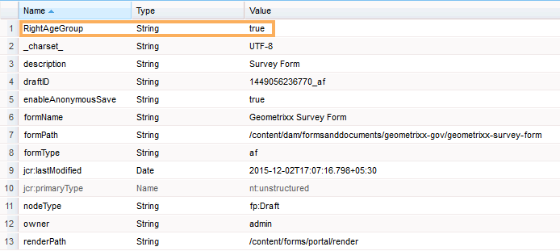

# Adicionar informações dos dados do usuário aos metadados de envio de formulário {#adding-information-from-user-data-to-form-submission-metadata}

>[!CAUTION]
>
>AEM 6.4 chegou ao fim do suporte estendido e esta documentação não é mais atualizada. Para obter mais detalhes, consulte nossa [períodos de assistência técnica](https://helpx.adobe.com/br/support/programs/eol-matrix.html). Encontre as versões compatíveis [here](https://experienceleague.adobe.com/docs/).

Você pode usar valores inseridos em um elemento de seu formulário para calcular campos de metadados de um rascunho ou de um envio de formulário. Os metadados permitem filtrar o conteúdo com base nos dados do usuário. Por exemplo, um usuário insere John Doe no campo de nome do formulário. Você pode usar essas informações para calcular metadados que podem categorizar esse envio no JD de iniciais.

Para calcular campos de metadados com valores inseridos pelo usuário, adicione elementos do formulário nos metadados. Quando um usuário insere um valor nesse elemento, um script usa o valor para calcular as informações. Essas informações são adicionadas nos metadados. Ao adicionar um elemento como um campo de metadados, você fornece uma chave para ele. A chave é adicionada como um campo nos metadados e as informações calculadas são registradas em relação a ela.

Por exemplo, uma empresa de seguros de saúde publica um formulário. Nesse formulário, um campo captura a idade dos usuários finais. O cliente deseja verificar todos os envios em uma faixa etária específica depois que vários usuários enviarem o formulário. Em vez de passar por todos os dados que se complicam com o número crescente de formulários, metadados adicionais ajudam o cliente. O autor do formulário pode configurar quais propriedades/dados preenchidos pelo usuário final são armazenados no nível superior para facilitar a pesquisa. Metadados adicionais são informações preenchidas pelo usuário armazenadas no nível superior do nó de metadados, conforme o autor o configurou.

Considere outro exemplo de um formulário que captura a ID do email e o número de telefone. Quando um usuário visita esse formulário anonimamente e abandona o formulário, o autor pode configurar o formulário para salvar automaticamente a id do email e o número de telefone. Este formulário é salvo automaticamente e o número de telefone e a ID de email são armazenados no nó de metadados do rascunho. Um caso de uso dessa configuração é o painel de gerenciamento de clientes potenciais.

## Adição de elementos de formulário aos metadados {#adding-form-elements-to-metadata}

Execute as seguintes etapas para adicionar um elemento nos metadados:

1. Abra o formulário adaptável no modo de edição.

   Para abrir o formulário no modo de edição, no Gerenciador de formulários, selecione o formulário e toque em **Abrir**.

1. No modo de edição, selecione um componente, toque em  > **Contêiner de formulário adaptável** e toque em .
1. Na barra lateral, clique em **Metadados**.
1. Na seção Metadados , clique em **Adicionar**.
1. Use o campo Value da guia Metadata para adicionar scripts. Os scripts adicionados coletam dados de elementos no formulário e calculam valores alimentados aos metadados.

   Por exemplo, **true** estiver registrado nos metadados se a idade inserida for maior que 21, e **false** é registrado se for menor que 21. Digite o seguinte script na guia Metadados:

   `(agebox.value >= 21) ? true : false`

   
   **Figura:** *Script inserido na guia Metadados*

1. Clique em **OK**.

Depois que um usuário insere dados no elemento selecionado como um campo de metadados, as informações calculadas são registradas nos metadados. Você pode ver os metadados no repositório configurado para armazenar metadados.

## Visualização de metadados atualizados de envio de formulário: {#seeing-updated-form-nbsp-submission-metadata}

No exemplo acima, os metadados são armazenados no repositório CRX. Os metadados têm a seguinte aparência:

Se você adicionar um elemento de caixa de seleção nos metadados, os valores selecionados serão armazenados como uma sequência de caracteres separada por vírgulas. Por exemplo, você adiciona um componente de caixa de seleção no formulário e especifica seu nome como `checkbox1`. Nas propriedades do componente da caixa de seleção, você adiciona os itens Licença de Condução, Número do Seguro Social e Passport para os valores 0, 1 e 2.

Você seleciona um contêiner de formulário adaptável e, nas propriedades do formulário, adiciona uma chave de metadados `cb1` que armazena `checkbox1.value`e publicar o formulário. Quando um cliente preenche o formulário, o cliente seleciona as opções Passport e Social Security Number no campo de caixa de seleção. Os valores 1 e 2 são armazenados como 1, 2 no campo cb1 dos metadados de envio.

>[!NOTE]
>
>O exemplo acima é somente para fins de aprendizagem. Certifique-se de procurar metadados no local correto, conforme configurado na implementação do AEM Forms.
