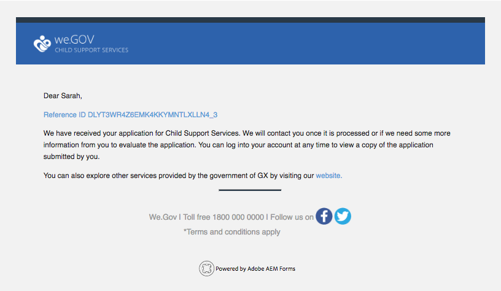
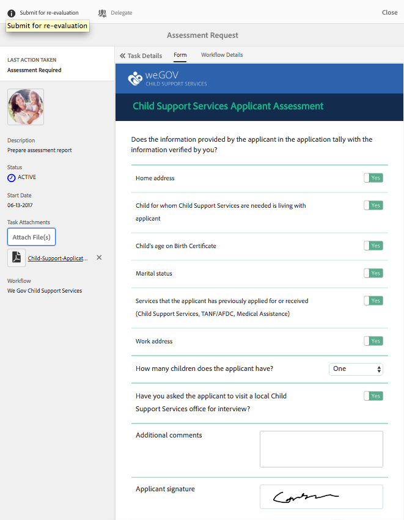

# Apresentação do site de referência We.Gov {#we-gov-reference-site-walkthrough}

## Pré-requisito {#pre-requisite}

Configure seu site de referência We.Gov conforme descrito em [Configurar e configurar sites](/help/forms/using/setup-reference-sites.md)de referência da AEM Forms.

## Cenário do site de referência {#reference-site-scenario}

We.Gov é uma organização estatal que permite que pais adotivos se inscrevam para o suporte infantil se eles adotarem uma criança. O site gerencia o seguinte:

* Elegibilidade do candidato, da empresa-mãe adotiva
* Dados pessoais e profissionais do requerente (se o requerente for elegível para apoio à criança)
* Dados pessoais da criança adotada

   O requerente pode fornecer informações pormenorizadas para mais de uma criança
* Dados da conta bancária do requerente em que este pode receber prestações de assistência a crianças
* Cobrança da taxa de pedido
* Avaliação do pedido
* Aprovação do pedido
* Comunicação automatizada ao requerente

Uma vez apresentada a candidatura e paga a sua taxa, o requerente recebe um e-mail da organização com o aviso de recepção da candidatura apresentada.

A organização We.Gov recebe o aplicativo. A organização recebe a avaliação da solicitação e aprova as solicitações genuínas.

Depois que o aplicativo é aprovado, o requerente recebe um email do site We.Gov. A opção Documento **de** Visualização no e-mail vincula-se a um documento com os detalhes de inscrição do candidato.

O infográfico abaixo mostra o fluxo de trabalho passo a passo do cenário do site de referência We.Gov.

O cenário envolve as seguintes personas:

* Sarah Rose, a mãe adotiva que pede apoio para crianças
* Joe, a criança adotada
* Gloria Rios, chefe da divisão de aprovação, We.Gov
* Conard Simms, o agente de campo que cuida da avaliação do aplicativo

## Sarah inicia sua verificação de qualificação {#sarah-initiates-her-eligibility-check}

Um candidato pode verificar a qualificação para solicitar benefícios de suporte-filho. O site permite que os usuários respondam perguntas para permitir que determinem se seu aplicativo é elegível para benefícios. Sarah, uma mãe adotiva, é uma candidata potencial para isso. O formulário de elegibilidade faz parte dos serviços de Pedido de Apoio à Criança do sítio Web We.Gov. Para verificar sua qualificação, Sarah clica em Suporte **** infantil no site We.Gov. Na página Suporte à Criança, Sarah clica em **[!UICONTROL Verificar sua qualificação]**.

Além da abordagem acima, Sarah pode clicar em **[!UICONTROL Introdução]** na página inicial. Sarah é navegada até a página Todos os aplicativos, onde ela pode clicar em Aplicar em **[!UICONTROL Aplicativo para Serviços]** de Suporte Filho. Sarah é levada ao cheque de elegibilidade.

Na página Verificar qualificação para suporte filho, é pedido a Sarah um conjunto de perguntas para determinar sua qualificação para benefícios de suporte filho. Por meio de um conjunto de perguntas, ela é questionada:

* Se ela for a pessoa que guarda a criança
* Se ela e a criança vivem no estado de GX
* A faixa etária da criança e a educação da criança.

Sarah responde a essas perguntas, e sua qualificação é validada. Suas respostas determinam se ela é elegível para apoio infantil.

Sarah é informada de que ela é elegível para apoio infantil, e a taxa de inscrição é de US$ 25.

### Como funciona {#how-it-works}

A qualificação de Sarah é validada por meio de uma barreira de qualificação criada usando o editor de regras. O editor de regras permite especificar as condições que são atendidas antes que um candidato possa preencher o formulário de solicitação. Quando Sarah, a candidata, preenche todas as condições de elegibilidade, aterrissa no formulário de candidatura.

A verificação de qualificação faz parte do formulário adaptável do aplicativo para suporte à criança. A regra valida a elegibilidade quando:

* O requerente é um responsável pela custódia
* O requerente e a criança permanecem no estado GX
* O requerente tem a principal guarda diária da criança
* A idade da criança ter cobertura de serviços de apoio é menor que 16 anos.

### Veja você mesmo {#see-it-yourself}

No seu navegador, abra `https://<hostname>:<PublishPort>/content/we-gov/en.html`. No site We.Gov, clique em Child Support (Suporte para filhos). Na página Suporte à criança, clique em Verificar sua qualificação.

Para ver as regras:

1. Abra o formulário no modo de edição na instância do autor. URL: `https://<hostname>:<AuthorPort>/editor.html/content/forms/af/we-gov/child-support/css.html`.
1. Select a component and click .

   O Editor de regras é aberto listando todas as regras aplicadas no formulário.

1. No painel do lado esquerdo, clique em regras `passMsg` e `failMsg` para entender como a verificação de qualificação funciona.

## Sarah start seu pedido de apoio infantil {#sarah-starts-her-application-for-child-support}

Sarah clica em Aplicativo **[!UICONTROL de]** Start depois de ser informada sobre sua qualificação para suporte a crianças.\
Na página Application For Child Support Services, Sarah fornece detalhes nas seguintes seções:

* **[!UICONTROL Sobre o Requerente]**: Deixe Sarah fornecer seus detalhes nesta seção.

* **[!UICONTROL Informações]** secundárias: Permite que Sarah forneça informações sobre crianças, que são cobertas por serviços de apoio.

* **[!UICONTROL Pagamento]**: Deixe Sarah fornecer detalhes bancários em que We.Gov pode depositar uma compensação mensal de apoio.

* **[!UICONTROL Pagamento]** de taxa: Permite que Sarah forneça os detalhes do cartão de crédito para pagar a taxa do pedido.

Por padrão, Sarah é direcionada para a seção **[!UICONTROL Sobre o Requerente]** .

A qualquer momento, Sarah pode clicar em **[!UICONTROL Voltar mais tarde]** e retomar com seu aplicativo. Quando ela clica em **[!UICONTROL Voltar mais tarde]**, seu progresso é salvo como um rascunho, e ela recebe uma opção para enviar o rascunho por email.

Quando ela clica em **[!UICONTROL Enviar e-mail]**, ela recebe um e-mail com um link para o rascunho de seu formulário.

O formulário de suporte para filhos no site We.Gov usa formulários adaptáveis. Ela pode usar o link em seu email e preencher o formulário em seu dispositivo móvel.

>[!NOTE]
>
>O fluxo de trabalho de retornar do e-mail funciona somente com usuários conectados. No cenário do site de referência, verifique se a usuário Sarah Rose está adicionada. As credenciais de login da Sarah são `srose/password`.

Sarah pode fornecer detalhes em qualquer seção, mas a taxa do aplicativo é aceita somente depois que ela fornece as informações necessárias em todas as seções. Uma aplicação está incompleta sem pagamento de taxa e são necessários campos marcados com um asterisco.

### <strong>Sarah fornece informações</strong> {#strong-sarah-provides-her-information-strong}

Depois que Sarah clicar em **[!UICONTROL Start Application]**, ela será direcionada para a seção Informações do Candidato da página Application For Child Support Services. Em Informações do Candidato, Sarah navega pelas guias e fornece informações pessoais para o aplicativo. Ela clica em **[!UICONTROL Próximo]** para navegar pelas guias.

Em Informações sobre o Requerente, solicita-se-lhe que forneça informações detalhadas sob as seguintes guias:

* **[!UICONTROL Informações básicas]**

Em Basic Information (Informações básicas), Sarah fornece sua prova de identificação e suas informações pessoais. As informações pessoais de Sarah incluem o nome, a ID de e-mail e o número da segurança social.

* **[!UICONTROL Relação]**

   Em Relacionamento, Sarah insere informações sobre seu estado civil.

* **[!UICONTROL Informações adicionais]**

   Em Additional Information (Informações adicionais), Sarah insere um número de identificação, sua data de nascimento e o endereço atual e o número de telefone.

### Sarah fornece informações sobre filhos {#sarah-provides-child-information}

Depois que Sarah fornecer suas informações pessoais e clicar em **[!UICONTROL Avançar]**, ela será levada para a seção Informações da Criança.

Na seção Informações sobre crianças, ela fornece os seguintes detalhes:

* Número de filhos para solicitar serviços de suporte a crianças
* Nome da criança, número da segurança social, data de nascimento e local de nascimento

Se Sarah escolher mais de uma criança, ela terá formulários extras habilitados com os mesmos detalhes para preencher.\
Sarah escolhe seu único filho, Joe, e digita seu nome.

### Sarah fornece informações de pagamento {#sarah-provides-payment-information}

Depois que Sarah fornecer informações sobre a criança (ou filhos) adotada e clicar em **[!UICONTROL Avançar]**, ela será direcionada para a seção Informações **[!UICONTROL de]** Pagamento.

Na seção Informações sobre Pagamento, fornece os detalhes da conta bancária na qual ela pode receber os benefícios do apoio infantil.\
Ela digita o número de sua conta bancária de 10 dígitos.

## Sarah paga a taxa de inscrição e assina o formulário {#sarah-pays-the-application-fee-and-signs-the-form}

Depois que Sarah concorda com os termos e condições do aplicativo, ela paga a taxa de inscrição de US$ 25. A taxa de inscrição é necessária para processar o aplicativo.\
Sarah entra nos detalhes do cartão de crédito e clica em **[!UICONTROL Pagar Agora]**. Depois de pagar as taxas, uma versão em PDF do aplicativo é exibida com um campo de assinatura.

Sarah pode escolher digitar, usar o recurso de desenhar à mão, inserir uma imagem de assinatura ou usar a tela sensível ao toque de seu celular para desenhar sua assinatura. Sarah digita seu nome e clica em Clicar para assinar.

Seu pedido é enviado para o site We.Gov.

### <strong>Sarah recebe um email de reconhecimento</strong> {#strong-sarah-receives-an-acknowledgement-email-strong}

Depois que Sarah paga a taxa de inscrição, ela recebe um e-mail de reconhecimento do site We.Gov.\
We.Gov processa o pedido, e Sarah é informada que ela receberá uma compensação mensal depois que seu pedido for aprovado.

### Como funciona {#how-it-works-1}

O aplicativo de suporte secundário usa uma combinação de layouts de painel, como a guia superior, o assistente e o acordeão para criar a experiência. Ele usa um modelo de formulário chamado Modelo Filho We.Gov.

O candidato pode se mover entre seções para preencher diferentes componentes do formulário. Quando o requerente preenche o formulário, o envia, concorda com os termos e condições e paga a taxa, é iniciado um fluxo de trabalho personalizado. O fluxo de trabalho personalizado envia um email automatizado ao candidato confirmando o envio do aplicativo. O pedido é transmitido ao serviço competente da organização para verificação e aprovação.

O layout do formulário é especificado no Tema do Serviço de Suporte a Filho do Governador. O estilo inclui estilo de componente, plano de fundo da página, formatação de estado de erro dos componentes e estilos de fonte.

A verificação de qualificação usa regras especificadas no formulário. Ele usa as verificações de validade especificadas abaixo:

`SHOW passMsgWHEN (Does the child live in the state of GX? is equal to Yes) AND (Do you live in the state of GX? is equal to Yes) AND ( (Who has the main day-to-day care of the child? is equal to You) AND (Are you: is equal to The custodial parent) ) AND (Is the child you are applying for: is equal to Under 16 years) ELSE Hide`

`HIDE failMsg WHEN (Does the child lives in the state of GX? is equal to Yes) AND ( (Do you live in the state of GX? is equal to Yes) AND (Who has the main day-to-day care of the child? is equal to You) ) AND (Is the child you are applying for: is equal to Under 16 years) AND (Are you: is equal to The custodial parent) ELSE Show`

### Veja você mesmo {#see-it-yourself-1}

Em seu navegador, abra `https://<hostname>:<PublishPort>/content/forms/af/we-gov/child-support/css.html` e preencha as informações necessárias. Ao enviar a solicitação depois de preencher as informações necessárias, pagar as taxas e assinar o documento, você receberá o e-mail de confirmação.

Consulte o Modelo Filho We.Gov aqui: `https://<hostname>:<AuthorPort>/editor.html/conf/we-gov/settings/wcm/templates/we-gov-child-template/structure.html`

Veja o tema aqui: `https://<hostname>:<AuthorPort>/editor.html/content/dam/formsanddocuments-themes/we-gov/we-gov-theme-A/jcr:content`

Para ver todas as regras, execute as seguintes etapas:

1. Abra o formulário no modo de criação.

   URL: `https://<hostname>:<AuthorPort>/editor.html/content/forms/af/we-gov/child-support/css.html`

1. Selecione um componente e toque em . Todas as regras são listadas no editor de regras, incluindo as regras listadas acima.

## Gloria recebe a candidatura {#gloria-receives-the-application}

Gloria, chefe de aprovações em We.Gov, pode visualização, aprovar ou rejeitar candidaturas enviadas. AEM Caixa de entrada permite que ela veja todas as solicitações enviadas em um único lugar.

### Como funciona {#how-it-works-2}

Quando Sarah preenche e envia o aplicativo de suporte filho, um PDF ou Documento de Registro do aplicativo é criado e enviado para a caixa de entrada de Gloria Rios. Gloria pode visualização do pedido apresentado, aceitando-o ou rejeitando-o.

### Veja você mesmo {#see-it-yourself-2}

Abrir página `https://<hostname***>:<PublishPort>/content/we-gov/en.html`. Na página, toque em **[!UICONTROL Fazer logon]**, marque a caixa de seleção **[!UICONTROL Fazer logon como representante]** , faça logon na caixa de entrada AEM usando grios/password como nome de usuário/senha para Gloria Rios. O aplicativo de suporte secundário é exibido. Para obter informações sobre como usar AEM Caixa de entrada para tarefas de fluxo de trabalho centradas em formulários, consulte [Gerenciar aplicativos e tarefas do Forms AEM Caixa de entrada](/help/forms/using/manage-applications-inbox.md).

Gloria pode ver, aprovar ou rejeitar o aplicativo do painel do aplicativo.

### Como funciona {#how-it-works-3}

Gloria, chefe de aprovação na We.Gov, abre sua caixa de entrada AEM. Ela vê uma tarefa de revisão em sua lista de tarefas. Ela abre e visualização a tarefa de revisão.

Ela vê um PDF do formulário preenchido com detalhes que Sarah inseriu junto com os documentos que Sarah carregou.\
Gloria pode aprovar ou rejeitar o pedido. No entanto, Gloria clica em **[!UICONTROL Avaliação Necessária]** para avaliar o aplicativo.

O aplicativo da Sarah é um ponto de partida no fluxo de trabalho da AEM. Ele inicia o fluxo de trabalho AEM quando o formulário de aplicativo de suporte secundário é enviado. O fluxo de trabalho AEM cria uma tarefa para Gloria, que aparece na sua caixa de entrada AEM. Quando Gloria solicita uma avaliação no local, uma nova tarefa é criada para o agente de campo.

### Veja você mesmo {#see-it-yourself-3}

Se a configuração for concluída, o fluxo de trabalho AEM será start imediatamente após o formulário ser enviado. Faça logon na caixa de entrada usando as credenciais de Gloria.

Acesse a caixa de entrada em https://&lt;nome do ***host***>:&lt;***PublishPort***>/content/we-gov/en.html. Na página, toque em **[!UICONTROL Fazer logon]**, marque a caixa de seleção **[!UICONTROL Fazer logon como representante]** para usar as credenciais padrão de Gloria:

* Nome de usuário: grios
* Senha: password

Em sua caixa de entrada AEM, o aplicativo da Sarah é adicionado como uma tarefa de revisão. Selecione a tarefa e clique em **Avaliação necessária** para prosseguir para a próxima etapa.

### A placa recebe a tarefa de avaliação {#conard-assessment-task}

Quando Gloria clica em **[!UICONTROL Avaliação obrigatória]**, Conard recebe a tarefa de revisão em sua Caixa de entrada AEM. A tarefa é a próxima etapa do fluxo de trabalho AEM definido no modelo de fluxo de trabalho. Ele vê a tarefa da revisão e a abre.

A Conard obtém a tarefa de avaliação do requerente, como mostrado abaixo.

A avaliação de suporte à criança é um formulário associado à tarefa. Ele recebe os detalhes de Sarah, junto com os documentos de apoio (anexados em detalhes da tarefa). O cartão preenche o formulário de avaliação no campo em um dispositivo e envia para reavaliação.

O Conard verifica todos os detalhes que a Sarah forneceu e a Sarah assina a avaliação. A AEM Forms pode pegar o local e o carimbo de data e hora e adicioná-los à assinatura.

A placa clica em **[!UICONTROL Enviar para reavaliação]** e o fluxo de trabalho AEM envia a avaliação para a organização We.Gov.

### Como funciona {#how-it-works-4}

Quando Gloria solicita uma avaliação, a próxima etapa AEM fluxo de trabalho é iniciada e a tarefa de avaliação é adicionada à caixa de entrada do Conard. O Conard é o trabalhador de campo.

O Conard visita o local de Sarah, verifica se as informações que Sarah forneceu são genuínas e preenche o formulário de avaliação. O Conard pode acessar um PDF do formulário completo que Sarah preencheu.

### Veja você mesmo {#see-it-yourself-4}

Abra a caixa de entrada AEM em seu tablet e use as credenciais do Conard para fazer logon.

As credenciais padrão do Conard são:

* Nome de usuário: csimms
* Senha: password

Você pode ver uma nova tarefa de solicitação de avaliação adicionada à caixa de entrada. Submeter a avaliação concluída e prosseguir para a próxima etapa.

### Gloria revê a avaliação e aprova o pedido {#gloria-reviews-the-assessment-and-approves-the-application}

Depois que a Conard submete a avaliação, Gloria vê uma tarefa de revisão na sua caixa de entrada. Ela seleciona e abre a **[!UICONTROL Review]**.

Em Detalhes da Tarefa, Gloria vê Última Ação Tomada como &quot;Submeter para Reavaliação&quot; (pelo Conard). Gloria vê que a Conard Simms avaliou o pedido.

### Como funciona {#how-it-works-5}

Depois que a Conard submete a avaliação, Gloria vê uma tarefa de revisão na sua caixa de entrada. Ela seleciona e abre o Review. Em Detalhes da Tarefa, Gloria vê o comentário de avaliação feito pelo Conard, que é &quot;Tudo encontrado em ordem&quot;.

Gloria aprova o pedido.

### Veja você mesmo {#see-it-yourself-5}

Abra a caixa de entrada e faça logon usando as credenciais de Gloria. Uma nova tarefa chamada Revisar é exibida na caixa de entrada.

Abra a tarefa para ver o status da Última ação realizada. Com base na avaliação, aprovar o pedido.

## Sarah recebe um email de aprovação {#sarah-receives-an-approval-email}

Depois que Gloria aprova o pedido, Sarah recebe um e-mail do We.Gov informando que seu pedido foi aprovado.

O botão Documento **[!UICONTROL da]** Visualização no e-mail vincula-se aos detalhes de inscrição. Sarah clica em Documento **[!UICONTROL Visualização.]**

Os detalhes das listas do documento de inscrição, como a ID de referência, a cobertura do filho, a data de início, o número da conta bancária, a frequência de pagamento e a quantia de pagamento.

Sarah pode visualização os documentos que ela carregou na mesma página.

### Como funciona {#how-it-works-6}

Quando Gloria aprova o aplicativo, Sarah recebe um email automatizado com um link para o documento de inscrição.

O documento de inscrição é uma comunicação interativa e pode ser visualizado em qualquer dispositivo. Ele contém detalhes do serviço de suporte infantil e informações fornecidas pela Sarah.

### Veja você mesmo {#see-it-yourself-6}

Verifique o cliente de email configurado para o email automático com um link para o documento de inscrição.

Como alternativa, para ver o documento no seu navegador, abra: `https://<hostname>:<PublishPort>/content/aemforms-refsite/doclink.html?document=/content/forms/af/we-gov/child-support/enrollment-document&referenceId=[reference-id]&channel=web`

## We.Gov analisa o desempenho do aplicativo {#we-gov-analyzes-the-performance-of-the-application}

We.Gov, de tempos em tempos, analisa o desempenho de seu aplicativo de serviços de suporte para crianças para verificar se os clientes estão enfrentando problemas. Eles usam essa análise para tomar decisões informadas sobre as mudanças necessárias no aplicativo de serviços de apoio à criança para melhorar a experiência do usuário, reduzir a taxa de abandono de formulários e, assim, melhorar a conversão. Eles aproveitam a integração da AEM Forms com a Adobe Analytics para a análise. A imagem a seguir descreve o painel de análise.

### Como funciona {#how-it-works-7}

As métricas de desempenho para o formulário de aplicativo de serviços de suporte secundário são rastreadas usando o Adobe Analytics. Para obter mais informações sobre como configurar o Adobe Analytics e exibir relatórios, consulte [Configurar análises para formulários e documentos](/help/forms/using/configure-analytics-forms-documents.md).

### Veja você mesmo {#see-it-yourself-7}

Para que você possa visualização e explorar o relatório de análise, estamos fornecendo dados semente para o aplicativo de serviços de suporte para crianças no site de referência. Antes de usar dados semente, consulte [Configurar o Analytics](/help/forms/using/setup-reference-sites.md#configureanalytics). Execute as seguintes etapas na instância do autor para visualização o relatório aos dados semente:

1. Vá para a interface do usuário do **[!UICONTROL Forms &amp; Documentos]** em https://&lt;*nome do host*>:&lt;*AuthorPort*>/aem/forms.html/content/dam/formsanddocuments.

1. Clique para abrir a pasta **We.Gov** .
1. Selecione o formulário adaptativo **[!UICONTROL Aplicativo para serviços]** de suporte filho e clique em **[!UICONTROL Ativar o Analytics]** na barra de ferramentas.

1. Selecione o formulário novamente e clique em Relatório **** do Analytics na barra de ferramentas para gerar o relatório. Você verá um relatório em branco inicialmente.

Para gerar um relatório de análise com dados semente:

1. No navegador de endereços da lista CRXDE, digite: **/apps/we-gov/demo-artifacts/analyticsDados de teste/Serviço de suporte ao filhoDados de teste do Analytics**
1. Os dados semente são selecionados na estrutura do diretório do lado esquerdo.
1. Duplo clique no arquivo selecionado para abrir seu conteúdo no painel direito.
1. Copie todo o conteúdo no arquivo de dados de teste.
1. No CRXDE, navegue até: **/content/dam/formsanddocuments/we-gov/child-support/css/jcr:content/analyticsdatanode/lastsevendays**
1. No campo analytics data em Propriedades, cole o conteúdo copiado do arquivo de dados de teste.
1. Agora, gere o relatório de análise novamente para o **[!UICONTROL Aplicativo para Serviços]** de Suporte Filho. Você pode ver os dados semente no relatório gerado.

