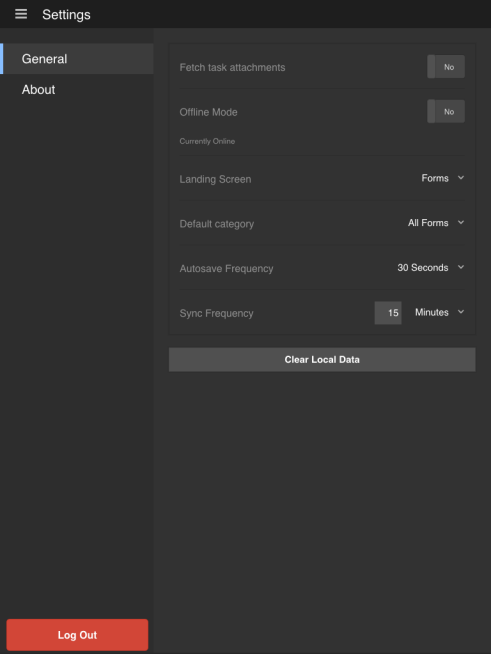

# Tela inicial {#home-screen}

>[!CAUTION]
>
>AEM 6.4 chegou ao fim do suporte estendido e esta documentação não é mais atualizada. Para obter mais detalhes, consulte nossa [períodos de assistência técnica](https://helpx.adobe.com/br/support/programs/eol-matrix.html). Encontre as versões compatíveis [here](https://experienceleague.adobe.com/docs/).

Ao fazer logon no aplicativo AEM Forms, você é redirecionado para a tela inicial.

## Tela inicial padrão {#default-home-screen}

Por padrão, a tela inicial exibe todos os formulários, incluindo os pontos de partida e as tarefas (se o servidor conectado estiver habilitado para o AEM Forms Workflow), juntamente com as miniaturas associadas. Você pode especificar as miniaturas no servidor do AEM Forms.

A figura a seguir é anotada com chamadas para os componentes essenciais na tela inicial padrão.

[Clique para ampliar](assets/home-screen-1-1.png)

1. **Botão Menu**: Toque no **Menu** para navegar até Tarefas, Forms, Caixa de saída e Configurações. Se o aplicativo AEM Forms estiver conectado a um servidor JEE AEM Forms, você poderá ver a opção Tarefas . A opção Tarefas também armazena os rascunhos criados a partir de tarefas em um processo. Para servidores OSGi da AEM Forms, a opção Tarefas está oculta. A caixa de saída armazena os formulários e rascunhos salvos antes de sincronizar com o servidor. Todos os formulários e rascunhos salvos na Caixa de saída são carregados no servidor do AEM Forms quando o aplicativo é [sincronizado com o servidor](/help/forms/using/sync-app.md). Para obter informações sobre Configurações, consulte [Atualizar configurações gerais](/help/forms/using/update-general-settings.md).
1. **Tarefa ou formulário**: Toque na tarefa ou formulário listado com o qual deseja trabalhar.
1. **Reticências Horizontais**: Indica que as ações estão disponíveis para o formulário. Tocar no elipse exibe as ações e a descrição fornecidas pelo autor. O **Excluir rascunho** e **Concluído** é visível ao tocar nas reticências.
1. **Ícone Atualizar**: Toque no ícone de atualização para sincronizar o aplicativo com o servidor do AEM Forms.

## Personalização da tela inicial {#customizing-the-home-screen}

Você pode alterar a tela inicial padrão do aplicativo na **[Configurações gerais](/help/forms/using/update-general-settings.md)** do aplicativo ou do **Preferência** no HTML Workspace.

A alteração feita na configuração da tela inicial no aplicativo afeta a tela inicial do usuário atual registrado no dispositivo móvel atual.

No entanto, a alteração feita no HTML Workspace afeta todos os usuários de aplicativos do AEM Forms conectados ao servidor do AEM Forms.
