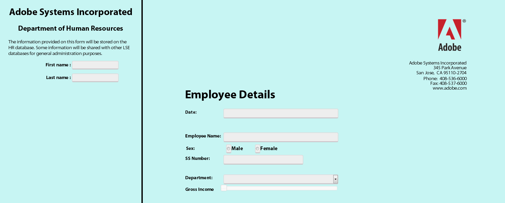

# Integração do Form Bridge ao portal personalizado para formulários HTML5 {#integrating-form-bridge-with-custom-portal-for-html-forms}

>[!CAUTION]
>
>AEM 6.4 chegou ao fim do suporte estendido e esta documentação não é mais atualizada. Para obter mais detalhes, consulte nossa [períodos de assistência técnica](https://helpx.adobe.com/br/support/programs/eol-matrix.html). Encontre as versões compatíveis [here](https://experienceleague.adobe.com/docs/).

O FormBridge é uma API HTML5 Forms bridge que permite interagir com um formulário. Para obter a referência da API do FormBridge, consulte [Referência da API do FormBridge](/help/forms/using/form-bridge-apis.md).

Você pode usar a API FormBridge para obter ou definir os valores dos campos do formulário a partir da página HTML e enviar o formulário. Por exemplo, você pode usar a API para criar uma experiência semelhante a um assistente.

Um aplicativo HTML existente pode aproveitar a API do FormBridge para interagir com um formulário e incorporá-lo à página do HTML. Você pode usar as seguintes etapas para definir o valor de um campo usando a API Form Bridge.

## Integração de formulários HTML5 a uma página da Web {#integrating-html-forms-to-a-web-page}

1. **Escolha um Perfil ou crie um Perfil**

   1. Na interface do CRX DE, navegue até: `https://[server]:[port]/crx/de`.
   1. Faça logon com as credenciais de administrador.
   1. Crie um perfil ou escolha um perfil existente.

      Para obter detalhes sobre como criar um perfil, consulte [Criação de um novo perfil](/help/forms/using/custom-profile.md).

1. **Modificar o perfil do HTML**

   Inclua tempo de execução XFA, biblioteca de localidade XFA e trecho de HTML de formulário XFA no renderizador de perfil, crie sua página da Web e coloque o formulário dentro da página da Web.

   Por exemplo, use o seguinte trecho de código para criar um aplicativo com dois campos de entrada e um formulário para demonstrar a interação entre o formulário e um aplicativo externo.

   ```xml
   <%@ page session="false"
                  contentType="text/html; charset=utf-8"%><%
   %><%@ taglib prefix="cq" uri="https://www.day.com/taglibs/cq/1.0" %><%
   %><!DOCTYPE html>
   <html manifest="${param.offlineSpec}">
       <head>
          <cq:include script="formRuntime.jsp"/>
           <!-- Portal Scripts and Styles -->
          <cq:include script="portalheader.jsp"/> 
       </head>
       <body>
           <div id="leftdiv" >
               <div id="leftdivcontentarea">   
                   <!-- Portal Body -->
                 <cq:include script="portalbody.jsp"/>  
               </div>
           </div>
           <div id="rightdiv">
               <div id="formBody">
               <cq:include script="config.jsp"/>
               <!-- Form body -->
               <cq:include script="formBody.jsp"/>
               <!  --To assist in page transitions -- add navigation, based on scrolling -->
               <cq:include  script="../nav/scroll/nav_footer.jsp"/>
               <cq:include script="footer.jsp"/>
               </div>    
           </div>
       </body>
   </html>
   ```

   >[!NOTE]
   >
   >O **linha 9** O contém referência de JSP adicional para estilos de CSS e arquivos JavaScript para projetar a página.
   >
   >O &lt;div id=&quot;rightdiv&quot;> ativar **linha 18** contém o trecho HTML do formulário XFA.
   O estilo da página é em dois contêineres: **left** e **right**. O contêiner correto tem o formulário . O contêiner esquerdo tem dois campos de entrada e parte da HTML externa.
   A captura de tela a seguir mostra como o formulário é exibido em um navegador.

   

   O lado esquerdo é parte do **HTML page**. O lado direito que contém os campos é o **formulário xfa**.

1. **Acesso aos campos do formulário da página**

   Este é um exemplo de script que pode ser adicionado para definir valores em um campo de formulário.

   Por exemplo, se você deseja definir a variável **EmployeeName** uso dos valores em Campos **Nome** e **Sobrenome**, chame o **window.formBridge.setFieldValue** .

   Da mesma forma, é possível ler o valor ao chamar **window.formBridge.getFieldValue **API.

   ```
   $(function() {
               $(".input").blur(function() {
                   window.formBridge.setFieldValue(
                               'xfa.form.form1.#subform[0].EmployeeName',
                                $("#lname").val()+' '+$("#fname").val()
                              )
                   });
           });
   ```
