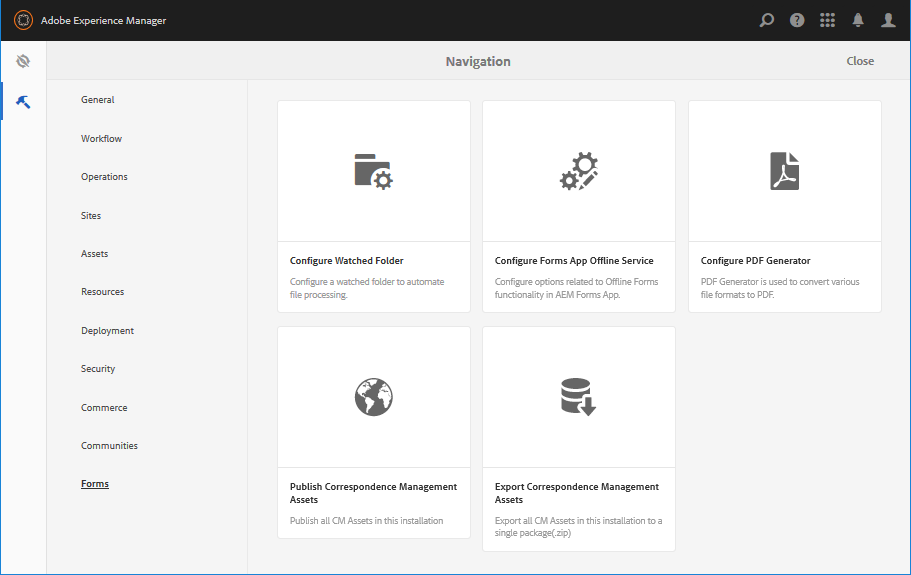

# Introdução ao gerenciamento de formulários {#introduction-to-managing-forms}

>[!CAUTION]
>
>AEM 6.4 chegou ao fim do suporte estendido e esta documentação não é mais atualizada. Para obter mais detalhes, consulte nossa [períodos de assistência técnica](https://helpx.adobe.com/br/support/programs/eol-matrix.html). Encontre as versões compatíveis [here](https://experienceleague.adobe.com/docs/).

O AEM Forms oferece uma interface de usuário simplificada, mas eficiente, para criar e gerenciar formulários, documentos, temas, cartas, fragmentos de documento, dicionários de dados e ativos relacionados. Ajuda a gerenciar todo o ciclo de vida de formulários, documentos e ativos relacionados, desde o desktop de um desenvolvedor até a oferta\
em um servidor de portal para usuários finais. Você pode usar a interface do usuário do AEM Forms para:

* Acessar componentes do AEM Forms
* Acesse as configurações do AEM Forms

>[!NOTE]
>
>Para obter informações detalhadas sobre outras ferramentas e opções de AEM, consulte [Trabalhar com o ambiente de criação](/help/sites-authoring/home.md).

## Acessar componentes do AEM Forms {#access-aem-forms-components}

Juntamente com as opções para criar formulários, documentos e ativos relacionados, o AEM fornece opções para criar sites, ativos, gerenciar uma instância de AEM e muito mais. Você pode clicar no botão  Logotipo do Experience Manager para navegar até todas as ferramentas disponíveis. Juntamente com os links para os consoles de outros componentes, também contém links para o AEM Forms . Para navegar até o AEM Forms, clique no botão **logotipo Experience Manager**  > **navegação**  > **Forms**. Os links dos seguintes consoles são exibidos:

* Formulários e documentos
* Temas
* Cartas
* Fragmentos do documento
* Dicionários de dados

### Formulários e documentos  {#forms-documents}

O Forms &amp; Documents fornece opções para criar uma Comunicação interativa, formulário adaptável, fragmento de formulário adaptável e conjunto de formulários. Somente para AEM Forms no JEE, a Forms e os Documentos fornecem uma opção para importar arquivos do armazenamento local e sincronizar ativos da AEM Forms com o Workbench.

O botão criar é o ponto de partida do processo de criação ou upload do ativo do AEM Forms. Ele fornece opções para criar:

* **Comunicação interativa**: Uma Comunicação interativa é uma correspondência digital, declaração ou documento personalizado, interativo e amigável para dispositivos com base em HTML. As Comunicações interativas são responsivas em natureza e alteram o layout e o design automaticamente com base no dispositivo e nas configurações do usuário. Para obter informações detalhadas, consulte [Visão geral das comunicações interativas](/help/forms/using/interactive-communications-overview.md).

* **Formulário adaptável:** Um formulário adaptável é um formulário envolvente e responsivo. Você pode criar um formulário adaptável para se adaptar dinamicamente às entradas do usuário, adicionando ou removendo seções de formulário com base na resposta do usuário, no dispositivo ou no ambiente de trabalho. O [Introdução à criação de formulários adaptáveis](/help/forms/using/introduction-forms-authoring.md) este artigo fornece informações detalhadas sobre os formulários adaptáveis.

* **Fragmento de formulário adaptável:** Embora cada formulário seja projetado para uma finalidade específica, há alguns segmentos comuns na maioria das formas, como para fornecer detalhes pessoais, como nome e endereço, detalhes familiares, detalhes de renda etc. Você pode criar um ativo individual para essas seções. Esses segmentos reutilizáveis e independentes são chamados de fragmentos de formulário adaptáveis. Para obter informações detalhadas, consulte [fragmentos de formulário adaptáveis](/help/forms/using/adaptive-form-fragments.md) artigo 10. o

* **Conjunto de formulários:** Um conjunto de formulários é uma coleção de formulários HTML5 agrupados e apresentados como um único conjunto de formulários para os usuários finais. Quando os usuários finais começam a preencher um conjunto de formulários, eles são perfeitamente transitados de um formulário para outro. No final, um usuário pode enviar todos os formulários, como uma única entidade, com apenas um clique. Para obter informações detalhadas, consulte [Conjunto de formulários no AEM Forms](/help/forms/using/formset-in-aem-forms.md).

* **Pasta:** A interface do usuário do AEM Forms usa pastas para organizar ativos. Ele suporta dois tipos de pastas:

   * **Pasta Geral:** Essas pastas são usadas para ativos criados na interface do usuário do AEM Forms. Essas pastas não têm uma estrutura de pastas estrita. É possível renomear, criar subpastas e armazenar formulários adaptáveis, Comunicações interativas, fragmentos de formulário adaptáveis, Modelos de formulário (XDPs), PDF forms, Documentos e ativos relacionados nessas pastas.
   * **Pasta Forms Workflow:** As pastas de fluxo de trabalho do Forms são criadas quando os processos do Workbench (arquivos do LiveCycle) são migrados e sincronizados com a interface do usuário do AEM Forms. Não é permitido renomear, criar uma subpasta, criar uma Comunicação interativa, um fragmento de formulário adaptável ou uma Comunicação interativa. Também não é permitido excluir uma pasta de versão ou criar e carregar um formulário adaptável, um fragmento de formulário adaptável ou uma Comunicação interativa em paralelo à pasta de versão.

**A.** Pasta geral **B.** pasta Forms Workflow

O painel Forms e Documento também fornece opções para:

* **Importar arquivos do armazenamento local:** É possível importar PDF forms &amp; Documents, Form templates (formulários XFA) e outros recursos (esquema Imagem e XML para XSDs). Para obter instruções passo a passo, consulte [Importação e exportação de ativos para o AEM Forms](/help/forms/using/import-export-forms-templates.md).

* **Sincronizar ativos do AEM Forms com o Workbench:** Você pode usar a opção Arquivos do Workbench para sincronizar ativos entre a interface do usuário do AEM Forms e o Workbench. Ela garante que todos os ativos estejam disponíveis na interface do usuário do AEM Forms e na seleção de ativos do repositório crx do Workbench.

### Temas  {#themes}

Um tema contém detalhes de estilo para componentes e painéis. Os temas têm uma identidade independente. Assim, você pode reutilizar um tema em várias formas adaptáveis. Você pode especificar estilos para um componente ou modificar as propriedades de CSS de vários componentes usados em seus formulários. Os estilos incluem propriedades como cores de plano de fundo, cores de estado, transparência e tamanho. É possível salvar personalizações em um tema e exportá-las para componentes do formulário como uma predefinição. Ao adicionar o tema ao formulário, o estilo especificado reflete nos componentes correspondentes do formulário. Com o AEM 6.2 Forms, você pode criar temas e aplicá-los aos seus formulários.

Para obter informações sobre como criar e usar temas, consulte [Temas no AEM Forms](/help/forms/using/themes.md).

### Cartas  {#letters}

Uma carta AEM forms é uma correspondência segura, personalizada e interativa. Você pode usar o AEM Forms para reunir rapidamente letras (também conhecidas como correspondências) do conteúdo pré-aprovado e de autoria personalizada em um processo simplificado.

Para obter informações sobre como criar e usar letras, consulte [Criar carta](/help/forms/using/create-letter.md).

### Fragmentos do documento {#document-fragments}

Fragmentos de documento são partes reutilizáveis ou componentes de uma correspondência que pode ser usada para compor cartas. Os fragmentos de documento são do tipo texto, lista, condição e fragmento de layout. Para obter informações sobre como criar e usar fragmentos de documento, consulte [criação de fragmentos de documento](/help/forms/using/document-fragments.md).

### Dicionários de dados {#data-dictionaries}

Normalmente, os usuários corporativos não exigem conhecimento de representações de metadados, como XSD (esquema XML) e classes Java. No entanto, elas geralmente exigem acesso a essas estruturas de dados e atributos para criar soluções. O AEM Forms usa o dicionário de dados para permitir que usuários corporativos usem informações de fontes de dados de back-end sem saber detalhes técnicos sobre seus modelos de dados subjacentes.

Para obter informações sobre como criar e usar dicionários de dados, consulte criação [artigo do dicionário de dados](/help/forms/using/data-dictionary.md)

## Acessar configurações do AEM Forms {#accessing-aem-forms-configurations}

AEM painel Ferramentas contém ferramentas para vários componentes. Para navegar até ferramentas específicas do AEM Forms, clique no botão **logotipo Experience Manager**  > **ferramentas**  > **Forms**. As ferramentas para executar as seguintes funções são exibidas:

* **Configurar pasta assistida:** Um administrador pode configurar uma pasta de rede, conhecida como pasta assistida, de modo que, quando um usuário colocar um arquivo (como um arquivo PDF) na pasta assistida, uma operação pré-configurada será iniciada e manipulará o arquivo. <!-- Fix broken link For detailed information, see Create and Configure a watched folder. -->

* **Configurar o serviço offline do aplicativo Forms:** O serviço offline de aplicativo AEM Forms armazena em cache os caminhos ou URLs dos recursos usados em um formulário. O armazenamento em cache de caminhos ou URLs dos recursos usados em um formulário melhora o desempenho do lado do servidor. Para configurar o componente offline do lado do servidor do aplicativo AEM Forms, consulte [Trabalhar no modo offline](/help/forms/using/work-offline-mode.md).

* **Configurar gerador de PDF:** Um administrador pode configurar o Gerador de PDF AEM Forms, adicionar contas de usuário e importar ou exportar configuração para o Gerador de PDF.
* **Publicar ativos de gerenciamento de correspondência:** O AEM Forms permite publicar todas as Cartas, Fragmentos de documentos e Dicionários de dados e dependências relacionadas de uma instância do autor ao mesmo tempo. Os ativos publicados incluem todos os ativos de Gerenciamento de correspondência e dependências relacionadas. Para obter informações detalhadas, consulte [Publicar e desfazer a publicação de formulários e documentos](/help/forms/using/publishing-unpublishing-forms.md#publishallthecorrespondencemanagementassets).
* **Exportar ativos de gerenciamento de correspondência:** É possível baixar todos os ativos de Gerenciamento de correspondência e dependências relacionadas como um pacote de uma instância de formulários AEM. Para obter etapas detalhadas, consulte [Importação e exportação de ativos para o AEM Forms](/help/forms/using/import-export-forms-templates.md#importandexportassetsincorrespondencemanagement)

## Elementos comuns da interface do usuário {#commonelements}

* **Painel esquerdo:** Você pode clicar no ícone do painel à esquerda  para revelar os recursos Linha do tempo e Referências do AEM Forms.

   * **Linha do tempo:** É possível adicionar e exibir comentários em um ativo que está disponível para revisão na linha do tempo. Para obter instruções detalhadas, consulte [Criar e gerenciar revisões de ativos nos formulários](/help/forms/using/create-reviews-forms.md).
   * **Referências:** Um ativo do AEM Forms pode ser usado em vários ativos do AEM Forms. Por exemplo, um fragmento de documento pode ser usado em várias letras. Referências é uma lista de ativos (outras formas ou recursos) em que o ativo selecionado é usado e também a lista de outros ativos que o ativo selecionado está usando.

* **Navegação estrutural:** Uma navegação estrutural representa o título do console ou da pasta atual. Você pode clicar na opção Caminho da navegação para navegar entre o nível de pastas mais alto na hierarquia.
* **Alternador de visualização:** Você pode clicar no ícone Exibir Alternador  ou  para alternar rapidamente entre a lista e a exibição de cartão. Para obter mais informações sobre componentes comuns da interface do usuário, consulte [Trabalhar com o ambiente de criação](/help/sites-authoring/basic-handling.md).
* **Pesquisar:** A opção de pesquisa  O oferece a capacidade de encontrar e acessar rapidamente o conteúdo e as ferramentas necessárias. Digite o nome do conteúdo ou da capacidade do produto e selecione entre as sugestões, por exemplo, digite &quot;Documentos&quot; para encontrar e navegar rapidamente até o console Forms &amp; Documents ou Document Fragments. Para obter mais informações sobre a pesquisa, consulte AEM 6.2 [pesquisa](/help/sites-authoring/search.md) artigo
* **Barra de ferramentas Ações**: Ao selecionar um ativo, a barra de ferramentas de ações aparece acima da lista de ativos. Ele contém todas as ferramentas de gerenciamento do ativo selecionado. Você pode passar o mouse sobre um ícone de ferramenta para ver a dica de ferramenta que descreve sua funcionalidade

>[!NOTE]
>
>Quando um usuário faz uma pesquisa em qualquer console de Forms &amp; Documents, o painel contém somente **Filtros e opções**. Você pode usar Filtros e opções para realizar uma pesquisa avançada.

* **Barra de ferramentas Ações**: Ao selecionar um ativo, a barra de ferramentas de ações aparece acima da lista de ativos. Ele contém todas as ferramentas de gerenciamento do ativo selecionado. Você pode passar o mouse sobre um ícone de ferramenta para ver a dica de ferramenta que descreve sua funcionalidade

