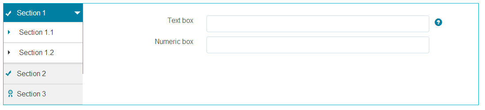
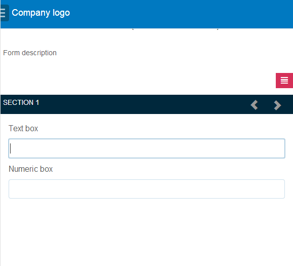

# Recursos de layout de formulários adaptáveis {#layout-capabilities-of-adaptive-forms}

>[!CAUTION]
>
>AEM 6.4 chegou ao fim do suporte estendido e esta documentação não é mais atualizada. Para obter mais detalhes, consulte nossa [períodos de assistência técnica](https://helpx.adobe.com/br/support/programs/eol-matrix.html). Encontre as versões compatíveis [here](https://experienceleague.adobe.com/docs/).

O Adobe Experience Manager (AEM) permite criar formulários adaptáveis fáceis de usar que oferecem experiências dinâmicas para os usuários finais. O layout do formulário controla como os itens ou componentes são exibidos em um formulário adaptável.

## Conhecimento pré-requisito {#prerequisite-knowledge}

Antes de saber mais sobre os diferentes recursos de layout de formulários adaptáveis, leia os artigos a seguir para saber mais sobre formulários adaptáveis.

[Introdução ao AEM Forms](/help/forms/using/introduction-aem-forms.md)

[Introdução à criação de formulários](/help/forms/using/introduction-forms-authoring.md)

## Tipos de layouts {#types-of-layouts}

Um formulário adaptável fornece os seguintes tipos de layouts:

**Layout do painel** Controla como os itens ou componentes dentro de um painel são exibidos em um dispositivo.

**Layout móvel** Controla a navegação de um formulário em um dispositivo móvel. Se a largura do dispositivo for de 768 pixels ou mais, o layout será considerado um layout móvel e otimizado para um dispositivo móvel.

**Layout da barra de ferramentas** Controla o posicionamento dos botões de Ação na barra de ferramentas ou na barra de ferramentas do painel em um formulário.

Todos esses layouts de painel são definidos no seguinte local:

`/libs/fd/af/layouts`.

>[!NOTE]
>
>Para alterar o layout de um formulário adaptável, use o Modo de criação no AEM.


## Layout do painel {#panel-layout}

Um autor de formulário pode associar um layout a cada painel de um formulário adaptável, incluindo o painel raiz.

Os layouts do Painel estão disponíveis em `/libs/fd/af/layouts/panel` local.


**Figura:** *Lista de layouts de painel em formulários adaptáveis*

### Responsivo - tudo em uma página sem navegação {#responsive-everything-on-one-page-without-navigation-br}

Use este layout de painel para criar um layout responsivo que se ajuste ao tamanho da tela do seu dispositivo sem precisar de navegação especializada.

Com esse layout, é possível colocar vários **[!UICONTROL Formulário adaptável do painel]** componentes um após o outro dentro do painel.


**Figura:** *Um formulário usando um layout responsivo, como visto em uma tela pequena*


**Figura:** *Um formulário usando um layout responsivo, como visto em uma tela grande*

### Assistente - um formulário em várias etapas que mostra uma etapa de cada vez {#wizard-a-multi-step-form-showing-one-step-at-a-time}

Use esse layout de painel para fornecer a navegação guiada dentro de um formulário. Por exemplo, use esse layout quando desejar capturar informações obrigatórias em um formulário, ao mesmo tempo em que orienta os usuários passo a passo.

Use o `Panel adaptive form` componente para fornecer navegação passo a passo dentro de um painel. Quando você usa esse layout, um usuário move para a próxima etapa somente após a conclusão da etapa atual

```
window.guideBridge.validate([], this.panel.navigationContext.currentItem.somExpression)
```


**Figura:** *Expressão de conclusão de etapa no layout do Assistente para um formulário de várias etapas*


**Figura:** *Um formulário usando o Assistente*

### Layout para design de acordeão {#layout-for-accordion-design}

Com esse layout, é possível colocar a variável `Panel adaptive form` em um painel com navegação no estilo acordeão. Com esse layout, também é possível criar painéis repetitivos. Painéis repetitivos permitem adicionar ou remover dinamicamente painéis, conforme necessário. Você pode definir o número mínimo e máximo de vezes que um painel se repete. Além disso, o título do painel pode ser determinado dinamicamente, com base nas informações fornecidas nos itens do painel.

A expressão Summary pode ser usada para mostrar os valores fornecidos pelo usuário final no título do painel minimizado.


**Figura:** *Painéis repetitivos criados com o layout Acordeão*

### Layout com guias - as guias são exibidas à esquerda {#tabbed-layout-tabs-appear-on-the-left}

Com esse layout, é possível colocar a variável `Panel adaptive form` em um painel com navegação por guias. As guias são colocadas à esquerda do conteúdo do painel.



**Figura:** *Guias que aparecem à esquerda de um painel*

### Layout com guias - as guias são exibidas na parte superior {#tabbed-layout-tabs-appear-on-the-top}

Com esse layout, é possível colocar a variável `Panel adaptive form` Componente em um painel com navegação de guia. As guias são colocadas sobre o conteúdo do painel.


**Figura:** *Guias que aparecem na parte superior de um painel*

## Layouts para dispositivos móveis {#mobile-layouts}

Os layouts móveis permitem uma navegação simples nos dispositivos móveis com telas relativamente menores. Os layouts móveis usam estilos de guias ou de assistente para navegação de formulários. Aplicar um layout móvel fornece um único layout para todo o formulário.

Esse layout controla a navegação usando uma barra de navegação e um menu de navegação. A barra de navegação mostra **&lt;** e **>** ícone para indicar **next** e **previous** etapas de navegação no formulário.

Os Layouts móveis estão disponíveis em `/libs/fd/af/layouts/mobile/` local. Os seguintes layouts para dispositivos móveis estão disponíveis em formulários adaptáveis, por padrão.


**Figura:** *Lista de layouts para dispositivos móveis em formulários adaptáveis*

Ao usar um layout móvel, o menu de formulário, para acessar vários painéis, fica disponível ao tocar em  ícone .

### Layout com títulos de painel no cabeçalho do formulário {#layout-with-panel-titles-in-the-form-header}

Esse layout, como o nome sugere, mostra os títulos do painel junto com o menu de navegação e a barra de navegação. Esse layout também fornece ícones Próximo e Anterior para navegação.


**Figura:** *Layouts para dispositivos móveis com títulos de painéis nos cabeçalhos do formulário*

### Layout sem títulos de painel no cabeçalho do formulário {#layout-without-panel-titles-in-the-form-header}

Esse layout, como o nome sugere, mostra somente o menu de navegação e a barra de navegação sem títulos de painel. Esse layout também fornece ícones Próximo e Anterior para navegação.



**Figura:** *Layouts para dispositivos móveis sem títulos de painéis nos cabeçalhos do formulário*

## Layouts da barra de ferramentas {#toolbar-layouts}

Um Layout da barra de ferramentas controla o posicionamento e a exibição de todos os botões de ação adicionados aos formulários adaptáveis. O layout pode ser adicionado em um nível de formulário ou em um painel.


**Figura:** *Uma lista de Layouts da barra de ferramentas em formulários adaptáveis*

Os layouts da barra de ferramentas estão disponíveis em `/libs/fd/af/layouts/toolbar` local. por padrão, os formulários adaptáveis fornecem os seguintes Layouts da barra de ferramentas.

### Layout padrão da barra de ferramentas {#default-layout-for-toolbar}

Esse layout é selecionado como o layout padrão quando você adiciona botões de ação em um formulário adaptável. Selecionar esse layout exibe o mesmo layout para dispositivos móveis e de desktop.

Além disso, é possível adicionar várias barras de ferramentas contendo botões de ação configurados com esse layout. Um botão de ação está associado a um controle de formulário. É possível configurar as barras de ferramentas para serem anteriores ou posteriores a um painel.


**Figura:** *Exibição padrão da barra de ferramentas*

### Layout móvel fixo para a barra de ferramentas {#mobile-fixed-layout-for-toolbar}

Selecione este layout para fornecer layouts alternativos para dispositivos móveis e desktop.

Para o layout da área de trabalho, é possível adicionar botões de ação usando alguns rótulos específicos. Somente uma barra de ferramentas pode ser configurada com esse layout. Se mais de uma barra de ferramentas estiver configurada com esse layout, há uma sobreposição para dispositivos móveis e apenas uma barra de ferramentas estará visível. Por exemplo, é possível ter uma barra de ferramentas na parte inferior ou superior do formulário ou, depois ou antes dos painéis no formulário.

Para o layout móvel, é possível adicionar botões de ação usando ícones.


**Figura:** *Layout fixo para dispositivo móvel para barra de ferramentas*
