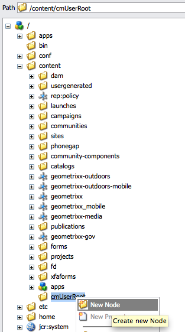

# Gerenciar imagens de assinatura do agente {#manage-agent-signature-images}

## Visão geral {#overview}

No Gerenciamento de correspondência, é possível usar uma imagem para renderizar a assinatura do agente em cartas. Depois de configurar a imagem de assinatura do agente, ao criar uma carta, você pode renderizar a imagem de assinatura do agente na carta como a assinatura do agente remetente.

O DDE agentSignatureImage é um DDE calculado que representa a imagem de assinatura do agente. A expressão para este DDE calculado usa uma nova função personalizada exposta pelo bloco modular do Expression Manager. Essa função personalizada utiliza agentID e agentFolder como parâmetros de entrada e busca o conteúdo da imagem com base nesses parâmetros. O dicionário de dados do sistema SystemContext fornece às letras no Gerenciamento de Correspondência acesso às informações no contexto atual do sistema. O contexto do sistema inclui informações sobre os parâmetros de configuração ativos e do usuário atualmente conectado.

É possível adicionar imagens sob a pasta cmuserroot. Em Propriedades [de configuração do](/help/forms/using/cm-configuration-properties.md)Correspondence Management, usando a propriedade raiz do usuário do CM, é possível alterar a pasta de onde a imagem de assinatura do agente é selecionada.

O valor do DDE agentFolder é obtido do parâmetro de configuração CMUserRoot para as propriedades de configuração do Gerenciamento de correspondência. Por padrão, esse parâmetro de configuração aponta para/content/cmUserRoot no repositório CRX. Você pode alterar o valor da configuração de CMUserRoot nas Propriedades de configuração.\
Você também pode substituir a função personalizada padrão para definir sua própria lógica para buscar a imagem de assinatura do usuário.

## Adicionar imagem de assinatura do agente {#adding-agent-signature-image}

1. Certifique-se de que a imagem de assinatura do agente tenha o mesmo nome que o nome de usuário AEM do usuário. (A extensão não é necessária para o nome do arquivo de imagem.)
1. No CRX, crie uma pasta nomeada `cmUserRoot` na pasta de conteúdo.

   1. Ir para `https://[server]:[port]/crx/de`. Se necessário, faça logon como Administrador.

   1. Clique com o botão direito do mouse na pasta **de conteúdo** e selecione **Criar** > **Criar pasta**.

      

   1. Na caixa de diálogo Criar pasta, digite o nome da pasta como `cmUserRoot`. Clique em **Salvar tudo**.

      >[!NOTE]
      >
      >cmUserRoot é o local padrão onde o AEM procura pela imagem de assinatura do agente. Entretanto, é possível alterá-la editando a propriedade Raiz do usuário do CM nas propriedades [de configuração do Gerenciamento de](/help/forms/using/cm-configuration-properties.md)correspondência.

1. No Content Explorer, navegue até a pasta cmUserRoot e adicione a imagem de assinatura do agente a ela.

   1. Ir para `https://[server]:[port]/crx/explorer/index.jsp`. Faça logon como Administrador, se necessário.
   1. Clique em **Content Explorer**. O Content Explorer é aberto em uma nova janela.
   1. No Content Explorer, navegue até a pasta cmUserRoot e selecione-a. Clique com o botão direito do mouse na pasta **cmUserRoot** e selecione **Novo nó**.

      

      Faça as seguintes entradas na linha para o novo nó e clique na marca de seleção verde.

      **** Nome: JohnDoe (ou o nome do arquivo de assinatura do agente)

      **** Tipo: nt:file

      Na `cmUserRoot` pasta, uma nova pasta chamada `JohnDoe` (ou o nome fornecido na etapa anterior) é criada.

   1. Clique na nova pasta que você criou (aqui `JohnDoe`). O Content Explorer exibe o conteúdo da pasta como esmaecido.

   1. Clique duas vezes na propriedade **jcr:content** , defina seu tipo como **nt:resource** e clique na marca de seleção verde para salvar a entrada.

      Se a propriedade não estiver presente, primeiro crie uma propriedade com o nome jcr:content.

      

      Entre as subpropriedades de jcr:content está jcr:data, que está esmaecida. Clique duas vezes em jcr:data. A propriedade se torna editável e o botão Escolher arquivo aparece na entrada. Clique em **Escolher arquivo** e selecione o arquivo de imagem que deseja usar como logotipo. O arquivo de imagem não precisa ter uma extensão.

      
   Clique em **Salvar tudo**.

1. Certifique-se de que o XDP\layout usado na letra tenha um campo de imagem na parte inferior esquerda (ou outro local apropriado no layout onde você deseja renderizar a assinatura) para renderizar a imagem de assinatura.
1. Ao criar a correspondência, na guia Dados, selecione um campo de imagem para a imagem de assinatura usando as seguintes etapas:

   1. Selecione Sistema no menu pop-up Tipo de ligação no painel direito.

   1. Selecione o DDE agentSignatureImage da lista no painel Elemento de dados para o DD SystemContext.

   1. Salve a carta.

1. Quando a carta é renderizada, você pode ver a assinatura na visualização da carta no campo de imagem de acordo com o layout.

   

