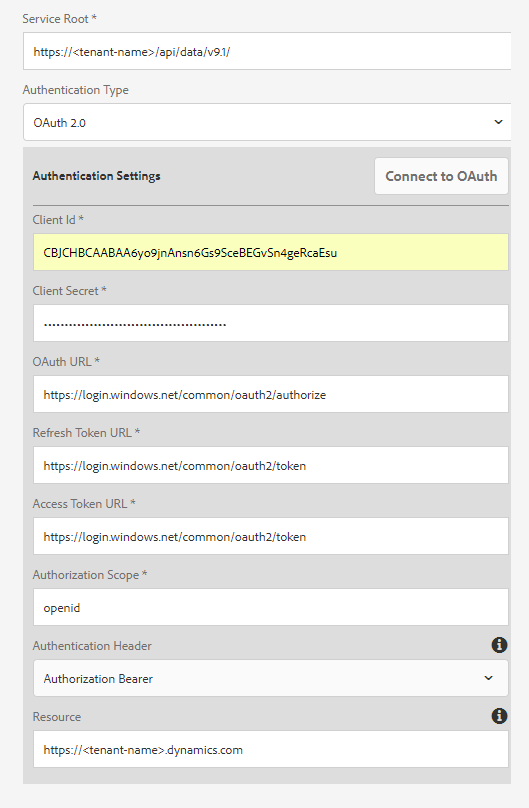

# Configuração do Microsoft Dynamics OData {#microsoft-dynamics-odata-configuration}

Aproveite, integre e trabalhe com os serviços do Microsoft Dynamics online e local por meio de um modelo de dados de formulário.


O Microsoft Dynamics é um software CRM (Customer Relationship Management) e ERP (Enterprise Resource Planning) que fornece soluções empresariais para criar e gerenciar contas, contatos, clientes potenciais, oportunidades e casos de clientes. [A Integração](/help/forms/using/data-integration.md) de dados da AEM Forms fornece uma configuração de serviço em nuvem OData para integrar a Forms ao servidor Microsoft Dynamics online e local. Ele permite criar um modelo de dados de formulário com base nas entidades, atributos e serviços definidos no serviço Microsoft Dynamics. O modelo de dados de formulário pode ser usado para criar formulários adaptáveis que interagem com o Microsoft Dynamics Server para habilitar workflows comerciais. Por exemplo:

* Query do Microsoft Dynamics Server para dados e pré-preenchimento de formulários adaptáveis
* Gravar dados no Microsoft Dynamics no envio de formulário adaptável
* Gravar dados no Microsoft Dynamics por meio de entidades personalizadas definidas no modelo de dados de formulário e vice-versa

O pacote de complementos AEM Forms também inclui a configuração de referência OData que você pode aproveitar para integrar rapidamente o Microsoft Dynamics ao AEM Forms.

Quando o pacote é instalado, as seguintes entidades e serviços estão disponíveis na sua instância do AEM Forms:

* Cloud Service OData do MS Dynamics (Serviço OData)
* Modelo de dados de formulário com entidades e serviços pré-configurados do Microsoft Dynamics.

O Cloud Service OData e o modelo de dados de formulário com entidades e serviços pré-configurados do Microsoft Dynamics só estarão disponíveis na instância do AEM Forms se o modo de execução da instância AEM estiver definido como `samplecontent`(padrão). Para obter mais informações sobre como configurar modos de execução para uma instância AEM, consulte Modos [de execução](https://helpx.adobe.com/in/experience-manager/6-4/sites-deploying/configure-runmodes.html).

## Pré-requisitos {#prerequisites}

Antes de começar a configurar e configurar o Microsoft Dynamics, verifique se você:

* Instalado o pacote suplementar do Forms [AEM 6.4](https://helpx.adobe.com//experience-manager/6-4/forms/using/installing-configuring-aem-forms-osgi.html)
* Configurado o Microsoft Dynamics 365 on-line ou instalado uma instância de uma das seguintes versões do Microsoft Dynamics:

   * Microsoft Dynamics 365 no local
   * Microsoft Dynamics 2016 no local

* [Registrado o aplicativo do serviço online Microsoft Dynamics com o Microsoft Azure Ative Diretory](https://docs.microsoft.com/en-us/dynamics365/customer-engagement/developer/walkthrough-register-dynamics-365-app-azure-active-directory). Anote os valores para a ID do cliente (também chamada de ID da aplicação) e o segredo do cliente para o serviço registrado. Esses valores são usados ao [configurar o serviço em nuvem para o serviço](/help/forms/using/ms-dynamics-odata-configuration.md#configure-cloud-service-for-your-microsoft-dynamics-service)do Microsoft Dynamics.

## Definir URL de resposta para o aplicativo registrado do Microsoft Dynamics {#set-reply-url-for-registered-microsoft-dynamics-application}

Faça o seguinte para definir o URL de resposta para o aplicativo registrado do Microsoft Dynamics:

>[!NOTE]
>
>Use este procedimento somente ao integrar o AEM Forms ao servidor Microsoft Dynamics online.

1. Vá para a conta do Ative Diretory do Microsoft Azure e adicione o seguinte URL de configuração de serviço em nuvem nas configurações de URLs **[!UICONTROL de]** resposta para seu aplicativo registrado:

   `https://[server]:[port]/libs/fd/fdm/gui/components/admin/fdmcloudservice/createcloudconfigwizard/cloudservices.html`

   

1. Salve a configuração.

## Configurar o Microsoft Dynamics para IFD {#configure-microsoft-dynamics-for-ifd}

O Microsoft Dynamics usa autenticação baseada em declarações para fornecer acesso aos dados no servidor do Microsoft Dynamics CRM a usuários externos. Para habilitar isso, faça o seguinte para configurar o Microsoft Dynamics para a implantação com a Internet (IFD) e defina as configurações de declaração.

>[!NOTE]
>
>Use este procedimento somente ao integrar o AEM Forms ao servidor Microsoft Dynamics local.

1. Configure a instância local do Microsoft Dynamics para IFD conforme descrito em [Configurar IFD para Microsoft Dynamics](https://technet.microsoft.com/en-us/library/dn609803.aspx).
1. Execute os seguintes comandos usando o Windows PowerShell para configurar as definições de afirmação no Microsoft Dynamics habilitado para IFD:

   ```
   Add-PSSnapin Microsoft.Crm.PowerShell 
    $ClaimsSettings = Get-CrmSetting -SettingType OAuthClaimsSettings 
    $ClaimsSettings.Enabled = $true 
    Set-CrmSetting -Setting $ClaimsSettings
   ```

   Consulte Registro de [aplicativo para CRM no local (IFD)](https://msdn.microsoft.com/sl-si/library/dn531010(v=crm.7).aspx#bkmk_ifd) para obter detalhes.

## Configurar o cliente OAuth no computador AD FS {#configure-oauth-client-on-ad-fs-machine}

Faça o seguinte para registrar um cliente OAuth na máquina do Ative Diretory Federation Services (AD FS) e conceder acesso à máquina do AD FS:

>[!NOTE]
>
>Use este procedimento somente ao integrar o AEM Forms ao servidor Microsoft Dynamics local.

1. Execute o seguinte comando:

   `Add-AdfsClient -ClientId “<Client-ID>” -Name "<name>" -RedirectUri "<redirect-uri>" -GenerateClientSecret`

   Em que:

   * `Client-ID` é uma ID de cliente que você pode gerar usando qualquer gerador de GUID.
   * `redirect-uri` é o URL do serviço de nuvem OData do Microsoft Dynamics no AEM Forms. O serviço de nuvem padrão instalado com o pacote AEM Forms é implantado no seguinte URL:

      ```
      http://[server]:[port]/libs/fd/fdm/gui/components/admin/fdmcloudservice/createcloudconfigwizard/cloudservices.html
      ```

1. Execute o seguinte comando para conceder acesso à máquina do AD FS:

   `Grant-AdfsApplicationPermission -ClientRoleIdentifier “<Client-ID>” -ServerRoleIdentifier <resource> -ScopeNames openid`

   Em que:

   * `resource` é o URL da organização do Microsoft Dynamics.

1. O Microsoft Dynamics usa o protocolo HTTPS. Para chamar pontos de extremidade do AD FS do servidor Forms, instale o certificado do site do Microsoft Dynamics no repositório de certificados Java usando o `keytool` comando no computador que executa o AEM Forms.

## Configurar o serviço em nuvem para o serviço Microsoft Dynamics {#configure-cloud-service-for-your-microsoft-dynamics-service}

A configuração do Cloud Service do **MS Dynamics OData (OData Service)** vem com a configuração padrão de OData. Para configurá-lo para se conectar ao seu serviço Microsoft Dynamics, faça o seguinte:

1. Navegue até **[!UICONTROL Ferramentas > Cloud Services > Fontes]** de dados e toque na pasta `global` de configuração.
1. Selecione **[!UICONTROL MS Dynamics OData Cloud Service (Serviço OData)]** e toque em **[!UICONTROL Propriedades]**. A caixa de diálogo de propriedade de configuração do serviço de nuvem é aberta.

   Na guia Configurações **[!UICONTROL de]** autenticação:

   1. Insira o valor do campo Raiz **[!UICONTROL do]** serviço. Vá para a instância Dinâmico e navegue até Recursos **[!UICONTROL do]** desenvolvedor para visualização do valor do campo Raiz do serviço. Por exemplo, https://&lt;nome-locatário>/api/data/v9.1/
   1. Substitua os valores padrão na ID **[!UICONTROL do]** cliente (também conhecida como **[!UICONTROL ID da aplicação]**), no Segredo **[!UICONTROL do]** cliente, no URL **** OAuth, no URL **[!UICONTROL do token de]********** atualização, nos campos Token de acessoURLe Recursos com valores da configuração do serviço Microsoft Dynamics. É obrigatório especificar o URL da instância dinâmica no campo **[!UICONTROL Recurso]** para configurar o Microsoft Dynamics com um modelo de dados de formulário. Use o URL raiz do serviço para derivar o URL da instância dinâmica. Por exemplo, [https://org.crm.dynamics.com](https://org.crm.dynamics.com/).
   1. Especifique **[!UICONTROL open]** no campo Escopo **[!UICONTROL de]** autorização para o processo de autorização no Microsoft Dynamics.

   

1. Clique em **[!UICONTROL Conectar-se ao OAuth]**. Você é redirecionado para a página de logon do Microsoft Dynamics.
1. Faça logon com suas credenciais do Microsoft Dynamics e aceite permitir que a configuração do serviço de nuvem se conecte ao serviço do Microsoft Dynamics. É uma tarefa única para estabelecer a conexão entre o serviço de nuvem e o serviço.

   Em seguida, você é redirecionado para a página de configuração do serviço de nuvem, que exibe uma mensagem informando que a configuração OData foi salva com êxito.

O serviço em nuvem do MS Dynamics OData Cloud Service (Serviço OData) está configurado e conectado ao serviço do Dynamics.

## Create form data model {#create-form-data-model}

Quando você instala o pacote AEM Forms, um modelo de dados de formulário,**Microsoft Dynamics FDM**, é implantado em sua instância AEM. Por padrão, o modelo de dados de formulário usa o serviço Microsoft Dynamics configurado no Cloud Service do MS Dynamics OData (OData Service) como sua fonte de dados.

Ao abrir o modelo de dados de formulário pela primeira vez, ele se conecta ao serviço configurado do Microsoft Dynamics e obtém entidades da instância do Microsoft Dynamics. As entidades &quot;contato&quot; e &quot;cliente potencial&quot; do Microsoft Dynamics já foram adicionadas no modelo de dados de formulário.

Para revisar o modelo de dados do formulário, vá para **[!UICONTROL Forms > Integrações]** de dados. Selecione **[!UICONTROL Microsoft Dynamics FDM]** e clique em **[!UICONTROL Editar]** para abrir o modelo de dados de formulário no modo de edição. Como alternativa, você pode abrir o modelo de dados de formulário diretamente do seguinte URL:

`https://[*server*]:[*port*]/aem/fdm/editor.html/content/dam/formsanddocuments-fdm/ms-dynamics-fdm`


Em seguida, é possível criar um formulário adaptável com base no modelo de dados do formulário e usá-lo em vários casos de uso do formulário adaptável, como:

* Preencha o formulário adaptável consultando informações de entidades e serviços do Microsoft Dynamics
* Chamar operações do Microsoft Dynamics Server definidas em um modelo de dados de formulário usando regras de formulário adaptáveis
* Gravar dados de formulário enviados para entidades do Microsoft Dynamics

É recomendável criar uma cópia do modelo de dados de formulário fornecido com o pacote AEM Forms e configurar os modelos e serviços de dados de acordo com seus requisitos. Ele garantirá que qualquer atualização futura do pacote não substitua o modelo de dados do formulário.

Para obter mais informações sobre como criar e usar o modelo de dados de formulário em workflows comerciais, consulte Integração [de](/help/forms/using/data-integration.md)dados.
