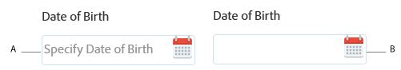

# Texto de espaço reservado no AEM Forms {#placeholder-text-in-aem-forms}

>[!CAUTION]
>
>AEM 6.4 chegou ao fim do suporte estendido e esta documentação não é mais atualizada. Para obter mais detalhes, consulte nossa [períodos de assistência técnica](https://helpx.adobe.com/br/support/programs/eol-matrix.html). Encontre as versões compatíveis [here](https://experienceleague.adobe.com/docs/).

O texto do espaço reservado representa uma palavra ou frase curta. Destina-se a ajudar o usuário com a entrada de dados quando o controle não tem valor. Um texto de espaço reservado pode ser um valor de amostra ou uma breve descrição do formato esperado. O texto do espaço reservado é mostrado antes que o usuário insira um valor, ele é removido quando o usuário insere ou seleciona um valor.

>[!NOTE]
>
>O texto de espaço reservado, se especificado, deve ter um valor que não contenha caracteres de nova linha.

**A.** Componente de data com texto de espaço reservado **B.** Componente de data sem texto de espaço reservado

O AEM Forms suporta o texto de espaço reservado para os campos Caixa de senha, Seletor de data, Caixa numérica e caixa de texto.\
Os textos de espaço reservado não são suportados para o widget de data HTML5 nativo. Para especificar um texto de Espaço reservado:

1. Clique com o botão direito do mouse em um componente compatível com o Texto de espaço reservado e clique em **Editar**. A caixa de diálogo Editar componente é exibida.

1. Abra o **Título e texto** guia .
1. Especifique uma palavra ou uma frase curta no **Caixa de texto Espaço reservado**. Clique em **OK**.

>[!NOTE]
>
>O texto de espaço reservado não é suportado no Microsoft Internet Explorer 9.
