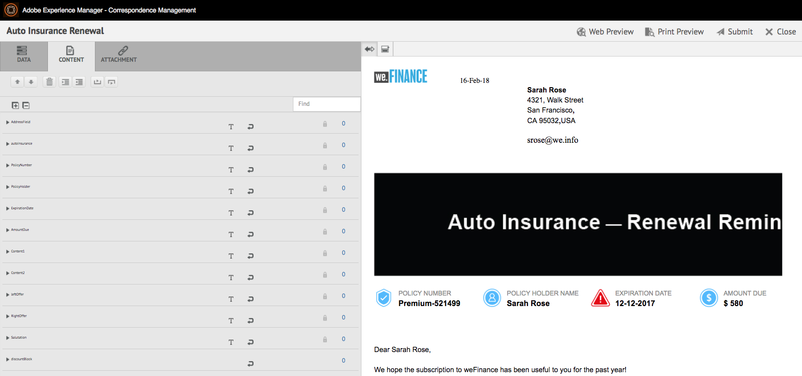

# Preparar e enviar comunicação interativa usando a interface do usuário do agente {#prepare-and-send-interactive-communication-using-the-agent-ui}

A interface do usuário do agente permite que os agentes preparem e enviem comunicação interativa para o processo de publicação. O Agente faz as modificações necessárias conforme permitido e envia a Comunicação interativa para um processo posterior, como email ou impressão.

## Visão geral {#overview}

Após a criação de uma Comunicação interativa, o Agente pode abrir a Comunicação interativa na interface do usuário do agente e preparar uma cópia específica do destinatário inserindo dados e gerenciando conteúdo e anexos. Por fim, o Agente pode enviar a Comunicação Interativa para um processo posterior.

Ao preparar a Comunicação interativa usando a interface do usuário do agente, o agente gerencia os seguintes aspectos da Comunicação interativa na interface do agente antes de enviá-la para um processo de publicação:

* **Dados**: A guia Dados da interface do usuário do agente exibe quaisquer variáveis editáveis pelo agente e propriedades de modelo de dados de formulário desbloqueadas na Comunicação interativa. Essas variáveis/propriedades são criadas durante a edição ou criação de fragmentos de documento incluídos na Comunicação interativa. A guia Data também inclui todos os campos criados no modelo de canal XDP/impressão. A guia Dados aparece somente quando há variáveis, propriedades de modelo de dados de formulário ou campos na Comunicação interativa que são editáveis pelo agente.
* **Conteúdo**: Na guia Conteúdo, o Agente gerencia o conteúdo, como fragmentos de documento e variáveis de conteúdo na Comunicação interativa. O Agente pode fazer as alterações no fragmento do documento conforme permitido ao criar a Comunicação interativa nas propriedades desses fragmentos de documento. O Agente também pode reordenar, adicionar/remover um fragmento de documento e adicionar quebras de página, se permitido.
* **Anexos**: A guia Anexos aparece na interface do usuário do agente somente se a Comunicação interativa tiver anexos ou se o agente tiver acesso à biblioteca. O agente pode ou não ter permissão para alterar ou editar os anexos.

## Preparar comunicação interativa usando a interface do usuário do agente {#prepare-interactive-communication-using-the-agent-ui}

1. Selecione **[!UICONTROL Forms]** > **[!UICONTROL Forms &amp; Documents]**.
1. Selecione a Comunicação Interativa apropriada e toque em **[!UICONTROL Abrir interface do usuário do agente]**.

   >[!NOTE]
   >
   >A interface do usuário do agente funciona somente se a Comunicação interativa selecionada tiver um canal de impressão.

   

   Com base no conteúdo e nas propriedades da Comunicação interativa, a interface do usuário do agente é exibida com as três guias a seguir: Dados, conteúdo e anexo.

   

   Prossiga para inserir dados, gerenciar o conteúdo e gerenciar os anexos.

### Inserir dados {#enter-data}

1. Na guia Data , insira os dados para variáveis, propriedades do modelo de dados de formulário e campos do modelo de impressão (XDP), conforme necessário. Preencha todos os campos obrigatórios marcados com um asterisco (&amp;ast;) para ativar o botão **Submit**.

   Toque em um valor de campo de dados na visualização Comunicação interativa para realçar o campo de dados correspondente na guia Dados ou vice-versa.

### Gerenciar conteúdo {#manage-content}

Na guia Conteúdo, gerencie o conteúdo, como fragmentos de documento e variáveis de conteúdo, na Comunicação interativa.

1. Selecione **[!UICONTROL Content]**. A guia Conteúdo da Comunicação interativa é exibida.

   

1. Edite os fragmentos do documento, conforme necessário, na guia Content . Para trazer o foco para o fragmento relevante na hierarquia do conteúdo, toque na linha relevante ou no parágrafo na visualização da Comunicação interativa ou toque no fragmento diretamente na hierarquia Conteúdo.

   Por exemplo, o fragmento do documento com a linha &quot;Faça um pagamento online agora ...&quot; é selecionado na visualização no gráfico abaixo e o mesmo fragmento do documento foi selecionado na guia Conteúdo.

   

   Na guia Conteúdo ou Dados , ao tocar em Realçar Módulos Selecionados no Conteúdo ( ) no canto superior esquerdo da visualização, é possível desativar ou ativar a funcionalidade para ir para o fragmento do documento quando o texto, parágrafo ou campo de dados relevante for tocado/selecionado na visualização.

   Os fragmentos que podem ser editados pelo agente durante a criação da Comunicação interativa têm o ícone Editar conteúdo selecionado ( ). Toque no ícone Editar conteúdo selecionado para iniciar o fragmento no modo de edição e fazer alterações nele. Use as seguintes opções para formatação e gerenciamento de texto:

   * [Opções de formatação](#formattingtext)

      * [Copiar e colar texto formatado de outros aplicativos](#pasteformattedtext)
      * [Realçar partes do texto](#highlightemphasize)
   * [Caracteres especiais](#specialcharacters)
   * [Atalhos de teclado](/help/forms/using/keyboard-shortcuts.md)

   Para obter mais informações sobre as ações disponíveis para vários fragmentos de documento na interface do usuário do Agente, consulte [Ações e informações disponíveis na interface do usuário do Agente](#actionsagentui).

1. Para adicionar uma quebra de página à saída impressa da Comunicação interativa, coloque o cursor onde deseja inserir uma quebra de página e selecione Quebra de página antes ou Quebra de página depois de ( ).

   Um espaço reservado explícito para quebras de página é inserido na Comunicação interativa. Para visualizar como uma quebra de página explícita afeta a Comunicação interativa, consulte a visualização de impressão.

   

   Continue a gerenciar os anexos da Comunicação interativa.

### Gerenciar Anexos {#manage-attachments}

1. Selecione **[!UICONTROL Attachment]**. A interface do usuário do agente exibe os anexos disponíveis como configurados ao criar a Comunicação interativa.

   Você pode optar por não enviar um anexo junto com a Comunicação interativa tocando no ícone de exibição e tocar na cruz no anexo para excluí-lo (se o agente tiver permissão para excluir ou ocultar o anexo) da Comunicação interativa. Para os anexos especificados como obrigatórios ao criar a Comunicação interativa, os ícones Exibir e Excluir são desativados.

   

1. Toque no ícone Acesso à biblioteca ( ) para acessar a Biblioteca de conteúdo para inserir ativos DAM como anexos.

   >[!NOTE]
   >
   >O ícone Acesso à biblioteca está disponível somente se o acesso à biblioteca foi ativado durante a criação da Comunicação interativa (nas propriedades do Contêiner de documento do canal Imprimir).

1. Se a ordem dos anexos não tiver sido bloqueada durante a criação da Comunicação interativa, é possível reordenar os anexos selecionando um anexo e tocando nas setas para baixo e para cima.
1. Use Visualização da Web e Visualização de impressão para ver se as duas saídas estão de acordo com seu requisito.

   Se você achar as visualizações satisfatórias, toque em **[!UICONTROL Enviar]** para enviar/enviar a Comunicação interativa para um processo de publicação. Ou, para fazer alterações, saia da visualização para voltar para fazer as alterações.

## Formatação de texto {#formattingtext}

Ao editar um fragmento de texto na interface do agente, a barra de ferramentas muda de acordo com o tipo de edição que você escolher fazer: Fonte, Parágrafo ou Lista:

 

Barra de ferramentas Fonte

Barra de ferramentas Parágrafo

Barra de ferramentas Lista

### Realçar/realçar partes do texto {#highlightemphasize}

Para realçar\enfatizar partes do texto em um fragmento editável, selecione o texto e toque em Realçar cor.

### Colar texto formatado {#pasteformattedtext}

### Inserir caracteres especiais no texto {#specialcharacters}

A interface do usuário do agente tem suporte incorporado para 210 caracteres especiais. O administrador pode [adicionar suporte para caracteres especiais mais/personalizados por personalização](/help/forms/using/custom-special-characters.md).

#### Entrega do anexo {#attachmentdelivery}

* Quando a Comunicação interativa é renderizada usando APIs do lado do servidor como um PDF interativo ou não interativo, o PDF renderizado contém anexos como anexos de PDF.
* Quando um processo de publicação associado a uma Comunicação interativa é carregado como parte da Interface do usuário do agente Enviar, os anexos são passados como o parâmetro List&lt;com.adobe.idp.Document> inAttachmentDocs .
* Os workflows do mecanismo de delivery, como email e impressão, também fornecem anexos junto com a versão PDF da Comunicação interativa.

## Ações e informações disponíveis na interface do usuário do agente {#actionsagentui}

### Fragmentos de documento {#document-fragments}

* **Setas** para cima/para baixo: Setas para mover fragmentos de documento para cima ou para baixo na Comunicação interativa.
* **Excluir**: Se permitido, exclua o fragmento de documento da Comunicação interativa.
* **Quebra de página antes de**  (aplicável para fragmentos filhos da área de destino): Insere quebra de página antes do fragmento do documento.
* **Recuo**: Aumentar ou diminuir o recuo de um fragmento de documento.
* **Quebra de página depois de**  (aplicável para fragmentos filhos da área de destino): Insere quebra de página após o fragmento do documento.

* Editar (somente fragmentos de texto): Abra o editor de rich text para editar o fragmento do documento de texto. Para obter mais informações, consulte [Formatação de texto](#formattingtext).

* Seleção (ícone de olhos): Inclui\exclui fragmento de documento da Comunicação interativa.
* Valores não preenchidos (informações): Indica o número de variáveis não preenchidas no fragmento do documento.

### Listar fragmentos de documento {#list-document-fragments}

* Inserir Linha em Branco: Insere uma nova linha em branco.
* Seleção (ícone de olhos): Inclui\exclui fragmento de documento da Comunicação interativa.
* Ignorar marcadores/números: Habilite para ignorar marcadores/numeração no fragmento de documento da lista.
* Valores não preenchidos (informações): Indica o número de variáveis não preenchidas no fragmento do documento.

