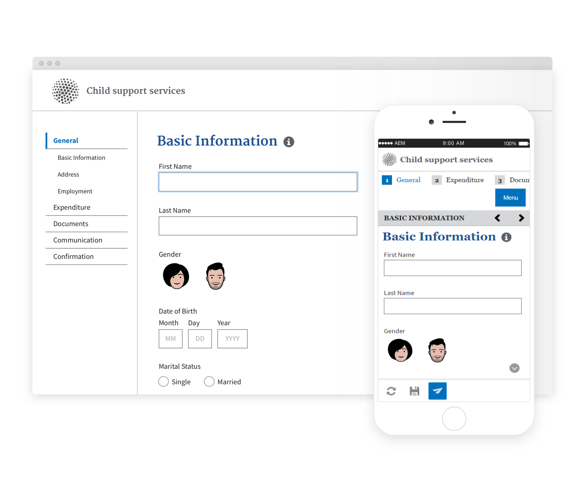

# Temas de Referência {#reference-themes}

>[!CAUTION]
>
>AEM 6.4 chegou ao fim do suporte estendido e esta documentação não é mais atualizada. Para obter mais detalhes, consulte nossa [períodos de assistência técnica](https://helpx.adobe.com/br/support/programs/eol-matrix.html). Encontre as versões compatíveis [here](https://experienceleague.adobe.com/docs/).

[Temas](/help/forms/using/themes.md) permite criar estilos em seus formulários sem conhecimento profundo de CSS. Além do tema padrão, você pode obter os seguintes temas instalando o[Pacote do complemento AEM Forms](https://experienceleague.adobe.com/docs/experience-manager-release-information/aem-release-updates/forms-updates/aem-forms-releases.html):

* Beril
* Exec
* Exec-Light
* Liberdade
* Ultramarina
* Urbane
* Padrões de web design dos EUA
* Tranquilo

Cada tema contém um estilo exclusivo e elegante que pode ser usado para criar formulários adaptáveis encantadores para os usuários. Ele contém um estilo exclusivo para seletores como painel, caixa de texto, caixa numérica, botão de opção, tabela e switch. As estilos nesses temas baseiam-se em requisitos. Por exemplo, em um cenário específico, você precisa de um tema minimalista com fontes limpas. O tema da liberdade permite-nos alcançar esse aspecto.

Os temas incluídos neste pacote são responsivos e o estilo nesses temas é definido para exibições móveis e para desktop. A maioria dos navegadores modernos em vários dispositivos pode renderizar formulários aplicados com um desses temas sem complicações.

Para obter mais informações sobre como instalar o pacote, consulte [Como trabalhar com pacotes](/help/sites-administering/package-manager.md).

## Beril {#beryl}

O tema Beryl é usado por [Formulário adaptável We.Gov](/help/forms/using/gov-reference-site-walkthrough.md), e enfatiza o uso da imagem de fundo, a transparência e os ícones grandes e planos. Na captura de tela abaixo, você pode ver a aparência do tema Beryl e como ele pode melhorar o estilo de seu formulário.

[Clique para ampliar](assets/beryl-1.png)

## Exec {#exec}

O tema Exec evita preenchimentos sólidos em segundo plano para enfatizar os componentes do formulário. Selecionar e clicar em componentes altera as cores das fontes. Em comparação ao tema padrão Tela, a cor da fonte do texto na guia selecionada muda para azul escuro. Observe como os botões de navegação e envio são diferentes do tema Beryl.

[Clique para ampliar](assets/exec-1.png)

## Execução de luz {#exec-light}

O tema Exec Light usa espaço em branco para criar uma experiência contínua. Os botões Next e Submit obtêm um preenchimento sólido e uma sombra 3D. As guias selecionadas à esquerda recebem uma seta em vez de marcas de verificação duplas.

[Clique para ampliar](assets/exec-light-1.png)

## Liberdade {#liberty}

O tema da liberdade usa uma abordagem minimalista para destacar o importante. Por exemplo, a cor da fonte da guia visitada muda para verde. Você só pode ver o contorno inferior da caixa de texto que emula a aparência de um formulário baseado em papel com linhas. A caixa de texto ativa tem um contorno inferior preto, enquanto outros ficam com o contorno inferior cinza claro.

[Clique para ampliar](assets/liberty-1.png)

## Tranquilo {#tranquil}

O tema tranquilo fornece tons claros e escuros do esquema de cor Tranquilo para destacar diferentes componentes de um formulário. Por exemplo, botões de opção, painéis e guias recebem um tom diferente de verde.

[Clique para ampliar](assets/tranquil-1.png)

## Ultramarina {#ultramarine}

O tema ultramarine usa tons azuis profundos para realçar componentes como guias, painéis, caixas de texto e botões.

## Urbane {#urbane}

O tema Urbane enfatiza uma aparência minimalista e funcional para seu formulário. Ao aplicar o tema Urbane ao seu formulário, você pode ver que os componentes são planos. Os painéis obtêm contornos finos para criar uma aparência moderna.

[Clique para ampliar](assets/urbane-1.png)

## Padrões de web design dos EUA {#u-s-web-design-standards}

O tema Padrões de web design dos EUA, como o nome sugere, usa as fontes e os estilos descritos no site Padrões de web dos EUA em rascunho. O padrão da Web é usado por organizações federais para criar experiências consistentes na Web em sites do governo federal.

[Clique para ampliar](assets/usgov.png)
