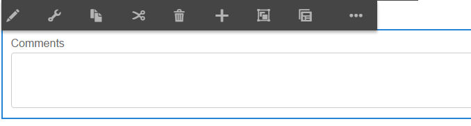

# Conceder acesso ao editor de regras para grupos de usuários selecionados {#grant-rule-editor-access-to-select-user-groups}

## Visão geral {#overview}

Você pode ter diferentes tipos de usuários com habilidades variadas que funcionam com o Adaptive Forms. Embora os usuários especialistas possam ter o conhecimento certo para trabalhar com scripts e regras complexas, pode haver usuários de nível básico que precisam trabalhar somente com o layout e as propriedades básicas de formulários adaptáveis.

A AEM Forms permite limitar o acesso do editor de regras aos usuários com base em sua função ou função. Nas configurações do Adaptive Forms Configuration Service, você pode especificar os [grupos de usuários](/help/sites-administering/security.md) que podem visualização e acessar o editor de regras.

## Especificar grupos de usuários que podem acessar o editor de regras {#specify-user-groups-that-can-access-rule-editor}

1. Faça logon na AEM Forms como administrador.
1. Na instância do autor, clique em Adobe Experience Manager > Ferramentas  > Operações > Console da Web. O Console da Web é aberto em uma nova janela.

   

1. Na janela Console da Web, localize e clique em **Serviço de configuração de formulário adaptável**. **A caixa** de diálogo Adaptive Form Configuration Service é exibida. Não altere nenhum valor e clique em **Salvar**.

   Ele cria um arquivo /apps/system/config/com.adobe.aemds.guide.service.impl.AdaptiveFormConfigurationServiceImpl.config no repositório CRX.

1. Faça logon no CRXDE como administrador. Abra o arquivo /apps/system/config/com.adobe.aemds.guide.service.impl.AdaptiveFormConfigurationServiceImpl.config para edição.
1. Use a seguinte propriedade para especificar o nome de um grupo que pode acessar o editor de regras (por exemplo, RuleEditorsUserGroup) e clique em **Salvar tudo**.

   `af.ruleeditor.custom.groups=["RuleEditorsUserGroup"]`

   Para habilitar o acesso para vários grupos, especifique uma lista de valores separados por vírgulas:

   `af.ruleeditor.custom.groups=["RuleEditorsUserGroup", "PermittedUserGroup"]`

   

   Agora, quando um usuário que não faz parte do grupo de usuários especificado (aqui RuleEditorsUserGroup) toca em um campo, o ícone Editar regra ( ) não está disponível para ela na barra de ferramentas de componentes:

   

   Barra de ferramentas Componentes como visível a um usuário com acesso ao editor de regras

   

   Barra de ferramentas Componentes como visível a um usuário sem acesso ao editor de regras

   Para obter instruções sobre como adicionar usuários a grupos, consulte [Administração e segurança do usuário](/help/sites-administering/security.md).

