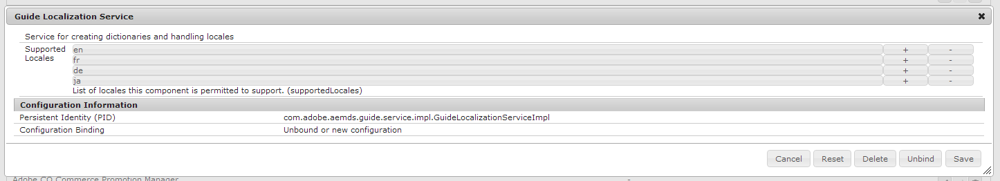

# Suporte a novas localidades para localização de formulários adaptáveis {#supporting-new-locales-for-adaptive-forms-localization}

>[!CAUTION]
>
>AEM 6.4 chegou ao fim do suporte estendido e esta documentação não é mais atualizada. Para obter mais detalhes, consulte nossa [períodos de assistência técnica](https://helpx.adobe.com/br/support/programs/eol-matrix.html). Encontre as versões compatíveis [here](https://experienceleague.adobe.com/docs/).

## Sobre dicionários de localidades {#about-locale-dictionaries}

A localização de formulários adaptáveis depende de dois tipos de dicionários de localidade:

**Dicionário específico do formulário** Contém strings usadas em formulários adaptáveis. Por exemplo, rótulos, nomes de campo, mensagens de erro, descrições de ajuda e assim por diante. Ele é gerenciado como um conjunto de arquivos XLIFF para cada localidade e você pode acessá-lo em https://`<host>`:`<port>`/libs/cq/i18n/translator.html.

**Dicionários globais** Há dois dicionários globais, gerenciados como objetos JSON, em AEM biblioteca do cliente. Esses dicionários contêm mensagens de erro padrão, nomes de mês, símbolos de moeda, padrões de data e hora e assim por diante. Você pode encontrar esses dicionários no CRXDe Lite em /libs/fd/xfaforms/clientlibs/I18N. Essas localizações contêm pastas separadas para cada localidade. Como os dicionários globais geralmente não são atualizados com frequência, manter arquivos JavaScript separados para cada localidade permite que os navegadores os armazenem em cache e reduzam o uso da largura de banda da rede ao acessar diferentes formulários adaptáveis no mesmo servidor.

### Como a localização do formulário adaptável funciona {#how-localization-of-adaptive-form-works}

Quando um formulário adaptável é renderizado, ele identifica o local solicitado observando os seguintes parâmetros na ordem especificada:

* Parâmetro de solicitação `afAcceptLang`

   Para substituir a localidade do navegador de usuários, você pode passar a variável `afAcceptLang` solicitar parâmetro para forçar a localidade. Por exemplo, o seguinte URL forçará a renderização do formulário no idioma japonês:

   `https://[*server*]:[*port*]/<*contextPath*>/<*formFolder*>/<*formName*>.html?wcmmode=disabled&afAcceptLang=ja`

* A localidade do navegador definida para o usuário, que é especificada na solicitação usando o `Accept-Language` cabeçalho.

* Configuração de idioma do usuário especificado em AEM.

Depois que a localidade é identificada, os formulários adaptáveis escolhem o dicionário específico do formulário. Se o dicionário específico do formulário para a localidade solicitada não for encontrado, ele usará o dicionário Inglês (en) .

Se uma biblioteca do cliente para o local solicitado não existir, ela verificará se há uma biblioteca do cliente para o código de idioma presente no local. Por exemplo, se a localidade solicitada for `en_ZA` (inglês da África do Sul) e a biblioteca do cliente para `en_ZA` não existir, o formulário adaptável usará a biblioteca do cliente para `en` (Inglês), se existir. No entanto, se nenhum deles existir, o formulário adaptável usará o dicionário para `en` localidade.

## Adicionar suporte de localização para localidades não suportadas {#add-localization-support-for-non-supported-locales}

Atualmente, o AEM Forms suporta a localização de conteúdo de formulários adaptáveis em inglês (en), espanhol (es), francês (fr), italiano (it), alemão (de), japonês (ja), português-brasileiro (pt-BR, chinês - (zh-CN), chinês-Taiwan (zh-TW) e coreano (ko-KR).

Para adicionar suporte para um novo local no tempo de execução dos formulários adaptáveis:

1. [Adicionar uma localidade ao serviço GuideLocalizationService](/help/forms/using/supporting-new-language-localization.md#p-add-a-locale-to-the-guide-localization-service-br-p)

1. [Adicionar biblioteca de cliente XFA para uma localidade](/help/forms/using/supporting-new-language-localization.md#p-add-xfa-client-library-for-a-locale-br-p)

1. [Adicionar biblioteca de cliente de formulário adaptável para um local](/help/forms/using/supporting-new-language-localization.md#p-add-adaptive-form-client-library-for-a-locale-br-p)
1. [Adicionar suporte de local ao dicionário](/help/forms/using/supporting-new-language-localization.md#p-add-locale-support-for-the-dictionary-br-p)
1. [Reinicie o servidor](/help/forms/using/supporting-new-language-localization.md#p-restart-the-server-p)

### Adicionar uma localidade ao serviço de localização do Guia {#add-a-locale-to-the-guide-localization-service-br}

1. Ir para `https://[server]:[port]/system/console/configMgr`.
1. Clique em para editar o **Serviço de localização do guia** componente.
1. Adicione a localidade que deseja adicionar à lista de localidades suportadas.



### Adicionar biblioteca de cliente XFA para uma localidade {#add-xfa-client-library-for-a-locale-br}

Criar um nó do tipo `cq:ClientLibraryFolder` under `etc/<folderHierarchy>`, com categoria `xfaforms.I18N.<locale>`e adicione os seguintes arquivos à biblioteca do cliente:

* **I18N.js** definição `xfalib.locale.Strings` para `<locale>` conforme definido em `/etc/clientlibs/fd/xfaforms/I18N/ja/I18N`.

* **js.txt** Contendo o seguinte:

```
/libs/fd/xfaforms/clientlibs/I18N/Namespace.js
I18N.js
/etc/clientlibs/fd/xfaforms/I18N/LogMessages.js
```

### Adicionar biblioteca de cliente de formulário adaptável para um local {#add-adaptive-form-client-library-for-a-locale-br}

Criar um nó do tipo `cq:ClientLibraryFolder` under `etc/<folderHierarchy>`, com categoria como `guides.I18N.<locale>` e e dependências como `xfaforms.3rdparty`, `xfaforms.I18N.<locale>` e `guide.common`. &quot;

Adicione os seguintes arquivos à biblioteca do cliente:

* **i18n.js** definição `guidelib.i18n`, com padrões de &quot;calendarSymbols&quot;, `datePatterns`, `timePatterns`, `dateTimeSymbols`, `numberPatterns`, `numberSymbols`, `currencySymbols`, `typefaces` para `<locale>` de acordo com as especificações XFA descritas em [Especificação do conjunto de localidades](https://helpx.adobe.com/content/dam/Adobe/specs/xfa_spec_3_3.pdf). Você também pode ver como ele é definido para outras localidades compatíveis em `/etc/clientlibs/fd/af/I18N/fr/javascript/i18n.js`.

* **LogMessages.js** definição `guidelib.i18n.strings` e `guidelib.i18n.LogMessages` para `<locale>` conforme definido em `/etc/clientlibs/fd/af/I18N/fr/javascript/LogMessages.js`.

* **js.txt** Contendo o seguinte:

```
i18n.js
LogMessages.js
```

### Adicionar suporte de local ao dicionário {#add-locale-support-for-the-dictionary-br}

Execute esta etapa somente se a variável `<locale>` você está adicionando que não está entre `en`, `de`, `es`, `fr`, `it`, `pt-br`, `zh-cn`, `zh-tw`, `ja`, `ko-kr`.

1. Crie um `nt:unstructured` nó `languages` under `etc`, se ainda não estiver presente.

1. Adicionar uma propriedade de string com vários valores `languages` ao nó , se ainda não estiver presente.
1. Adicione o `<locale>` valores de localidade padrão `de`, `es`, `fr`, `it`, `pt-br`, `zh-cn`, `zh-tw`, `ja`, `ko-kr`, se ainda não estiver presente.

1. Adicione o `<locale>` aos valores da `languages` propriedade de `/etc/languages`.

O `<locale>` aparecerá em `https://[server]:[port]/libs/cq/i18n/translator.html`.

### Reinicie o servidor {#restart-the-server}

Reinicie o servidor de AEM para que a localidade adicionada entre em vigor.

## Exemplos de bibliotecas para adicionar suporte ao espanhol {#sample-libraries-for-adding-support-for-spanish}

Exemplos de bibliotecas de clientes para adicionar suporte ao espanhol

[Obter arquivo](assets/sample.zip)
