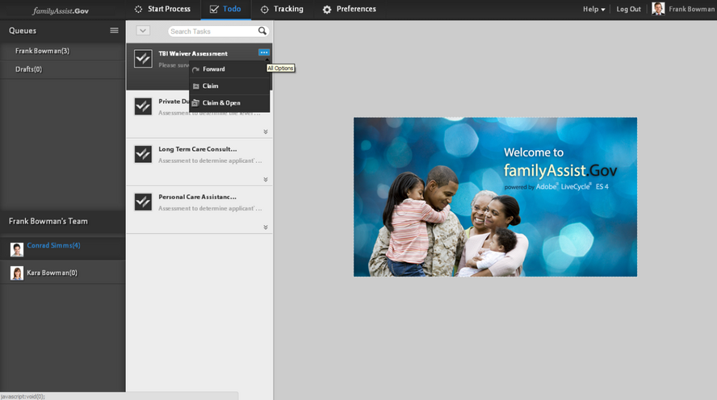

# Gerenciamento de tarefas em uma hierarquia organizacional usando a Visualização do Gerenciador {#managing-tasks-in-an-organizational-hierarchy-using-manager-view}

>[!CAUTION]
>
>AEM 6.4 chegou ao fim do suporte estendido e esta documentação não é mais atualizada. Para obter mais detalhes, consulte nossa [períodos de assistência técnica](https://helpx.adobe.com/br/support/programs/eol-matrix.html). Encontre as versões compatíveis [here](https://experienceleague.adobe.com/docs/).

Na área de trabalho do AEM Forms, os gerentes agora podem acessar as tarefas atribuídas a qualquer pessoa em sua hierarquia (relatórios diretos ou indiretos) e executar várias ações com eles. As tarefas estão disponíveis na guia To-do no espaço de trabalho do AEM Forms. As ações apoiadas nas tarefas dos relatórios diretos são:

**Avançar** Encaminhe uma tarefa do relatório direto para qualquer usuário.

**Reclamação** Reivindica uma tarefa de relatório direto.

**Reivindicação e abertura** Reivindica uma tarefa de um relatório direto e o abre automaticamente na lista De Tarefas do gerente.

**Rejeitar** Rejeitar uma tarefa encaminhada a um relatório direto por algum outro usuário. Essa opção está disponível para as tarefas encaminhadas por outros usuários a um relatório direto.

O AEM Forms restringe o acesso de um usuário somente às tarefas para as quais o usuário tem controle de acesso (ACL). Essa verificação garante que um usuário possa buscar apenas as tarefas nas quais o usuário tem permissões de acesso. Usando serviços e implementações da Web de terceiros para definir a hierarquia, uma organização pode personalizar a definição de gerente e relatórios diretos para atender às suas necessidades.

1. Crie um DSC. Para obter mais informações, consulte o tópico &quot;Desenvolvimento de componentes para AEM Forms&quot; em [Programação com o AEM Forms](https://www.adobe.com/go/learn_aemforms_programming_63) guia.
1. No DSC, defina um novo SPI para o gerenciamento de hierarquia para definir relatórios diretos e hierarquia dentro dos usuários do AEM Forms. A seguir, há um exemplo de trecho de código Java™.

   ```as3
   public class MyHierarchyMgmtService 
   { 
        /*
       Input : Principal Oid for a livecycle user
       Output : Returns true when the user is either the service invoker OR his direct/indirect report.
       */
       boolean isInHierarchy(String principalOid) {
   
       }
   
       /* 
       Input : Principal Oid for a livecycle user
       Output : List of principal Oids for direct reports of the livecycle user
       A user may get direct reports only for himself OR his direct/indirect reports.
       So the API is functionally equivalent to - 
       isInHierarchy(principalOid) ? <return direct reports> : <return empty list>
       */
       List<String> getDirectReports(String principalOid) {
   
       }
   
       /* 
       Returns whether a livecycle user has direct reports or not.
       It's functionally equivalent to -
       getDirectReports(principalOid).size()>0
       */
       boolean isManager(String principalOid) {
   
       }  
   }
   ```

1. Crie um arquivo component.xml. Certifique-se de que a spec-id deve ser a mesma mostrada no trecho de código abaixo. A seguir, há um trecho de código de amostra que pode ser redefinido.

   ```as3
   <component xmlns="https://adobe.com/idp/dsc/component/document"> 
       <component-id>com.adobe.sample.SampleDSC</component-id> 
       <version>1.1</version> 
       <supports-export>false</supports-export> 
         <descriptor-class>com.adobe.idp.dsc.component.impl.DefaultPOJODescriptorImpl</descriptor-class> 
         <services> 
           <service name="MyHierarchyMgmtService" title="My hierarchy management service" orchestrateable="false"> 
           <auto-deploy service-id="MyHierarchyMgmtService" category-id="Sample DSC" major-version="1" minor-version="0" /> 
           <description>Service for resolving hierarchy management.</description> 
            <specifications> 
            <specification spec-id="com.adobe.idp.taskmanager.dsc.enterprise.HierarchyManagementProvider"/> 
            </specifications> 
           <specification-version>1.0</specification-version> 
           <implementation-class>com.adobe.sample.hierarchymanagement.MyHierarchyMgmtService</implementation-class> 
           <request-processing-strategy>single_instance</request-processing-strategy> 
           <supported-connectors>default</supported-connectors> 
           <operation-config> 
               <operation-name>*</operation-name> 
               <transaction-type>Container</transaction-type> 
               <transaction-propagation>supports</transaction-propagation> 
               <!--transaction-timeout>3000</transaction-timeout--> 
           </operation-config> 
           <operations> 
               <operation anonymous-access="true" name="isInHierarchy" method="isInHierarchy"> 
                   <input-parameter name="principalOid" type="java.lang.String" /> 
                   <output-parameter name="result" type="java.lang.Boolean"/> 
               </operation> 
               <operation anonymous-access="true" name="getDirectReports" method="getDirectReports"> 
                   <input-parameter name="principalOid" type="java.lang.String" /> 
                   <output-parameter name="result" type="java.util.List"/> 
               </operation> 
               <operation anonymous-access="true" name="isManager" method="isManager"> 
                   <input-parameter name="principalOid" type="java.lang.String" /> 
                   <output-parameter name="result" type="java.lang.Boolean"/> 
               </operation> 
               </operations> 
               </service> 
         </services>
   </component>
   ```

1. Implante o DSC por meio do Workbench. Reiniciar `ProcessManagementTeamTasksService` serviço.
1. Talvez seja necessário atualizar seu navegador ou fazer logout/login com o usuário novamente.

A tela a seguir ilustra o acesso às tarefas dos relatórios diretos e às ações disponíveis.



Acesse as tarefas dos relatórios diretos e execute as tarefas
