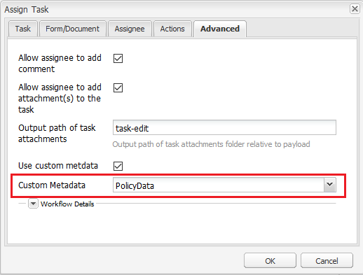

# Usar metadados em uma notificação por email  {#use-metadata-in-an-email-notification}

>[!CAUTION]
>
>AEM 6.4 chegou ao fim do suporte estendido e esta documentação não é mais atualizada. Para obter mais detalhes, consulte nossa [períodos de assistência técnica](https://helpx.adobe.com/br/support/programs/eol-matrix.html). Encontre as versões compatíveis [here](https://experienceleague.adobe.com/docs/).

Use metadados para preencher informações em uma notificação de email de fluxo de trabalho de formulários

Você pode usar a etapa Atribuir tarefa para criar e atribuir tarefas a um usuário ou grupo. Quando uma tarefa é atribuída a um usuário ou grupo, uma notificação por email é enviada ao usuário definido ou a cada membro do grupo definido. Um [notificação por email](/help/forms/using/use-custom-email-template-assign-task-step.md) contém o link da tarefa atribuída e as informações relacionadas à tarefa.

Você pode usar metadados em um modelo de email para preencher dinamicamente as informações em uma notificação por email. Por exemplo, o valor do título, da descrição, da data de vencimento, da prioridade, do fluxo de trabalho e da última data na seguinte notificação de email é selecionado dinamicamente no tempo de execução (quando uma notificação de email é gerada).


Os metadados são armazenados em pares de valores chave. Você pode especificar a chave no template de email e a chave é substituída por um valor no tempo de execução (quando uma notificação por email é gerada). Por exemplo, na amostra de código abaixo, &quot;$ {workitem_title} &quot; é uma chave. Ele é substituído pelo valor &quot;Loan-Request&quot; no tempo de execução.

```xml
subject=Task Assigned - ${workitem_title}

message=<html><body>\n\
 <table>\n\
  <tbody>\n\
   <tr>\n\
    <td>\n\
      Sample Company\n\
    </td>\n\
   </tr>\n\
   <tr>\n\
    <td>\n\
     <pre style="font-size: 13px; font-family: Helvetica, Arial, sans-serif;  font-weight: normal; color: #323232;"> Hello ${workitem_assignee},\n\
 The following task has been assigned to you:</pre>\n\
    </td>\n\
   </tr>\n\
   <tr>\n\
    <td>\n\
     <table>\n\
      <tbody>\n\
       <tr style="border-bottom: solid 2px #FFFCF9;">\n\
        <td> TITLE</td>\n\
        <td>\n\
         <p>${workitem_title}</p>\n\
        </td>\n\
       </tr>\n\
                            <tr style="border-bottom: solid 2px #FFFCF9;">\n\
        <td> DESCRIPTION</td>\n\
        <td>\n\
         <p>${workitem_description}</p>\n\
        </td>\n\
       </tr>\n\
       <tr style="border-bottom: solid 2px #FFFCF9;">\n\
        <td> DUE DATE</td>\n\
        <td>\n\
         <p>${workitem_due_date}</p>\n\
        </td>\n\
       </tr>\n\
       <tr style="border-bottom: solid 2px #FFFCF9;">\n\
        <td> PRIORITY</td>\n\
        <td>\n\
         <p>${workitem_priority}</p>\n\
        </td>\n\
       </tr>\n\
       <tr>\n\
        <td> WORKFLOW</td>\n\
        <td>\n\
         <p>${workitem_workflow}</p>\n\
        </td>\n\
       </tr>\n\
      </tbody>\n\
     </table>\n\
    </td>\n\
   </tr>\n\
   <tr style = "text-align: center; vertical-align: middle;">\n\
    <td> \n\
     <a href="${workitem_url}" target="_blank" style="background-color: #1EBBBB; font-size: 18px; line-height: 25px; font-weight: bold; color: #FFFFFF; text-decoration: none; padding: 15px 15px 15px 15px;">Open Task</a>\n\
    </td>\n\
   </tr>\n\
   <tr>\n\
    <td>\n\
     <p><span style="font-size: 12px; font-weight: normal; font-style: italic; color: #919191;">This is an automatically generated email. Please do not reply to this email.</span></p>\n\
    </td>\n\
   </tr>\n\
  </tbody>\n\
 </table>\n\
</body>\n\
</html>\n\
```

## Uso de metadados gerados pelo sistema em uma notificação por email {#using-system-generated-metadata-in-an-email-notification}

Um aplicativo AEM Forms fornece várias variáveis de metadados (pares de valores chave) prontos para uso. Você pode usar essas variáveis em um modelo de email. O valor da variável é baseado no aplicativo de formulários associado. A tabela a seguir lista todas as variáveis de metadados disponíveis para uso imediato:

<table> 
 <tbody> 
  <tr> 
   <td>Chave</td> 
   <td>Descrição</td> 
  </tr> 
  <tr> 
   <td>workitem_title</td> 
   <td>Título do aplicativo de formulários associado.</td> 
  </tr> 
  <tr> 
   <td>url_do_item_de_trabalho</td> 
   <td>URL para acessar o aplicativo de formulários associado.</td> 
  </tr> 
  <tr> 
   <td>descrição_do_item_de_trabalho</td> 
   <td>Descrição do aplicativo de formulários associado.</td> 
  </tr> 
  <tr> 
   <td>workitem_priority</td> 
   <td>Prioridade especificada para o aplicativo de formulários associado.</td> 
  </tr> 
  <tr> 
   <td>data_de_vencimento_do_item_de_trabalho</td> 
   <td>Última data para agir no aplicativo de formulários associado.</td> 
  </tr> 
  <tr> 
   <td>workflow_do_item</td> 
   <td>Nome do fluxo de trabalho associado ao aplicativo forms.</td> 
  </tr> 
  <tr> 
   <td>workitem_assign_timestamp</td> 
   <td>Data e hora em que o item de fluxo de trabalho foi atribuído ao destinatário atual.</td> 
  </tr> 
  <tr> 
   <td>workitem_assignee</td> 
   <td>Nome do destinatário presente.</td> 
  </tr> 
  <tr> 
   <td>host_prefix</td> 
   <td>URL do servidor do autor. Por exemplo, https://10.41.42.66:4502<br /> </td> 
  </tr> 
  <tr> 
   <td>publish_prefix</td> 
   <td>URL do servidor de publicação. Por exemplo, https://10.41.42.66:4503</td> 
  </tr> 
 </tbody> 
</table>

## Uso de metadados personalizados em uma notificação por email {#using-custom-metadata-in-an-email-notification}

Você também pode usar metadados personalizados em uma notificação por email. Os metadados personalizados contêm informações além dos metadados gerados pelo sistema. Por exemplo, detalhes de política recuperados de um banco de dados. Você pode usar um pacote ECMAScript ou OSGi para adicionar metadados personalizados no repositório crx:

### Usar o ECMAScript para adicionar metadados personalizados  {#use-ecmascript-to-add-custom-metadata}

[ECMAScript](https://en.wikipedia.org/wiki/ECMAScript) é uma linguagem de script. Ele é usado para aplicativos de servidor e scripts do lado do cliente. Execute as seguintes etapas para usar o ECMAScript para adicionar metadados personalizados a um modelo de email:

1. Faça logon no CRX DE com uma conta administrativa. O URL é `https://[server]:[port]/crx/de/index.jsp`

1. Navegue até /apps/fd/dashboard/scripts/metadataScripts. Crie um arquivo com a extensão .ecma. Por exemplo, usermetadata.ecma

   Se o caminho mencionado acima não existir, crie-o.

1. Adicione o código ao arquivo .ecma que tem a lógica de gerar metadados personalizados em pares de valores chave. Por exemplo, o código ECMAScript a seguir gera metadados personalizados para uma apólice de seguro:

   ```
   function getUserMetaData()  {
       //Commented lines below provide an overview on how to set user metadata in map and return it.
       var HashMap = Packages.java.util.HashMap;
       var valuesMap = new HashMap();
       valuesMap.put("policyNumber", "2017568972695");
       valuesMap.put("policyHolder", "Adobe Systems");
   
       return valuesMap;
   }
   ```

1. Clique em Salvar tudo. Agora, o script está disponível para seleção em AEM modelo de fluxo de trabalho.

   

1. (Opcional) Especifique o título do script:

   Se você não especificar o título, o campo Metadados personalizados exibirá o caminho completo do arquivo ECMAScript. Execute as seguintes etapas para especificar um título significativo para o script:

   1. Expanda o nó do script, clique com o botão direito do mouse no nó **[!UICONTROL jcr:content]** e clique em **[!UICONTROL Misturas]**.
   1. Digite mix:título na caixa de diálogo Editar misturas e clique em **+**.
   1. Adicione uma propriedade com os seguintes valores.

      | Nome | jcr:title |
      |---|---|
      | Tipo | String |
      | Valor | Especifique o título do script. Por exemplo, metadados personalizados para o detentor da política. O valor especificado é exibido na etapa Atribuir tarefa . |

### Usar um pacote OSGi e uma interface Java para adicionar metadados personalizados {#use-an-osgi-bundle-and-java-interface-to-add-custom-metadata}

Você pode usar a interface Java WorkitemUserMetadataService para adicionar metadados personalizados a modelos de email. Você pode criar um pacote OSGi que use a interface Java WorkitemUserMetadataService e implantá-lo no servidor AEM Forms. Disponibiliza os metadados para seleção na etapa Atribuir tarefa .

Para criar um pacote OSGi com a interface Java, adicione [SDK do cliente da AEM Forms](https://helpx.adobe.com/aem-forms/kb/aem-forms-releases.html) jar e [jarro de granito](https://repo.adobe.com/nexus/content/groups/public/com/adobe/granite/com.adobe.granite.workflow.api/1.0.2/) arquivos como dependências externas para o projeto do pacote OSGi. Você pode usar qualquer Java IDE para criar um pacote OSGi. O procedimento a seguir fornece etapas para usar o Eclipse para criar um pacote OSGi:

1. Abra o Eclipse IDE. Navegue até Arquivo > Novo projeto.

1. Na tela Selecionar um assistente, selecione Projeto Maven e clique em Avançar.

1. No projeto Novo Maven, mantenha os padrões e clique em Avançar. Selecione um arquétipo e clique em Avançar. Por exemplo, maven-archetype-quickstart. Especifique a ID do grupo, a ID do artefato, a versão e o pacote para o projeto e clique em Concluir. O projeto é criado.

1. Abra o arquivo pom.xml para edição e substitua todo o conteúdo do arquivo pelo seguinte:

   ```
   
   ```

1. Adicione o código-fonte que usa a interface Java WorkitemUserMetadataService para adicionar metadados personalizados para modelos de email. Um código de exemplo é listado abaixo:

   ```java
   package com.aem.impl;
   
   import com.adobe.fd.workspace.service.external.WorkitemUserMetadataService;
   import org.apache.felix.scr.annotations.Component;
   import org.apache.felix.scr.annotations.Properties;
   import org.apache.felix.scr.annotations.Property;
   import org.apache.felix.scr.annotations.Service;
   import org.osgi.framework.Constants;
   
   import java.util.HashMap;
   import java.util.Map;
   
   @Component
   @Service
   @Properties({
           @Property(name = Constants.SERVICE_DESCRIPTION, value = "A sample implementation of a user metadata service."),
           @Property(name = WorkitemUserMetadataService.SERVICE_PROPERTY_LABEL, value = "Default User Metadata Service")})
   
   public class WorkitemUserMetadataServiceImpl
     implements WorkitemUserMetadataService
   {
     public WorkitemUserMetadataServiceImpl() {}
   
     public Map<String, String> getUserMetadataMap()
     {
       HashMap<String, String> metadataMap = null;
       metadataMap = new HashMap();
       metadataMap.put("test_metadata", "tested-interface implementation");
       return metadataMap;
     }
   }
   ```

1. Abra um prompt de comando e navegue até o diretório que contém o projeto do pacote OSGi. Use o seguinte comando para criar o pacote OSGi:

   `mvn clean install`

1. Faça upload do pacote para um servidor AEM Forms. Você pode usar AEM Gerenciador de pacotes para importar o pacote para o servidor AEM Forms.

Após a importação do pacote, é possível selecionar os metadados na etapa Atribuir tarefa e usá-lo como modelo de email.
