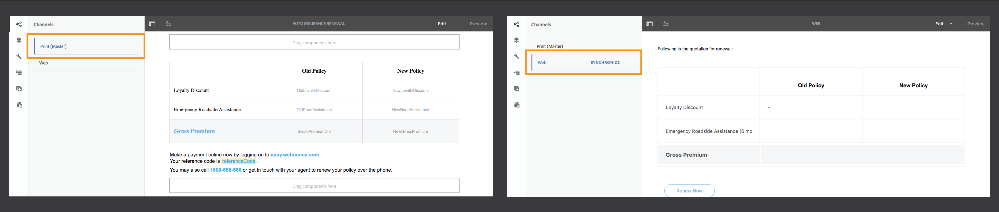

# Resumo dos novos recursos | AEM 6.4 Forms {#new-features-summary-aem-forms}

Resumo dos novos recursos e melhorias no AEM 6.4 Forms.

A AEM Forms inclui vários novos recursos e aprimoramentos que simplificam ainda mais a criação, o gerenciamento e as experiências do usuário com formulários adaptáveis e comunicações interativas.

Leia para uma rápida introdução a novos recursos e melhorias. Consulte a documentação para obter detalhes sobre a oferta de recursos. Além disso, consulte AEM 6.4 Notas de [versão](/help/release-notes/forms.md)do Forms. Para obter a documentação completa do Forms AEM 6.4, visite [AEM Guia](/help/forms/home.md)do Usuário do Forms 6.4.

## Comunicações interativas {#interactive-communications}

A Interative Communications centraliza e gerencia a criação, montagem e delivery de correspondências seguras, personalizadas e interativas, como correspondência comercial, cartas, documentos, declarações, avisos de benefícios, prospetos de gerenciamento de riquezas, emails de marketing, projetos de lei e kits de boas-vindas.

A Interative Communications usa a mesma tecnologia subjacente, os mesmos processos e componentes que os formulários adaptativos para criar comunicações responsivas com vários canais, como formulários adaptativos responsivos.

A comunicação interativa oferta vantagens significativas:

* Fornece integração OTB com o Form Data Model para permitir acesso fácil e simplificado a bancos de dados back-end e outros sistemas CRM, como o MS Dynamics
* Fornece uma interface de criação integrada para canais da Web e da impressão
* Fornece interface de criação baseada em arrastar e soltar, semelhante à criação do Adaptive Forms, para canais de impressão e da Web.

A comunicação interativa é a abordagem padrão e recomendada para criar comunicações de clientes. Para continuar usando as letras AEM 6.3 Forms e AEM 6.2 Forms, é necessário instalar um pacote de compatibilidade.

### Criação de comunicação interativa de vários canais {#multi-channel-interactive-communication-authoring}

Usando a comunicação interativa, você pode criar e editar documentos impressos e da Web de um único editor de documentos. Ao utilizar os mesmos fragmentos de documento para criar execuções de ambos os canais, é possível eliminar a duplicação de esforços.

Para obter mais informações, consulte Visão geral [das comunicações](/help/forms/using/interactive-communications-overview.md)interativas.

### Editor de Documentos WYSIWYG {#wysiwyg-document-editor}

O editor de documentos de arrastar e soltar WYSIWYG é amigável aos negócios. A interface intuitiva, a funcionalidade de arrastar e soltar, os componentes padrão, os modelos de dados e o repositório integrado para ativos facilitam a criação rápida e fácil de comunicações interativas.

Para criar uma comunicação interativa ou editar uma existente, os usuários corporativos podem usar os seguintes blocos componentes: Canais, conteúdo, propriedades, ativos, componentes e fontes de dados.

Para obter mais informações, consulte [Introdução à criação de comunicação](/help/forms/using/introduction-interactive-communication-authoring.md)interativa.

### Gerar automaticamente versão da Web a partir de conteúdo impresso em comunicação interativa {#auto-generate-web-version-from-print-content-in-interactive-communication}

Os autores podem gerar automaticamente conteúdo de documentos da Web de documentos de impressão para criar, pré-visualização e editar documentos de impressão e da Web no mesmo editor. Os autores de comunicação interativa podem criar uma vez e publicar em todos os canais. Os autores de comunicação interativa podem usar os mesmos fragmentos de documento no canal de impressão e da Web para evitar a duplicação de esforços.

Para obter mais informações, consulte [Imprimir canal e canal](/help/forms/using/web-channel-print-channel.md)da Web.

### Usar temas para criar um estilo de canal da Web de comunicação interativa {#use-themes-to-style-web-channel-of-interactive-communication}

A comunicação interativa suporta temas. Você pode criar temas e aplicá-los à sua comunicação interativa. Um tema contém detalhes de estilização para componentes e painéis. Você pode reutilizar um tema em diferentes comunicações interativas para oferecer uma aparência e marca comuns e consistentes.

A AEM Forms inclui um tema predefinido para Comunicações interativas. Usando um tema, você também pode personalizar a aparência de uma comunicação interativa em um dispositivo.

Para obter mais informações, consulte [Temas no AEM Forms](/help/forms/using/themes.md).

### Interface do agente aprimorada {#enhanced-agent-interface}

A interface do usuário do Agente agora oferece suporte à impressão e pré-visualização da Web da comunicação interativa. Na mesma interface de usuário do Agente, você pode optar por editar o canal de impressão e o canal da Web de pré-visualização de sua comunicação interativa de vários canais. Campos, variáveis, elementos FDM e fragmentos de documento no canal de impressão podem ser configurados para serem modificados pelo agente na interface do usuário do Agente. O suporte ao modelo de dados de formulário permite que você gere pré-visualizações com dados de amostra pré-preenchidos.

Para obter mais informações, consulte [Preparar e enviar comunicação interativa usando a interface do usuário](/help/forms/using/prepare-send-interactive-communication.md)do agente.

### Apresentar informações em gráficos {#present-information-in-charts}

A comunicação interativa suporta gráficos na Web e o canal de impressão para comunicações mais avançadas. Usando gráficos como torta, rosca, barra e coluna, você pode condensar e apresentar visualmente grandes quantidades de informações para fácil interpretação e análise.

 

Para obter mais informações, consulte [Uso de gráficos em Comunicações](/help/forms/using/chart-component-interactive-communications.md)interativas.

### Conectores de dados prontos para preencher os documentos {#out-of-the-box-data-connectors-to-prefill-documents}

A comunicação interativa fornece integração de dados com ferramentas de negócios para conexão com vários sistemas de negócios, incluindo sistemas CRM, e personalização de dados em documentos.

Para obter mais informações, consulte [Usar modelo](/help/forms/using/using-form-data-model.md)de dados de formulário.

### Editor de fragmentos de documento aprimorado {#enhanced-document-fragment-editor}

Agora você pode usar elementos e regras do FDM em fragmentos de documento de comunicação interativa.

* Suporte para elementos de modelo de dados de formulário
* Mostrar ou ocultar um ativo/fragmento de texto usando regras
* Validar o valor de um elemento/variável
* Executar funções para calcular o valor de uma expressão matemática

Para obter mais informações, consulte:

* [Textos em Comunicações Interativas](/help/forms/using/texts-interactive-communications.md)
* [Condições em comunicações interativas](/help/forms/using/conditions-interactive-communications.md)

### Pacote de compatibilidade para ativos existentes {#compatibility-package-for-existing-assets}

Por padrão, ativos de carta das versões anteriores do AEM Forms não são suportados nesta versão. Se você pretende continuar usando as letras AEM 6.3 Forms e AEM 6.2 Forms, é necessário instalar o pacote de compatibilidade.

## Integração de dados {#data-integration}

[A integração](/help/forms/using/data-integration.md) de dados da AEM Forms permite configurar fontes de dados diferentes; tais como bases de dados, serviços Web RESTful ou SOAP e serviços OData; para criar um modelo de dados de formulário que pode ser usado para vincular dados, preencher previamente e invocar serviços em formulários e documentos adaptáveis.

Há vários novos recursos e melhorias na integração de dados nesta versão.

### Criar modelo de dados de formulário sem fonte de dados {#create-form-data-model-without-data-source}

Usuários de negócios e autores de formulários agora podem criar um modelo de dados de formulário, incluindo suas entidades e propriedades, sem configurar uma fonte de dados, e podem ser usados para criar documentos e formulários adaptáveis. É possível vincular o modelo de dados de formulário a fontes de dados posteriormente. Elimina dependências em fontes de dados para criar formulários e documentos usando o modelo de dados de formulário.

Da mesma forma, é possível criar entidades e propriedades-filho em um modelo de dados de formulário existente e vinculá-las às entidades e propriedades correspondentes em uma fonte de dados posteriormente.

Para obter mais informações, consulte [Criar modelo](/help/forms/using/create-form-data-models.md)de dados de formulário.

### Criar propriedades calculadas {#create-computed-properties}

Os autores e desenvolvedores da Forms podem criar propriedades computadas no modelo de dados de formulário. Eles permitem calcular um valor para a propriedade criando regras ou lógica nos dados disponíveis em fontes de dados configuradas. Uma regra é uma expressão que é avaliada quando os dados são carregados no modelo de dados do formulário ou quando os valores das propriedades na expressão são alterados. Por exemplo, uma propriedade calculada chamada Instalações calcula a quantia mensal a ser paga para um empréstimo com base na taxa de juros especificada na fonte de dados e na quantia e duração do empréstimo especificadas pelo usuário no formulário.

Uma propriedade calculada reside localmente em um modelo de dados de formulário e não existe em uma fonte de dados. Você pode usar as propriedades computadas em formulários adaptáveis e comunicações interativas.

Para obter mais informações, consulte [Trabalhar com modelo](/help/forms/using/work-with-form-data-model.md)de dados de formulário.

### Pré-visualização de formulários e documentos com dados de amostra {#preview-forms-and-documents-with-sample-data}

O modelo de dados de formulário permite gerar dados de amostra para propriedades de todas as entidades em um modelo de dados de formulário. Os dados gerados correspondem aos tipos de dados configurados para as propriedades. Quando você pré-visualização um formulário ou documento adaptável associado ao modelo de dados do formulário, ele é renderizado com dados de amostra pré-preenchidos.

Os dados de amostra são um conjunto de valores aleatórios que são alterados sempre que você os gera. No entanto, você pode editar e salvar os dados de amostra que persistem mesmo se os regenerar. Por exemplo, se você editar e salvar os dados de amostra para as propriedades Nome e Sobrenome e, posteriormente, adicionar outra propriedade ou entidade no modelo de dados de formulário e gerar novamente os dados de amostra, as propriedades Nome e Sobrenome mostrarão os valores salvos enquanto os valores para outras propriedades forem regenerados.

Para obter detalhes, consulte [Usar modelo](/help/forms/using/using-form-data-model.md)de dados de formulário.

### Refresh data source definitions {#refresh-data-source-definitions}

Qualquer atualização nas entidades ou propriedades da fonte de dados não é refletida automaticamente nos modelos de dados de formulário associados. O editor de modelo de dados de formulário agora apresenta  (Atualizar Definições de Fonte de Dados) que invalida o cache do servidor e busca o schema atualizado da fonte de dados para refletir imediatamente no modelo de dados de formulário.

### Configurar fontes de dados usando a interface do usuário Touch {#configure-data-sources-using-touch-user-interface}

Com esta versão, a configuração dos serviços em nuvem para fontes de dados está disponível na interface do usuário do Touch. Além disso, o local para configurar os serviços em nuvem foi alterado para **[!UICONTROL Ferramentas > Cloud Services > Fontes]** de dados. See [Configure data sources](/help/forms/using/configure-data-sources.md).

## Formulários adaptáveis {#adaptive-forms}

### Melhore o desempenho de formulários adaptáveis com carregamento lento aprimorado {#improve-performance-of-adaptive-forms-with-enhanced-lazy-loading}

A funcionalidade de carregamento lento em formulários adaptáveis difere a inicialização de fragmentos de formulário até que sejam necessários. Ele melhora o desempenho de formulários grandes ao minimizar o tempo necessário para renderizar um formulário, resultando em uma melhor experiência do usuário.

Há vários aprimoramentos no recurso de carregamento lento nesta versão:

* Os componentes de anexo de arquivo e Termos e condições são suportados em fragmentos de formulário com carregamento lento ativado.
* Fragmentos de formulário adaptáveis com carregamento lento ativado são suportados em painéis repetíveis.
* Formulários adaptáveis com fragmentos ativados de carregamento lento são suportados no aplicativo AEM Forms.

## Workflows de AEM centrados na Forms {#forms-centric-aem-workflows}

Com a capacidade de Workflows de AEM centrados na Forms, você pode criar e implantar rapidamente workflows para várias tarefas na pilha OSGi. Não é mais necessário instalar o recurso Process Management disponível na pilha JEE, simplificando a implantação e eliminando os custos do servidor de aplicativos e da infraestrutura. Para obter mais informações, consulte workflows centrados na [Forms no OSGi](/help/forms/using/aem-forms-workflow.md).

Veja a seguir os aprimoramentos nos Workflows Forms-Centric AEM: ・

* O editor de modelo de fluxo de trabalho está disponível na interface do usuário Touch. Ajuda a reduzir o tempo necessário para criar Workflows de AEM centrados em formulários.
* Etapa do fluxo de trabalho para enviar emails. Por exemplo, você pode usar a etapa de email para enviar um documento de registro na conclusão de um fluxo de trabalho.
* Etapa de fluxo de trabalho para usar serviços de modelo de dados de formulário em um modelo de fluxo de trabalho. Esta etapa permite que você chame os serviços de integração de dados sem gravar nenhum código personalizado. Por exemplo, você pode chamar um serviço de GET para obter detalhes de funcionários de um arquivo de banco de dados sem gravar nenhum código personalizado.

## Aplicativo AEM Forms {#aem-forms-app}

O aplicativo AEM Forms permite que trabalhadores de campo sincronizem seus dispositivos móveis com um servidor AEM Forms e trabalhem em seus formulários. O aplicativo funciona perfeitamente quando o dispositivo está offline, salvando dados localmente no dispositivo e sincronizando os dados com o servidor quando o dispositivo está online novamente. Para obter mais informações, consulte Aplicativo AEM Forms.

Veja a seguir as melhorias no aplicativo AEM Forms:

* Formulários adaptáveis com fragmentos ativados de carregamento lento são suportados no aplicativo AEM Forms.
* Formulários adaptáveis com modelo de dados de formulário são suportados no aplicativo AEM Forms.

## Segurança de documentos {#document-security}

Usando a segurança do documento, é possível distribuir com segurança todas as informações salvas em um formato compatível. A segurança do Documento garante que somente usuários autorizados possam usar seus documentos. Veja a seguir as principais mudanças na segurança do documento:

* A segurança do Documento fornece uma Biblioteca de Proteção [Portátil (PPL)](/help/forms/using/document-security-offerings.md) para proteger um documento localmente, sem enviar o documento para o servidor AEM Forms. Somente as credenciais de segurança e os detalhes da política viajam pela rede para o servidor AEM Forms. AEM 6.4 A Forms introduziu a Biblioteca de Proteção Portátil (PPL) em um formato de pacote OSGi. Agora, você pode instalar diretamente a biblioteca PPL em um servidor AEM Forms e usar os recursos de AEM e PPL em conjunto.
* A segurança do Documento C++ SDK e a biblioteca PPL C++ podem ser compiladas com o Microsoft Visual Studio 2013. A versão anteriormente suportada era o Microsoft Visual Studio 2010.

## Plataformas compatíveis {#supported-platforms}

A AEM Forms pode ser configurada usando qualquer combinação de sistemas operacionais, servidores de aplicativos, bancos de dados, drivers de banco de dados, JDK, servidores LDAP e servidores de email suportados. Veja a seguir as principais mudanças nas plataformas suportadas:

<table> 
 <tbody> 
  <tr> 
   <td>Componente</td> 
   <td>Suporte adicionado</td> 
   <td>Suporte removido</td> 
  </tr> 
  <tr> 
   <td>Sistemas operacionais</td> 
   <td> 
    <ul> 
     <li>Microsoft Windows Server 2016</li> 
     <li>Oracle Linux 7 Update 3</li> 
    </ul> </td> 
   <td> 
    <ul> 
     <li>IBM AIX 7.2 [1]  </li> 
     <li>Solaris 11 [1]</li> 
    </ul> </td> 
  </tr> 
  <tr> 
   <td>Servidores de aplicativos  </td> 
   <td> 
    <ul> 
     <li>Red Hat JBoss EAP 7</li> 
    </ul> </td> 
   <td> 
    <ul> 
     <li>IBM Weblogic 12.1.3</li> 
     <li>IBM WebSphere 8.5.5</li> 
     <li>Red Hat JBoss EAP 6</li> 
    </ul> </td> 
  </tr> 
  <tr> 
   <td>Bancos de dados</td> 
   <td> 
    <ul> 
     <li>Microsoft SQL Server 2016</li> 
     <li>MySQL 5.7.19 e posterior</li> 
     <li>IBM DB2 11.1</li> 
     <li>Arquitetura do Oracle Multilocatário</li> 
    </ul> </td> 
   <td> 
    <ul> 
     <li>Microsoft SQL Server 2012  </li> 
     <li>Microsoft SQL Server 2014</li> 
     <li>MySQL 5.5</li> 
     <li>IBM DB2 10.5  </li> 
    </ul> </td> 
  </tr> 
  <tr> 
   <td>Servidores LDAP</td> 
   <td> 
    <ul> 
     <li>Microsoft Ative Diretory 2016</li> 
     <li>IBM Tivoli Diretory Server 6.4</li> 
    </ul> </td> 
   <td> 
    <ul> 
     <li>Microsoft Ative Diretory 2008</li> 
     <li>IBM Tivoli Diretory Server 6.3</li> 
     <li>Oracle Diretory Server Enterprise Edition 7.0</li> 
    </ul> </td> 
  </tr> 
  <tr> 
   <td>Servidores de email</td> 
   <td> 
    <ul> 
     <li>Microsoft Office 365</li> 
    </ul> </td> 
   <td> 
    <ul> 
     <li>Novell Groupaware 7</li> 
    </ul> </td> 
  </tr> 
  <tr> 
   <td>Conectores</td> 
   <td> 
    <ul> 
     <li>Conector para Microsoft Sharepoint 2016</li> 
     <li>Connector for EMC Documentum 7.3</li> 
    </ul> </td> 
   <td> 
    <ul> 
     <li>Conector para Microsoft Sharepoint 2007</li> 
     <li>Conector para Microsoft Sharepoint 2010</li> 
     <li>Conector para IBM Filenet 5.0</li> 
     <li>Connector for EMC Documentum 6.7</li> 
    </ul> </td> 
  </tr> 
  <tr> 
   <td>Navegadores</td> 
   <td> 
    <ul> 
     <li>Apple Safari 11.x no macOS</li> 
     <li>Apple Safari 11.x no iOS</li> 
    </ul> </td> 
   <td> 
    <ul> 
     <li>Navegador Blackberry para dispositivos Blackberry Z30 e Q10</li> 
    </ul> </td> 
  </tr> 
  <tr> 
   <td>AEM Forms app  </td> 
   <td> 
    <ul> 
     <li>Android 4.4 ou superior</li> 
     <li>Apple iOS 10 ou superior</li> 
    </ul> </td> 
   <td> </td> 
  </tr> 
 </tbody> 
</table>

1. Os sistemas operacionais AIX e Solaris estão disponíveis somente para clientes de atualização.
