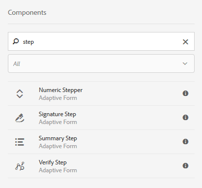

# Usar o Adobe Sign em um formulário adaptável {#using-adobe-sign-in-an-adaptive-form}

Ative os workflows de assinatura eletrônica (Adobe Sign) para um formulário adaptável para automatizar workflows de assinatura, simplificar processos de assinatura única e de várias assinaturas e assinar eletronicamente formulários de dispositivos móveis.

O Adobe Sign permite workflows de assinatura eletrônica para formulários adaptáveis. As assinaturas eletrônicas melhoram os workflows para processar documentos para áreas legais, de vendas, de folha de pagamento, de gerenciamento de recursos humanos e outras.

Em um cenário típico de formulários adaptáveis e do Adobe Sign, um usuário preenche um formulário adaptável para solicitar um serviço. Por exemplo, um pedido de hipoteca e de cartão de crédito requer assinaturas legais de todos os mutuários e co-requerentes. Para ativar workflows de assinatura eletrônica para cenários semelhantes, é possível integrar o Adobe Sign aos formulários do AEM. Mais alguns exemplos são: você pode usar o Adobe Sign para:

* Feche negócios de qualquer dispositivo com processos de propostas, cotações e contratos totalmente automatizados.
* Conclua os processos de recursos humanos mais rapidamente e dê aos seus funcionários as experiências digitais.
* Reduza o tempo de ciclo de contratos e integre seus fornecedores mais rapidamente.
* Crie workflows digitais que automatizam processos comuns.

A integração do Adobe Sign com o AEM Forms suporta:

* workflows de assinatura de usuário único e múltiplo
* workflows de assinatura sequenciais e simultâneos
* Experiências de assinatura em forma e fora de forma
* Assinar formulários como um usuário anônimo ou conectado
* Processos de assinatura dinâmica (integração com o fluxo de trabalho do AEM Forms)
* Autenticação por meio de uma base de conhecimento, telefone e perfis sociais

## Pré-requisitos {#prerequisites}

Antes de usar o Adobe Sign em um formulário adaptável:

* Verifique se o serviço em nuvem do AEM Forms está configurado para usar o Adobe Sign. Para obter detalhes, consulte [Integrar o Adobe Sign a formulários](/help/forms/using/adobe-sign-integration-adaptive-forms.md)AEM.
* Mantenha a lista dos signatários prontos. Você precisa de pelo menos um endereço de email para cada assinante.

## Configurar o Adobe Sign para um formulário adaptável {#configure-adobe-sign-for-an-adaptive-form}

Execute as seguintes etapas para configurar o Adobe Sign para um formulário adaptável:

1. [Editar propriedades de formulário adaptável para assinatura da Adobe](#enableadobesign)
1. [Adicionar campos do Adobe Sign a um formulário adaptável](#addadobesignfieldstoanadaptiveform)
1. [Ativar o Adobe Sign para um formulário adaptável](#enableadobsignforanadaptiveform)
1. [Selecione o serviço Adobe Sign Cloud para um formulário adaptável](#selectadobesigncloudserviceforanadaptiveform)

1. [Adicionar assinantes do Adobe Sign a um formulário adaptável](#addsignerstoanadaptiveform)
1. [Selecione Enviar ação para um formulário adaptável](#selectsubmitactionforanadaptiveform)

### Editar propriedades de formulário adaptável para o Adobe Sign {#enableadobesign}

Configure as propriedades de formulário adaptável para o Adobe Sign para um formulário adaptável existente ou novo.

[Criar um formulário adaptável para o Adobe Sign](/help/forms/using/working-with-adobe-sign.md#create-an-adaptive-form-for-adobe-sign) descreve as etapas para criar um formulário adaptável básico. Consulte [Criação de um formulário](/help/forms/using/creating-adaptive-form.md) adaptável para outras opções disponíveis ao criar um formulário adaptável.

#### Criar um formulário adaptável para o Adobe Sign {#create-an-adaptive-form-for-adobe-sign}

Execute as seguintes etapas para criar um formulário adaptável para o Adobe Sign:

1. Navegue até **[!UICONTROL Adobe Experience Manager]** > **[!UICONTROL Formulários]** > **[!UICONTROL Formulários e Documentos]**.
1. Toque em **[!UICONTROL Criar]** e selecione Formulário **** adaptável. Uma lista de modelos é exibida. Selecione o modelo e toque em **[!UICONTROL Próximo]**.
1. Na guia **[!UICONTROL Básico]** :

   1. Especifique o **Nome** e o **Título** para o formulário adaptável.
   1. Selecione o container [de](/help/forms/using/adobe-sign-integration-adaptive-forms.md#configure-adobe-sign-with-aem-forms) configuração criado ao configurar o Adobe Sign com o AEM Forms.

1. Na guia Modelo **[!UICONTROL de]** formulário, selecione uma das seguintes opções:

   * Selecione o modelo de formulário **[!UICONTROL Associar como o Documento do modelo]** de Registro e selecione um Documento do modelo de Registro. Se você usar um formulário adaptativo baseado em modelo de formulário, os documentos enviados para assinatura exibirão apenas os campos que se baseiam no modelo de formulário associado. Não exibe todos os campos do formulário adaptável.
   * Selecione a opção **[!UICONTROL Gerar Documento de registro]** . Se você usar um formulário adaptável habilitado para a opção Documento de registro, o documento enviado para assinatura exibirá todos os campos do formulário adaptável.

1. Toque em **[!UICONTROL Criar.]** É criado um formulário adaptável habilitado para assinatura, que pode ser usado para adicionar campos do Adobe Sign.

#### Editar um formulário adaptável para o Adobe Sign {#editafsign}

Execute as seguintes etapas para usar o Adobe Sign em um formulário adaptável existente:

1. Navegue até **[!UICONTROL Adobe Experience Manager]** > **[!UICONTROL Formulários]**> **[!UICONTROL Formulários e Documentos]**.
1. Selecione o formulário adaptável e toque em **[!UICONTROL Propriedades]**.
1. Na guia **[!UICONTROL Básico]** , selecione o container [de](/help/forms/using/adobe-sign-integration-adaptive-forms.md#configure-adobe-sign-with-aem-forms) configuração criado ao configurar o Adobe Sign com o AEM Forms.
1. Na guia Modelo **[!UICONTROL de]** formulário, selecione uma das seguintes opções:

   * Selecione o modelo de formulário **[!UICONTROL Associar como o Documento do modelo]** de Registro e selecione um Documento do modelo de Registro. Se você usar um formulário adaptativo baseado em modelo de formulário, os documentos enviados para assinatura exibirão apenas os campos que se baseiam no modelo de formulário associado. Não exibe todos os campos do formulário adaptável.
   * Selecione a opção **[!UICONTROL Gerar Documento de registro]** . Se você usar um formulário adaptável habilitado para a opção Documento de registro, o documento enviado para assinatura exibirá todos os campos do formulário adaptável.

1. Toque em **[!UICONTROL Salvar e fechar]**. O formulário adaptável está habilitado para o Adobe Sign.

### Adicionar campos do Adobe Sign a um formulário adaptável {#addadobesignfieldstoanadaptiveform}

O Adobe Sign tem vários campos que podem ser colocados em um formulário adaptável. Esses campos aceitam vários tipos de dados, como assinaturas, iniciais, empresa ou título, e ajudam a coletar informações extras durante a assinatura, juntamente com as assinaturas. Você pode usar o componente Bloco de assinatura da Adobe para colocar os campos do Adobe Sign em vários locais em um formulário adaptável.

Execute as seguintes etapas para adicionar campos a um formulário adaptável e personalizar várias opções relacionadas a esses campos:

1. Arraste e solte o componente **Adobe Sign Block** do navegador de componentes para o formulário adaptável. O componente Bloco de assinatura da Adobe tem todos os campos do Adobe Sign suportados. Por padrão, adiciona um campo **Assinatura** ao formulário adaptável.

   

   Por padrão, o Bloco de assinatura da Adobe não fica visível no formulário adaptável publicado. Ela é visível somente nos documentos de assinatura. Você pode alterar a visibilidade do Bloco de assinatura da Adobe a partir das propriedades do componente Bloco de assinatura da Adobe.

   >[!NOTE]
   >
   >* O uso do bloco Adobe Sign não é obrigatório para usar o Adobe Sign em um formulário adaptável. Se você não usar o bloco do Adobe Sign e adicionar campos para os signatários, o campo de assinatura padrão será exibido na parte inferior dos documentos de assinatura.
   >* Use o bloco Adobe Sign somente para os formulários adaptativos que geram automaticamente o Documento de Registro. Se você estiver usando um XDP personalizado para gerar um Documento de Registro ou um formulário adaptável baseado em modelo de formulário, o bloco Adobe Sign não será necessário.

1. Selecione o componente Bloco **do** Adobe Sign e toque no ícone **Editar**  . Exibe opções para adicionar campos e formatar a aparência de um campo.

   

   **A.** Selecione e adicione campos do Adobe Sign. **B.** Expanda o bloco do Adobe Sign para a visualização em tela cheia

1. Toque no ícone **Adobe Sign Field**  . Ele exibe opções para selecionar e adicionar campos do Adobe Sign.

   Expanda o campo **suspenso Tipo** para selecionar um campo Adobe Sign e toque no ícone  concluído para adicionar o campo selecionado ao bloco Adobe Sign. O campo suspenso **Tipo** inclui os tipos de campos Assinatura, Informações do assinante e Dados. Integração do Adobe Sign com os campos de suporte do AEM Forms listados somente na caixa suspensa Tipo. Para obter informações detalhadas sobre os campos do Adobe Sign, consulte a documentação [do](https://helpx.adobe.com/sign/help/field-types.html)Adobe Sign.

   

   É obrigatório fornecer um nome exclusivo para um campo. Você também pode selecionar a opção necessária para marcar um campo como obrigatório. Além da opção **Nome** e **obrigatório** , alguns campos do Adobe Sign têm mais opções. Por exemplo, máscara e várias linhas. Além disso, especifique um nome exclusivo para cada campo do Adobe Sign se os campos residem no mesmo bloco do Adobe Sign ou em blocos diferentes.

### Ativar o Adobe Sign para um formulário adaptável {#enableadobsignforanadaptiveform}

A partir da caixa, o Adobe Sign não está ativado para um formulário adaptável. Execute as seguintes etapas para ativá-la:

1. No navegador de conteúdo, toque em Container **de** formulário e toque no ícone **Configurar**  . Ele abre o navegador de propriedades e exibe as propriedades do container de formulário adaptável.
1. No navegador de propriedades, expanda a opção Assinatura **** eletrônica e selecione a opção **Ativar o Adobe Sign** . Ela ativa o Adobe Sign para obter um formulário adaptável.

### Selecionar o serviço da Adobe Sign Cloud e a ordem de assinatura {#selectadobesigncloudserviceforanadaptiveform}

Você pode configurar vários serviços do Adobe Sign para uma instância do AEM Forms. É aconselhável ter um conjunto separado de serviços para cada função (Recursos Humanos, Finanças e muito mais). Facilita o rastreamento e o relatórios de documentos assinados. Por exemplo, um banco tem vários departamentos. Você pode ter uma configuração separada para cada departamento para melhor rastreamento dos documentos.

Um documento também pode ter vários signatários. Por exemplo, uma solicitação de cartão de crédito pode ter vários candidatos. Um banco requer assinaturas de todos os candidatos antes de iniciar o processamento do pedido. Para cenários com vários signatários, você pode optar por assinar o documento em ordem sequencial ou simultânea.

Execute as seguintes etapas para selecionar um serviço em nuvem e a ordem de assinatura:

1. No navegador de conteúdo, toque em Container **de** formulário e toque no ícone **Configurar**  . Ele abre o navegador de propriedades e exibe as propriedades do container de formulário adaptável.
1. No navegador de propriedades, expanda a opção Assinatura **** eletrônica e selecione a opção **Ativar o Adobe Sign** . Ela ativa o Adobe Sign para obter um formulário adaptável.
1. Selecione um serviço em nuvem na lista já configurada dos Adobe Sign Cloud Services.

   Se a lista do serviço **da** Adobe Sign Cloud estiver vazia, siga o artigo [Configurar o Adobe Sign com formulários](/help/forms/using/adobe-sign-integration-adaptive-forms.md) AEM para configurar o serviço.

1. Selecione a ordem de assinatura na caixa de diálogo **Os assinantes podem assinar** . Os cantores do Adobe Sign podem assinar um formulário adaptável **Sequencialmente** - um após o outro assinante, ou **Simultaneamente** - em qualquer ordem.

   Em ordem sequencial, um assinante recebe o formulário para assinatura, de cada vez. Depois que um assinante concluir a assinatura do documento, o formulário será enviado para o próximo assinante e assim por diante.

   Em ordem simultânea, vários signatários podem assinar um formulário de cada vez.

1. [Adicione signatários a um formulário](#addsignerstoanadaptiveform) adaptável e toque no ícone Concluído para salvar as alterações.

### Adicionar signatários a um formulário adaptável {#addsignerstoanadaptiveform}

Você pode ter apenas um ou vários signatários para um formulário adaptável. Ao adicionar um assinante, você também pode configurar detalhes de autenticação para o assinante. Também é possível selecionar se o usuário e o cantor do formulário são a mesma pessoa. Execute as seguintes etapas para adicionar e fornecer vários detalhes sobre um assinante:

1. No navegador de conteúdo, toque em Container **de** formulário e toque no ícone **Configurar**  . Ele abre o navegador de propriedades com as propriedades do container de formulário adaptável.
1. No navegador de propriedades, expanda a opção Assinatura **** eletrônica e selecione a opção **Ativar o Adobe Sign** . Ela ativa o Adobe Sign para obter um formulário adaptável.
1. Toque em **Adicionar assinante** em Configuração **do assinante.** Ele adiciona um signatário ao formulário adaptativo. É possível adicionar vários signatários do Adobe Sign a um formulário adaptável.
1. 

   Clique no ícone **Editar**  para especificar as seguintes informações sobre o assinante:

   * **Título:** Especifique um título para identificar exclusivamente um assinante.
   * **O assinante e a pessoa que preenche o formulário são os mesmos?:** Selecione **Sim** se o usuário e o primeiro assinante forem a mesma pessoa. Se a opção estiver definida como **Não,** não use o componente de etapa de assinatura no formulário adaptável. Se o formulário contiver um componente Etapa de assinatura, o campo será automaticamente definido como Sim.
   * **Endereço de email do assinante:** Especifique o endereço de email do assinante. O assinante recebe para ser assinado documentos/formulário no endereço de email especificado. Você pode optar por usar um endereço de email fornecido em um campo de formulário, no perfil de usuário do AEM do usuário conectado ou inserir manualmente um endereço de email. Trata-se de um passo obrigatório. Observe também que, se você tiver configurado apenas um assinante, certifique-se de que o endereço de email do assinante não seja idêntico à conta do Adobe Sign usada para configurar os serviços em nuvem do AEM.
   * **Método de autenticação do assinante:** Especifique o método para autenticar um usuário antes de abrir um formulário para assinatura. Você pode escolher entre autenticação por telefone, base de conhecimento e baseada em identidade social.

   >[!NOTE]
   >
   >* Por padrão, a autenticação baseada em identidade social fornece uma opção para autenticação usando o Facebook, o Google e o LinkedIn. Você pode entrar em contato com o suporte do Adobe Sign para ativar outros provedores de autenticação social.

   * **Campos do Adobe Sign para preencher ou assinar:** Selecione os campos do Adobe Sign para o assinante. Um formulário adaptável pode ter vários campos do Adobe Sign. Você pode optar por ativar campos específicos para um assinante. O campo exibe todos os Blocos de assinatura da Adobe disponíveis. Quando você seleciona um bloco, todos os campos do bloco são selecionados. Você pode usar o ícone X para desmarcar um campo.

   

   A imagem acima tem dois exemplos de blocos de assinatura da Adobe: Informações pessoais e detalhes do escritório

   Toque no ícone  concluído. O assinante é adicionado e configurado.

### Selecione Enviar ação para um formulário adaptável {#selectsubmitactionforanadaptiveform}

Depois de adicionar os campos do Adobe Sign a um formulário adaptável, ativar o Adobe Sign a partir do container do formulário, selecionar o Adobe Sign Cloud Service e adicionar os assinantes do Adobe Sign, selecionar uma ação de envio apropriada para o formulário adaptável. Para obter informações detalhadas sobre ações de envio de formulários adaptáveis, consulte [Configuração da ação](/help/forms/using/configuring-submit-actions.md)Enviar.

Além disso, um formulário adaptativo habilitado para o Adobe Sign é enviado somente depois que todos os signatários assinam o formulário. Você pode encontrar um formulário parcialmente assinado na seção Assinatura pendente do portal de formulários. O Adobe Sign Configuration Service continua pesquisando o servidor Adobe Sign em intervalos  regulares para verificar o status das assinaturas. Se todos os signatários concluírem a assinatura do formulário, o serviço de ação de envio será iniciado e o formulário será enviado. Se você estiver usando uma ação de envio personalizada e o formulário usar o Adobe Sign, atualize sua ação de envio personalizada para usar o serviço de ação de envio.

>[!NOTE]
>
>Os dados do formulário adaptável são armazenados temporariamente no Portal do Forms. É recomendável usar o armazenamento [personalizado para o Portal](/help/forms/using/configuring-draft-submission-storage.md)de formulários. Ela garante que os dados de PII (informações de identificação pessoal) não sejam armazenados em servidores AEM.

Sua experiência de assinatura de formulário está pronta. Você pode pré-visualização o formulário para verificar a experiência de assinatura. No formulário publicado, os campos Adobe Sign Block são exibidos quando um assinante recebe o formulário para assinatura por meio de um email. Essa experiência também é conhecida como experiência de assinatura fora de forma. Você também pode configurar uma experiência de assinatura no formulário para o primeiro assinante, para obter etapas detalhadas, consulte [Criar experiência](/help/forms/using/working-with-adobe-sign.md#create-in-form-signing-experience)de assinatura no formulário.

## Configurar assinaturas em nuvem para um formulário adaptável {#configure-cloud-signatures-for-an-adaptive-form}

Assinaturas digitais ou remotas baseadas em nuvem são uma nova geração de assinaturas digitais que funcionam em computadores, dispositivos móveis e na Web. e atender aos mais altos níveis de conformidade e garantia para autenticação de assinante. Você pode assinar um formulário adaptável com assinaturas digitais baseadas em nuvem.

Depois de [editar as propriedades do formulário adaptável para o Adobe sign](#enableadobesign), execute as seguintes etapas para adicionar o campo de assinatura na nuvem a um formulário adaptável:

1. Arraste e solte o componente **Adobe Sign Block** do navegador de componentes para o formulário adaptável. O componente Bloco de assinatura da Adobe tem todos os campos do Adobe Sign suportados. Por padrão, adiciona um campo **Assinatura** ao formulário adaptável.

   

1. Selecione o componente Bloco **do** Adobe Sign e toque no ícone **Editar**  . Exibe opções para adicionar campos e formatar a aparência de um campo.

   

   **A.** Selecione e adicione campos do Adobe Sign. **B.** Expanda o bloco do Adobe Sign para a visualização em tela cheia

1. Toque no ícone **Adobe Sign Field**  . Ele exibe opções para selecionar e adicionar campos do Adobe Sign.

   Expanda o campo **suspenso Tipo** para selecionar Assinatura **** digital e toque no ícone  concluído para adicionar o campo selecionado ao bloco do Adobe Sign.

   

   É obrigatório fornecer um nome exclusivo para um campo.

   Aplique assinaturas digitais ao formulário adaptável usando:

   * Assinaturas da nuvem: Assine com uma ID  digital hospedada por um provedor de serviço confiável.
   * Adobe Acrobat ou Reader: Baixe e abra o documento com o Adobe Acrobat ou Reader para fazer logon usando um cartão inteligente, um token USB ou uma ID digital baseada em arquivo.

   Depois de adicionar o campo de assinatura na nuvem ao formulário adaptável, execute as seguintes etapas para concluir o processo de configuração:

   * [Ativar o Adobe Sign para um formulário adaptável](#enableadobsignforanadaptiveform)
   * [Selecione o serviço Adobe Sign Cloud para um formulário adaptável](#selectadobesigncloudserviceforanadaptiveform)
   * [Adicionar assinantes do Adobe Sign a um formulário adaptável](#addsignerstoanadaptiveform)
   * [Selecione Enviar ação para um formulário adaptável](#selectsubmitactionforanadaptiveform)

## Criar experiência de assinatura no formulário {#create-in-form-signing-experience}

Um usuário também pode assinar um formulário adaptável enquanto preenche o formulário. Essa experiência também é conhecida como experiência de assinatura no formulário. A experiência de assinatura no formulário está disponível somente para o primeiro cantor em um ambiente com vários signatários. Execute as seguintes etapas para criar uma experiência de assinatura no formulário para um formulário adaptável:

1. [Adicione e configure o componente](#add-and-configure-the-signature-step-component)Etapa de assinatura.
1. [Adicione o componente](#configure-the-thank-you-page-or-summary-step-component)Etapa de resumo.

### Adicionar e configurar o componente Etapa de assinatura {#add-and-configure-the-signature-step-component}

Use o componente Etapa de assinatura para fornecer uma área para assinar eletronicamente o formulário preenchido. Quando a seção que contém o componente Etapa de assinatura é renderizada, ela exibe uma versão PDF assinável do formulário preenchido. O componente Etapa de assinatura ocupa a largura total disponível para o formulário. É recomendável não ter nenhum outro componente na seção que contém o componente Etapa de assinatura.

Execute as seguintes etapas para configurar o componente Etapa de assinatura:

1. Arraste e solte o componente Etapa **da** assinatura do navegador Componentes para o formulário.
1. Selecione o componente recém-adicionado da etapa Assinatura e toque no ícone **Configurar**  . Ele abre o navegador de propriedades e exibe as propriedades da etapa de assinatura. Configure as seguintes propriedades:

   * **Nome** do elemento: Especifique o nome do componente.
   * **Título:** Especifique o título exclusivo do componente.
   * **Mensagem do modelo:** Especifique a mensagem a ser exibida enquanto o PDF de assinatura estiver sendo carregado. Os serviços Adobe Sign levam algum tempo para preparar e carregar um PDF de assinatura.
   * **Serviço de assinatura:** Selecione a opção **Adobe Sign** .
   * **Usar componente** herdado de assinatura eletrônica: Se você estiver usando o respectivo formulário adaptável no [AEM Forms Workspace](/help/forms/using/introduction-html-workspace.md), no aplicativo AEM Forms ou se o formulário adaptativo subjacente tiver um componente de e-sign herdado, selecione a opção **Usar componente** de E-sign herdado.
   * **Configuração**: Selecione uma configuração (Adobe Sign Cloud Service). A caixa suspensa estará disponível somente se a opção **Usar componente** de assinatura eletrônica herdado estiver ativada.

   Toque no ícone  concluído para salvar as alterações.

   

   >[!NOTE]
   >
   >* Quando você arrasta e solta o componente Etapa **[!UICONTROL da]** assinatura no formulário, o signatário **[!UICONTROL e a pessoa que preenche o formulário são os mesmos?]** é automaticamente definida como **Sim**. É necessário manter o formulário funcionando.
   >* Os formulários adaptativos ativados do Adobe Sign não são compatíveis com o uso do botão Enviar na seção ou no painel usando o componente Etapa de assinatura. Você pode adicionar uma etapa de resumo após a etapa Assinatura para o envio manual ou uma submissão automática é acionada após o intervalo definido usando o Serviço [de configuração do](/help/forms/using/adobe-sign-integration-adaptive-forms.md#configure-adobe-sign-scheduler-to-sync-the-signing-status)Adobe Sign.

### Configurar a página de agradecimento ou o componente de etapa de resumo {#configure-the-thank-you-page-or-summary-step-component}

O componente Etapa **de** resumo envia automaticamente o formulário, preenche as informações na página Resumo personalizada e exibe o resumo do formulário enviado. Ele também obtém as informações necessárias no mapa de retorno. O componente Etapa de resumo ocupa a largura total disponível para o formulário. É recomendável não ter nenhum outro componente na seção que contenha o componente de Etapa de resumo.

Agora, a experiência de assinatura no formulário está pronta. Você pode pré-visualização o formulário para verificar a experiência de assinatura.

## Perguntas frequentes {#frequently-asked-questions}

**P: É possível incorporar um formulário adaptável em outra forma adaptável. O formulário adaptativo incorporado pode ser habilitado para o Adobe Sign?**

**Ans:** Não, o AEM Forms não oferece suporte ao uso de um formulário adaptável que incorpora um formulário adaptável habilitado para assinatura do Adobe Sign.

**P: Quando eu crio um formulário adaptável usando o modelo avançado e o abro para edição, uma mensagem de erro &quot;Assinaturas eletrônicas ou signatários não estão configurados corretamente.&quot; é exibido. Como resolver a mensagem de erro?**

**Ans:** O formulário adaptável criado usando o modelo avançado está configurado para usar o Adobe Sign. Para resolver o erro, crie e selecione uma configuração de nuvem do Adobe Sign e configure um assinante do Adobe Sign para o formulário adaptável.

**P: É possível usar tags de texto do Adobe Sign em um componente de texto estático de um formulário adaptável?**

**Ans:** Sim, você pode usar tags de texto em um componente de texto para adicionar campos do Adobe Sign a um formulário adaptável ativado pelo [Documento de Registro](/help/forms/using/generate-document-of-record-for-non-xfa-based-adaptive-forms.md) (somente documento de opção de registro gerado automaticamente). Para saber mais sobre o procedimento e as regras para criar uma tag de texto, consulte Documentação [do](https://helpx.adobe.com/sign/help/text-tags.html)Adobe Sign. Observe também que os formulários adaptativos têm suporte limitado para tags de texto. Você pode usar as tags de texto para criar apenas os campos compatíveis com o Adobe Sign Block.

**P: O AEM Forms fornece componentes de etapa de bloqueio e assinatura do Adobe Sign. Eles podem ser usados simultaneamente em uma forma adaptativa?**

**Ans:** É possível usar ambos os componentes simultaneamente em um formulário. Estas são algumas recomendações para o uso desses componentes:

**Bloco do Adobe Sign:** Você pode usar o Bloco de assinatura da Adobe para adicionar campos do Adobe Sign em qualquer lugar no formulário adaptável. Também ajuda a atribuir campos específicos a signatários. Por padrão, quando um formulário adaptável é visualizado ou publicado, o Adobe Sign Block não fica visível. Esses blocos são ativados somente no documento de assinatura. No documento de assinatura, somente os campos atribuídos a um assinante são ativados. O bloco do Adobe Sign pode ser usado com o primeiro e os signatários subsequentes.

**Componente da etapa de assinatura:** Você pode usar o componente de etapa de assinatura para criar uma experiência de assinatura no formulário. Ela permite que somente o primeiro assinante assine enquanto o formulário está sendo preenchido. Quando a seção que contém o componente Etapa de assinatura é renderizada, exibe uma versão PDF assinável do formulário. Geralmente, é a última ou penúltima seção seguida do componente de resumo de um formulário.

