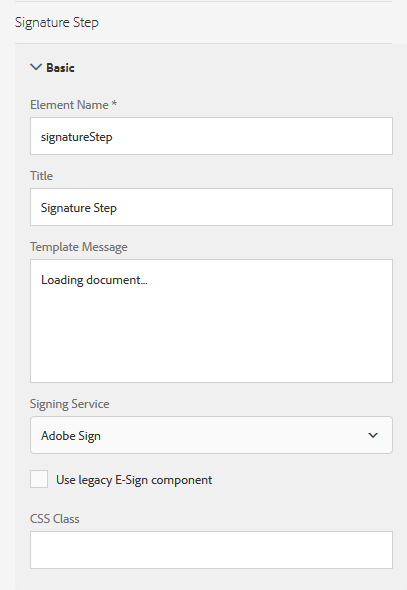

# Uso do Acrobat Sign em um formulário adaptável {#using-adobe-sign-in-an-adaptive-form}

Habilite fluxos de trabalho de assinatura eletrônica (Acrobat Sign) para um formulário adaptável para automatizar fluxos de trabalho de assinatura, simplificar processos de assinatura única e múltipla e assinar eletronicamente formulários de dispositivos móveis.

O Acrobat Sign habilita fluxos de trabalho de assinatura eletrônica para formulários adaptáveis. As assinaturas eletrônicas melhoram os fluxos de trabalho para processar documentos para áreas legais, de vendas, de folha de pagamento, de gerenciamento de recursos humanos e outras.

Em um cenário típico de Acrobat Sign e formulários adaptáveis, um usuário preenche um formulário adaptável para se candidatar a um serviço. Por exemplo, um pedido de hipoteca e de cartão de crédito requer assinaturas legais de todos os mutuários e co-requerentes. Para ativar workflows de assinatura eletrônica para cenários semelhantes, você pode integrar o Acrobat Sign com o AEM Forms. Mais alguns exemplos são: você pode usar o Acrobat Sign para:

* Feche negócios de qualquer dispositivo com processos de proposta, cotação e contrato totalmente automatizados.
* Termine os processos de recurso humano mais rapidamente e dê aos seus funcionários as experiências digitais.
* Reduza mais rapidamente os tempos de ciclo do contrato e integre seus fornecedores.
* Crie workflows digitais que automatizam processos comuns.

A integração do Acrobat Sign com o AEM Forms é compatível com:

* Fluxos de trabalho de assinatura de um e vários usuários
* Fluxos de trabalho de assinatura sequenciais e simultâneos
* Experiências de assinatura no formulário e fora do formulário
* Assinar formulários como um usuário anônimo ou conectado
* Processos de assinatura dinâmica (integração com o fluxo de trabalho do AEM Forms)
* Autenticação por meio de uma base de conhecimento, telefone e perfis sociais

Saiba mais sobre o [práticas recomendadas para usar o Acrobat Sign com formulários adaptáveis](https://medium.com/adobetech/using-adobe-sign-to-e-sign-an-adaptive-form-heres-the-best-way-to-do-it-dc3e15f9b684) para criar experiências de assinatura melhores.

## Pré-requisitos {#prerequisites}

Antes de usar o Acrobat Sign em um formulário adaptável:

* Verifique se o serviço de nuvem da AEM Forms está configurado para usar o Acrobat Sign. Para obter detalhes, consulte [Integrar o Acrobat Sign ao AEM Forms](/help/forms/using/adobe-sign-integration-adaptive-forms.md).
* Mantenha a lista de signatários pronta. Você precisa de pelo menos um endereço de email para cada assinante.

## Configurar o Acrobat Sign para um formulário adaptável {#configure-adobe-sign-for-an-adaptive-form}

Execute as seguintes etapas para configurar o Acrobat Sign para um formulário adaptável:

1. [Editar propriedades de formulário adaptável para Acrobat Sign](#enableadobesign)
1. [Adicionar campos Acrobat Sign a um formulário adaptável](#addadobesignfieldstoanadaptiveform)
1. [Ativar o Acrobat Sign para um formulário adaptável](#enableadobsignforanadaptiveform)
1. [Selecione Acrobat Sign Cloud Service para um formulário adaptável](#selectadobesigncloudserviceforanadaptiveform)

1. [Adicionar signatários do Acrobat Sign a um formulário adaptável](#addsignerstoanadaptiveform)
1. [Selecione Enviar ação para um formulário adaptável](#selectsubmitactionforanadaptiveform)

### Editar propriedades de formulário adaptável para Acrobat Sign {#enableadobesign}

Configure as propriedades de formulário adaptável para o Acrobat Sign para um formulário adaptável existente ou novo.

[Criar um formulário adaptável para o Acrobat Sign](/help/forms/using/working-with-adobe-sign.md#create-an-adaptive-form-for-adobe-sign) descreve as etapas para criar um formulário adaptável básico. Consulte [Criação de um formulário adaptável](/help/forms/using/creating-adaptive-form.md) para outras opções disponíveis ao criar um formulário adaptável.

#### Criar um formulário adaptável para o Acrobat Sign {#create-an-adaptive-form-for-adobe-sign}

Execute as seguintes etapas para criar um formulário adaptável para o Acrobat Sign:

1. Navegar para **[!UICONTROL Adobe Experience Manager]** > **[!UICONTROL Forms]** > **[!UICONTROL Forms &amp; Documents]**.
1. Toque **[!UICONTROL Criar]** e selecione **[!UICONTROL Formulário adaptável]**. Uma lista de modelos é exibida. Selecione o modelo e toque em **[!UICONTROL Próximo]**.
1. No **[!UICONTROL Básico]** guia :

   1. Especifique a **Nome** e **Título** para o formulário adaptável.
   1. Selecione o [contêiner de configuração](/help/forms/using/adobe-sign-integration-adaptive-forms.md#configure-adobe-sign-with-aem-forms) criado ao configurar o Acrobat Sign com o AEM Forms.

      >[!NOTE]
      >
      >O **[!UICONTROL Cloud Service Acrobat Sign]** a lista suspensa exibe os serviços de nuvem configurados no contêiner de configuração selecionado por você nesse campo. O **[!UICONTROL Cloud Service Acrobat Sign]** a lista suspensa está disponível na variável **[!UICONTROL Assinatura eletrônica]** seção das propriedades do formulário adaptável ao selecionar o **[!UICONTROL Ativar o Acrobat Sign]** opção.

1. No **[!UICONTROL Modelo de formulário]** selecione uma das seguintes opções:

   * Selecione o **[!UICONTROL Associar modelo de formulário como o modelo Documento de registro]** e selecione um modelo Document of Record . Se você usar um formulário adaptável baseado em modelo de formulário, os documentos enviados para assinatura exibirão apenas os campos que se baseiam no modelo de formulário associado. Não exibe todos os campos do formulário adaptável.
   * Selecione o **[!UICONTROL Gerar Documento de Registro]** opção. Se você usar uma opção Documento de registro ativada no formulário adaptável, o documento enviado para assinatura exibirá todos os campos do formulário adaptável.

1. Toque **[!UICONTROL Criar.]** É criado um formulário adaptável habilitado para assinatura, que pode ser usado para adicionar campos Acrobat Sign.

#### Editar um formulário adaptável para Acrobat Sign {#editafsign}

Execute as seguintes etapas para usar o Acrobat Sign em um formulário adaptável existente:

1. Navegar para **[!UICONTROL Adobe Experience Manager]** > **[!UICONTROL Forms]**> **[!UICONTROL Forms &amp; Documents]**.
1. Selecione o formulário adaptável e toque em **[!UICONTROL Propriedades]**.
1. No **[!UICONTROL Básico]** selecione a guia [contêiner de configuração](/help/forms/using/adobe-sign-integration-adaptive-forms.md#configure-adobe-sign-with-aem-forms) criado ao configurar o Acrobat Sign com o AEM Forms.
1. No **[!UICONTROL Modelo de formulário]** selecione uma das seguintes opções:

   * Selecione o **[!UICONTROL Associar modelo de formulário como o modelo Documento de registro]** e selecione um modelo Document of Record . Se você usar um formulário adaptável baseado em modelo de formulário, os documentos enviados para assinatura exibirão apenas os campos que se baseiam no modelo de formulário associado. Não exibe todos os campos do formulário adaptável.
   * Selecione o **[!UICONTROL Gerar Documento de Registro]** opção. Se você usar uma opção Documento de registro ativada no formulário adaptável, o documento enviado para assinatura exibirá todos os campos do formulário adaptável.

1. Toque **[!UICONTROL Salvar e fechar]**. O formulário adaptável está habilitado para o Acrobat Sign.

### Adicionar campos Acrobat Sign a um formulário adaptável {#addadobesignfieldstoanadaptiveform}

O Acrobat Sign tem vários campos que podem ser colocados em um formulário adaptável. Esses campos aceitam vários tipos de dados, como assinaturas, iniciais, empresa ou título, e ajudam a coletar informações adicionais durante a assinatura, juntamente com as assinaturas. Você pode usar o componente Acrobat Sign Block para colocar campos Acrobat Sign em vários locais em um formulário adaptável.

Execute as etapas a seguir para adicionar campos a um formulário adaptável e personalizar várias opções relacionadas a esses campos:

1. Arrastar e soltar **Bloco Acrobat Sign** componente do navegador de componentes para o formulário adaptável. O componente Acrobat Sign Block tem todos os campos Acrobat Sign compatíveis. Por padrão, ele adiciona uma **Assinatura** para o formulário adaptável.

   

   Por padrão, o Bloco Acrobat Sign não está visível no formulário adaptável publicado. Ela é visível somente nos documentos de assinatura. Você pode alterar a visibilidade do Acrobat Sign Block a partir das propriedades do componente Acrobat Sign Block.

   >[!NOTE]
   >
   >* O uso do bloco Acrobat Sign não é obrigatório para usar o Acrobat Sign em um formulário adaptável. Se você não usar o bloco Acrobat Sign e adicionar campos para os signatários, o campo de assinatura padrão será exibido na parte inferior dos documentos de assinatura.
   >* Use o bloco Acrobat Sign somente para os formulários adaptáveis que geram automaticamente o Documento de registro. Se você estiver usando um XDP personalizado para gerar o Documento de registro ou um formulário adaptável baseado em modelo de formulário, o bloco Acrobat Sign não será necessário.

1. Selecione o **Bloco Acrobat Sign** e toque no **Editar**  ícone . Ele exibe opções para adicionar campos e formatar a aparência de um campo.

   

   **A.** Selecione e adicione campos Acrobat Sign. **B.** Expanda o bloco do Acrobat Sign para a exibição em tela cheia

1. Toque no **Campo Acrobat Sign**  ícone . Ele exibe opções para selecionar e adicionar campos Acrobat Sign.

   Expanda o **Tipo** campo suspenso para selecionar um campo Acrobat Sign e tocar em Concluído  ícone para adicionar o campo selecionado ao bloco Acrobat Sign. O **Tipo** O campo suspenso inclui os tipos de campo Assinatura, Informações do assinante e Dados . Integração do Acrobat Sign com campos de suporte do AEM Forms listados somente na caixa suspensa Tipo . Para obter informações detalhadas sobre campos do Acrobat Sign, consulte [Documentação do Acrobat Sign](https://helpx.adobe.com/sign/help/field-types.html).

   

   É obrigatório fornecer um nome exclusivo para um campo. Também é possível selecionar a opção obrigatória para marcar um campo como obrigatório. Além do **Nome** e **Obrigatório** , alguns campos do Acrobat Sign têm mais opções. Por exemplo, máscara e várias linhas. Além disso, especifique um nome exclusivo para cada campo do Acrobat Sign se os campos residem no mesmo ou em blocos Acrobat Sign diferentes.

### Ativar o Acrobat Sign para um formulário adaptável {#enableadobsignforanadaptiveform}

Pronto para uso, o Acrobat Sign não está habilitado para um formulário adaptável. Execute as seguintes etapas para habilitá-lo:

1. No navegador Conteúdo, toque em **Contêiner de formulário** e toque no **Configurar**  ícone . Ele abre o navegador de propriedades e exibe as propriedades do contêiner do Formulário adaptável.
1. No navegador de propriedades, expanda a **Assinatura eletrônica** e selecione a opção **Ativar o Acrobat Sign** opção. Ela habilita o Acrobat Sign para um formulário adaptável.

### Selecionar o Cloud Service Acrobat Sign e a ordem de assinatura {#selectadobesigncloudserviceforanadaptiveform}

Você pode configurar vários serviços da Acrobat Sign para uma instância do AEM Forms. É aconselhável ter um conjunto separado de serviços para cada função (Recursos Humanos, Finanças e muito mais). Isso facilita o rastreamento e o relatório de documentos assinados. Por exemplo, um banco tem vários departamentos. Você pode ter uma configuração separada para cada departamento para melhorar o rastreamento dos documentos.

Um documento também pode ter vários signatários. Por exemplo, um aplicativo de cartão de crédito pode ter vários candidatos. Um banco requer assinaturas de todos os candidatos antes de iniciar o processamento do pedido. Em cenários com vários signatários, você pode optar por assinar o documento em ordem sequencial ou simultânea.

Execute as seguintes etapas para selecionar um serviço em nuvem e a ordem de assinatura:

1. No navegador Conteúdo, toque em **Contêiner de formulário** e toque no **Configurar**  ícone . Ele abre o navegador de propriedades e exibe as propriedades do contêiner do Formulário adaptável.
1. No navegador de propriedades, expanda a **Assinatura eletrônica** e selecione a opção **Ativar o Acrobat Sign** opção. Ela habilita o Acrobat Sign para um formulário adaptável.
1. Selecione um serviço em nuvem na lista de Cloud Services do Acrobat Sign já configurados.

   Se a variável **Cloud Service Acrobat Sign** estiver vazia, siga o [Configurar o Acrobat Sign com o AEM Forms](/help/forms/using/adobe-sign-integration-adaptive-forms.md) artigo para configurar o serviço.

   A lista suspensa lista os serviços em nuvem que existem na `global` em Ferramentas > **[!UICONTROL Cloud Services]** > **[!UICONTROL Acrobat Sign]**. Além disso, a lista suspensa também lista os serviços de nuvem que existem na pasta selecionada na **[!UICONTROL Contêiner de configuração]** ao criar um formulário adaptável.

1. Selecione a ordem de assinatura no **Os assinantes podem assinar** caixa de diálogo. Os cantores do Acrobat Sign podem assinar um formulário adaptável **Sequencialmente** - um depois de outro signatário, ou **Simultaneamente** - em qualquer ordem.

   Em ordem sequencial, um assinante recebe o formulário para assinatura, de cada vez. Depois que um assinante concluir a assinatura do documento, o formulário será enviado para o assinante seguinte e assim por diante.

   Em ordem simultânea, vários signatários podem assinar um formulário de cada vez.

1. [Adicionar signatários a um formulário adaptável](#addsignerstoanadaptiveform) e toque no ícone Concluído para salvar as alterações.

### Adicionar signatários a um formulário adaptável {#addsignerstoanadaptiveform}

Você pode ter apenas um ou vários signatários para um formulário adaptável. Ao adicionar um assinante, você também pode configurar os detalhes de autenticação do assinante. Você também pode selecionar se o usuário e o cantor do formulário são a mesma pessoa. Execute as seguintes etapas para adicionar e fornecer vários detalhes sobre um assinante:

1. No navegador Conteúdo, toque em **Contêiner de formulário** e toque no **Configurar**  ícone . Ele abre o navegador de propriedades com as propriedades do contêiner do Formulário adaptativo.
1. No navegador de propriedades, expanda a **Assinatura eletrônica** e selecione a opção **Ativar o Acrobat Sign** opção. Ela habilita o Acrobat Sign para um formulário adaptável.
1. Toque **Adicionar Assinante** under **Configuração do assinante.** Ele adiciona um assinante ao formulário adaptável. É possível adicionar vários signatários do Acrobat Sign a um formulário adaptável.
1. 

   Clique no botão **Editar**  ícone para especificar as seguintes informações sobre o assinante:

   * **Título:** Especifique um título para identificar exclusivamente um assinante.
   * **O signatário e o preenchedor do formulário são os mesmos?:** Selecionar **Sim**, se o usuário e o primeiro assinante forem a mesma pessoa. Se a opção estiver definida como **Não,** em seguida, não use o componente etapa de assinatura no formulário adaptável. Se o formulário contiver um componente Etapa de assinatura, o campo será automaticamente definido como Sim.
   * **Endereço de email do assinante:** Especifique o endereço de email do assinante. O signatário recebe para ser documentos/formulários assinados no endereço de email especificado. Você pode optar por usar um endereço de email fornecido em um campo de formulário, AEM perfil de usuário do usuário conectado ou inserir manualmente um endereço de email. É uma etapa obrigatória. Além disso, observe que, se você configurou apenas um assinante, verifique se o endereço de email do assinante não é idêntico à conta do Acrobat Sign usada para configurar os serviços em nuvem do AEM.
   * **Método de Autenticação do Assinante:** Especifique o método para autenticar um usuário antes de abrir um formulário para assinatura. Você pode escolher entre telefone, base de conhecimento e autenticação baseada em identidade social.

   >[!NOTE]
   >
   >* Por padrão, a autenticação baseada em identidade social fornece uma opção para autenticação usando Facebook, Google e LinkedIn. Você pode entrar em contato com o suporte da Acrobat Sign para ativar outros provedores de autenticação social.

   * **Campos Acrobat Sign para preencher ou assinar:** Selecione os campos Acrobat Sign para o assinante. Um formulário adaptável pode ter vários campos Acrobat Sign. Você pode optar por ativar campos específicos para um assinante. O campo exibe todos os Blocos do Acrobat Sign disponíveis. Ao selecionar um bloco, todos os campos do bloco são selecionados. Você pode usar o ícone X para desmarcar um campo.

   

   A imagem acima tem dois exemplos de Blocos Acrobat Sign: Informações pessoais e detalhes do escritório

   Toque em Concluído  ícone . O assinante é adicionado e configurado.

### Selecione Enviar ação para um formulário adaptável {#selectsubmitactionforanadaptiveform}

Depois de adicionar campos Acrobat Sign a um formulário adaptável, ativar o Acrobat Sign a partir de um contêiner de formulário, selecionar Acrobat Sign Cloud Service e adicionar Acrobat Sign Signers, selecione uma ação de envio apropriada para o formulário adaptável. Para obter informações detalhadas sobre ações de envio de formulários adaptáveis, consulte [Configuração da ação Enviar](/help/forms/using/configuring-submit-actions.md).

Além disso, um formulário adaptável habilitado para Acrobat Sign é enviado somente após todos os signatários assinarem o formulário. Você pode encontrar formulários parcialmente assinados na seção Assinatura pendente do portal de formulários. O Serviço de Configuração do Acrobat Sign mantém o servidor Acrobat Sign em pesquisa em [intervalos regulares](/help/forms/using/adobe-sign-integration-adaptive-forms.md) para verificar o status das assinaturas. Se todos os signatários concluírem a assinatura do formulário, o serviço de ação de envio será iniciado e o formulário será enviado. Se você estiver usando uma ação de envio personalizado e o formulário usar o Acrobat Sign, atualize sua ação de envio personalizado para usar o serviço de envio de ação.

>[!NOTE]
>
>Os dados do formulário adaptável são armazenados temporariamente no Forms Portal. Recomenda-se a utilização de [armazenamento personalizado para o Forms Portal](/help/forms/using/configuring-draft-submission-storage.md). Ela garante que os dados PII (informações de identificação pessoal) não sejam armazenados em servidores AEM.

Sua experiência de assinatura de formulário está pronta. É possível visualizar o formulário para verificar a experiência de assinatura. No formulário publicado, os campos Acrobat Sign Block são exibidos quando um assinante recebe o formulário para assinatura por meio de um email. Essa experiência também é conhecida como experiência de assinatura fora de formulário. Você também pode configurar uma experiência de assinatura no formulário para o primeiro assinante, para etapas detalhadas, consulte [Criar experiência de assinatura no formulário](/help/forms/using/working-with-adobe-sign.md#create-in-form-signing-experience).

## Configurar assinaturas em nuvem para um formulário adaptável {#configure-cloud-signatures-for-an-adaptive-form}

Assinaturas digitais baseadas em nuvem ou assinaturas remotas são uma nova geração de assinaturas digitais que funcionam em computadores, dispositivos móveis e na Web — e atendem aos mais altos níveis de conformidade e garantia para autenticação de assinante. Você pode assinar um formulário adaptável com assinaturas digitais baseadas em nuvem.

Depois [editar propriedades de formulário adaptável para o Acrobat Sign](#enableadobesign), execute as seguintes etapas para adicionar um campo de assinatura de nuvem a um formulário adaptável:

1. Arrastar e soltar **Bloco Acrobat Sign** componente do navegador de componentes para o formulário adaptável. O componente Acrobat Sign Block tem todos os campos Acrobat Sign compatíveis. Por padrão, ele adiciona uma **Assinatura** para o formulário adaptável.

   

1. Selecione o **Bloco Acrobat Sign** e toque no **Editar**  ícone . Ele exibe opções para adicionar campos e formatar a aparência de um campo.

   

   **A.** Selecione e adicione campos Acrobat Sign. **B.** Expanda o bloco do Acrobat Sign para a exibição em tela cheia

1. Toque no **Campo Acrobat Sign**  ícone . Ele exibe opções para selecionar e adicionar campos Acrobat Sign.

   Expanda o **Tipo** campo suspenso a ser selecionado **Assinatura digital** e toque em Concluído  ícone para adicionar o campo selecionado ao bloco Acrobat Sign.

   

   É obrigatório fornecer um nome exclusivo para um campo.

   Aplique assinaturas digitais ao formulário adaptável usando:

   * Assinaturas da nuvem: Assinar com um [ID digital](https://helpx.adobe.com/sign/kb/digital-certificate-providers.html) hospedado por um provedor de serviços de confiança.
   * Adobe Acrobat ou Reader: Baixe e abra o documento com Adobe Acrobat ou Reader para assinar usando um cartão inteligente, um token USB ou uma ID digital baseada em arquivo.

   Depois de adicionar o campo de assinatura da nuvem ao formulário adaptável, execute as seguintes etapas para concluir o processo de configuração:

   * [Ativar o Acrobat Sign para um formulário adaptável](#enableadobsignforanadaptiveform)
   * [Selecione Acrobat Sign Cloud Service para um formulário adaptável](#selectadobesigncloudserviceforanadaptiveform)
   * [Adicionar signatários do Acrobat Sign a um formulário adaptável](#addsignerstoanadaptiveform)
   * [Selecione Enviar ação para um formulário adaptável](#selectsubmitactionforanadaptiveform)

## Criar experiência de assinatura no formulário {#create-in-form-signing-experience}

Um usuário também pode assinar um formulário adaptável durante o preenchimento do formulário. Essa experiência também é conhecida como experiência de assinatura no formulário. A experiência de assinatura no formulário está disponível somente para o primeiro cantor em um ambiente com vários signatários. Execute as seguintes etapas para criar uma experiência de assinatura no formulário para um formulário adaptável:

1. [Adicionar e configurar o componente Etapa de assinatura](#add-and-configure-the-signature-step-component).
1. [Adicionar o componente Etapa de resumo](#configure-the-thank-you-page-or-summary-step-component).

### Adicionar e configurar o componente Etapa de assinatura {#add-and-configure-the-signature-step-component}

Use o componente Etapa de assinatura para fornecer uma área para assinar eletronicamente o formulário preenchido. Quando a seção que contém o componente Etapa de assinatura é renderizada, ela exibe uma versão PDF assinável do formulário preenchido. O componente Etapa de assinatura ocupa a largura total disponível para o formulário. É recomendável não ter nenhum outro componente na seção que contenha o componente Etapa de assinatura.

Execute as seguintes etapas para configurar o componente Etapa de assinatura:

1. Arraste e solte a **Etapa de assinatura** componente do navegador Componentes para o formulário.
1. Selecione o componente de etapa Assinatura recém-adicionado e toque no **Configurar**  ícone . Ele abre o navegador de propriedades e exibe as propriedades da etapa Assinatura. Configure as seguintes propriedades:

   * **Nome do elemento**: Especifique o nome do componente.
   * **Título:** Especifique o título exclusivo do componente.
   * **Mensagem do modelo:** Especifique a mensagem a ser exibida enquanto o PDF de assinatura está sendo carregado. Os serviços da Acrobat Sign levam algum tempo para preparar e carregar o PDF de assinatura.
   * **Serviço de assinatura:** Selecione o **Acrobat Sign** opção.
   * **Usar componente herdado de assinatura eletrônica**: Se você estiver usando o respectivo formulário adaptável em [AEM Forms Workspace](/help/forms/using/introduction-html-workspace.md), aplicativo AEM Forms ou o formulário adaptável subjacente tem o componente de assinatura eletrônica herdado, selecione o **Usar componente herdado de assinatura eletrônica** opção.
   * **Configuração**: Selecione uma configuração (Acrobat Sign Cloud Service). A caixa suspensa só estará disponível se a variável **Usar componente herdado de assinatura eletrônica** está ativada.

   Toque em Concluído  para salvar as alterações.

   

   >[!NOTE]
   >
   >* Quando você arrasta e solta a variável **[!UICONTROL Etapa de assinatura]** componente do formulário, a variável **[!UICONTROL O signatário e o preenchedor do formulário são os mesmos?]** é automaticamente definida como **Sim**. É necessário manter o funcionamento do formulário.
   >* Os formulários adaptáveis habilitados para Acrobat Sign não são compatíveis com o uso do botão Enviar na seção ou no painel usando o componente Etapa de assinatura. Você pode adicionar uma etapa de resumo após a etapa Assinatura para o envio manual ou uma submissão automática é acionada após o intervalo definido usando o [Serviço de configuração do Acrobat Sign](/help/forms/using/adobe-sign-integration-adaptive-forms.md#configure-adobe-sign-scheduler-to-sync-the-signing-status).

### Configurar a página de agradecimento ou o componente da etapa de resumo {#configure-the-thank-you-page-or-summary-step-component}

O **Etapa de resumo** O componente envia automaticamente o formulário, preenche as informações dentro da página Resumo personalizada e exibe o resumo do formulário enviado. Também obtém as informações necessárias no mapa de retorno. O componente Etapa de resumo ocupa a largura total disponível para o formulário. É recomendável não ter nenhum outro componente na seção que contém o componente Etapa de resumo .

Agora, a experiência de assinatura no formulário está pronta. É possível visualizar o formulário para verificar a experiência de assinatura.

## Perguntas frequentes {#frequently-asked-questions}

**P: É possível incorporar um formulário adaptável em outro formulário adaptável. O formulário adaptável incorporado pode ser habilitado para Acrobat Sign?**

**Ans:** Não, a AEM Forms não oferece suporte ao uso de um formulário adaptável que incorpora um formulário adaptável habilitado para Acrobat Sign para assinatura.

**P: Quando eu crio um formulário adaptável usando o modelo avançado e o abro para edição, uma mensagem de erro &quot;Assinaturas ou signatários eletrônicos não estão configurados corretamente&quot;. é exibido. Como resolver a mensagem de erro?**

**Ans:** O formulário adaptável criado usando o modelo avançado é configurado para usar o Acrobat Sign. Para resolver o erro, crie e selecione uma configuração de nuvem do Acrobat Sign e configure um assinante do Acrobat Sign para o formulário adaptável.

**P: Posso usar tags de texto Acrobat Sign em um componente de texto estático de um formulário adaptável?**

**Ans:** Sim, você pode usar tags de texto em um componente de texto para adicionar campos Acrobat Sign a um [Documento de registro](/help/forms/using/generate-document-of-record-for-non-xfa-based-adaptive-forms.md) (Somente o documento gerado automaticamente da opção de registro) ativou o formulário adaptável. Para saber mais sobre o procedimento e as regras para criar uma tag de texto, consulte [Documentação do Acrobat Sign](https://experienceleague.adobe.com/docs/document-cloud-learn/sign-learning-hub/admin-set-up/advanced-tasks-admins/adobe-sign-text-tagging.html). Além disso, observe que os formulários adaptáveis têm suporte limitado para tags de texto. Você pode usar as tags de texto para criar apenas os campos compatíveis com o Acrobat Sign Block.

**P: O AEM Forms fornece componentes de etapa de bloqueio e assinatura do Acrobat Sign. Eles podem ser usados simultaneamente em um formulário adaptável?**

**Ans:** É possível usar ambos os componentes simultaneamente em um formulário. Estas são algumas recomendações para usar esses componentes:

**Bloco Acrobat Sign:** Você pode usar o Acrobat Sign Block para adicionar campos Acrobat Sign em qualquer lugar do formulário adaptável. Também ajuda a atribuir campos específicos aos signatários. Por padrão, quando um formulário adaptável é visualizado ou publicado, o Bloco do Acrobat Sign não fica visível. Esses blocos são ativados somente no documento de assinatura. No documento de assinatura, somente os campos atribuídos a um assinante são ativados. O bloco Acrobat Sign pode ser usado com assinantes originais e subsequentes.

**Componente de etapa de assinatura:** Você pode usar o componente etapa de assinatura para criar uma experiência de assinatura no formulário. Ele permite que somente o primeiro assinante assine enquanto o formulário está sendo preenchido. Quando a seção que contém o componente Etapa de assinatura é renderizada, ela exibe uma versão PDF assinável do formulário. Geralmente, é a última ou penúltima seção seguida pelo componente de resumo de um formulário.
