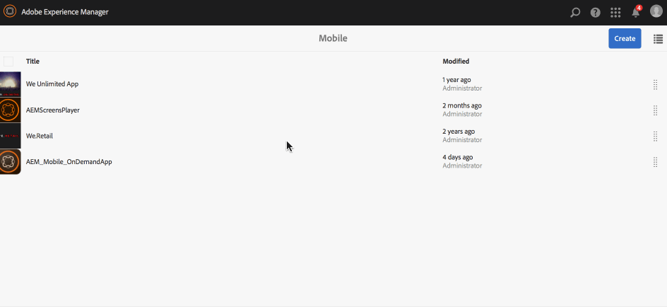

# Definições do aplicativo{#app-definitions}

>[!CAUTION]
>
>AEM 6.4 chegou ao fim do suporte estendido e esta documentação não é mais atualizada. Para obter mais detalhes, consulte nossa [períodos de assistência técnica](https://helpx.adobe.com/br/support/programs/eol-matrix.html). Encontre as versões compatíveis [here](https://experienceleague.adobe.com/docs/).

>[!NOTE]
>
>A Adobe recomenda usar o Editor de SPA para projetos que exigem renderização do lado do cliente com base em estrutura de aplicativo de página única (por exemplo, React). [Saiba mais](/help/sites-developing/spa-overview.md).

As definições do aplicativo são uma maneira de identificar quais espaços e outras configurações são apropriados para o aplicativo. As definições de aplicativo permitem que o usuário adicione espaço, sem precisar recompilar o aplicativo. A definição do aplicativo é atualizada e incluirá as informações de quaisquer novos espaços.

>[!NOTE]
>
>As definições do aplicativo estão vinculadas a um aplicativo, portanto, exigem a criação de um aplicativo no console do aplicativo AEM Mobile.

## Criação de uma nova definição de aplicativo {#creating-a-new-app-definition}

1. Choose **Celular** no Console de Navegação de AEM.

   

1. Choose **Aplicativos** from **Celular** e clique em **Criar.**

   Choose **Aplicativo** para e insira os detalhes para criar seu novo aplicativo.

   

### Próximas etapas {#the-next-steps}

Depois de conhecer as Definições do aplicativo, saiba mais sobre os seguintes recursos de criação:

* [Importar um aplicativo híbrido existente](/help/mobile/phonegap-adding-content-to-imported-app.md)
* [Criar um novo aplicativo usando o Assistente para criação de aplicativo](/help/mobile/phonegap-create-new-app.md)
* [Content Services](/help/mobile/develop-content-as-a-service.md)

## Recursos adicionais {#additional-resources}

Para saber mais sobre as funções e responsabilidades de um Administrador e Desenvolvedor, consulte os recursos abaixo:

* [Desenvolvimento para Adobe PhoneGap Enterprise com AEM](/help/mobile/developing-in-phonegap.md)
* [Administração de conteúdo para Adobe PhoneGap Enterprise com AEM](/help/mobile/administer-phonegap.md)
